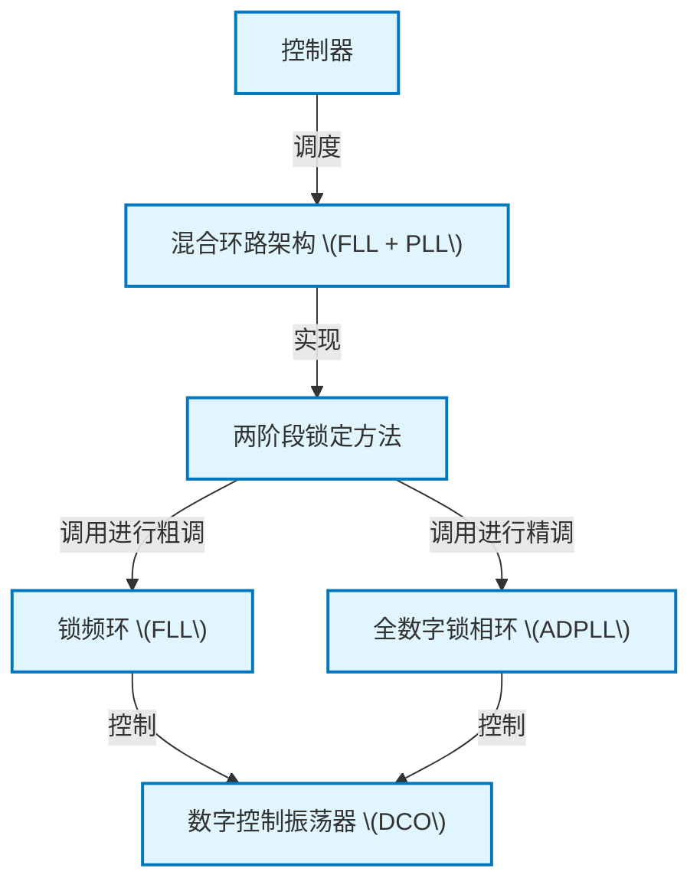

# Tutorial: downloaded_zh_4080

该项目实现了一个高效的 **信号频率与相位锁定系统**。
它创新地结合了两种控制环路：一个*锁频环 (FLL)* 负责快速进行粗略的频率定位，就像用望远镜快速找到目标；随后，一个*全数字锁相环 (ADPLL)* 接管并进行精细的相位微调，确保最终输出信号既快速又极其精准地锁定目标。整个过程由一个中央 **控制器** 调度，以实现最佳的锁定性能。

**Source Repository:** [None](None)

## Chapters

1. [混合环路架构 (FLL + PLL)](01_混合环路架构__fll___pll_.md)
2. [两阶段锁定方法](02_两阶段锁定方法.md)
3. [控制器](03_控制器.md)
4. [锁频环 (FLL)](04_锁频环__fll_.md)
5. [全数字锁相环 (ADPLL)](05_全数字锁相环__adpll_.md)
6. [数字控制振荡器 (DCO)](06_数字控制振荡器__dco_.md)

---

Generated by [AI Codebase Knowledge Builder](https://github.com/The-Pocket/Tutorial-Codebase-Knowledge)