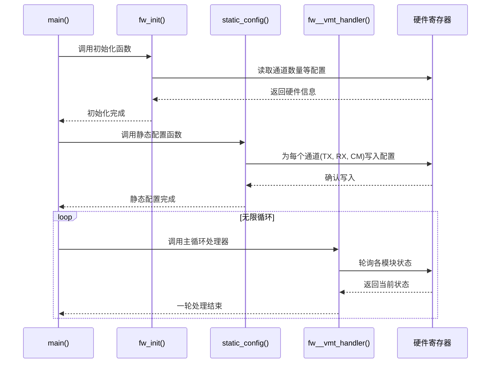

# Chapter 1: 固件主控与初始化


欢迎来到 `e112g_fw_src` 固件项目的第一章！这趟旅程将带你深入了解一个高性能SerDes（串行器/解串器）固件的内部工作原理。别担心，我们会一步一个脚印，用最通俗易懂的方式来探索这一切。

## 固件的“大脑”是什么？

想象一下，当你按下电脑的电源按钮时会发生什么？屏幕亮起，风扇转动，最终操作系统加载完成。这一切都不是瞬间发生的，而是一个精心编排的启动过程。

我们的固件也一样。当设备上电时，它需要一个“大脑”来指挥整个系统的启动和运行。这个“大脑”就是我们的 **固件主控**。它负责：

1.  **唤醒 (Wake Up):** 作为代码执行的起点。
2.  **检查环境 (Initialization):** 了解硬件配置，比如有多少条数据通道（Lane）需要管理。
3.  **准备工具 (Configuration):** 设置好所有子模块，如发射器（TX）、接收器（RX）和时钟（CM）。
4.  **开始工作 (Main Loop):** 进入一个永不停止的循环，像一个调度中心，持续处理来自外部的请求。

本章的核心就是理解这个“大脑”——`main()`函数以及它调用的初始化流程，看看固件是如何从零开始，一步步变得“有意识”并准备好处理数据的。

## 代码世界的起点：`main()` 函数

在C语言世界里，`main()` 函数是所有故事开始的地方。我们的固件也不例外。让我们来看一下位于 `fw.c` 文件中 `main` 函数的简化版本，它揭示了固件启动的核心三部曲。

```c
// 文件: fw.c

int main () {

  // 第一步: 基础初始化
  // 就像人醒来后先睁开眼睛，看看周围的环境
  fw_init ();

  // 第二步: 静态配置
  // 整理着装，确保所有部件都已就位并配置妥当
  static_config ();

  // 第三步: 进入主循环
  // 开始一天的工作，永不停歇地处理任务
  while (1) {
    fw__vmt_handler ();
  }
}
```

这段代码清晰地展示了固件的生命周期：
1.  **`fw_init()`**: 进行最基础的初始化。
2.  **`static_config()`**: 对所有硬件模块进行一次性的静态配置。
3.  **`while(1)`**: 进入无限循环，固件从此开始它的正式工作，不断轮询和处理事件。

接下来，我们将逐一拆解这些步骤。

### 第一步：`fw_init()` - 了解我们自己

在做任何事情之前，固件首先需要了解它所运行的硬件环境。`fw_init()` 函数就承担了这个角色。

```c
// 文件: fw.c

ATTR_INLINE void fw_init () {
  // 声明一个临时变量，用于存储读取的值
  uint8_t  v_cpu_clk_freq_10Mhz;

  // 从硬件寄存器中读取配置信息
  g_reg_val  = READ_REG( PMD_BASE_ADDR, PMD__PMD_SPARE_STAT0__ADDR );
  
  // 解析出物理通道(Lane)和公共模块(CM)的数量，并存入全局变量
  g_num_lane = GET_FIELD( g_reg_val, PMD__PMD_SPARE_STAT0__PMD_NUM_LANES_3_0 );
  g_num_cm   = GET_FIELD( g_reg_val, PMD__PMD_SPARE_STAT0__PMD_NUM_CMS_3_0 );

  // 读取CPU时钟频率，用于后续的延时计算
  v_cpu_clk_freq_10Mhz = READ_REG_FIELD( PMD_BASE_ADDR, PMD__FW_CSR0__CPU_CLK_FREQ_7_0 );
  // 如果频率是0（无效值），则使用默认值50
  v_cpu_clk_freq_10Mhz = (v_cpu_clk_freq_10Mhz == 0) ? 50 : v_cpu_clk_freq_10Mhz; 

  // 基于时钟频率初始化延时函数，这样我们才能进行精确的等待操作
  delay_init(v_cpu_clk_freq_10Mhz * 10);

  // ... 其他初始化代码 ...
}
```

这里的关键操作是：

*   **`READ_REG`**: 一个宏，用于从指定的硬件地址读取一个寄存器的值。这是固件与硬件沟通的基本方式。
*   **`g_num_lane`, `g_num_cm`**: 这些是**全局变量**。它们就像一个团队里的公告板，一旦 `fw_init()` 把信息写在上面，项目里的任何其他函数都能看到并使用这些信息。这非常重要，因为后续几乎所有操作都需要知道有多少个通道需要处理。
*   **`delay_init`**: 初始化一个精确的延时函数。在与硬件打交道时，我们经常需要“等待一会儿”来让某个操作完成，精确的延时是必不可少的。

完成 `fw_init()` 后，固件已经知道了“我是谁”（硬件配置）以及“时间感”（时钟频率）。

### 第二步：`static_config()` - 全面准备

知道了环境信息后，下一步就是根据这些信息对各个功能模块（通道、时钟等）进行配置。`static_config()` 就是这个配置过程的指挥官。

```c
// 文件: fw.c

void run_static_configs (bool a_force_tx_replica_cals) {
  
  // 遍历所有通道 (Lane)
  for (uint8_t v_inst_no = 0; v_inst_no < g_num_lane; v_inst_no++) {
    
    // 如果是公共模块 (CM)，也进行配置
    if (v_inst_no < g_num_cm) {
      pmd_cm__static_config (v_inst_no);
    }

    // 配置发射器 (TX)
    set_tx_lane_config (v_inst_no, ...); 

    // 配置接收器 (RX)
    set_rx_lane_config (v_inst_no); 
  }

  // ... 标记静态配置完成 ...
}

void static_config () {
  // 调用核心配置函数
  run_static_configs(false); 

  // 在硬件寄存器中设置一个标志位，告诉外部系统：固件静态配置已完成！
  WRITE_REG_FIELD( PMD_BASE_ADDR, PMD__FW_CSR8__FW_STATIC_CFG_DONE, 1 );
}
```

这段代码的核心是一个循环，它遍历了 `g_num_lane`（我们在 `fw_init` 中获取到的通道数）次。在每次循环中，它会分别调用：

*   `pmd_cm__static_config()`: 配置公共时钟模块。时钟是高速信号的心脏，必须最先稳定下来。我们将在 [第3章：公共模块与PLL时钟管理](03_公共模块与pll时钟管理_.md) 中深入探讨它。
*   `set_tx_lane_config()`: 配置发射器模块。这部分内容详见 [第4章：发射器(TX)控制与校准](04_发射器_tx_控制与校准_.md)。
*   `set_rx_lane_config()`: 配置接收器模块。这部分内容详见 [第5章：接收器(RX)控制与自适应均衡](05_接收器_rx_控制与自适应均衡_.md)。

当这个循环结束后，所有的通道和时钟模块都已根据预设的[配置参数与查找表](02_配置参数与查找表_.md)完成了基础设置，准备好随时待命。

### 第三步：`fw__vmt_handler()` - 永不停歇的调度中心

初始化是一次性的，而固件的真正价值在于持续不断地响应和处理任务。`main` 函数中的 `while(1)` 循环通过反复调用 `fw__vmt_handler()` 来实现这一点。

`fw__vmt_handler()` 就像一个忙碌的调度员，它会挨个“拜访”每个模块，问它们：“有新任务吗？”。

```c
// 文件: fw.c

ATTR_INLINE void fw__vmt_handler () {
  
  // 遍历所有通道实例
  for (uint8_t v_inst_no = 0; v_inst_no < g_num_lane; v_inst_no++)  {
    
    // 轮询公共时钟模块 (CM) 的处理器
    if (v_inst_no < g_num_cm) {
      pmd_cm__pll_handler (v_inst_no);
    }

    // 轮询发射器 (TX) 的处理器
    // 如果有请求，就处理它；如果处理完了，就发送确认
    if (handshake_fsm_st[vTxHandlerFsmId] == e_pmd_handler_idle_st) tx_handler_req_decode (vTxHandlerFsmId); 
    if (handshake_fsm_st[vTxHandlerFsmId] == e_pmd_handler_req_st)  tx_handler_task_array[handler_func_pntr[vTxHandlerFsmId]] (vTxHandlerFsmId); 
    
    // 轮询接收器 (RX) 的处理器
    // 同样，检查是否有新的请求需要处理
    if (handshake_fsm_st[vRxHandlerFsmId] == e_pmd_handler_idle_st) rx_handler_req_decode (vRxHandlerFsmId); 
    if (handshake_fsm_st[vRxHandlerFsmId] == e_pmd_handler_req_st)  rx_handler_task_array[handler_func_pntr[vRxHandlerFsmId]] (vRxHandlerFsmId); 

    // ... 其他处理逻辑 ...
  }
    
  // 轮询信箱 (Mailbox)，检查是否有来自主机的新命令
  func_sch_decode_mb_req ();
}
```

这个函数的核心也是一个 `for` 循环。在循环的每一次迭代中，它会专注在一个通道上，并依次检查和处理该通道关联的 **CM**、**TX** 和 **RX** 模块的状态。这种设计模式被称为“**轮询（Polling）**”。

*   `pmd_cm__pll_handler()`: 维护PLL（锁相环）时钟的稳定。
*   `tx_handler_req_decode()` / `rx_handler_req_decode()`: 检查是否有新的任务请求。这些任务可能是由硬件状态变化触发的，也可能是通过信箱（Mailbox）从外部主机（Host）发来的命令。关于任务处理的细节，我们会在 [第6章：任务处理与信箱通信机制](06_任务处理与信箱通信机制_.md) 中详细介绍。

这个 `while(1)` 循环是固件的“心跳”，确保了系统能够持续、不知疲倦地对各种内部和外部事件做出响应。

## 深入幕后：启动流程全景图

为了更直观地理解整个启动过程，我们可以用一个时序图来表示：



这个图清晰地展示了：

1.  `main()` 函数是所有操作的发起者。
2.  `fw_init()` 和 `static_config()` 是启动阶段的一次性任务，它们与硬件交互以完成准备工作。
3.  `fw__vmt_handler()` 在一个无限循环中被反复调用，持续地轮询硬件，构成了固件运行阶段的核心。

## 结论

在本章中，我们一起探索了固件的“大脑”——主控与初始化流程。我们学习到：

*   固件的生命始于 `main()` 函数。
*   启动过程分为两大步：**初始化 (`fw_init`)** 和 **静态配置 (`static_config`)**。初始化是为了了解环境，配置是为了让各个模块准备就绪。
*   启动完成后，固件进入一个由 `while(1)` 和 **`fw__vmt_handler()`** 构成的**无限主循环**，像一个调度中心一样，不断轮询和处理各个子模块的任务。

我们还初步接触到了固件与硬件通过读写寄存器进行通信的方式，以及使用全局变量来共享状态信息。

在初始化过程中，我们多次提到了“配置”。这些配置从何而来？它们是如何组织的？这正是我们下一章要探讨的主题。

准备好了吗？让我们继续前进！

---

➡️ **下一章：[第2章：配置参数与查找表](02_配置参数与查找表_.md)**

---

Generated by [AI Codebase Knowledge Builder](https://github.com/The-Pocket/Tutorial-Codebase-Knowledge)