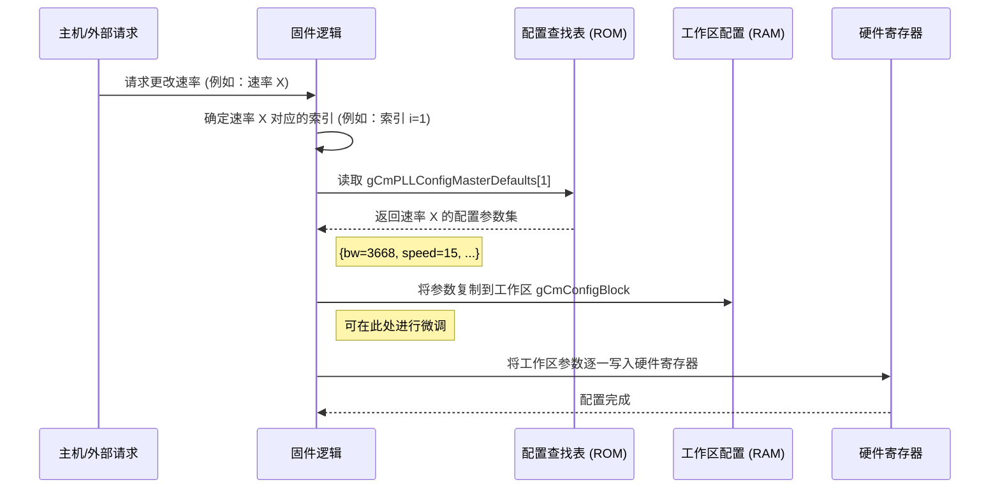

# Chapter 2: 配置参数与查找表


在[第1章：固件主控与初始化](01_固件主控与初始化_.md)中，我们看到固件在启动时会执行一个名为 `static_config()` 的关键步骤，它会为发射器(TX)、接收器(RX)和时钟(CM)等模块加载配置。但这些配置的数值——那些看起来像“魔法数字”的参数——究竟从何而来？

本章，我们将揭开这些“魔法数字”的神秘面紗。我们将探索固件设计的核心理念之一：**数据驱动设计**。这正是通过本章的主角——**配置参数与查找表（LUTs）**——来实现的。

## 固件的“食谱书”

想象一下你是一位顶级大厨（我们的固件），经营着一家高级餐厅（高性能SerDes）。每天，你都会接到各种各样的订单（比如，要求以 PCIe Gen 5 的速率传输数据，或者以 112G 以太网模式工作）。

如果每次接到订单，你都从头开始研究如何烹饪，那效率就太低了。一个聪明的大厨会怎么做？他会准备一本**食谱书**！

*   **食谱 (Recipe)**：针对每道菜（每种操作模式），都有一份详细的食谱，上面写明了需要哪些食材（`cm_ana_pll_bw`）、每种食材用多少量（`2419`）、烹饪步骤和火候（其他参数）。
*   **食谱书 (Cookbook)**：这本食谱书，就是我们固件中的**查找表 (Look-Up Table, LUT)**。它包含了针对所有已知操作模式的“最佳食谱”。

当接到订单（例如，配置为 `cntx_0` 模式）时，你（固件）只需翻到食谱书的第0页，按照上面的参数去精确设置你的厨房设备（硬件寄存器）。

这种将“怎么做”（逻辑代码）与“用什么做”（配置数据）分离的设计方法，就是**数据驱动**。它的巨大优势在于：

*   **灵活性**：想支持一道新菜？只需在食谱书里增加一页新食谱即可，完全不用改造厨房（重写核心代码）。
*   **可维护性**：发现某个配方可以优化？直接修改食谱书里的数据，简单明了。
*   **清晰性**：核心代码只负责“查阅食谱并执行”，逻辑非常干净。所有的复杂性都封装在了数据表中。

现在，让我们看看这本“食谱书”在代码里长什么样。

## 食谱卡模板：`struct` 结构体

在C语言中，我们用 `struct` (结构体) 来定义一张“食谱卡”的模板。它规定了一份食谱应该包含哪些“食材”字段。

例如，`cm_pll_master_config_defaults.h` 文件中定义了一个用于PLL（锁相环）时钟配置的结构体（为清晰起见，此处已简化）。

```c
// 文件: cm_pll_master_config_defaults.h

// 这就是一张“PLL配置食谱卡”的模板
struct tCmPLLConfigMasterDefaults_t {
  uint16_t cm_ana_pll_bw;       // PLL带宽，好比汤的浓度
  uint8_t  cm_ana_speed_i;      // 模拟速度，好比烹饪的火候
  uint16_t pll0_fbclkdiv;       // 反馈时钟分频，好比面粉和水的比例
  uint16_t pll0_ssc_peak;       // 扩频峰值，好比调味料的用量
  // ... 还有很多其他参数 ...
};
```

这个 `struct` 本身不包含任何数值，它只是一个蓝图，定义了配置一个PLL需要哪些参数。

## 食谱大全：查找表 (LUT)

有了食谱卡模板，我们就可以编写一本完整的食谱书了。在代码中，这通常是一个用 `const` 修饰的结构体数组。`const` 关键字意味着这本食谱书是**只读**的，由芯片设计专家预先写好，固件在运行时只能查阅，不能修改。

让我们翻开位于 `cm_pll_master_config_defaults.c` 的这本“食谱书”。

```c
// 文件: cm_pll_master_config_defaults.c

// 这就是我们的“PLL食谱书”，一个包含很多“食谱卡”的数组
// const 表示它是只读的，就像一本印刷好的书
const struct tCmPLLConfigMasterDefaults_t gCmPLLConfigMasterDefaults[ePhyPllCntx_Max] = 
{
    {            // cntx_0: 这是第一份食谱，对应模式0
        2419,    // cm_ana_pll_bw
        15,      // cm_ana_speed_i
        75,      // pll0_fbclkdiv
        24576,   // pll0_ssc_peak
        // ... 其他参数 ...
    },
    {            // cntx_1: 这是第二份食谱，对应模式1
        3668,    // cm_ana_pll_bw
        15,      // cm_ana_speed_i
        80,      // pll0_fbclkdiv
        26214,   // pll0_ssc_peak
        // ... 其他参数 ...
    },
    // ... 后续还有很多其他模式的食谱 ...
};
```

`gCmPLLConfigMasterDefaults` 就是这本“食谱书”的名字。它是一个数组，每个元素都是一个 `tCmPLLConfigMasterDefaults_t` 类型的结构体，也就是一张填满了具体数值的“食谱卡”。

当固件需要配置为模式0时，它会取出数组的第0个元素 (`gCmPLLConfigMasterDefaults[0]`)，然后将里面的 `cm_ana_pll_bw` 设置为 `2419`，`pll0_fbclkdiv` 设置为 `75`，以此类推。

## 工作台上的便签：可变配置区

除了这本印刷精美的“只读食谱书”，厨师在工作时还需要一个可以随时涂写的工作台或者便签本，用来记录当前正在烹饪的菜肴的状态。

在固件中，这个“便签本”就是定义在 `fw_dccm_csr.c` 文件中的**可变配置块**。与查找表不同，它们**没有 `const` 关键字**，意味着它们的值可以在固件运行时被随时修改。

```c
// 文件: fw_dccm_csr.c

// 为每个通道(Lane)准备一个可写的TX配置“便签本”
// 注意，这里没有 const 关键字
struct tTxLaneConfigBlock_t gTxLaneConfigBlock [MAX_NUM_LANE] = {
  { 
    // 这里的值是上电后的“默认”或“初始”状态
    // 好比厨师开始工作前，先把所有调料瓶摆放整齐
    0,     // tx_ana_v2i_en
    127,   // tx_ana_amp_max
    1,     // tx_ana_en_early
    // ... 其他初始值 ...
  },
  // ... 为其他通道也准备了同样的“便签本” ...
};
```

`gTxLaneConfigBlock`、`gRxLaneConfigBlock` 等就是这样的“便签本”。固件的工作流程通常是：

1.  接到指令，要切换到某个新模式。
2.  从“只读食谱书”（如 `gCmPLLConfigMasterDefaults`）中查到对应模式的食谱。
3.  将食谱上的参数“抄写”到“便签本”（如 `gCmConfigBlock`）上。
4.  最后，根据“便签本”上的最终值去设置硬件。

这样做的好处是，我们可以在应用配置前，对从食谱中抄写来的值进行微调（比如根据[温度补偿](07_温度感应与补偿_.md)的结果），而不会弄脏原始的“食谱书”。

## “烹饪”流程：如何使用查找表

现在我们把整个流程串起来，看看固件是如何利用这些数据结构来完成配置的。



这个图清晰地展示了数据流：

1.  **请求到来**：主机（Host）通过[信箱机制](06_任务处理与信箱通信机制_.md)发送命令，要求切换到一个新的数据速率。
2.  **查找食谱**：固件逻辑根据请求的速率，确定它在“食谱书” `gCmPLLConfigMasterDefaults` 中的索引（比如索引 `1`）。
3.  **抄写食谱**：固件将 `gCmPLLConfigMasterDefaults[1]` 中的所有参数值，复制到可写的“便签本” `gCmConfigBlock` 中。
4.  **执行烹饪**：固件遍历 `gCmConfigBlock` 中的每一个参数，通过 `WRITE_REG` 或 `WRITE_REG_FIELD` 等函数，将这些值设置到硬件寄存器中。

这个过程就像一个训练有素的厨师，精确、高效地按照食谱完成烹饪，确保了每次出品（硬件配置）的质量和一致性。

### 更多的“专业食谱”

除了PLL配置，固件中还有很多针对不同功能的专用“食谱书”。例如，`fw_lrmax_luts.c` 文件中就包含了大量用于接收器均衡（CTLE）的查找表。

```c
// 文件: fw_lrmax_luts.c

// 针对“中等损耗”信道的CTLE配置食谱
rx_ana_ctle_cz_lut_t g_rx_ana_ctle_cz_med_loss_lut = { 
  13, 13, 14, 14, 14, 15, 15, 15, 12, 12, 12, ...
};

// 针对“低损耗”信道的CTLE配置食谱
rx_ana_ctle_cz_lut_t g_rx_ana_ctle_cz_low_loss_lut = { 
  15, 15, 15, 15, 15, 15, 15, 15, 14, 14, 14, ...
};
```

这些查找表使得接收器可以根据不同的线路损耗情况（`med_loss` 或 `low_loss`），选择最合适的均衡参数，以达到最佳的信号接收效果。我们将在[第5章：接收器(RX)控制与自适应均衡](05_接收器_rx_控制与自适应均衡_.md)中深入了解它的工作原理。

## 结论

在本章中，我们揭开了固件设计的“秘密武器”——配置参数与查找表。我们学到了：

*   **数据驱动设计**：通过将配置数据（“做什么”）与控制逻辑（“怎么做”）分离，使固件变得极其灵活和易于维护。
*   **配置结构体 (`struct`)**：如同“食谱卡”的模板，定义了配置一个模块需要哪些参数。
*   **查找表 (LUT)**：如同“食谱书”，是一个由 `const` 修饰的结构体数组，存储了针对不同操作模式的预设参数集。它们通常存储在只读存储器（ROM）中。
*   **可变配置区**：如同“工作便签”，是普通的全局变量结构体，用于存放当前正在使用的配置，可以在运行时被修改。它们存储在可读写存储器（RAM）中。

我们理解了固件在响应配置请求时，会从只读的LUT中“查阅”配方，将其“抄写”到可写的工作区，最后再应用到硬件上。

现在我们知道了配置从何而来，也知道了时钟是系统的心脏。那么，下一步自然就是去看看第一个应用这些配置的模块是如何工作的。

准备好深入了解系统的心跳了吗？

---

➡️ **下一章：[第3章：公共模块与PLL时钟管理](03_公共模块与pll时钟管理_.md)**

---

Generated by [AI Codebase Knowledge Builder](https://github.com/The-Pocket/Tutorial-Codebase-Knowledge)