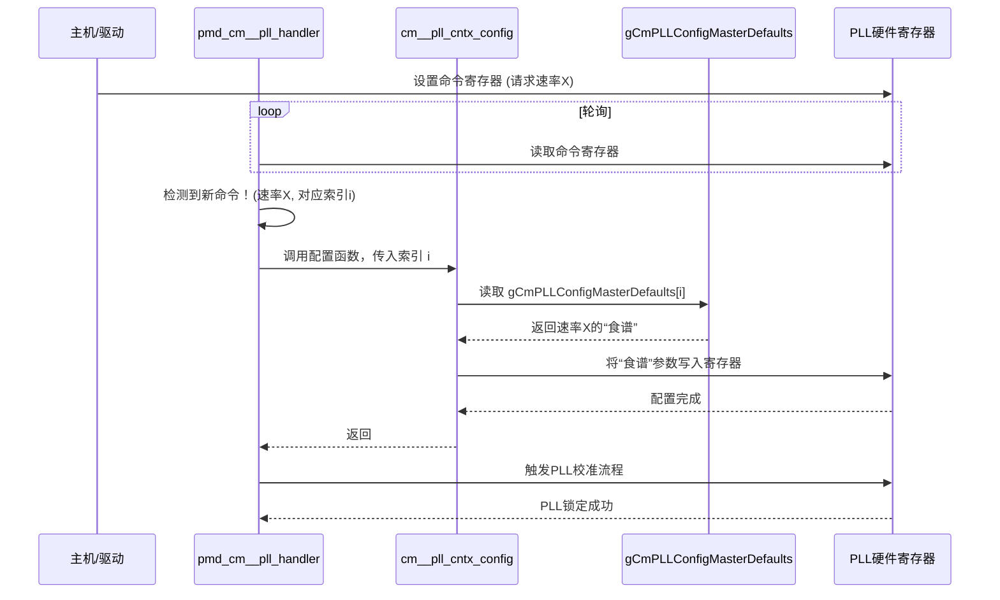

# Chapter 3: 公共模块与PLL时钟管理


好的，这是为您撰写的《e112g_fw_src》教程第三章。

# 第3章：公共模块与PLL时钟管理

在[第2章：配置参数与查找表](02_配置参数与查找表_.md)中，我们揭秘了固件的“食谱书”——那些定义了各种操作模式的查找表。现在，我们将看到这些“食谱”如何被用来烹饪第一道，也是最关键的一道“大菜”：配置系统的心脏——时钟。

## 系统的心跳：为什么时钟如此重要？

想象一个庞大的交响乐团，所有乐手（数据通道TX和RX）都需要根据指挥的节拍来演奏。如果节拍器时快时慢，或者干脆停摆，那么整个演奏将会是一场灾难。

在高速数字通信中，这个“节拍器”就是**时钟信号 (Clock Signal)**。它以极高的频率（比如几十GHz）稳定地振荡，为数据的发送和接收提供精确的时间基准。没有一个稳定、准确的时钟，数据传输就会出错，甚至完全失败。

我们固件中的**公共模块（Common Module, CM）**就扮演着“指挥”的角色，它内部最核心的部件就是**锁相环（Phase-Locked Loop, PLL）**，也就是我们精密的“电子节拍器”。本章将带你了解固件是如何设置、校准并管理这个“节拍器”的。

## 核心组件解析

### 1. 锁相环 (PLL)：神奇的频率倍增器

PLL 是一个非常神奇的电路。你可以给它一个相对低速且普通的参考时钟（比如来自一个石英晶振的100MHz信号），它能够“锁定”这个参考信号的相位，并输出一个频率成倍增加（例如，25GHz）且极其稳定的时钟信号。

*   **输入**：一个普通的参考时钟（Reference Clock）。
*   **功能**：倍频和稳频。
*   **输出**：一个超高频、超稳定的时钟，供所有数据通道使用。

这个过程就像一位专业的速记员，听着一个匀速的节拍声，然后以快上好几倍的速度，精准地写下每一个字符，节奏丝毫不乱。

### 2. 公共模块 (CM)：时钟的“大管家”

在芯片设计中，一个高质量的PLL既昂贵又占地方。为每一条数据通道都配备一个独立的PLL是不现实的。因此，设计者采用了更高效的方案：让多条通道**共享**一个PLL。

这个管理和共享PLL的模块，就是**公共模块 (Common Module, CM)**。它负责：

*   **配置PLL**：根据不同的通信协议（如PCIe, Ethernet）和速率，从[查找表](02_配置参数与查找表_.md)中加载对应的“食谱”。
*   **启动与校准**：控制PLL的启动顺序，并进行精细的校准，确保它精确锁定在目标频率上。
*   **状态监控**：持续监控PLL是否“锁定”（locked），如果失锁则要进行处理。
*   **动态调整**：像一个贴心的管家，时刻关注环境变化（尤其是温度），并对PLL进行微调，以抵消温度漂移带来的影响。

## “烹饪”时钟：配置与校准流程

当主机（Host）下达指令，要求PHY切换到一个新的数据速率时，固件内部会发生一系列连锁反应，核心就是对CM和PLL的操作。

这个过程可以分为两大步：**配置**和**校准**。

1.  **加载配置 (Configuration)**：固件首先根据指令，去“食谱书” `gCmPLLConfigMasterDefaults` 中查找对应新速率的配置参数。
2.  **应用配置 (Apply)**：然后，固件将这些参数（如分频比、环路带宽等）一个个写入到PLL的硬件寄存器中。
3.  **启动校准 (Calibration)**：配置加载完成后，固件会命令PLL开始校准。PLL内部电路会自动进行一系列微调，直到输出时钟的频率和相位与目标值完全一致，这个状态被称为**“锁定”（Locked）**。

让我们通过一个时序图来更清晰地看看这个流程：



这个图展示了固件如何像一个自动化厨师一样，响应命令、查阅食谱、设置厨具（硬件寄存器），最后启动烹饪（校准）。

## 代码中的“指挥家”

现在，让我们深入代码，看看这些步骤是如何实现的。

### 1. 加载“食谱”：`cm__pll_cntx_config()`

当`pmd_cm__pll_handler`收到一个配置命令后，它会调用 `cm__pll_cntx_config()` 函数。这个函数是应用配置的核心。它位于 `cm.c` 文件中。

```c
// 文件: cm.c

ATTR_INLINE void cm__pll_cntx_config (uint8_t a_cm_no, uint8_t a_pllX_cntx) {
  // 指向我们那本“PLL食谱书”的指针
  const struct tCmPLLConfigMasterDefaults_t *vp_cntx_config_master_defaults;

  // 1. 根据传入的速率上下文(a_pllX_cntx)，找到在“食谱书”中的具体页码(索引)
  uint8_t v_pllX_cntx_idx = cntx_index_map[a_pllX_cntx];  
   
  // 2. 让指针指向那一页“食谱”
  vp_cntx_config_master_defaults = &gCmPLLConfigMasterDefaults[v_pllX_cntx_idx];
  
  // 3. 开始“烹饪”：从食谱中取出各项参数，写入硬件寄存器
  // 设置反馈时钟分频比 (FBDIV)
  WRITE_REG_FIELD(g_cm_base_addr, CM__PLL0_CFG2__PLL0_FBCLKDIV_10_0, vp_cntx_config_master_defaults->pll0_fbclkdiv);

  // 设置环路带宽 (BW)，这决定了PLL的响应速度和稳定性
  g_reg_val = READ_REG (g_cm_base_addr, CM__ANA_OVRDVAL0__ADDR);
  SET_FIELD (g_reg_val, CM__ANA_OVRDVAL0__CM_ANA_PLL_BW_14_0, vp_cntx_config_master_defaults->cm_ana_pll_bw);
  WRITE_REG (g_cm_base_addr, CM__ANA_OVRDVAL0__ADDR, g_reg_val);

  // ... 此处省略了对其他几十个参数的设置 ...
}
```

代码逻辑非常清晰：
1.  根据传入的速率模式 `a_pllX_cntx`，查找它在 `gCmPLLConfigMasterDefaults` 这个巨大“食谱书”数组中的位置。
2.  获取指向该“食谱”（一个结构体）的指针。
3.  通过 `vp_cntx_config_master_defaults->` 访问结构体中的每一个字段（如 `pll0_fbclkdiv`），并使用 `WRITE_REG_FIELD` 将它们写入到对应的硬件寄存器中。

这一步完成后，PLL就已经被告知了它需要生成什么样的时钟。

### 2. 持续守护：温度补偿 `cm__pll_pgm_vctl()`

仅仅在开始时配置一次是不够的。芯片工作时会发热，温度的变化会导致电子元器件的特性发生微小的改变，从而可能使PLL的时钟频率产生漂移。为了保持时钟的绝对稳定，固件需要不断进行**温度补偿**。

这个任务由 `cm__pll_pgm_vctl()` 函数（位于`cm.c`）执行，它会在PLL校准前被调用。

```mermaid
graph TD
    A[温度传感器] -->|测量当前温度 (如 85°C)| B(固件);
    B -->|以温度为线索，查找补偿“秘籍”| C(温度补偿表 g_vctl_tsense_lut);
    C -->|找到对应条目 {temp=85, vco_gain_cal=0, vco_gain_cal_lvl=2}| B;
    B -->|“好的，需要这样微调！”| D(PLL硬件);
    D -- 更新VCO控制电压 --> D;
    subgraph 稳定运行的PLL
        D
    end
```

让我们看看实现这一点的代码：
```c
// 文件: cm.c

ATTR_INLINE void cm__pll_pgm_vctl (uint8_t a_cm_no) {
  uint8_t v_idx;

  // 1. 从工作区获取由温度传感器测得的当前温度
  //    我们将在第7章详细了解温度感应
  int8_t current_temp = gCmConfigBlock[a_cm_no].m_s2c_meas_temp;

  // 2. 根据温度计算在'g_vctl_tsense_lut'查找表中的索引
  //    这个表存储了不同温度下最佳的VCO增益补偿值
  v_idx = (current_temp - MIN_TEMP) / TEMP_STEP; 

  // 3. 从查找表中取出补偿值
  uint8_t vco_gain_cal = g_vctl_tsense_lut[v_idx].vco_gain_cal_bg;
  uint8_t vco_gain_lvl = g_vctl_tsense_lut[v_idx].vco_gain_cal_lvl_bg;

  // 4. 将这些补偿值写入PLL的VCO（压控振荡器）增益控制寄存器
  //    这就像微调节拍器的旋钮，以抵消温度带来的影响
  g_reg_val = READ_REG (g_cm_base_addr, CM__ANA_OVRDVAL6__ADDR);
  SET_FIELD (g_reg_val, CM__ANA_OVRDVAL6__CM_ANA_PLL_VCO_GAIN_CAL_1_0, vco_gain_cal);
  SET_FIELD (g_reg_val, CM__ANA_OVRDVAL6__CM_ANA_PLL_VCO_GAIN_CAL_LVL_5_0, vco_gain_lvl);
  WRITE_REG (g_cm_base_addr, CM__ANA_OVRDVAL6__ADDR, g_reg_val);
}
```
这个函数完美地展示了固件的“智能”之处：它不是死板地执行一次性配置，而是能够主动感知环境（温度）变化，并利用预先计算好的数据（`g_vctl_tsense_lut`）进行动态、实时的调整，确保系统的心跳永远精准如一。这个过程是固件与[温度感应与补偿](07_温度感应与补偿_.md)模块协作完成的。

### 3. 命令处理中心：`pmd_cm__pll_handler()`

那么，固件是什么时候知道要执行 `cm__pll_cntx_config` 或 `cm__pll_pgm_vctl` 这些操作的呢？答案就在 `pmd_cm__pll_handler()` 函数（位于 `pmd_cm.c`）中。这个函数在[第1章](01_固件主控与初始化_.md)提到的 `main` 函数的无限循环中被不断调用。

```c
// 文件: pmd_cm.c

ATTR_INLINE void pmd_cm__pll_handler (uint8_t a_cm_no) {
  // ...

  // 这是一个状态机，根据当前状态执行不同操作
  switch (vp_pmd_cm->m_pll_handler_st) {
    // 状态：空闲 (Idle)
    case e_pmd_handler_idle_st: {
      // 1. 检查硬件状态寄存器，看是否有新的命令到来
      bool new_command_arrived = READ_REG_FIELD( g_pmd_cm_base_addr, PMD_CM__FW_STAT__PLLX_FW_CMD_EN ); 

      // 2. 如果没有新命令，就什么也不做，直接返回
      if (new_command_arrived == 0) {
        break;
      }

      // 3. 如果有新命令！读取命令类型
      vp_pmd_cm->m_pll_handler_cmd = READ_REG_FIELD( g_reg_val, PMD_CM__FW_STAT__PLLX_FW_CMD_2_0 );

      // 4. 切换到“请求处理中”状态，下一轮循环时将执行对应命令
      vp_pmd_cm->m_pll_handler_st = e_pmd_handler_req_st;
      break;
    }

    // 状态：请求处理中 (Request)
    case e_pmd_handler_req_st: {
      // 根据命令类型，调用不同的处理函数
      // 例如，如果命令是“配置上下文”，就会调用 pmd_cm__pll_fw_cmd0_cntx_cfg
      pll_handler_fw_cmd_func_array[vp_pmd_cm->m_pll_handler_cmd] (a_cm_no);
     
      // ... 处理完成后切换到“应答”或“空闲”状态
      break;
    }
    // ... 其他状态
  }
}
```
这个函数就像一个永远警觉的哨兵。在 `e_pmd_handler_idle_st`（空闲状态）下，它不断地**轮询（Polling）**一个特定的硬件寄存器位 (`PLLX_FW_CMD_EN`)。一旦外部主机（Host）通过写入这个寄存器来发出命令，`pmd_cm__pll_handler` 就会立即检测到，并切换到 `e_pmd_handler_req_st`（请求处理状态），然后调用相应的函数（如我们之前分析的 `cm__pll_cntx_config`）来执行任务。

## 结论

在本章中，我们深入探索了 `e112g_fw_src` 的“心脏”——公共模块与PLL时钟管理。我们学到了：

*   **PLL是系统的心跳**：它将一个普通的参考时钟，转换成用于高速数据传输的、超高频、超稳定的时钟信号。
*   **CM是PLL的大管家**：它负责根据外部命令，使用[查找表](02_配置参数与查找表_.md)中的“食谱”来配置、校准和维护PLL。
*   **配置是数据驱动的**：`cm__pll_cntx_config` 函数从 `gCmPLLConfigMasterDefaults` 数组中加载参数，并写入硬件，完美实践了数据与逻辑分离的设计。
*   **管理是动态的**：固件不仅仅是做一次性配置。通过 `cm__pll_pgm_vctl` 等函数，它能响应温度等环境变化，进行实时补偿，以保证时钟的持续稳定。
*   **响应是事件驱动的**：`pmd_cm__pll_handler` 通过轮询硬件状态来监听命令，构成了整个模块的事件处理循环。

现在，我们已经有了一个稳定、可靠的心跳。接下来，我们就可以利用这个时钟，开始真正地向外发送数据了。准备好看看数据是如何从固件中“发射”出去的吗？

---

➡️ **下一章：[第4章：发射器(TX)控制与校准](04_发射器_tx_控制与校准_.md)**

---

Generated by [AI Codebase Knowledge Builder](https://github.com/The-Pocket/Tutorial-Codebase-Knowledge)