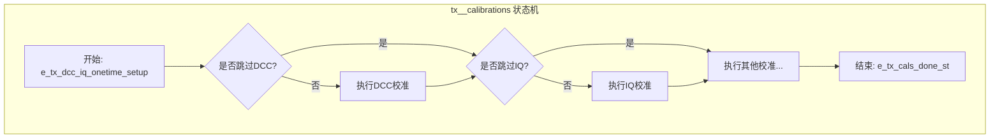

# Chapter 4: 发射器(TX)控制与校准


在[第3章：公共模块与PLL时钟管理](03_公共模块与pll时钟管理_.md)中，我们为整个系统配置了精准而稳定的“心跳”——PLL时钟。现在，心脏已经开始跳动，是时候让我们的设备张开“嘴巴”，把数据说出去了。这个“嘴巴”就是**发射器（Transmitter, TX）**。

本章，我们将一起探索固件是如何控制这个精密的“嘴巴”，确保它不仅能“说话”，而且能“说”得清晰、准确，让另一端能完全听懂。

## 为什么要小心翼翼地“开口说话”？

想象一下启动一台复杂的机器，比如一辆高性能跑车的引擎。你不能简单地直接点火，而是需要一个预热、自检的启动流程，确保机油到位、电子系统正常，然后引擎才能平稳启动并爆发出澎湃动力。

我们的高速发射器也是如此。它内部包含了大量敏感的模拟电路。如果瞬间给所有电路通电，巨大的电流冲击可能会损坏元器件，或者导致电路工作在不稳定的状态。因此，我们需要一个精心设计的**上电（Power-Up）和断电（Power-Down）序列**。

这个序列就像一个剧本，规定了：
1.  哪个部件先启动？（例如，先稳定电压调节器VREG）
2.  启动后要等待多久？（例如，等待1微秒让电压稳定）
3.  下一步该做什么？（例如，再开启偏置电路Bias）
4.  什么时候进行校准？

固件的核心任务之一，就是扮演导演的角色，将这个“剧本”加载到硬件中，然后命令硬件按部就班地执行，从而安全、可靠地启动或关闭发射器。

## “启动剧本”：上电序列查找表

这个“启动剧本”在我们的固件里，就是一系列的查找表（LUT）。在[第2章](02_配置参数与查找表_.md)中我们已经熟悉了这种数据驱动的设计。针对不同的通信模式（如以太网模式或PCIe模式），固件准备了不同的剧本。

让我们来看看位于 `eth_tx_pwr_cmd_seq.c` 文件中的以太网模式“上电剧本”。

```c
// 文件: eth_tx_pwr_cmd_seq.c

// 这就是上电序列的“剧本”，一个包含多个步骤的数组
struct tPowerUpSequenceTable_t gEthTxPowerUpSequenceTableLut[NUM_TX_PWRUP_STEPS] = {
    // 步骤1-3: 空操作，留作余量
    {  eTxHwCmd_None             ,    0,   0, ... },
    // 步骤4: 固件命令 - 禁用驱动器
    {  eTxFwCmd_TxDrvDisable     ,    1,   1, ... },
    // 步骤5: 硬件命令 - 使能电压调节器 (Vreg)
    {  eTxHwCmd_VregEn           ,    1,   0, ... },
    // 步骤6: 等待
    {  eTxHwCmd_None             ,    0,   0, ... },
    // 步骤7: 硬件命令 - 使能偏置电路 (Bias)
    {  eTxHwCmd_BiasEn           ,    1,   0, ... },
    // ... 中间省略了许多步骤 ...
    // 步骤26: 固件命令 - 执行一系列校准
    {  eTxFwCmd_TxCalibs         ,    0,   1, ... },
    // 步骤27: 固件命令 - 使能数字时钟到焊盘 (Pad)
    {  eTxFwCmd_TxDigClkEnPad    ,    1,   1, ... },
    // ... 后续还有其他步骤 ...
};
```

这个 `gEthTxPowerUpSequenceTableLut` 数组的每一行，都代表上电过程中的一个精确步骤。每一行定义了一个“命令”以及它的参数。这些命令分为两类：

*   **`eTxHwCmd_*` (硬件命令)**：比如 `eTxHwCmd_VregEn`。当硬件执行到这一步时，它会直接操作内部电路，打开电压调节器。这些是硬件自己就能完成的动作。
*   **`eTxFwCmd_*` (固件命令)**：比如 `eTxFwCmd_TxCalibs`。当硬件执行到这一步时，它会“暂停”并通知固件：“导演，轮到你了！”。固件随后会接管控制权，执行像校准这样更复杂的任务。任务完成后，固件再通知硬件继续执行后面的步骤。

这种软硬件协同的方式，兼顾了硬件执行的效率和固件控制的灵活性。

## 加载“剧本”到硬件：`config_tx_pwrseq()`

固件是如何把这个“剧本”告诉硬件的呢？答案在 `pmd_tx.c` 文件的 `config_tx_pwrseq()` 函数中。这个函数在系统初始化时被调用。

```c
// 文件: pmd_tx.c

inline void config_tx_pwrseq (uint8_t vLaneNo) {
  // ... 指向我们选择的“剧本”（以太网或PCIe）...
  // 根据模式选择对应的上电剧本
  if (vp_tx->m_tx_mode == e_pcie_mode) { 
    vPowerUpSequenceTable = gPcieTxPowerUpSequenceTableLut;
  } else {  
    vPowerUpSequenceTable = gEthTxPowerUpSequenceTableLut;
  }

  uint32_t vAddrOfst = 0x0;
  // 遍历“剧本”中的每一步
  for (uint32_t vI = 0; vI <= TOTAL_STEPS ; vI=vI+2)
  {
    // 将步骤的指令打包成一个32位的数值
    g_reg_val = (uint32_t)(*((uint32_t *)&vPowerUpSequenceTable[vI]));

    // 将这条指令写入硬件的“剧本存储区”（一系列寄存器）
    WRITE_REG( g_pmd_lane_tx_base_addr, (PMD_LANE_TX__TX_PWRUP_CFG0__ADDR + vAddrOfst), g_reg_val );
    
    // 地址递增，准备写入下一步指令
    vAddrOfst += 0x04;
  }
  // ... 同样的过程也用于加载“断电剧本” ...
}
```

这段代码的核心就是一个循环。它做的事情非常直观：
1.  根据当前通道的工作模式（`e_pcie_mode` 或 `e_eth_mode`），选择正确的“剧本”数组。
2.  逐行读取“剧本”中的指令。
3.  通过 `WRITE_REG` 将每一条指令写入到硬件的特定寄存器地址中。这些寄存器就像是硬件时序控制器（Sequencer）的内存。

当这个函数执行完毕后，硬件就已经知道了完整的上电和断电流程。之后，当主机发送一个“启动TX”的命令时，硬件时序控制器就会自动从第一步开始，严格按照我们加载的“剧本”执行。

```mermaid
sequenceDiagram
    participant Firmware as 固件 (pmd_tx.c)
    participant LUT as 上电剧本 (pwr_cmd_seq.c)
    participant HW_Sequencer as 硬件时序控制器
    participant HW_Analog as 模拟电路

    Firmware->>LUT: 读取启动剧本 (如 gEthTxPowerUpSequenceTableLut)
    LUT-->>Firmware: 返回指令列表
    Firmware->>HW_Sequencer: 将指令逐条写入配置寄存器
    Note right of Firmware: 剧本加载完成！

    Host->>HW_Sequencer: 命令：启动TX！
    HW_Sequencer->>HW_Analog: 执行步骤1: 使能Vreg
    delay 1us
    HW_Sequencer->>HW_Analog: 执行步骤2: 使能Bias
    delay ...
    HW_Sequencer->>Firmware: 请求执行固件命令 (如 eTxFwCmd_TxCalibs)
    Firmware->>Firmware: 执行复杂的校准程序...
    Firmware-->>HW_Sequencer: 固件任务完成，请继续
    HW_Sequencer->>HW_Analog: 执行后续步骤...
    HW_Sequencer-->>Host: TX启动完成！
```

## “吐字清晰”的秘诀：信号校准

仅仅把发射器安全地启动起来还不够。高速信号非常脆弱，就像耳语一样，任何微小的失真都可能导致信息错误。为了确保“吐字清晰”，固件在启动流程中，会执行一系列关键的**校准（Calibration）**程序。

在上面“剧本”的第26步，我们看到了一个固件命令 `eTxFwCmd_TxCalibs`。当硬件执行到这一步时，固件就会调用 `pmd_tx__calibrations()` 函数，开始进行精密的“调音”。

主要包括以下两种校准：

1.  **DCC (Duty-Cycle Correction) - 占空比校正**
    *   **问题**：理想的数字信号，'1'和'0'的持续时间应该完全一样。但由于电路的非理想性，可能会导致'1'比'0'长一点点（或短一点点）。这被称为占空比失真。
    *   **目标**：精确调整电路，让'1'和'0'的宽度完全相等，恢复50/50的完美占空比。
    *   **类比**：就像说话时，确保每个字的发音时长都恰到好处，不拖长也不急促。

2.  **IQ (In-phase/Quadrature) Calibration - IQ校准**
    *   **问题**：为了在相同时间内传输更多数据，我们使用PAM4（4电平脉冲幅度调制）等高级信号。它不再是简单的0/1，而是有四个不同的电压电平（比如0, 1, 2, 3）。如果I路信号和Q路信号（可以理解为构成PAM4信号的两个基础信号）之间存在相位或幅度的偏差，这四个电平就会变得模糊不清，容易误判。
    *   **目标**：调整I路和Q路信号，使它们的相位和幅度完全匹配，从而生成清晰、可辨的四个电平。
    *   **类比**：就像唱歌时发出和谐的和弦，如果两个音符的音准或节奏稍有偏差，和弦听起来就会很刺耳。IQ校准就是要把这两个“音符”调得完美和谐。

### 校准的执行者：`tx__calibrations()`

`pmd_tx__calibrations()` 函数会调用位于 `tx.c` 中的 `tx__calibrations()`，这是一个庞大而精密的状态机，它一步步地指挥硬件完成校准。



由于这个状态机非常复杂，我们只看其中一小部分，来理解它的工作模式——“**请求-轮询**”模式。

```c
// 文件: tx.c (简化逻辑)

bool tx__calibrations (uint8_t a_lane_no, ...) {
  // ...
  switch (vp_tx->m_tx_cal_st) {
    // ... 其他状态 ...

    case e_tx_dcc_cal_en_st: {
      // 1. 请求硬件开始DCC校准
      //    通过写入寄存器来触发一个“校准请求”信号
      WRITE_REG_FIELD (g_tx_base_addr, TX__PIN_OVRDVAL1__INT_TX0_DCC_CAL_REQ_I, 1);
      
      // 2. 切换到下一个状态，准备等待结果
      vp_tx->m_tx_cal_st = e_tx_dcc_cal_poll_done_st;
      break;
    }

    case e_tx_dcc_cal_poll_done_st: {
      bool v_poll_done = false;
      // 3. 轮询（Polling）硬件的状态寄存器
      v_poll_done = READ_REG_FIELD (g_tx_base_addr, TX__PIN_OVRDVAL1__INT_TX0_DCC_CAL_DONE_O);

      // 4. 如果硬件还没有完成（DONE位不为1），就什么也不做，等待下一次轮询
      if (v_poll_done == false) {
        break;
      }

      // 5. 如果硬件完成了！清除请求位，并进入下一个校准步骤
      WRITE_REG_FIELD (g_tx_base_addr, TX__PIN_OVRDVAL1__INT_TX0_DCC_CAL_REQ_I, 0);
      vp_tx->m_tx_cal_st = e_tx_iq_cal_en_st; // 进入IQ校准
      break;
    }

    // ... 其他校准状态 ...
  }
  // ...
}
```

这个模式非常经典：
1.  **请求 (Request)**：固件通过写寄存器，命令硬件开始一项耗时的工作（如DCC校准）。
2.  **轮询 (Poll)**：固件不傻等，它会不断地（在主循环的每一次迭代中）去检查一个“完成”状态位。
3.  **完成 (Acknowledge)**：一旦发现硬件设置了“完成”位，固件就知道任务结束了，然后可以开始下一个任务。

通过这种方式，固件高效地管理着一系列复杂的校准流程，确保发射器在最佳状态下工作。

## 结论

在本章中，我们打开了固件的“嘴巴”——发射器（TX），并学习了固件如何控制它进行清晰、可靠的数据发送。我们了解到：

*   **上电/断电序列是关键**：为了安全地控制敏感的模拟电路，固件使用一个精确定义的、基于查找表的步骤序列来启动和关闭TX。
*   **剧本式控制**：固件将这个操作序列（“剧本”）加载到硬件时序控制器中，实现了软硬件协同的高效控制。不同的通信协议有不同的“剧本”。
*   **校准保证信号质量**：在启动过程中，固件会执行一系列关键的校准，如**DCC校准**（保证'0'和'1'宽度相同）和**IQ校准**（保证PAM4信号电平清晰），从而减少失真。
*   **请求-轮询模式**：固件通过“请求-轮询”的方式来管理耗时的硬件校准过程，体现了高效的事件处理机制。

现在，我们的设备已经能够清晰地“说”出数据了。但一次完整的通信，不仅要会说，还要会“听”。我们的“耳朵”——接收器（RX）又是如何工作的呢？它如何从混杂着噪声的信号中准确地解码出数据？

---
➡️ **下一章：[第5章：接收器(RX)控制与自适应均衡](05_接收器_rx_控制与自适应均衡_.md)**

---

Generated by [AI Codebase Knowledge Builder](https://github.com/The-Pocket/Tutorial-Codebase-Knowledge)