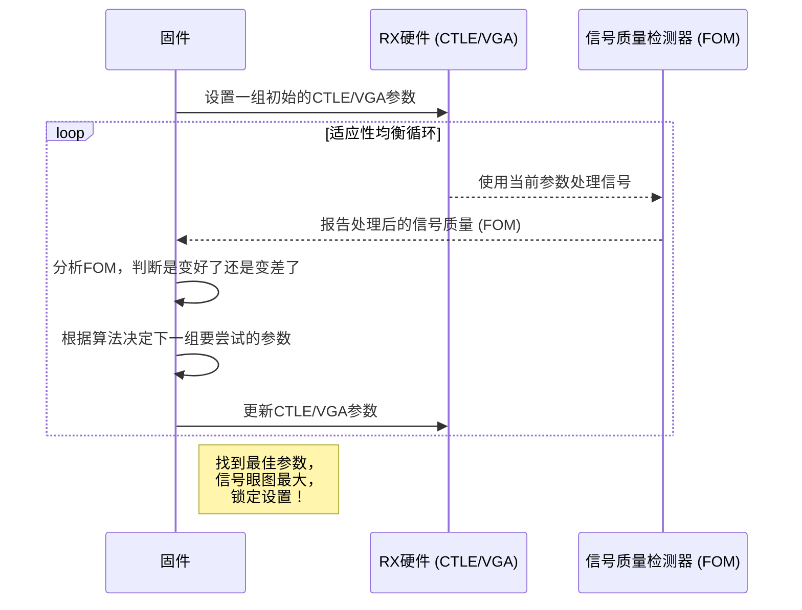

# Chapter 5: 接收器(RX)控制与自适应均衡


在[第4章：发射器(TX)控制与校准](04_发射器_tx_控制与校准_.md)中，我们学习了固件如何控制“嘴巴”（TX）清晰地发送数据。一次完整的通信，光会“说”还不够，更要会“听”。本章，我们将探索固件的“耳朵”——**接收器（Receiver, RX）**，看看它是如何在一堆嘈杂、失真的信号中，分辨并恢复出最原始、最清晰的数据。

## 信号的“长途旅行”与“助听器”

想象一下，你站在一个宽阔的广场一头，对另一头的朋友说话。你的声音在传播过程中，会因为距离而衰减，还会被风声、人声等各种噪音干扰。当你朋友听到时，声音可能已经变得微弱且模糊不清了。

高速数字信号在电路板的铜线（我们称之为“信道”）中传输时，也会经历类似的过程。信号会衰减，高频分量比低频分量衰减得更严重，还会受到各种电磁干扰。当信号到达接收器（RX）时，原本清晰的方波可能已经变成了“一塌糊涂”的波形，如下图所示，信号的“眼睛”已经快要闭上了。

```mermaid
graph TD
    subgraph 发射端 (TX)
        A[清晰的原始信号<br>]
    end
    subgraph 传输信道
        B(衰减, 失真, 噪声)
    end
    subgraph 接收端 (RX)
        C[模糊的接收信号<br>]
    end
    A -- 长距离传输 --> B --> C
```

如果直接对这个模糊的信号进行解码，出错的概率会非常高。

接收器（RX）的核心任务，就是扮演一个极其先进的**智能助听器**。它能分析接收到的“模糊声音”，并自动调整内部的滤波器和放大器，尽最大努力将其恢复成清晰的原始信号。这个过程，我们称之为**自适应均衡（Adaptive Equalization）**。

## “耳朵”的精密构造与启动

与发射器（TX）类似，接收器（RX）也由大量敏感的模拟电路构成，因此它同样需要一个精心设计的**上电序列**来保证安全、可靠的启动。这个“剧本”存储在查找表中，由固件在初始化时加载到硬件。

`eth_rx_pwr_cmd_seq.c` 文件中就定义了以太网模式下的接收器上电“剧本”。

```c
// 文件: eth_rx_pwr_cmd_seq.c

// RX上电序列“剧本”
struct tPowerUpSequenceTable_t gEthRxPowerUpSequenceTableLut[NUM_RX_PWRUP_STEPS] = {
    // 步骤1: 固件命令 - 恢复复位后的默认值
    {  eRxFwCmd_RestoreResetDefaults,    0,   1, ... },
    // ...
    // 步骤5: 硬件命令 - 使能电压调节器 (Vreg)
    {  eRxHwCmd_VregEn              ,    1,   0, ... },
    // 步骤6: 硬件命令 - 使能偏置电路 (Bias)
    {  eRxHwCmd_BiasEn              ,    1,   0, ... },
    // ...
    // 步骤12: 固件命令 - 加载速率相关的配置
    {  eRxFwCmd_RateCfg             ,    0,   1, ... },
    // ...
    // 步骤33-39: 硬件命令 - 执行一系列硬件自动校准
    {  eRxHwCmd_HfeqCal             ,    1,   0, ... }, 
    {  eRxHwCmd_Vga1Cal             ,    1,   0, ... }, 
    {  eRxHwCmd_AdcVrefCal          ,    1,   0, ... }, 
    // ...
    // 步骤49: 固件命令 - 执行更复杂的固件校准
    {  eRxFwCmd_CtleVgaRtrim        ,    0,   1, ... },
    // ... 后续还有很多步骤
};
```
这个流程与[第4章](04_发射器_tx_控制与校准_.md)中的TX上电序列非常相似，都是通过软硬件协同（`eRxHwCmd_*` 和 `eRxFwCmd_*`）的方式，一步步唤醒接收器。

`pmd_rx.c` 中的 `config_rx_pwrseq()` 函数负责将这个“剧本”加载到硬件中，为启动做好准备。

```c
// 文件: pmd_rx.c

inline void config_rx_pwrseq (uint8_t vLaneNo) {
  // ... 指针指向正确的“剧本” (以太网或PCIe模式) ...
  struct tPowerUpSequenceTable_t *vPowerUpSequenceTable;
  if (vp_rx->m_rx_mode == e_pcie_mode) { 
    vPowerUpSequenceTable = gPcieRxPowerUpSequenceTableLut;
  } else {  
    vPowerUpSequenceTable = gEthRxPowerUpSequenceTableLut;
  }

  // 循环遍历剧本，将每一步的指令写入硬件的序列器内存中
  uint32_t vAddrOfst = 0x0;
  for (uint32_t vI = 0; vI <= TOTAL_STEPS ; vI=vI+2)
  {
    g_reg_val = (uint32_t)(*((uint32_t *)&vPowerUpSequenceTable[vI]));
    WRITE_REG( g_pmd_lane_rx_base_addr, (PMD_LANE_RX__RX_PWRUP_CFG0__ADDR + vAddrOfst), g_reg_val );
    vAddrOfst += 0x04;
  }
}
```

## 智能“调音”：自适应均衡的核心

当RX安全启动后，真正神奇的事情开始了。它需要自动“调音”，把模糊的信号变清晰。这个“调音台”主要有两个旋钮：

1.  **CTLE (Continuous Time Linear Equalizer) - 连续时间线性均衡器**
    *   **作用**：这是一个特殊的滤波器，专门用来**提升**信号中被衰减的高频部分。
    *   **类比**：就像你调节音响的“高音（Treble）”旋钮。如果音乐听起来很沉闷，你调高高音，钹声和弦乐就会变得清晰明亮。CTLE就是做这个的。

2.  **VGA (Variable Gain Amplifier) - 可变增益放大器**
    *   **作用**：在CTLE处理完信号后，整个信号的幅度（音量）可能过大或过小。VGA负责将信号的整体幅度调整到一个最合适的“甜点区”。
    *   **类比**：这就是音响的“总音量（Volume）”旋钮，确保声音既不会小到听不见，也不会大到失真。

“自适应”的精髓在于，固件和硬件会形成一个紧密的**反馈循环**，自动寻找CTLE和VGA的最佳设置组合。


这个循环会不断迭代，直到找到一组能让信号“眼图”张得最大的参数为止。

## 代码中的“调音师”

自适应均衡是一个非常复杂的过程，由多个算法和状态机协同工作完成。我们来看几个关键的片段，了解其工作原理。

### 1. 持续的、自动的微调 (CCA)

CCA（Continuous Calibration and Adaptation）是一种让接收器在正常工作时也能持续进行微调的机制。它就像一个敬业的调音师，即使在乐队演奏过程中，也在悄悄地监听和调整，确保音效始终最佳。

`rx_afe_cca.c` 文件中的代码展示了这种微调的逻辑。

```c
// 文件: rx_afe_cca.c (简化逻辑)

// 运行VGA精细调节
void run_vga_fine_adapt (uint8_t a_lane_no) {

  // 读取当前的信号质量指标 (例如，信号摆幅)
  g_curr_vga_status30[a_lane_no] = READ_REG_FIELD (g_rx_base_addr,  RX__STATUS30__RX_ANA_VGA_GAIN_4_0);

  // 如果当前指标比上次好，或者已经达到最大值
  if ((g_prev_vga_status30[a_lane_no] < g_curr_vga_status30[a_lane_no]) || (g_curr_vga_status30[a_lane_no] == MAX)) {
    // 信号太强了，需要稍微减小增益
    // 检查是否能通过“微调”来降低
    if (gVgaCoarseCode[a_lane_no] <= min_coarse_code) {
        // 微调空间不够了，需要调整其他参数 (比如ADC参考电压)
        g_flag_adc_vref_adapt[a_lane_no] = 1; 
    } else {
        // 还有微调空间，调用函数减小VGA增益
        inlinefunc_updateVgaFine (a_lane_no, step, DECREASE);
    }
  }
  // 如果当前指标比上次差，或者已经达到最小值
  else if ((g_prev_vga_status30[a_lane_no] > g_curr_vga_status30[a_lane_no]) || (g_curr_vga_status30[a_lane_no] == MIN)) {
    // 信号太弱了，需要增加增益
    inlinefunc_updateVgaFine (a_lane_no, step, INCREASE);
  }

  // 记录下当前的指标，用于下次比较
  g_prev_vga_status30[a_lane_no] = g_curr_vga_status30[a_lane_no];
}
```
这段代码的逻辑非常直观：
1.  **读取状态**：从硬件寄存器读取一个能反映当前信号质量的值 (`g_curr_vga_status30`)。
2.  **比较判断**：将其与上一次读取的值 (`g_prev_vga_status30`) 进行比较。
3.  **做出决策**：
    *   如果信号太强（指标值变大），就尝试减小VGA增益。
    *   如果信号太弱（指标值变小），就尝试增加VGA增益。
4.  **执行调整**：调用像 `inlinefunc_updateVgaFine()` 这样的函数，通过写寄存器来改变硬件的VGA设置。
5.  **更新记录**：保存当前的指标值，为下一次循环做准备。

CTLE的调节过程也遵循类似的逻辑，不断地“试探”和“调整”，以追求最佳的信号清晰度。

### 2. 高级“回声消除”：FTFFE自适应

除了CTLE和VGA，还有一个更高级的工具叫做 **FTFFE (Floating Tap Feed-Forward Equalizer)**。

*   **问题**：信号在传输时，会产生“回声”（码间串扰, ISI），即前一个码元的信号会干扰到当前的码元。
*   **作用**：FTFFE就像一个定制的“回声消除器”。它有多个可以移动的“抽头（Tap）”，固件可以把它们精确地放置在产生回声的位置，并施加一个反向的信号来抵消掉这些回声。
*   **挑战**：如何知道应该把这些“抽头”放在哪里呢？

`fw_rx_adapt_atom.c` 文件中的 `funcFtffeTapSelection()` 函数为我们揭示了答案。这是一个非常精彩的数据驱动算法。

```c
// 文件: fw_rx_adapt_atom.c (简化逻辑)

void funcFtffeTapSelection (uint8_t fsm_no) {
  // ...

  // 1. 硬件已经测量并计算好了在不同位置的“回声强度”（相关性）
  //    结果存放在 pmd_lane_fsm_h[vLaneNo].corr_array 数组中

  // 2. 固件计算出每个可能抽头位置的“总回声能量”
  for (uint8_t i=0; i<isi_3tap_sum_array_size; i++) {
    // 将相邻几个点的回声强度相加，得到一个评估值
    isi_3tap_sum_array[i] = pmd_lane_fsm_h[vLaneNo].corr_array[i] + ...; 
  }

  // 3. 对“总回声能量”进行排序，找出能量最强的几个点
  //    这就是“回声”最严重的地方
  for (uint8_t i=0; i<size; i++) {
    for (uint8_t j=i+1; j<size; j++) {
      if (isi_3tap_sum_array[j] > isi_3tap_sum_array[i]) {
        // 交换位置，实现一个简单的排序算法
        // ...
      }
    }
  }

  // 4. 选择排序后最靠前的几个位置作为最佳抽头位置
  g0t0 = position_sorted_array[0]; // 第一个抽头组的最佳位置
  g1t0 = position_sorted_array[1]; // 第二个抽头组的最佳位置
  // ...

  // 5. 使用查找表（例如g0t0_array）将计算出的位置索引转换为实际的硬件配置值
  //    这又一次体现了在 [第2章](02_配置参数与查找表_.md) 中学到的数据驱动设计
  SET_FIELD (g_reg_val, ..., g0t0_array[pmd_lane_fsm_h[vLaneNo].g0[0]]);
  
  // 6. 将最终配置写入硬件
  WRITE_REG (g_rx_base_addr, RX__FFE_TRAINING12__ADDR, g_reg_val);
}
```
这个算法的步骤清晰地展示了固件的“智能”：
1.  **测量**：利用硬件收集关于信道特性的数据（回声强度）。
2.  **分析**：在固件内部对数据进行计算和排序，找出问题的关键点（回声最强的位置）。
3.  **决策**：基于分析结果，做出最优决策（选择最佳的抽头位置）。
4.  **执行**：利用[查找表](02_配置参数与查找表_.md)将决策转换为硬件配置，并写入寄存器，完成“回声消除”器的设置。

## 结论

在本章中，我们一起探索了固件的“耳朵”——接收器（RX），它是保证通信质量的最后一道，也是最关键的一道防线。我们学到了：

*   **接收器的挑战**：它必须处理从信道传来的、已经严重衰减和失真的高速信号。
*   **安全启动**：和TX一样，RX也有一套严格的、基于“剧本”的**上电序列**，由固件加载和控制。
*   **自适应均衡是核心**：这是RX的“智能助听器”功能。它通过一个**反馈循环**，自动调整 **CTLE**（高音旋钮）和 **VGA**（音量旋钮）的设置，以最大限度地恢复信号。
*   **智能算法**：固件内部运行着复杂的算法，例如**CCA**（持续微调）和**FTFFE自适应**（回声消除），它们通过“测量-分析-决策-执行”的模式，动态地与硬件交互，实现最佳的信号接收效果。

至此，我们已经分别了解了系统的心脏（CM）、嘴巴（TX）和耳朵（RX）是如何在固件的控制下独立工作的。但是，一个完整的系统需要它们协同运作。它们是如何接收来自外部的命令？固件又是如何调度和处理这些来自不同模块的任务的呢？

这正是我们下一章将要揭晓的秘密。

---
➡️ **下一章：[第6章：任务处理与信箱通信机制](06_任务处理与信箱通信机制_.md)**

---

Generated by [AI Codebase Knowledge Builder](https://github.com/The-Pocket/Tutorial-Codebase-Knowledge)