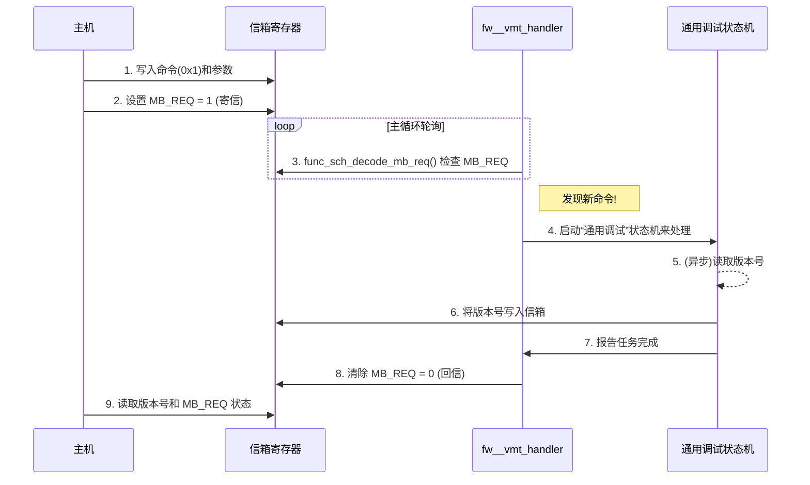

# Chapter 6: 任务处理与信箱通信机制


在前几章中，我们探索了固件的心脏（[CM](03_公共模块与pll时钟管理_.md)）、嘴巴（[TX](04_发射器_tx_控制与校准_.md)）和耳朵（[RX](05_接收器_rx_控制与自适应均衡_.md)）。我们看到固件是如何对这些模块进行精密的配置和校准的。但是，这些操作是由谁发起的呢？固件是如何知道**何时**该做什么事？又是如何与外部世界（比如主机的驱动程序）进行沟通的呢？

本章，我们将揭开固件内部的“调度中心”和“邮局”的神秘面纱。我们将学习固件赖以生存的两种核心机制：
1.  **请求-应答握手协议**：用于处理来自内部硬件状态机的任务请求。
2.  **信箱（Mailbox）机制**：用于处理来自外部主机（Host）的更复杂的命令。

## 问题：一个永不停止的循环如何处理新任务？

回想一下[第1章：固件主控与初始化](01_固件主控与初始化_.md)中提到的 `main` 函数，它最终进入了一个 `while(1)` 的无限循环。在这个循环里，`fw__vmt_handler()` 被反复调用，不断轮询各个模块。

```c
// 文件: fw.c (简化版)
int main () {
  // ... 初始化 ...
  while (1) {
    fw__vmt_handler ();
  }
}
```

想象一下，你是一个极其敬业的办公室经理（固件），你的工作就是不停地在办公室里巡视，检查每个员工（TX/RX模块）和每台机器（硬件状态机）的状态。

这时，如果一台机器完成了它的工作，需要你进行下一步操作，它会怎么通知你？如果公司CEO（主机）发来一封邮件，要求你报告公司资产（读取某个寄存器值），你又该如何接收并处理这个指令呢？你总不能停下巡视，专门等在一台机器旁边或者守在邮箱门口吧？

这正是本章要解决的问题。固件需要一套高效的**异步**通信和任务处理机制，确保在不停地执行主循环的同时，能够响应各种突发事件。

## 机制一：硬件的“举手”——请求-应答握手

在[第4章](04_发射器_tx_控制与校准_.md)和[第5章](05_接收器_rx_控制与自适应均衡_.md)中，我们看到了复杂的上电序列。这些序列大部分由硬件自动执行，但某些关键步骤（如校准）需要固件的介入。

硬件是如何通知固件“该你上场了”的呢？它采用了一种简单而高效的**“请求-应答”（Request-Acknowledge）握手**机制。

这就像工厂流水线上的工人（硬件）和质检员（固件）。
1.  **请求 (Request)**：当工人完成一个零件的组装后，他会在零件旁边亮起一盏红灯（设置一个“请求”寄存器位）。
2.  **察觉 (Decode)**：质检员在巡视时看到了这盏红灯（`tx_handler_req_decode()` 检测到请求位）。
3.  **处理 (Process)**：质检员拿起零件进行检查（固件调用 `tx_handler_task_array` 中的相应函数执行任务）。
4.  **应答 (Acknowledge)**：检查完毕后，质检员按下一个按钮，熄灭红灯，并亮起一盏绿灯（清除“请求”位，设置“应答”位），告诉工人可以继续下一步了。

这个过程的核心在于，质检员（固件）永远不会停下来傻等，他总是在巡视，只有看到红灯时才去处理。

### 代码中的握手机制

让我们看看 `fw__vmt_handler` 是如何实现这个巡视和处理流程的。

```c
// 文件: fw.c

ATTR_INLINE void fw__vmt_handler () {
  // ...
  for (uint8_t v_inst_no = 0; v_inst_no < g_num_lane; v_inst_no++)  {
    // ...
    // 轮询发射器 (TX) 的处理器
    vTxHandlerFsmId = MAX_NUM_CM + v_inst_no;
    
    // 1. 如果TX处理器处于“空闲”状态，就检查硬件是否“举手”了
    if (handshake_fsm_st[vTxHandlerFsmId] == e_pmd_handler_idle_st) {
        tx_handler_req_decode (vTxHandlerFsmId); 
    }
    
    // 2. 如果状态变为“请求”，就执行具体的任务
    if (handshake_fsm_st[vTxHandlerFsmId] == e_pmd_handler_req_st) {
        tx_handler_task_array[handler_func_pntr[vTxHandlerFsmId]] (vTxHandlerFsmId); 
    }
    
    // 3. 如果状态变为“应答”，就通知硬件任务已完成
    if (handshake_fsm_st[vTxHandlerFsmId] == e_pmd_handler_ack_st) {
        tx_handler_ack_gen(vTxHandlerFsmId);
    }
    // ... 对RX也进行类似处理 ...
  }
  // ...
}
```

这段代码完美地展示了一个**状态机（State Machine）**的逻辑：
*   `handshake_fsm_st`: 这是一个全局数组，记录了每个模块（TX/RX）当前的任务处理状态。
*   **`e_pmd_handler_idle_st` (空闲状态)**：在这个状态下，固件会调用 `tx_handler_req_decode` 去检查硬件的“请求”位。如果检测到请求，它会把状态切换到 `e_pmd_handler_req_st`。
*   **`e_pmd_handler_req_st` (请求处理状态)**：在这个状态下，固件会根据请求的类型，从一个名为 `tx_handler_task_array` 的**函数指针数组**中找到并执行对应的处理函数。任务完成后，状态切换到 `e_pmd_handler_ack_st`。
*   **`e_pmd_handler_ack_st` (应答状态)**：固件调用 `tx_handler_ack_gen` 函数，在硬件寄存器中写入一个“完成”信号，然后将状态切回 `e_pmd_handler_idle_st`，等待下一个任务。

`tx_handler_task_array` 是一个非常关键的数据结构，它将硬件请求的命令代码与固件中具体的处理函数一一对应起来。

```c
// 文件: fw_tables.c

// 一个函数指针数组，就像一本“任务处理手册”
void (*tx_handler_task_array[NUM_TX_HANLDER_FW_ST]) (uint8_t fsm_no) = {
   // ...
   [eTxFwCmd_TxCalibs]         = pmd_tx__calibrations,      // 如果请求是校准，就调用 pmd_tx__calibrations
   [eTxFwCmd_VregEn]           = pmd_tx__vreg_config,       // 如果请求是使能Vreg，就调用 pmd_tx__vreg_config
   [eTxFwCmd_TxDrvDisable]     = pmd_tx__drv_disable,       // ... 等等
   // ...
};
```

通过这种方式，固件实现了对硬件请求的灵活、高效、非阻塞的响应。

## 机制二：固件的“邮局”——信箱（Mailbox）

请求-应答机制非常适合处理固定的、由硬件发起的任务。但如果外部主机（Host）想要执行一些更灵活、更通用的操作，比如“读取一下固件的版本号”或者“测量一下当前的芯片温度”，该怎么办呢？

这时候，**信箱（Mailbox）机制**就派上用场了。

信箱本质上是芯片上一块共享的内存区域（由一组特定的寄存器构成），主机和固件都可以对它进行读写。它就像一个真正的邮局信箱：
*   **寄信（主机发送命令）**：主机将“收件人”（固件）、“信件内容”（命令代码和参数）和“邮票”（一个请求标志位 `MB_REQ`）一起放入信箱寄存器。
*   **取信（固件处理命令）**：固件在主循环中会定期检查信箱的“邮票”（`MB_REQ` 位）。一旦发现有新邮件，就会取出并处理。
*   **回信（固件返回结果）**：固件处理完命令后，会把结果写回信箱，并清除“邮票”，表示邮件已处理。
*   **收信（主机读取结果）**：主机发现“邮票”被清除了，就知道回信已经到了，可以去信箱里读取结果了。

### 案例：主机请求固件版本号

让我们通过一个具体的例子，看看信箱是如何工作的。



这个流程的关键在于第4步和第5步。对于一些可能耗时的操作，固件不会在主循环里直接执行，而是会启动一个专门的**“通用调试”状态机**（`general_debug_fsm`）。这个状态机独立运行，分步执行任务，执行完成后再通知主循环。这样做可以防止主循环被长时间阻塞，保持整个系统的高响应性。

### 代码中的“邮局”

1.  **收发室：`func_sch_decode_mb_req()`**

    在 `fw__vmt_handler` 的每次循环中，都会调用 `func_sch_decode_mb_req()`。这个函数就是“邮局”的收发室，专门负责检查信箱里有没有新邮件。

    ```c
    // 文件: fw_sch_atoms.c

    void func_sch_decode_mb_req (void) {
      uint8_t mb_req = 0; 
    
      // 1. 读取信箱寄存器
      g_reg_val = READ_REG (PMD_BASE_ADDR, PMD__FW_MAILBOX0__ADDR);
      // 2. 检查是否有请求标志位 (MB_REQ)
      mb_req = GET_FIELD (g_reg_val, PMD__FW_MAILBOX0__MB_REQ);
    
      if (mb_req == 1) {
        // 3. 有新邮件！获取命令代码
        uint8_t command_code = GET_FIELD (g_reg_val, PMD__FW_MAILBOX0__CMD_7_0);
    
        // 4. 根据命令代码，从“任务派发表”中找到对应的处理函数
        //    例如，如果 command_code 是 0x1 (读版本号)
        if (command_code == 0x1) {         
          // 调用版本号命令的解码函数
          general_debug_mb_cmd_decode_func_array[0] ();
        } 
        // ... 其他命令 ...
    
        // 5. 清除请求标志位，表示邮件已受理
        SET_FIELD (g_reg_val, PMD__FW_MAILBOX0__MB_REQ, 0x0);
        WRITE_REG (PMD_BASE_ADDR, PMD__FW_MAILBOX0__ADDR, g_reg_val);
      }
    }
    ```

2.  **邮件分拣员：`func_read_fw_version_cmd_decode()`**

    当收发室确认是一封“读取版本号”的邮件后，它会调用一个专门的“分拣”函数。这个函数负责为处理该任务的“通用调试状态机”做好准备。

    ```c
    // 文件: fw_general_debug_mb_decode_atoms.c
    
    // 专门处理“读取固件版本号”命令的解码函数
    uint8_t func_read_fw_version_cmd_decode () {
      // 如果通用调试状态机正忙，就返回忙碌状态
      if (general_debug_fsm_busy == 1) {
        return 1; // 表示“正忙，请稍后重试”
      } else {
        // 状态机空闲，可以接受新任务
        general_debug_mb_cmd  = 1;  // 记录命令类型
        new_general_debug_cmd = 1;  // 设置一个新命令标志，通知主循环启动状态机
        return 0; // 表示“命令已接受”
      }
    }
    ```
    这个函数本身不执行具体任务，它只是一个“传达员”，负责将任务请求传递给“通用调试状态机”。

3.  **任务执行者：通用调试状态机**

    `fw__vmt_handler` 在每次循环的末尾，都会检查 `new_general_debug_cmd` 标志，并驱动通用调试状态机运行。

    ```c
    // 文件: fw.c

    ATTR_INLINE void fw__vmt_handler () {
      // ... 轮询 TX/RX ...

      // 检查信箱
      func_sch_decode_mb_req ();
    
      // 如果有新的通用调试命令
      if (new_general_debug_cmd == 1) {
        execute_general_debug_mb_cmd (); // 启动状态机
      }
      
      // 驱动状态机执行一步
      general_debug_func_array[general_debug_fsm_h.current_state]();
      
      // 如果任务完成，生成应答
      if (general_debug_cmd_cmplt == 1) {
        generate_general_debug_ack ();
      }
    }
    ```
    这个状态机会一步步执行读取版本号的操作，将结果写入信箱，并在全部完成后设置 `general_debug_cmd_cmplt` 标志，最终由 `generate_general_debug_ack()` 完成整个通信闭环。

## 结论

在本章中，我们学习了固件作为系统调度中心的核心工作机制。我们了解到固件并非孤立运行，而是通过两种主要方式与内外交互：

*   **请求-应答握手**：一种高效的内部通信机制，用于处理来自**硬件状态机**的、定义明确的任务请求。它基于一个“空闲 -> 请求 -> 应答”的状态机模型，实现了非阻塞的任务处理。
*   **信箱机制**：一个灵活的“邮局”，用于处理来自**外部主机**的通用命令。它通过一块共享内存区域进行异步通信，并配合一个专用的“通用调试状态机”来处理可能耗时的任务，从而保证了主循环的流畅运行。

这两种机制共同构成了固件的神经网络，使得它能够在一个永不停歇的循环中，有序、高效地响应来自四面八方的事件和命令。

我们已经了解了固件如何与外部沟通，其中一个重要的沟通内容就是获取芯片的状态，比如温度。芯片在高速工作时会发热，而温度会影响其性能。固件是如何感知温度，并根据温度进行补偿的呢？

---
➡️ **下一章：[第7章：温度感应与补偿](07_温度感应与补偿_.md)**

---

Generated by [AI Codebase Knowledge Builder](https://github.com/The-Pocket/Tutorial-Codebase-Knowledge)