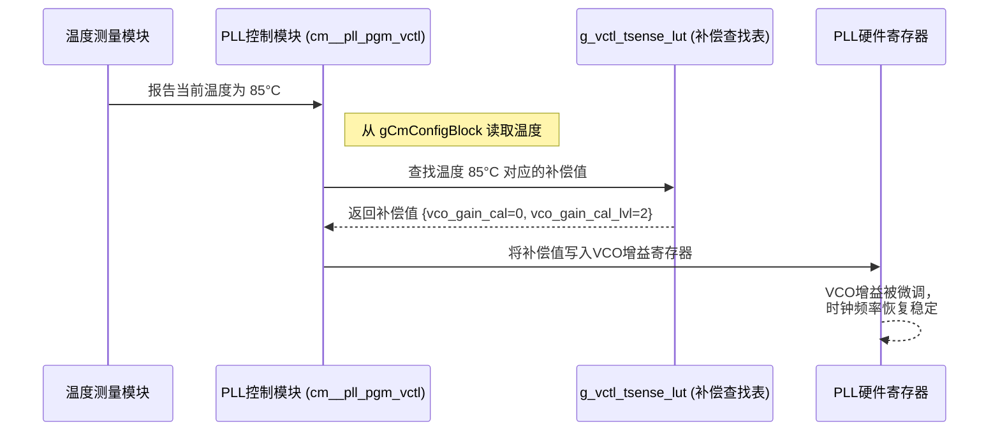

# Chapter 7: 温度感应与补偿


在[第6章：任务处理与信箱通信机制](06_任务处理与信箱通信机制_.md)中，我们学习了固件如何通过信箱（Mailbox）与外部主机进行通信。一个常见的请求就是：“嘿，固件，现在芯片内部有多热？”。为什么主机会关心这个问题？因为温度是影响高性能模拟电路稳定性的关键因素。

本章，我们将深入探讨固件的“内置恒温器”——温度感应与补偿模块。我们将了解固件是如何测量芯片的实时温度，并利用这些信息来动态调整关键电路，确保我们的PHY即使在“发烧”时也能保持最佳性能。

## 为什么芯片也需要“量体温”？

想象一下一把精密的木吉他。在凉爽干燥的房间里，它的音色可能非常完美。但如果把它带到炎热潮湿的户外，木材会发生微小的形变，导致琴弦的张力改变，音准就会跑偏。这时，就需要重新调音。

我们芯片内部的模拟电路，特别是像[第3章](03_公共模块与pll时钟管理_.md)中提到的PLL（锁相环）里的VCO（压控振荡器），也像这把吉他一样对温度非常敏感。

*   **温度漂移**：随着芯片工作时温度的升高或降低，半导体元件的物理特性会发生变化。这会导致VCO的增益（可以理解为“灵敏度”）发生漂移，进而可能使我们精心校准的时钟频率产生微小的偏差。
*   **性能下降**：这种偏差虽然微小，但在每秒传输数百亿比特（Gbps）的通信中，足以导致误码率（Bit Error Rate）上升，影响通信的稳定性。

因此，一个智能的固件不能只在开机时校准一次就万事大吉。它必须像一个细心的音乐家，时刻感知环境（温度）的变化，并随时对“乐器”（模拟电路）进行微调，这个过程就是**温度补偿**。

## “电子温度计”的工作原理

为了进行补偿，固件首先需要知道当前的准确温度。这依赖于一个内置的硬件“电子温度计”，以及固件内部的一套精密算法。

整个测温流程可以分为三步：

1.  **硬件测量**：芯片内部有一个温度传感器，它能产生两个与温度相关的模拟电压：一个几乎不随温度变化（`Vbg`，带隙基准电压），另一个则与温度成正比（`Vbe`，二极管正向压降）。
2.  **固件转换**：固件通过控制ADC（模数转换器），将这两个模拟电压转换成数字值。然后，通过一个特定的数学公式（基于`Vbe`和`Vbg`的比值），计算出一个“温度码”。
3.  **查表换算**：这个“温度码”还不是我们熟悉的摄氏度。固件会使用这个码作为索引，在一个预先校准好的**查找表（Look-Up Table, LUT）**中查找，最终将“温度码”换算成实际的摄氏度（°C）。

这个过程完美地体现了软硬件的协同工作。

```mermaid
graph TD
    A[硬件温度传感器] -->|产生Vbg和Vbe电压| B(固件);
    B -->|控制ADC测量电压<br>并计算出“温度码”| C{温度码 = k * (Vbe / Vbg)};
    C -->|以“温度码”为线索| D[温度查找表 `ts_code_lut`];
    D -->|查表与插值计算| E[最终温度值 (例如: 85°C)];
    E -->|存储在 gCmConfigBlock 中| F(等待其他模块使用);
```

## 代码中的“测温仪”：`func_general_debug_tsense()`

温度测量的具体实现位于 `fw_general_debug_atoms.c` 文件中的 `func_general_debug_tsense()` 函数里。这是一个庞大而精密的状态机，由[第6章](06_任务处理与信箱通信机制_.md)提到的“通用调试状态机”在收到测温命令后触发。

我们不必理解它的每一个细节，只需关注其核心步骤。

### 步骤1：准备工作 (e_tsense_cfg_st)

在正式测量前，固件需要进行一系列准备工作，就像医生量体温前要先把体温计甩一甩一样。这部分代码负责配置各种模拟电路，为精确测量铺平道路。

```c
// 文件: fw_general_debug_atoms.c (简化逻辑)

void func_general_debug_tsense () {
  // ...
  switch (general_debug_fsm_h.m_tsense_st) {
    case e_tsense_cfg_st1: {
      // 启用内部的基准电压源 (Bandgap)
      WRITE_REG_FIELD( g_cm_base_addr, ..., /* 启用 BG_EN */, 1 );

      // 配置各种模拟调试多路选择器，将温度传感器的输出连接到ADC
      WRITE_REG_FIELD( g_cm_base_addr, ..., /* 设置 DEBUG_SEL */, 0xB );
      WRITE_REG_FIELD( g_tx_base_addr, ..., /* 设置 TX_DEBUG_SEL */, 0x1 );
      
      // 等待一小段时间，让模拟电路稳定下来
      delay_start (&general_debug_fsm_h.m_delay_timer, 20);

      // 进入下一个配置状态
      general_debug_fsm_h.m_tsense_st = e_tsense_cfg_st2;
      break;
    }
    // ... 后续还有其他配置状态 ...
  }
}
```
这一阶段的核心是**配置**和**等待**，确保测量环境的稳定。

### 步骤2：执行测量和计算 (e_tsense_search_st & e_tsense_compute_st)

准备就绪后，状态机进入测量和计算阶段。它会先调用一个搜索函数（`func_general_debug_tsense_linear_search`）来精确地测量出 `Vbg` 和 `Vbe` 对应的数字码，然后进入计算状态。

```c
// 文件: fw_general_debug_atoms.c (简化逻辑)

case e_tsense_compute_st: {
  // 确保之前测量没有出错
  if (gCmConfigBlock[v_cm_no].m_tsense_error == 0) {
    
    // 1. 从工作区读取已测得的Vbe和Vbg的数字码
    uint16_t vbe_code = gCmConfigBlock[v_cm_no].m_tsense_vbe;
    uint16_t vbg_code = gCmConfigBlock[v_cm_no].m_tsense_vbg;

    // 2. 使用公式计算出原始的“温度码” (v_ts_code)
    uint32_t v_ts_code = ((1000 * vbe_code) * 250) / vbg_code;

    // 3. 在`ts_code_lut`查找表中找到最接近的区间
    uint8_t v_ts_code_idx = 0;
    for (v_inst = 0; v_inst < TSENSE_LUT_SIZE; v_inst++) {
      v_ts_code_idx = v_inst;
      if (v_ts_code >= (1000 * ts_code_lut[v_inst])) {
        break; // 找到了！
      }
    }

    // 4. 进行线性插值，计算出精确的摄氏度
    // (公式细节已简化，核心思想是在两个LUT点之间估算)
    int8_t v_temp_signed = MIN_TEMP + (v_ts_code_idx * TEMP_STEP) - ...;

    // 5. 将最终的温度值存入全局配置块，供其他模块使用
    gCmConfigBlock[v_cm_no].m_s2c_meas_temp = (uint8_t)v_temp_signed;
  }
  // 进入清理状态
  general_debug_fsm_h.m_tsense_st = e_tsense_clr_ovrd_st;
}
```
这一步是整个测温算法的核心，它将原始的测量码，通过**计算**和**查表**，最终转换成了有意义的摄氏度单位。

这个 `ts_code_lut` 查找表定义在 `fw_objects_in_dccm.c` 中，它是在芯片出厂前，由专家在不同温度下测量并写入固件的，是保证测温准确性的“密码本”。

```c
// 文件: fw_objects_in_dccm.c

// 温度码与实际温度的对应关系查找表
uint16_t ts_code_lut [TSENSE_LUT_SIZE] = 
{
     565, // 对应 -40°C
     563, // 对应 -35°C
     560, // 对应 -30°C
     // ...
     459, // 对应 85°C
     454, // 对应 90°C
     // ...
     415  // 对应 125°C
};
```

## “对症下药”：温度补偿

现在固件已经知道了当前的温度（例如，85°C），接下来就是利用这个信息去“微调”那些对温度敏感的电路了。这个过程就是**温度补偿**。

我们在[第3章：公共模块与PLL时钟管理](03_公共模块与pll时钟管理_.md)中其实已经见过它的实际应用了。`cm__pll_pgm_vctl()` 函数就是执行PLL温度补偿的专家。让我们再次回顾一下它的工作流程。



### 代码中的“调音师”

`cm.c` 文件中的 `cm__pll_pgm_vctl()` 函数完美地展示了补偿流程。

```c
// 文件: cm.c

ATTR_INLINE void cm__pll_pgm_vctl (uint8_t a_cm_no) {
  uint8_t v_idx;

  // 1. 从全局配置块中读取由温度传感器测得的温度
  int8_t current_temp = gCmConfigBlock[a_cm_no].m_s2c_meas_temp;

  // 2. 根据温度，计算在补偿查找表`g_vctl_tsense_lut`中的索引
  //    这个查找表存储了不同温度下，VCO增益需要设置的最佳值
  v_idx = (current_temp - MIN_TEMP) / TEMP_STEP; 

  // 3. 从查找表中取出精确的补偿值
  uint8_t vco_gain_cal_val = g_vctl_tsense_lut[v_idx].vco_gain_cal_bg;
  uint8_t vco_gain_lvl_val = g_vctl_tsense_lut[v_idx].vco_gain_cal_lvl_bg;

  // 4. 将补偿值写入PLL的VCO增益控制寄存器
  g_reg_val = READ_REG (g_cm_base_addr, CM__ANA_OVRDVAL6__ADDR);
  SET_FIELD (g_reg_val, ..., vco_gain_cal_val);    // 设置VCO增益校准值
  SET_FIELD (g_reg_val, ..., vco_gain_lvl_val);   // 设置VCO增益电平
  WRITE_REG (g_cm_base_addr, CM__ANA_OVRDVAL6__ADDR, g_reg_val);
  
  // ... 启用这些值的覆盖 ...
}
```
这个函数的工作流程清晰明了：**读温度 -> 查表 -> 写补偿**。它就像一个自动调音器，持续地将PLL的“音准”校正到最佳状态，以对抗温度变化带来的影响。

这里的 `g_vctl_tsense_lut` 是另一个关键的查找表，它存储的不再是温度，而是针对每个温度点，PLL应该使用的最佳补偿参数。

```c
// 文件: cm.c

// VCO增益补偿查找表
vctl_tsense_lut_t g_vctl_tsense_lut[40] = {
  // { 温度, vco_gain_cal, vco_gain_cal_lvl }
  {     -40,            7,                  1 },
  // ...
  {      80,           15,                  1 },
  {      85,            0,                  2 }, // 在85°C时，应使用这组补偿值
  {      90,            0,                  2 },
  // ...
  {     125,            4,                  2 }
};
```

## 结论

在本章中，我们一起探索了固件中至关重要的“恒温器”功能。我们学到了：

*   **温度的重要性**：模拟电路性能对温度敏感，若不补偿，会导致系统性能下降。
*   **测温流程**：固件通过一个“**测量->计算->查表**”的流程，将硬件传感器的原始读数转换为精确的摄氏度温度。
*   **补偿机制**：固件利用测量到的温度，再次**查阅**一个专门的补偿查找表，找到当前温度下最佳的电路参数，并将其写入硬件，从而抵消温度漂移带来的负面影响。
*   **数据驱动**：整个温度感应和补偿过程，严重依赖于多个预先校准好的**查找表**（LUT），这再次印证了在[第2章](02_配置参数与查找表_.md)中学到的数据驱动设计思想的强大之处。

至此，我们已经完成了对 `e112g_fw_src` 固件项目核心模块的探索之旅。从固件的启动与初始化，到时钟、发射器、接收器的控制，再到任务调度和今天的温度补偿，我们一步步揭开了这个高性能PHY固件的神秘面纱。希望这趟旅程能帮助你理解现代嵌入式固件设计的精髓：**分层、抽象、数据驱动、软硬件协同**。

感谢你的学习，探索永无止境！

---

Generated by [AI Codebase Knowledge Builder](https://github.com/The-Pocket/Tutorial-Codebase-Knowledge)