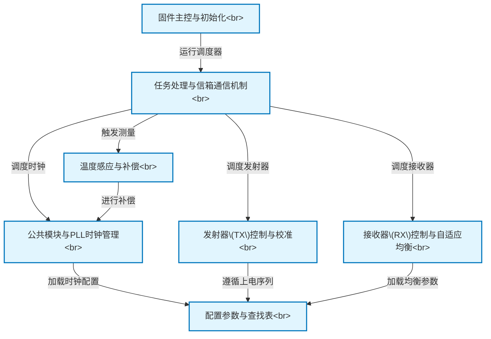

# Tutorial: e112g_fw_src

该项目是用于**高速通信芯片 (PHY)** 的固件。它如同芯片的*大脑*，负责设备启动时的所有硬件**初始化**工作。启动后，它会进入一个无限循环，持续管理关键的**数据发送 (TX) 与接收 (RX)** 任务。为确保在不同工作条件下通信的稳定性，该固件巧妙地利用*预计算的参数查找表*，并根据实时**温度**动态调整时钟信号和接收器设置。

**Source Repository:** [None](None)

## Chapters

1. [固件主控与初始化
](01_固件主控与初始化_.md)
2. [配置参数与查找表
](02_配置参数与查找表_.md)
3. [公共模块与PLL时钟管理
](03_公共模块与pll时钟管理_.md)
4. [发射器(TX)控制与校准
](04_发射器_tx_控制与校准_.md)
5. [接收器(RX)控制与自适应均衡
](05_接收器_rx_控制与自适应均衡_.md)
6. [任务处理与信箱通信机制
](06_任务处理与信箱通信机制_.md)
7. [温度感应与补偿
](07_温度感应与补偿_.md)

---

Generated by [AI Codebase Knowledge Builder](https://github.com/The-Pocket/Tutorial-Codebase-Knowledge)