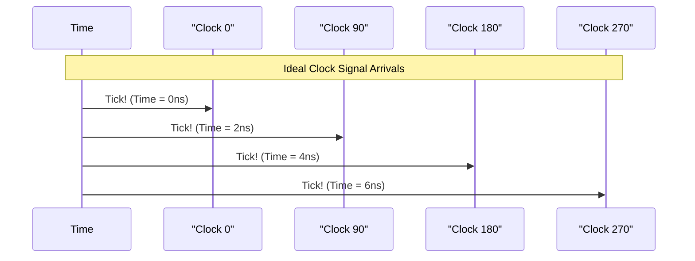
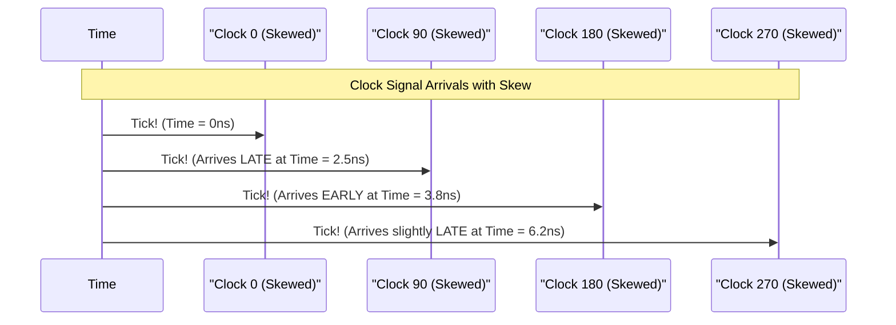

# Chapter 2: Clock Skew

Welcome to the second chapter! In our [previous chapter on PI Input Skew Calibration](01_pi_input_skew_calibration_.md), we learned about an automatic "tuning" process that helps our electronic systems work correctly by fixing timing errors in crucial internal signals. We mentioned that this process tackles something called "skew." Now, it's time to dive deeper into what exactly **Clock Skew** is.

## The Relay Race of Electronics

Imagine a relay race with four runners. Let's call them Runner 0, Runner 90, Runner 180, and Runner 270. For the race to go smoothly, each runner needs to pass the baton to the next at a precisely planned moment.
*   Runner 0 starts.
*   Then, Runner 90 needs to be ready at a specific point in time.
*   Then Runner 180.
*   And finally, Runner 270.

If they are all perfectly synchronized, the baton passes are smooth, and the team performs at its best.

Now, what if Runner 90 arrives a little *late* to their mark? Or what if Runner 180 arrives a bit *early*? This is **clock skew**. The runners are not perfectly synchronized. Some arrive too early, some too late. This can cause fumbled baton passes, slow down the team, or even lead to disqualification.

In the world of electronics, these "runners" are **clock signals**. Clock signals are like the heartbeat of an electronic circuit, providing regular pulses that tell different parts of the circuit when to do their job. We often have multiple clock signals that need to work together in perfect harmony, just like our relay runners. For instance, in our project, we're often dealing with four related clock signals often named `clk0`, `clk90`, `clk180`, and `clk270`. We'll learn more about these special [Quadrature Clocks (clk0, clk90, clk180, clk270)](03_quadrature_clocks__clk0__clk90__clk180__clk270__.md) in the next chapter.

**Clock skew**, therefore, is the tiny (but significant!) difference in arrival times of these clock signals at their destinations within the circuit.

## Why is Skew a Problem? Distorted Signals and Errors

When clock signals are skewed, it means that different parts of a circuit might receive their "go!" signal at slightly wrong times. This can cause major problems, especially in high-speed systems where timing is everything.

Think about a component like a [PMIX (Phase Mixer)](04_pmix__phase_mixer_.md). This component relies on these clock signals (like `clk0`, `clk90`, etc.) to correctly process incoming data. If the clocks feeding the PMIX are skewed:
*   **Data gets distorted:** The PMIX might misinterpret the data it's trying to process because its internal timing references are off. Imagine trying to assemble a puzzle piece, but your timing for placing it is slightly off – it won't fit correctly!
*   **Errors occur:** This distortion can lead to the system making mistakes when reading data. In digital systems, data is made of 0s and 1s (bits). Skew can cause a 0 to be read as a 1, or vice-versa. This is called a "bit error."
*   **Performance drops:** The overall system might become less reliable or slower because it's struggling with these timing inaccuracies.

As mentioned in our project's documentation (`e112mp_pi_input_skew_cal.pdf`, Page 1):
> "Clock Skew entering the PMIX from the PLL and clock transport lanes results in linearity distortion to the PMIX phase rotation profile."

This simply means that if the clocks aren't perfectly aligned, the PMIX doesn't work as smoothly or accurately as it should. This is why the document also states:
> "Removal of Skew results in SNR and BER optimization for the RX."

"SNR" means Signal-to-Noise Ratio (how clear the signal is compared to background noise), and "BER" means Bit Error Rate (how often errors occur). Fixing skew makes the signal clearer and reduces errors!

## Visualizing Clock Skew

Let's try to visualize this. Imagine each clock signal should "tick" at perfectly regular intervals relative to the others.

**Ideal Scenario (No Skew):**
All clocks arrive exactly when expected, perfectly spaced out.

*(Note: "ns" stands for nanoseconds, a billionth of a second. The exact timing values are just for illustration.)*

**With Clock Skew:**
The arrival times are off. Some are early, some are late.

This mismatch is what clock skew is all about. The project documentation (`e112mp_pi_input_skew_cal.pdf`, Page 1) shows a diagram comparing "No Skew" and "With Skew" using points A, B, C, and D representing the timing of four clocks. Without skew, these points form a perfect diamond shape. With skew, this diamond gets distorted, visually showing the timing imbalance.

## Where Does Skew Come From?

You might wonder why these clock signals don't just arrive on time naturally. Skew can be caused by several physical factors in an electronic chip:
*   **Different Wire Lengths:** Signals travel through tiny metal paths (wires) on the chip. If the path to one component is longer than to another, the signal will take more time to arrive.
*   **Temperature Variations:** Temperature can affect how fast signals travel. Different parts of a chip might be at slightly different temperatures.
*   **Manufacturing Variations:** Tiny imperfections during the manufacturing process of the chip can lead to slight differences in components and pathways.

Think of it like our relay race again. Maybe one runner's track lane has a slight uphill slope, or another runner got a slightly slower start due to a distraction. These small, almost unavoidable differences contribute to skew.

## The Goal: Measuring and Correcting Skew

Because clock skew can degrade performance and cause errors, high-performance systems need a way to deal with it. This is precisely what the `e112mp_pi_input_skew_cal` project is about.

The project uses a **startup calibration routine** – an automatic process that runs when the system powers on. This routine:
1.  **Measures** the existing skew between these critical clock signals.
2.  **Corrects** these timing differences by making tiny adjustments.

The aim is to get those "runners" (clock signals) back in perfect synchronization, ensuring the "baton passes" (data processing steps) happen smoothly and accurately.

## What We've Learned

In this chapter, we've demystified the concept of **Clock Skew**:
*   It's like runners in a relay race arriving at their marks too early or too late.
*   In electronics, it refers to timing inaccuracies between different clock signals.
*   Skew can distort data, cause errors, and reduce the performance of components like the [PMIX (Phase Mixer)](04_pmix__phase_mixer_.md).
*   It's caused by physical factors like wire lengths and temperature variations.
*   Our project, `e112mp_pi_input_skew_cal`, is designed to measure and correct this skew to ensure optimal system performance.

Now that we understand what clock skew is, we can explore the specific types of clocks involved in this process.

Join us in the next chapter: [Quadrature Clocks (clk0, clk90, clk180, clk270)](03_quadrature_clocks__clk0__clk90__clk180__clk270__.md)

---

Generated by [AI Codebase Knowledge Builder](https://github.com/The-Pocket/Tutorial-Codebase-Knowledge)