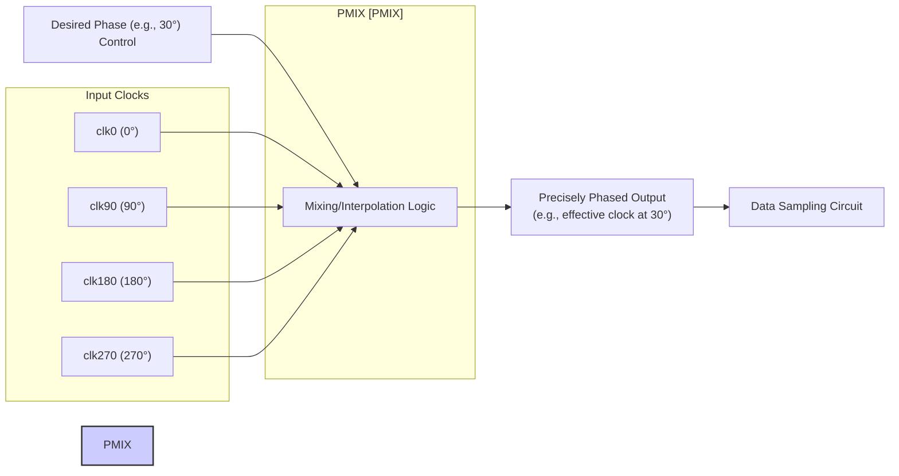
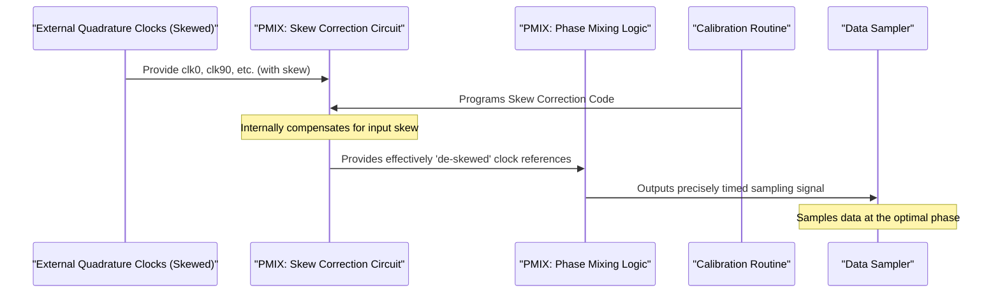

# Chapter 4: PMIX (Phase Mixer)

Welcome to Chapter 4! In our [previous chapter on Quadrature Clocks](03_quadrature_clocks__clk0__clk90__clk180__clk270__.md), we learned about the team of four special clock signals (`clk0`, `clk90`, `clk180`, `clk270`) that are ideally 90 degrees apart. These clocks are essential for sampling high-speed data. Now, we're going to explore a critical component that uses these clocks: the **PMIX (Phase Mixer)**.

## What is a PMIX? The Sophisticated Signal Blender

Imagine you're a DJ, and you have four turntables, each playing a beat (our [Quadrature Clocks (clk0, clk90, clk180, clk270)](03_quadrature_clocks__clk0__clk90__clk180__clk270__.md)). Each beat is slightly offset from the others, like `clk0` hitting on the "1", `clk90` on the "and" after 1, `clk180` on the "2", and `clk270` on the "and" after 2.

The **PMIX (Phase Mixer)** is like a very sophisticated DJ mixer. Its main job is not just to play one of these beats, but to *blend* them together to create a new, precisely timed beat that can fall *anywhere* in between the original four. In technical terms, the PMIX uses these multiple input clock signals to finely adjust the **phase** (the exact timing point within a cycle) of the system that samples the incoming data signal.

Think of it another way:
*   **A Sophisticated Dimmer Switch for Timing:** A regular light switch is on or off. A dimmer switch lets you choose many brightness levels. The PMIX is like a super-precise dimmer switch for timing, allowing the system to pick the *exact* moment to look at the data.
*   **A Precise Timing Adjustment Hub:** It's a central place where the system can make very fine adjustments to when it "listens" to the incoming data.

This fine-tuning is crucial for high-speed data communication. If the system can "look" (sample) the data at the *perfect* instant, it's much more likely to read it correctly, even if the signal is very fast or a bit noisy.

## How Does the PMIX "Mix" Clocks for Precision?

The PMIX takes the four quadrature clocks (`clk0`, `clk90`, `clk180`, `clk270`) as its primary ingredients. These clocks, ideally, give it four reference timing points spread evenly across a signal's cycle (0°, 90°, 180°, 270°).

The PMIX can then generate an output timing signal whose phase is effectively "interpolated" between these input phases. "Interpolate" is a fancy word for "intelligently estimate or create a value in between known values."

For example, if the system decides that the absolute best time to sample the data is not exactly at `clk0` (0 degrees) or `clk90` (90 degrees), but somewhere in between, say at 30 degrees, the PMIX can create this specific timing! It does this by combining the influence of `clk0` and `clk90` in a weighted manner.

By adjusting digital control signals fed into it, the PMIX can smoothly "sweep" the phase of its output across the entire 360-degree range, offering very fine timing resolution. This allows the receiver to "dial in" the optimal sampling point for the data.

## The Catch: The Importance of Clean Ingredients (Skew)

Our DJ mixer analogy works well here too. If the DJ wants to create a perfect blend, the source music from each turntable needs to be clean and on-time. What if one turntable is running slightly too slow, or another slightly too fast? The DJ's carefully crafted mix will sound off.

Similarly, the PMIX relies on its input [Quadrature Clocks (clk0, clk90, clk180, clk270)](03_quadrature_clocks__clk0__clk90__clk180__clk270__.md) to be perfectly in quadrature (exactly 90 degrees apart). If these input clocks are **skewed** – meaning their relative timings are off – then the PMIX cannot perform its phase adjustments accurately.
*   If `clk90` is supposed to be at 90 degrees but actually arrives at 85 degrees (early) or 95 degrees (late) relative to `clk0`, the PMIX's "understanding" of the 0-90 degree interval is flawed.
*   When it tries to generate a phase at, say, 30 degrees, it will be 30 degrees relative to these skewed inputs, not 30 degrees in an absolute sense.

This "linearity distortion" (as mentioned in `e112mp_pi_input_skew_cal.pdf`, Page 1) means the PMIX's adjustments won't be as precise as they should be, degrading signal quality and potentially leading to more errors when reading data. It's a classic case of "garbage in, garbage out." If the PMIX gets skewed clocks, its output phase adjustments will be less reliable.

## The PMIX's Secret Weapon: The Skew Correction Circuit

Here's where the PMIX shows its sophistication. It's not just a passive blender; it has a built-in defense mechanism against input clock skew! The PMIX itself contains a **skew correction circuit**.

Think of this circuit as an intelligent pre-processor for the input clocks. During the [PI Input Skew Calibration](01_pi_input_skew_calibration_.md) routine (which our project `e112mp_pi_input_skew_cal` is all about!), the system measures the skew present in `clk0`, `clk90`, `clk180`, and `clk270`.

Based on these measurements, the calibration routine programs the PMIX's internal skew correction circuit. It essentially tells the PMIX:
> "Hey PMIX, your `clk90` input is arriving 5 degrees too early, and your `clk180` is 3 degrees too late. Please internally adjust for these discrepancies *before* you do your phase mixing."

This programming is done by setting a specific [Skew Correction Code](08_skew_correction_code_.md). Once this code is set, the PMIX can effectively counteract the skew on its inputs, allowing its main phase mixing/interpolation logic to work with timing references that *behave as if* they were perfectly in quadrature.

As the project documentation (`e112mp_pi_input_skew_cal.pdf`, Page 1) states:
> "To remove the skew between the incoming clocks, the PMIX is fitted with a skew correction circuit."
> "Skew correction is performed through a startup calibration routine."

Here’s a simplified view of how this works:

The diagram on Page 3 of `e112mp_pi_input_skew_cal.pdf` shows a block labeled "PMIX Skew Adjust." This is precisely the skew correction circuit we're talking about. It receives control inputs derived from skew measurements, allowing it to fine-tune how the PMIX interprets its input clocks.

## Why is This Internal Correction Important?

By having the skew correction *inside* the PMIX, the system can ensure that this critical component always operates with the best possible timing references. This leads to:
*   **More Accurate Phase Adjustments:** The PMIX can create the exact desired phase with higher fidelity.
*   **Improved Signal Quality (SNR):** Better timing means a clearer distinction between data 0s and 1s.
*   **Fewer Bit Errors (BER):** Ultimately, this leads to more reliable data communication.

The `e112mp_pi_input_skew_cal` project's main goal is to intelligently determine the correct settings for this "PMIX Skew Adjust" circuit.

## What We've Learned

In this chapter, we've uncovered the role of the PMIX (Phase Mixer):
*   It's like a sophisticated signal blender or a precise timing adjustment hub for high-speed data.
*   It uses the [Quadrature Clocks (clk0, clk90, clk180, clk270)](03_quadrature_clocks__clk0__clk90__clk180__clk270__.md) to finely adjust the phase (timing) at which the incoming data signal is sampled.
*   If the input quadrature clocks are skewed, the PMIX's ability to accurately adjust phase is compromised.
*   Crucially, the PMIX contains an internal **skew correction circuit**.
*   This circuit is programmed by the [PI Input Skew Calibration](01_pi_input_skew_calibration_.md) routine (using a [Skew Correction Code](08_skew_correction_code_.md)) to counteract the skew in the input clocks.
*   This ensures the PMIX can perform its phase adjustments accurately, leading to better signal quality and fewer errors.

The PMIX, with its internal skew correction, is a cornerstone of the receiver's ability to handle high-speed data. But how does the calibration routine know *how much* skew there is, and therefore how to program the PMIX's skew correction circuit? This involves testing and measurement.

Let's explore how the system uses a special test signal and an Analog-to-Digital Converter (ADC) to figure this out in the next chapter.

Join us in: [Loopback Test Signal and ADC](05_loopback_test_signal_and_adc_.md)

---

Generated by [AI Codebase Knowledge Builder](https://github.com/The-Pocket/Tutorial-Codebase-Knowledge)