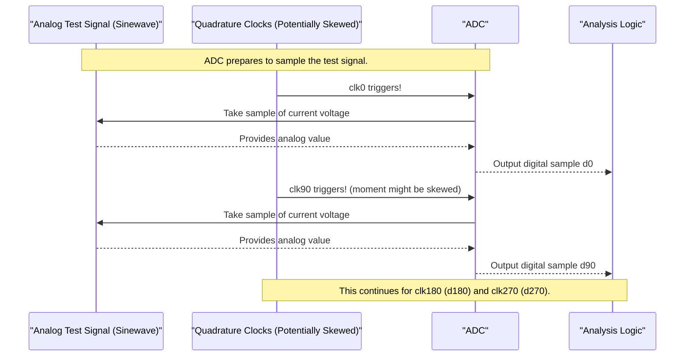

# Chapter 5: Loopback Test Signal and ADC

Welcome to Chapter 5! In our [previous chapter on the PMIX (Phase Mixer)](04_pmix__phase_mixer_.md), we learned that the PMIX has a special circuit to correct for skew in its input [Quadrature Clocks (clk0, clk90, clk180, clk270)](03_quadrature_clocks__clk0__clk90__clk180__clk270_.md). But for this correction to work, the system first needs to *know* how much skew there is. How does it figure this out? It needs to perform a measurement! This chapter explains how a special internal test signal and a component called an Analog-to-Digital Converter (ADC) help us do just that.

## The Problem: How Do We "See" Clock Skew?

Imagine you're trying to tune a guitar. You pluck a string, but how do you know if it's sharp or flat? You usually compare it to a reference sound, like a tuning fork or an electronic tuner.

Similarly, to measure [Clock Skew](02_clock_skew_.md) in our high-speed system, we can't just "look" at the clocks directly with our eyes – they are incredibly fast electrical signals! We need a clever way to:
1.  Have a **known, predictable signal** to act as our reference.
2.  Use our potentially skewed clocks to **"observe" this reference signal**.
3.  Analyze these observations to deduce the timing errors (skew).

This is where the loopback test signal and the ADC come into play.

## 1. The Known Reference: The Loopback Test Signal

To perform calibration, our system needs a reliable, predictable reference. It generates this reference internally using a **loopback path**. "Loopback" simply means the signal is created inside the chip and routed (looped back) to another part of the same chip for testing, rather than coming from an external source. This gives us great control.

This internally generated signal is a **test signal**, often designed to be a smooth, predictable wave, like a **sinewave**. Think of it as the system humming a perfectly consistent musical note to itself.

As mentioned in the project details (`e112mp_pi_input_skew_cal.pdf`, Page 2):
> "Prior to Calibration, a signal is made available at the ADC input."
> "ADC receives a signal resembling a sinewave from the loopback path with frequency fs/7 or fs/10"

*   **Sinewave-like:** A sinewave is a very pure, simple waveform. Its shape is mathematically predictable, which is great for testing.
*   **Frequency fs/7 or fs/10:** This means the test signal's frequency is a fraction (like 1/7th or 1/10th) of the main system clock frequency (`fs`). This specific choice of frequency helps ensure that when we sample the sinewave, we capture a good variety of points along its curve over multiple cycles.
*   **Internal Generation:** The diagram on Page 2 of the PDF shows "loopback HS clock from PLL" likely being used to generate this test signal (e.g., via a "Div7/10" block), which is then fed to the ADC.

So, the system creates its own clean, known "test song" internally.

```mermaid
graph TD
    subgraph "Chip"
        PLL[High-Speed Clock (fs) from PLL] --> SIG_GEN["Test Signal Generator (e.g., Div7/10)"];
        SIG_GEN -->|Predictable Sinewave (fs/7 or fs/10)| ADC_INPUT["To ADC Input"];
    end
    Note over SIG_GEN: This is the 'loopback test signal'
```

## 2. Capturing the Signal: The Analog-to-Digital Converter (ADC)

Now that we have our predictable test signal (an analog electrical voltage that varies smoothly over time), we need a way to "see" it or measure it. This is the job of the **Analog-to-Digital Converter (ADC)**.

Think of an ADC as a super high-speed digital camera.
*   The **analog test signal** is like the scene you want to photograph.
*   The ADC takes incredibly fast **snapshots** (called **samples**) of this scene.
*   Each snapshot isn't a picture, but a **digital number** that represents the voltage (the "brightness" or level) of the test signal at the exact moment the snapshot was taken.

So, the ADC converts the smooth, continuous analog test signal into a series of discrete digital values.

## 3. Timing the Snapshots: The Quadrature Clocks

Here’s the crucial part: *when* does the ADC take these snapshots? The ADC is told to take a sample every time one of our [Quadrature Clocks (clk0, clk90, clk180, clk270)](03_quadrature_clocks__clk0__clk90__clk180__clk270_.md) "ticks" or triggers.

*   When `clk0` triggers, the ADC takes a sample. Let's call this digital sample `d0`.
*   When `clk90` triggers, the ADC takes another sample. Let's call it `d90`.
*   When `clk180` triggers, we get `d180`.
*   When `clk270` triggers, we get `d270`.

This is key: the timing of these snapshots (`d0`, `d90`, `d180`, `d270`) is dictated by the very clocks whose skew we are trying to measure!

If the clocks are perfectly spaced (0°, 90°, 180°, 270°), the digital samples `d0, d90, d180, d270` will capture the sinewave test signal at these ideal phase points. For example, if `clk0` happens to sample the sinewave as it crosses zero, then `clk90` (if perfectly on time) should sample it at its peak.

However, if there's [Clock Skew](02_clock_skew_.md) – for example, if `clk90` arrives a bit late – then the sample `d90` will be taken at a slightly different point on the sinewave than it ideally should have.

The diagram on Page 3 of `e112mp_pi_input_skew_cal.pdf` perfectly illustrates this. You see "ADC IN" (our sinewave test signal) being sampled by the "Sampling Clocks" (`+clk0`, `clk90`, `clk180`, `clk270`) via an "ADC interface", producing the digital samples `d0`, `d90`, `d180`, `d270`.



## 4. The Result: Digital Samples Ready for Analysis

After this process, we have a set of digital numbers: `d0`, `d90`, `d180`, and `d270`. Each number represents the voltage of our known sinewave test signal at the moment its corresponding clock phase triggered the ADC.

If the sinewave is, say, `V(t) = A * sin(2 * pi * f * t + phase_offset)`:
*   `d0` approximates `V(t_clk0)`
*   `d90` approximates `V(t_clk90)`
*   `d180` approximates `V(t_clk180)`
*   `d270` approximates `V(t_clk270)`

where `t_clkX` are the actual arrival times of the clocks.

By looking at the *values* of `d0, d90, d180, d270` and knowing the *expected* shape of the sinewave, the system can figure out if `t_clk90` was truly 90 degrees after `t_clk0`, if `t_clk180` was truly 90 degrees after `t_clk90`, and so on. Any deviation in the expected relationship between these digital sample values indicates a timing skew in the clocks.

**Signal Conditioning (An Important Detail):**
Before the test signal reaches the ADC, its strength (amplitude) needs to be just right – not too weak, not too strong – for the ADC to measure it accurately. The system uses a **VGA (Variable Gain Amplifier)** to adjust the signal's amplitude.
As stated on Page 2 of `e112mp_pi_input_skew_cal.pdf`:
> "VGA gain is configured to apply a signal with appropriate amplitude at the input of the ADC"
This step, called "ADC Signal conditioning," happens *before* the skew correction process truly begins, ensuring the measurements will be reliable.

## How This Helps Calibration

These digital samples (`d0`, `d90`, `d180`, `d270`) are the raw ingredients for the next step in our calibration process. They provide a "snapshot" of how the quadrature clocks are behaving relative to a known reference signal.

The actual calculations to determine the skew from these samples are done using what are called [Skew Correlation Measurements (E21, E31, E41)](06_skew_correlation_measurements__e21__e31__e41_.md), which we'll explore in the very next chapter.

Think of it like this:
*   **Test Signal:** The standard "eye chart" at an optometrist.
*   **ADC:** The patient's eyes looking at the chart.
*   **Quadrature Clocks:** The timing precision of *when* the patient focuses on each letter.
*   **Digital Samples (d0-d270):** What the patient *reports* seeing.
*   **Skew Measurement Logic (Next Chapter):** The optometrist analyzing the patient's reported letters to determine if their vision (or in our case, clock timing) needs correction.

## What We've Learned

In this chapter, we've seen how the system sets up to measure clock skew:
*   It uses an **internal loopback path** to generate a **predictable sinewave-like test signal** (e.g., at frequency fs/7 or fs/10). This acts as a known reference.
*   This analog test signal is fed into an **Analog-to-Digital Converter (ADC)**.
*   The ADC acts like a high-speed camera, taking **snapshots (samples)** of the test signal.
*   The timing of these snapshots is dictated by the potentially skewed **[Quadrature Clocks (clk0, clk90, clk180, clk270)](03_quadrature_clocks__clk0__clk90__clk180__clk270_.md)**.
*   The ADC outputs **digital samples (d0, d90, d180, d270)**, which represent the test signal's value at the moments the clocks triggered.
*   These digital samples are then ready to be analyzed to determine the amount of clock skew.
*   Proper signal conditioning (like VGA gain adjustment) ensures the ADC gets a good signal to measure.

Now that we have these digital samples, how do we use them to actually calculate the skew? That's what we'll find out next!

Join us in the next chapter: [Skew Correlation Measurements (E21, E31, E41)](06_skew_correlation_measurements__e21__e31__e41_.md)

---

Generated by [AI Codebase Knowledge Builder](https://github.com/The-Pocket/Tutorial-Codebase-Knowledge)