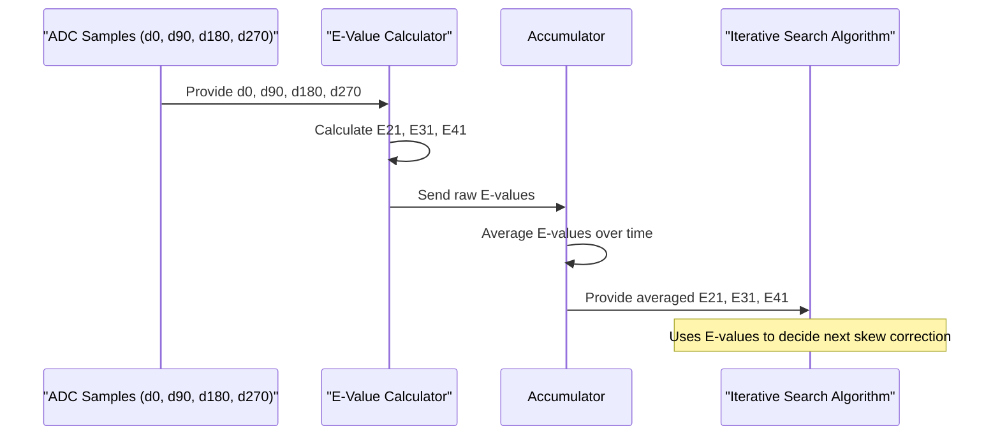

# Chapter 6: Skew Correlation Measurements (E21, E31, E41)

Welcome to Chapter 6! In the [previous chapter on Loopback Test Signal and ADC](05_loopback_test_signal_and_adc_.md), we saw how our system uses a known sinewave test signal and an Analog-to-Digital Converter (ADC) to capture "snapshots" of this signal. These snapshots, timed by our potentially skewed [Quadrature Clocks (clk0, clk90, clk180, clk270)](03_quadrature_clocks__clk0__clk90__clk180__clk270_.md), give us digital values: `d0`, `d90`, `d180`, and `d270`.

Now, we have these numbers. But how do we use them to actually *measure* the clock skew? How do we turn these raw sample values into a meaningful number that tells us if our clocks are perfectly 90 degrees apart or not? That's where **Skew Correlation Measurements** come in!

## What are Skew Correlation Measurements? Turning Samples into Skew Insights

Imagine you're trying to capture a fast-moving object, like a sprinter. You take a series of photos very quickly: one at the start, one a fraction of a second later, then another, and another.
*   Photo 1: Sprinter at 0 meters.
*   Photo 2: Sprinter at 10 meters.
*   Photo 3: Sprinter at 20 meters.
*   Photo 4: Sprinter at 30 meters.

If your camera shutter clicks were perfectly evenly timed, and the sprinter maintained a constant speed, the distance covered between each photo pair would be the same (10 meters each time).

Now, what if your camera's timing was a bit off?
*   Photo 1: Sprinter at 0 meters.
*   Photo 2 (taken a bit *late*): Sprinter at 12 meters. (More distance covered because more time passed)
*   Photo 3 (taken a bit *early* relative to the *ideal* interval after photo 2): Sprinter at 19 meters. (Less distance covered because less time passed)

By comparing the distances covered (`distance2 - distance1` vs. `distance3 - distance2`), you could tell that your photo timing wasn't perfectly even.

**Skew Correlation Measurements (E21, E31, E41)** are mathematical calculations that do something very similar with our ADC samples (`d0`, `d90`, `d180`, `d270`). They analyze these values to quantify the timing differences (skew) between our quadrature clock phases.

*   `d0`, `d90`, `d180`, `d270`: These are like readings of the test signal's voltage (the sprinter's position) at different moments.
*   **The Goal:** We want to see if the "time gaps" between `clk0-clk90`, `clk90-clk180`, and `clk180-clk270` are all equal (ideally 90 degrees).

These measurements are cleverly designed to be most sensitive to phase differences when the samples fall on the rapidly changing parts (the **slopes or edges**) of the sinewave test signal. Why? Because on a steep slope, even a tiny shift in sampling time causes a big change in the sampled voltage. On a flat peak or trough, a small time shift doesn't change the voltage much, making it harder to detect timing errors.

Think of rolling a ball down a ramp versus on a flat table. A slight nudge in time makes a big difference in position on the ramp, but not much on the flat table.

## Meet the Skew Detectives: E21, E31, and E41

Our system uses three main skew correlation measurements, often called E21, E31, and E41. Let's look at the first one, E21, to understand the idea.

### E21: Comparing the First Two Clock Intervals

The formula for E21 (as found in the project documentation `e112mp_pi_input_skew_cal.pdf`, Page 3) is:

**E21 = abs(d90 – d0) - abs(d180 – d90)**

Let's break this down:
*   `d0`, `d90`, `d180`: These are the digital values sampled by `clk0`, `clk90`, and `clk180` respectively, from our sinewave test signal.
*   `(d90 – d0)`: This is the *difference* in the signal's voltage between the `clk0` sample and the `clk90` sample. It tells us how much the sinewave changed during the time interval between `clk0` and `clk90`.
*   `abs(...)`: This means "absolute value," so we only care about the *magnitude* of the change, not whether it was positive or negative. This makes sense because the sinewave goes up and down.
*   So, `abs(d90 – d0)` is a measure of how much the signal changed between the first two clock ticks.
*   Similarly, `abs(d180 – d90)` is a measure of how much the signal changed between the second and third clock ticks (`clk90` and `clk180`).

**What E21 tells us:**
*   If `clk0`, `clk90`, and `clk180` are perfectly spaced (i.e., `clk90` is exactly 90 degrees after `clk0`, and `clk180` is exactly 90 degrees after `clk90`), AND if these samples are on a nice, consistent slope of the sinewave...
*   Then the *amount of change* in the signal should be the same for both intervals.
    *   `abs(d90 – d0)` should be approximately equal to `abs(d180 – d90)`.
*   In this ideal case, **E21 would be close to zero**.

If E21 is *not* close to zero, it means the effective time interval between `clk0` and `clk90` was different from the interval between `clk90` and `clk180`. This difference is due to **clock skew**!

### E31 and E41: Covering Other Clock Intervals

E31 and E41 work on the same principle but look at other pairs of clock intervals:

*   **E31 = abs(d180 – d90) - abs(d270 – d180)**
    *   This compares the change between `clk90-clk180` with the change between `clk180-clk270`.
    *   Ideally, E31 should also be close to zero if there's no skew in these phases.

*   **E41 = abs(d270 – d180) - abs(d0 – d270)**
    *   This compares the change between `clk180-clk270` with the change between `clk270` and the *next* `clk0` (effectively wrapping around the cycle).
    *   Again, E41 should be close to zero in an ideal, no-skew scenario.

(The formulas are taken from `e112mp_pi_input_skew_cal.pdf`, Page 3).

By using all three measurements (E21, E31, E41), the system gets a comprehensive view of the skew across all quadrature clock phases. This is important because, as mentioned, one pair of samples might accidentally land on a peak or trough of the sinewave where skew is harder to detect. Using three measurements ensures we're likely to catch the skew somewhere on a sensitive slope.

## Visualizing How E-Measurements Detect Skew

Let's imagine our sinewave test signal and see how samples taken by our clocks might look.

```mermaid
%%{init: {'theme': 'base', 'themeVariables': { 'lineColor': '#bbb', 'textColor': '#333'}}}%%
xychart-beta
    title "Sinewave Samples for E21 Calculation"
    x-axis "Time (Phase)"
    y-axis "Voltage"
    line stroke-width=2px label="Test Sinewave" data=[{"x":0,"y":0.1}, {"x":1,"y":0.5}, {"x":2,"y":0.9}, {"x":3,"y":0.5}, {"x":4,"y":0.1}]

    annotations [
      {
        "x": 0, "y": 0.1, "text": "d0", "dx": -10, "dy": 10
      },
      {
        "x": 1, "y": 0.5, "text": "d90 (Ideal)", "dx": 0, "dy": -10
      },
      {
        "x": 2, "y": 0.9, "text": "d180 (Ideal)", "dx": 0, "dy": -10
      },
      {
        "x": 0.7, "y": 0.35, "text": "d90 (Skewed - Early)", "dx": 0, "dy": 15, "fill": "red"
      }
    ]
    scatter data=[{"x":0, "y":0.1}, {"x":1, "y":0.5}, {"x":2, "y":0.9}] fill=blue shape=circle size=3px label="Ideal Samples"
    scatter data=[{"x":0, "y":0.1}, {"x":0.7, "y":0.35}, {"x":2, "y":0.9}] fill=red shape=diamond size=3px label="Skewed d90 Sample"
```

**Ideal Case (No Skew, E21 ≈ 0):**
Let's say our samples on a rising slope are:
*   `d0 = 0.1V`
*   `d90 = 0.5V` (sampled perfectly 90° later)
*   `d180 = 0.9V` (sampled perfectly 90° after d90)

Then:
*   `abs(d90 – d0) = abs(0.5 – 0.1) = abs(0.4) = 0.4`
*   `abs(d180 – d90) = abs(0.9 – 0.5) = abs(0.4) = 0.4`
*   `E21 = 0.4 – 0.4 = 0`
An E21 of 0 indicates that the voltage change in the first interval is the same as in the second, suggesting the time intervals were equal (no skew between these phases).

**Skewed Case (clk90 is early, E21 ≠ 0):**
Now, suppose `clk90` arrives a bit early due to skew.
*   `d0 = 0.1V`
*   `d90 = 0.35V` (sampled early, so signal hasn't risen as much)
*   `d180 = 0.9V` (assuming `clk180` is still okay relative to the *ideal* `clk90` timing for this example, or that the skew is mostly between `clk0` and `clk90`)

Then:
*   `abs(d90 – d0) = abs(0.35 – 0.1) = abs(0.25) = 0.25`
*   `abs(d180 – d90) = abs(0.9 – 0.35) = abs(0.55) = 0.55`
*   `E21 = 0.25 – 0.55 = -0.30`
Now E21 is -0.30, which is not zero! This non-zero value flags that there's a timing imbalance or skew. The calibration system will use this information to try and make adjustments.

## How the System Uses These Measurements

The calculated E21, E31, and E41 values are the heart of the skew detection process.
1.  The system collects the ADC samples `d0, d90, d180, d270`.
2.  It calculates E21, E31, and E41 using these samples.
3.  These E-values are not perfect; real signals have noise. So, as mentioned in the project documentation (`e112mp_pi_input_skew_cal.pdf`, Page 3), these measurements are "fed through an accumulator to average out noise." This means multiple E-values are calculated over time and averaged to get a more stable and reliable reading.
4.  The averaged E-values tell the system how much (and in which direction, relatively speaking) the clock phases are off.
5.  These averaged E-values then become the input to the [Iterative Search Algorithm for Skew Correction](07_iterative_search_algorithm_for_skew_correction_.md). The algorithm's job is to make adjustments to the clock timings (via a [Skew Correction Code](08_skew_correction_code_.md)) with the goal of driving these E21, E31, and E41 values as close to zero as possible.

The diagram on Page 3 of the project PDF shows this flow: the "Sampled Signal" (`d0` to `d270`) goes into "Phase Measurement Controls" which output signals related to E21, E31, and E41. These are then accumulated.



## Under the Hood: Simple Math

The actual calculation of E21, E31, and E41 is just basic arithmetic, easily done by digital logic in the chip. Here's a simplified pseudo-code example of how E21 might be calculated:

```
// Function to calculate E21
function calculate_E21(d0, d90, d180):
  // Calculate the change in signal between clk0 and clk90
  delta1 = d90 - d0
  abs_delta1 = absolute_value(delta1) // Get the magnitude

  // Calculate the change in signal between clk90 and clk180
  delta2 = d180 - d90
  abs_delta2 = absolute_value(delta2) // Get the magnitude

  // E21 is the difference of these two magnitudes
  e21_value = abs_delta1 - abs_delta2

  return e21_value

// Example usage:
// d0_sample, d90_sample, d180_sample are obtained from the ADC
// e21_result = calculate_E21(d0_sample, d90_sample, d180_sample)
// print("Calculated E21:", e21_result)
```
This simple calculation, repeated for E31 and E41, gives powerful insight into the timing accuracy of the critical quadrature clocks.

## What We've Learned

In this chapter, we've explored the Skew Correlation Measurements (E21, E31, E41):
*   They are mathematical calculations (`E21 = abs(d90 – d0) - abs(d180 – d90)`, etc.) used to quantify timing differences (skew) between [Quadrature Clocks (clk0, clk90, clk180, clk270)](03_quadrature_clocks__clk0__clk90__clk180__clk270_.md).
*   They work by comparing the amount of change in a [Loopback Test Signal and ADC](05_loopback_test_signal_and_adc_.md) sample between consecutive clock intervals.
*   Ideally, if there's no skew and samples are on a sinewave slope, these E-values should be close to zero.
*   Non-zero E-values indicate skew.
*   These measurements are designed to be most sensitive on the slopes (edges) of the sinewave test signal.
*   Multiple measurements (E21, E31, E41) give a comprehensive view of skew across all phases.
*   The calculated (and averaged) E-values are crucial inputs for the next stage: trying to fix the skew.

Now that we can *measure* the skew, how does the system actually *correct* it? This involves a clever trial-and-error process.

Join us in the next chapter to find out: [Iterative Search Algorithm for Skew Correction](07_iterative_search_algorithm_for_skew_correction_.md)

---

Generated by [AI Codebase Knowledge Builder](https://github.com/The-Pocket/Tutorial-Codebase-Knowledge)