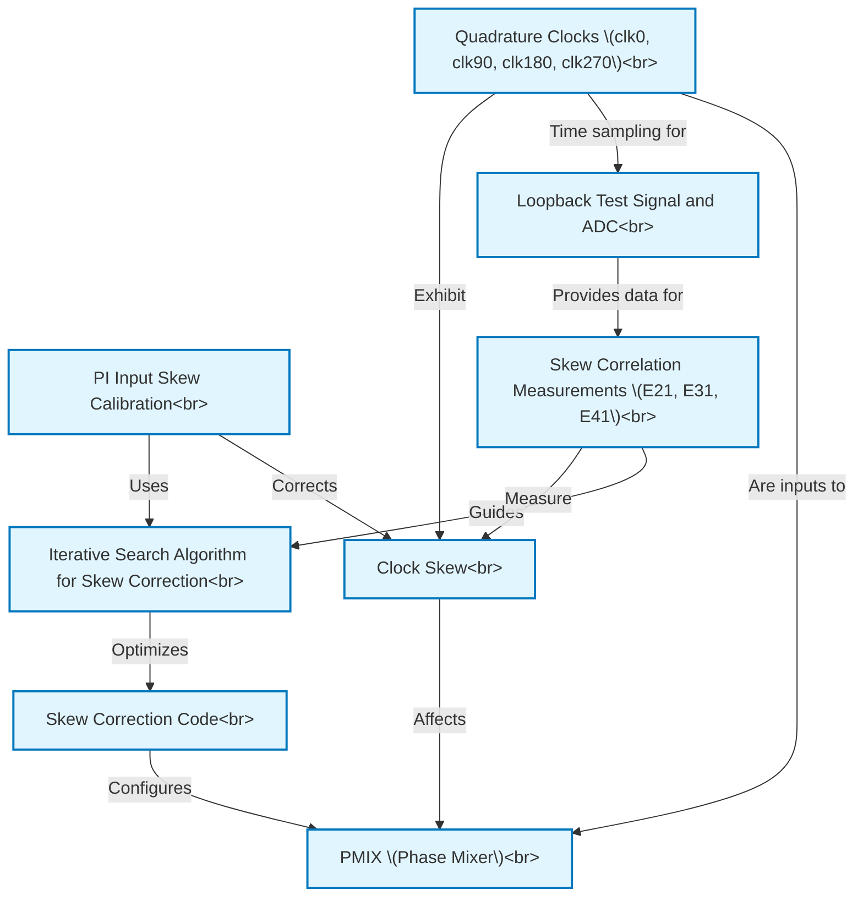

# Tutorial: e112mp_pi_input_skew_cal

This project is about an *automated system* that fixes tiny timing errors, called **clock skew**, between critical *internal clock signals* within a high-speed data receiver. By precisely aligning these clocks using a *calibration process* at startup, the system ensures the receiver can accurately interpret incoming data, leading to better **signal quality** and fewer errors.

**Source Repository:** [None](None)

## Chapters

1. [PI Input Skew Calibration
](01_pi_input_skew_calibration_.md)
2. [Clock Skew
](02_clock_skew_.md)
3. [Quadrature Clocks (clk0, clk90, clk180, clk270)
](03_quadrature_clocks__clk0__clk90__clk180__clk270__.md)
4. [PMIX (Phase Mixer)
](04_pmix__phase_mixer__.md)
5. [Loopback Test Signal and ADC
](05_loopback_test_signal_and_adc_.md)
6. [Skew Correlation Measurements (E21, E31, E41)
](06_skew_correlation_measurements__e21__e31__e41__.md)
7. [Iterative Search Algorithm for Skew Correction
](07_iterative_search_algorithm_for_skew_correction_.md)
8. [Skew Correction Code
](08_skew_correction_code_.md)

---

Generated by [AI Codebase Knowledge Builder](https://github.com/The-Pocket/Tutorial-Codebase-Knowledge)