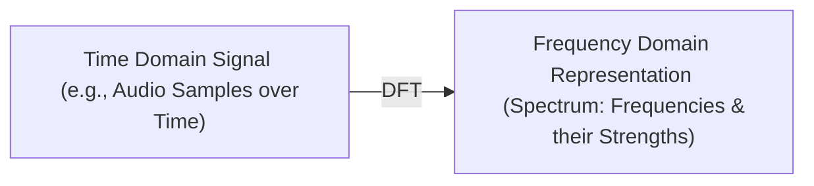

# Chapter 1: Discrete Fourier Transform (DFT) - Foundation

Welcome to the first chapter of our journey into the fascinating world of the Fast Fourier Transform (FFT)! Before we can understand the "Fast" part, we need to grasp the "Fourier Transform" itself, specifically its digital cousin, the **Discrete Fourier Transform (DFT)**.

## What's the Big Deal? From Sound Waves to Secret Frequencies

Imagine you're listening to your favorite song. It sounds like a single, continuous piece of music, right? But what if I told you that this sound is actually made up of many different, simpler sounds, all mixed together? These simpler sounds are like individual musical notes, each with its own **frequency** (how high or low the note is) and **strength** (how loud it is).

Our ears and brain do a fantastic job of hearing the combined sound. But sometimes, we want to be like a musical detective and find out exactly which "notes" or frequencies are hidden inside a sound, and how strong each one is. This is incredibly useful in many fields:
*   **Music:** Analyzing the notes in a chord, or even trying to separate different instruments.
*   **Audio Engineering:** Removing unwanted noise (like a hum) by identifying its frequency.
*   **Telecommunications:** Sending multiple signals over the same wire by using different frequencies.
*   **Image Processing:** Analyzing patterns and textures in images.

The **Discrete Fourier Transform (DFT)** is a mathematical tool that helps us do exactly this: it takes a signal (like a snippet of recorded audio) and breaks it down into its individual frequency components.

## What is the DFT? The Signal's "Recipe"

Think of the DFT as a magical prism for signals. Just like a glass prism takes a beam of white light and splits it into a rainbow of individual colors (each color being a different frequency of light), the DFT takes a complex signal and shows us the "rainbow" of frequencies it contains.

*   **Discrete:** In the real world, when we record sound with a microphone or take a digital picture, we don't get a perfectly smooth, continuous signal. Instead, we get a series of **samples** – measurements taken at specific, regular moments in time (for audio) or specific points in space (for images). The "Discrete" in DFT means it's designed to work with these discrete samples.
*   **Transform:** It "transforms" or changes our view of the signal. We start with a signal represented in the **time domain** (how its amplitude changes over time) and the DFT converts it into the **frequency domain** (which frequencies are present and how strong they are).

So, the DFT gives us a "recipe" for our signal, telling us:
1.  **Which frequencies** are present.
2.  **The strength (amplitude)** of each of those frequencies.
3.  Sometimes, it also tells us about the **phase** of each frequency (which is like its starting position or timing), but for beginners, the frequency and strength are the most important parts to understand.

Here's a simple way to visualize this:

Imagine you have a sound recording. It might look like this if you plot its amplitude over time:

**(Conceptual Time Domain Plot - imagine a wavy line here)**

After applying the DFT, you might get a plot like this (called a spectrum):

**(Conceptual Frequency Domain Plot - imagine a graph with peaks at certain frequencies)**

The peaks in the frequency domain plot tell you which frequencies are the loudest or most prominent in your original sound.

## The DFT in Action: A Simple Analogy

Imagine you have a collection of tuning forks, each for a different musical note (a specific frequency). Now, you hear a complex sound.
To figure out what notes are in that sound using your tuning forks, you could:
1.  Hold up the "Low C" tuning fork. If the sound makes this tuning fork vibrate a lot, then "Low C" is probably in the sound.
2.  Hold up the "Middle G" tuning fork. If it vibrates a little, then "Middle G" is in the sound, but not as loudly.
3.  Hold up the "High F#" tuning fork. If it doesn't vibrate much at all, that note isn't really present.

The DFT does something mathematically similar. For each possible frequency it's checking, it sees "how much" of that frequency is present in the original signal.

## What the DFT Calculates (The "Foundation")

The Discrete Fourier Transform (DFT) is the fundamental mathematical operation that an FFT algorithm (which we'll cover in the [next chapter](02_fast_fourier_transform__fft____core_concept_.md)) computes.
Imagine you have a series of data points, like those samples from an audio recording over time. Let's say you have `N` samples. The DFT will convert this time-based sequence of `N` samples into `N` complex numbers. Each of these complex numbers represents the strength and phase of a particular frequency, from 0 Hz up to a maximum frequency determined by your sampling rate.

Mathematically, if your input samples are `x₀, x₁, ..., x_(N-1)`, the DFT calculates a set of output values `X₀, X₁, ..., X_(N-1)` using a specific formula. Each `Xk` corresponds to a particular frequency. (We won't dive deep into the math formula in this very first chapter, but it involves summing up contributions from all input samples for each frequency).

## The Catch: DFT Can Be Slow!

The DFT tells us *what* needs to be calculated to get from the time domain to the frequency domain. However, if you perform this calculation directly using its basic definition, it can be very slow, especially if you have a lot of data samples.

Think about it: to find the strength of *each* frequency component, the DFT formula (in its direct form) needs to look at *every single one* of your input samples.
*   If you have `N` input samples...
*   And you want to calculate `N` frequency components...
*   You'll be doing something roughly `N * N` (or `N²`) times.

This is what computer scientists call **O(N²) complexity** (read as "Order N squared").
*   If you have 100 samples, that's around 100 * 100 = 10,000 calculations. Manageable.
*   If you have 1,000 samples, that's 1,000 * 1,000 = 1,000,000 calculations. Getting slow.
*   If you have 1,000,000 samples (common for a few seconds of audio), that's 1,000,000 * 1,000,000 = 1,000,000,000,000 (a trillion!) calculations. That's way too slow for most practical uses!

This slowness is the main reason why we need a "Fast" way to compute the DFT.

## DFT: The "What", FFT: The "Fast How"

It's crucial to understand this:
*   The **DFT** defines the *target*: it's the mathematical transformation from a time-based signal to a frequency-based representation. It tells us *what* information we want to get.
*   The **Fast Fourier Transform (FFT)**, which we'll explore in [Chapter 2: Fast Fourier Transform (FFT) - Core Concept](02_fast_fourier_transform__fft____core_concept_.md), is a collection of clever algorithms (or step-by-step methods) to calculate the *exact same DFT result*, but much, much faster.

So, an FFT isn't a *different* kind of transform; it's a super-efficient recipe for cooking up the DFT.

## Summary and What's Next

In this chapter, we've learned:
*   Signals like sound are often made of many hidden frequencies.
*   The **Discrete Fourier Transform (DFT)** is a mathematical tool that uncovers these frequencies and their strengths, transforming a signal from the time domain to the frequency domain.
*   It works on **discrete samples** of a signal.
*   While the DFT tells us *what* to calculate, doing it directly is computationally intensive (O(N²)), making it slow for large datasets.

This understanding of the DFT as the foundational concept—what we want to achieve and why its direct calculation is challenging—sets the stage perfectly for our next topic. We'll see how we can get these valuable frequency insights without waiting forever!

Ready to see how we can speed things up? Let's move on to [Chapter 2: Fast Fourier Transform (FFT) - Core Concept](02_fast_fourier_transform__fft____core_concept_.md)!

---

Generated by [AI Codebase Knowledge Builder](https://github.com/The-Pocket/Tutorial-Codebase-Knowledge)