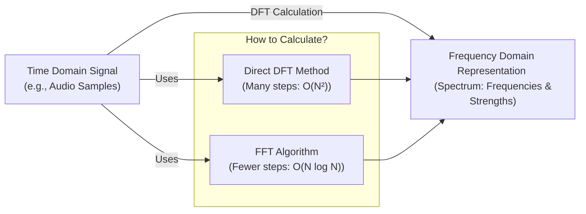
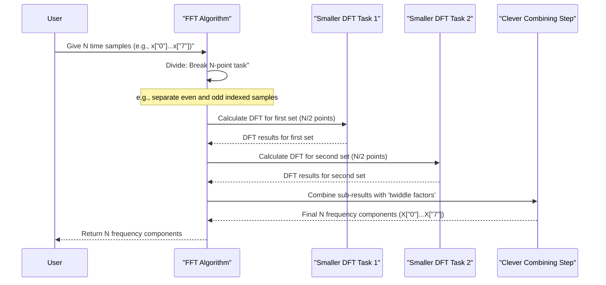

# Chapter 2: Fast Fourier Transform (FFT) - Core Concept

Welcome to Chapter 2! In [Chapter 1: Discrete Fourier Transform (DFT) - Foundation](01_discrete_fourier_transform__dft____foundation_.md), we learned about the Discrete Fourier Transform (DFT). The DFT is like a magical prism that takes a signal (like a sound wave) and shows us all the individual frequencies hidden inside it. We also discovered a bit of a problem: while the DFT tells us *what* frequencies are there, calculating them directly can be incredibly slow, especially for long signals. This slowness is described as O(N²) complexity, meaning the number of calculations grows very quickly as the number of samples (N) increases.

So, how can we get these valuable frequency insights without waiting forever? That's where the **Fast Fourier Transform (FFT)** comes in!

## What is the Fast Fourier Transform (FFT)? Speeding Up the Detective Work

Imagine our musical detective from Chapter 1 trying to identify notes in a complex chord.
*   The **DFT** method was like meticulously checking every possible note with every tuning fork, one by one – thorough, but slow.
*   The **FFT** is like a master detective who has developed a brilliant system of shortcuts. Instead of checking everything exhaustively, they use clever tricks and patterns to arrive at the *exact same conclusions* much, much faster.

The **Fast Fourier Transform (FFT)** is not a *new* kind of transform. It's an incredibly **efficient algorithm** (a set of smart steps) to compute the **Discrete Fourier Transform (DFT)**.
Think of it this way:
*   The DFT is the *recipe* for what we want to bake (the frequency spectrum of our signal).
*   The FFT is a collection of super-fast *baking techniques* that produce the exact same cake (the DFT results), but in a fraction of the time.

The key is that the FFT uses clever mathematical shortcuts, often involving a technique called **factorization**, to break down the big DFT problem into smaller, more manageable pieces. This dramatically reduces the number of calculations needed.

Both the direct DFT method and an FFT algorithm will give you the same frequency information (B), but the FFT gets you there much quicker!

## Why "Fast"? The Magic of Fewer Calculations

In Chapter 1, we saw that a direct DFT for `N` samples takes roughly `N * N` (or N²) operations.
The FFT, through its cleverness, reduces this to roughly `N * log N` operations. This might not seem like a huge difference at first glance, but let's see an example:

Suppose you have a signal with `N = 1024` samples (a small number for audio, but good for an example).
*   **Direct DFT (N²):** 1024 * 1024 = 1,048,576 operations.
*   **FFT (N log₂ N):**  Since 2¹⁰ = 1024, log₂1024 = 10. So, 1024 * 10 = 10,240 operations.

That's a massive difference! The FFT needs about 10,000 operations, while the direct DFT needs over a million – about 100 times more! For larger `N`, like a million samples (just a few seconds of CD-quality audio):
*   **Direct DFT (N²):** 1,000,000 * 1,000,000 = 1,000,000,000,000 (a trillion!) operations. This would take ages!
*   **FFT (N log₂ N):**  log₂1,000,000 is roughly 20. So, 1,000,000 * 20 = 20,000,000 (twenty million) operations. Still a lot, but *vastly* more manageable for a computer.

This incredible speed-up is why the FFT is so widely used in digital signal processing, image analysis, and many scientific fields. It makes analyzing complex signals practical. We'll explore what "O(N log N)" means in more detail in the [next chapter](03_computational_complexity__o_n_log_n___.md).

## How Does the FFT Work Its Magic? (The Core Idea: Divide and Conquer)

Without getting too deep into the math just yet (we'll save that for chapters like [Cooley–Tukey FFT Algorithm](05_cooley_tukey_fft_algorithm_.md)), the core idea behind most FFT algorithms is "divide and conquer."

Imagine you have a very large, complicated puzzle to solve (calculating the DFT for many points).
*   The **direct DFT approach** is like trying to fit all the pieces together at once, looking at every piece in relation to every other piece.
*   The **FFT approach** is like:
    1.  **Divide:** Splitting the puzzle into several smaller, less complicated sub-puzzles. For example, if you have an N-point DFT, you might break it down into two N/2-point DFTs.
    2.  **Conquer:** Solving these smaller sub-puzzles. If the sub-puzzles are still too big, you divide them again, and so on, until they become trivial to solve.
    3.  **Combine:** Cleverly putting the solutions of the smaller puzzles back together to get the solution for the original big puzzle. This "combining" step involves some specific mathematical operations using what are called "twiddle factors" (which are just special complex numbers derived from roots of unity).

Here's a simplified conceptual diagram of this "divide and conquer" strategy:

By repeatedly breaking down the problem, the FFT avoids many of the redundant calculations that make the direct DFT so slow. The "factorization" mentioned in the concept description refers to this process of breaking down the DFT computation into these smaller, more efficient steps.

## What the FFT Calculates: Still the Same DFT!

It's super important to remember: **The FFT calculates the exact same frequency components (amplitudes and phases for each frequency bin) as the DFT.** It's not an approximation (when we ignore tiny errors from computer arithmetic). It's just a much faster *method* to get to the same destination.

So, all the reasons we wanted to use the DFT in Chapter 1 (to find hidden frequencies in music, remove noise, analyze images, etc.) are still valid, and the FFT just lets us do it efficiently. This efficiency is crucial for real-time applications, like in telecommunications or live audio processing, and for analyzing large datasets. You'll see many examples in the [Applications of FFT](04_applications_of_fft_.md) chapter.

## Summary and What's Next

In this chapter, we've uncovered the core idea behind the Fast Fourier Transform:
*   The **FFT** is a family of **fast algorithms** to compute the **Discrete Fourier Transform (DFT)**.
*   It doesn't change *what* is calculated, only *how fast* it's calculated.
*   The speedup comes from clever mathematical shortcuts, primarily using a "divide and conquer" strategy, which reduces the computational complexity from O(N²) to a much more manageable **O(N log N)**.
*   This efficiency makes the FFT a cornerstone of modern digital signal processing and many scientific computations.

Now that we understand that the "F" in FFT stands for "Fast" and why that's a big deal, we're ready to look more closely at what that "O(N log N)" speed actually means and why it's such a game-changer.

Let's dive into [Chapter 3: Computational Complexity (O(n log n))](03_computational_complexity__o_n_log_n___.md) to understand the numbers behind the speed!

---

Generated by [AI Codebase Knowledge Builder](https://github.com/The-Pocket/Tutorial-Codebase-Knowledge)