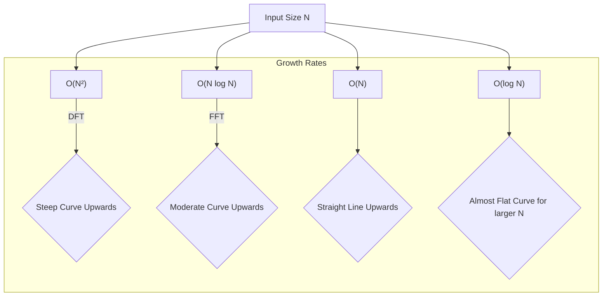

# Chapter 3: Computational Complexity (O(n log n))

In [Chapter 2: Fast Fourier Transform (FFT) - Core Concept](02_fast_fourier_transform__fft____core_concept_.md), we discovered that the Fast Fourier Transform (FFT) is a much quicker way to get the same results as the direct Discrete Fourier Transform (DFT). We mentioned that the direct DFT is "slow" (O(N²)) and the FFT is "fast" (O(N log N)). But what do these strange "O" expressions actually mean? And why is "N log N" so much better than "N²"?

This chapter will demystify **computational complexity**, focusing on the O(N log N) efficiency that makes FFTs so powerful. Understanding this concept will show you *why* FFTs are a game-changer for analyzing signals in the real world.

## What's the Big Deal with Speed? Choosing the Right Path

Imagine you need to travel from your home to a park. There are two paths:
1.  **Path A:** A winding, scenic route that takes a long time, and the further the park, the *disproportionately* longer it takes. If the park is twice as far, it might take four times as long!
2.  **Path B:** A more direct highway route. It still takes longer if the park is further away, but the increase in time is much more reasonable.

In computing, algorithms (like the DFT or FFT) are like these paths, and the "distance to the park" is the size of your data (e.g., the number of audio samples you want to analyze). "Computational complexity" is a way to describe how the travel time (the algorithm's runtime) changes as the distance (data size) increases. We naturally want the faster path, especially for long journeys (large datasets)!

## Introducing "Big O" Notation: An Algorithm's Speed Nickname

When computer scientists talk about how fast an algorithm is, they often use something called **Big O notation**. It looks like **O(...)**, for example, O(N²) or O(N log N).

Think of Big O as a nickname that describes the *growth rate* of an algorithm's runtime as its input size (which we'll call 'N') gets larger.
*   It doesn't tell you the exact time in seconds (that depends on your computer's speed, programming language, etc.).
*   Instead, it tells you how the number of operations an algorithm needs to perform scales with N. For example, if N doubles, does the work double, quadruple, or something else?

This helps us compare algorithms in a general way, independent of specific hardware.

## The "Slow Lane": O(N²) Complexity of Direct DFT

Remember from [Chapter 1: Discrete Fourier Transform (DFT) - Foundation](01_discrete_fourier_transform__dft____foundation_.md) that a direct DFT calculation can be quite slow. To figure out each frequency component, the basic DFT formula looks at *every single one* of your N input samples. If you have N samples and want N frequency components, you're doing roughly N multiplied by N (N²) operations.

This is called **O(N²) complexity** (read as "Order N squared").

Let's see how N² grows:
*   If N = 10 samples, N² = 100 operations.
*   If N = 100 samples, N² = 10,000 operations.
*   If N = 1,000 samples, N² = 1,000,000 operations!
*   If N = 10,000 samples, N² = 100,000,000 operations!!

Notice a pattern? **If the data size (N) doubles, the computation time roughly quadruples.** This gets very slow, very quickly for large N.

**Analogy:** Calculating a DFT directly is like trying to find a specific word in a large dictionary by starting at the first page and reading *every single word* until you find the one you're looking for. If the dictionary doubles in size, your search time roughly quadruples (because you have twice as many words to check, and on average, you might go halfway for each word, simplifying to N*N comparison for all words).

## Understanding O(log N): The "Quick Jump" Power

Before we get to O(N log N), let's understand the **log N** part. In computer science, "log" usually means logarithm base 2 (written as log₂ N).

**What is log₂ N?** It's roughly the number of times you can cut N in half until you get down to 1.
*   If N = 8, log₂ 8 = 3 (8 -> 4 -> 2 -> 1; 3 cuts)
*   If N = 16, log₂ 16 = 4
*   If N = 1024, log₂ 1024 = 10
*   If N = 1,048,576 (around a million), log₂ N is only about 20!

The key takeaway is that **log N grows very, very slowly** compared to N.

**Analogy (revisited):** Searching for a word in a dictionary *using its alphabetical sorting* is like a O(log N) operation. You don't check every word. You open to the middle. Is your word before or after? You've just eliminated half the dictionary! You repeat this, halving the search space each time. For a million-word dictionary, you'd find the section in about 20 steps, not a million!

This "halving" or "divide and conquer" approach is central to why FFTs are fast.

## The "Fast Lane": O(N log N) Complexity of FFT

Now we can understand **O(N log N)** (read as "Order N log N"). This is the efficiency FFT algorithms achieve. It means the number of operations is roughly N *multiplied by* log N.

Let's compare O(N²) with O(N log N) using our previous examples:

| N (Input Size) | Direct DFT: O(N²) Approx. Ops | FFT: O(N log₂ N) Approx. Ops | How much faster is FFT? |
| :------------- | :---------------------------- | :--------------------------- | :---------------------- |
| 16             | 16 * 16 = 256                 | 16 * log₂(16) = 16 * 4 = 64  | 4 times                 |
| 256            | 256 * 256 = 65,536            | 256 * log₂(256) = 256 * 8 = 2,048 | 32 times                |
| 1,024          | 1,024² ≈ 1 million            | 1,024 * log₂(1024) = 1024 * 10 = 10,240 | ≈ 100 times             |
| 1,048,576 (≈ 1 Million) | (10⁶)² = 1 trillion      | 10⁶ * log₂(10⁶) ≈ 10⁶ * 20 = 20 million | ≈ 50,000 times          |

Look at that last row! For a million data points (common for a few seconds of audio):
*   Direct DFT: A trillion operations. This could take minutes, hours, or even days on a typical computer!
*   FFT: Twenty million operations. This can be done in well under a second!

This massive difference is why O(N log N) is a "significant improvement." It's what makes analyzing large datasets practical for everyday applications like music processing, image filtering, and scientific research.

**The dictionary analogy for O(N log N):**
While just finding the *section* is O(log N), an FFT still has to do some work related to each of the N items. So, it's like using the O(log N) dictionary trick to efficiently organize or process information related to all N words, rather than just finding one. The "divide and conquer" strategy used in FFTs, as briefly mentioned in [Chapter 2: Fast Fourier Transform (FFT) - Core Concept](02_fast_fourier_transform__fft____core_concept_.md), is what leads to this N log N behavior. It breaks the big N-point problem into smaller problems (the `log N` part) and then combines the results, performing operations proportional to N at each stage of division/combination.

## Visualizing the Growth

Let's see how these complexities look on a graph. The Y-axis shows the number of operations, and the X-axis shows the input size (N).

(Conceptual plot description: Imagine a graph where the `O(N²)` line shoots up very quickly, the `O(N log N)` line also goes up but much less steeply, the `O(N)` line is a straight diagonal, and the `O(log N)` line becomes almost flat as N increases.)

The diagram helps visualize that as `N` (the amount of data) gets bigger:
*   `O(N²)` (like direct DFT) becomes very costly very fast.
*   `O(N log N)` (like FFT) grows much more manageably. This is the sweet spot for many efficient algorithms.

## Why is O(N log N) a "Sweet Spot"?

Many real-world problems involve large amounts of data.
*   A few seconds of audio at CD quality can have over a million samples.
*   A digital photo can have millions of pixels.
*   Scientific simulations can generate enormous datasets.

If analyzing this data required O(N²) operations, many tasks would be too slow to be useful. Imagine waiting hours for your music player to apply an effect or for an image editor to sharpen a photo!

The O(N log N) complexity of FFT algorithms makes these tasks feasible, often in real-time or near real-time. This efficiency is a cornerstone of modern digital signal processing. The "factorizing the DFT matrix into a product of sparse factors," as mentioned in the concept description for FFT, is a key mathematical trick that enables this reduction in complexity from O(N²) to O(N log N). We'll see a specific example of how this factorization works in [Chapter 5: Cooley–Tukey FFT Algorithm](05_cooley_tukey_fft_algorithm_.md).

## A Quick Note on Big O

It's important to remember a couple of things about Big O notation for beginners:
1.  **It ignores constant factors:** An algorithm that takes `2 * N log N` steps and one that takes `100 * N log N` steps are both considered O(N log N). Big O describes the *shape* of the growth curve as N gets very large, not the exact height.
2.  **It describes the dominant term:** If an algorithm takes `N log N + N` operations, it's still O(N log N) because as N gets very large, the `N log N` part grows much faster and dominates the `N` part.

## Summary and What's Next

In this chapter, we've peeled back the curtain on what makes FFTs "fast":
*   **Computational Complexity** (often using Big O notation) describes how an algorithm's runtime scales with input size (N).
*   A direct DFT has **O(N²)** complexity: if data doubles, work roughly quadruples. This is slow for large N.
*   FFT algorithms achieve **O(N log N)** complexity. The `log N` term grows very slowly, making `N log N` vastly more efficient than `N²` for large datasets.
*   This `N log N` efficiency is like using a clever dictionary search (log N-like jumps) combined with processing related to N items, making complex analyses practical.

Understanding O(N log N) helps us appreciate *why* the FFT is such a revolutionary algorithm. It's not just a little faster; it's fundamentally more scalable, opening the door to a vast range of applications.

Now that we appreciate the *speed* of the FFT, let's see where this incredible efficiency is put to use. Get ready to explore the diverse and fascinating [Applications of FFT](04_applications_of_fft_.md)!

---

Generated by [AI Codebase Knowledge Builder](https://github.com/The-Pocket/Tutorial-Codebase-Knowledge)