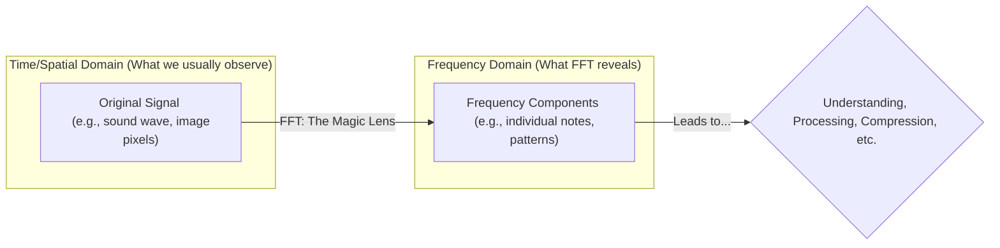
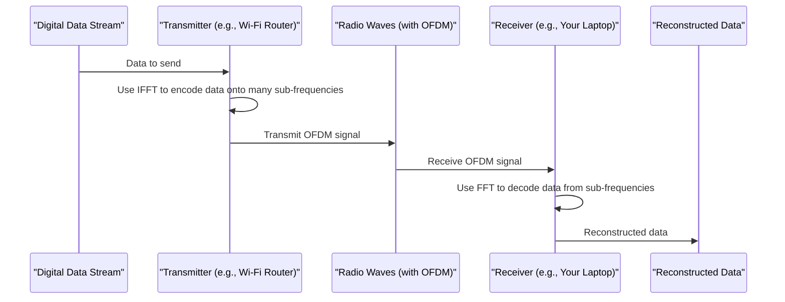
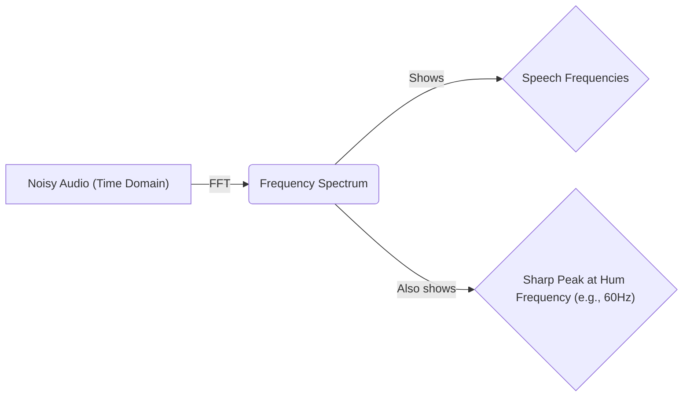

# Chapter 4: Applications of FFT

Welcome to Chapter 4! In the previous chapters, we journeyed from understanding the [Discrete Fourier Transform (DFT) - Foundation](01_discrete_fourier_transform__dft____foundation_.md), to learning about the [Fast Fourier Transform (FFT) - Core Concept](02_fast_fourier_transform__fft____core_concept_.md), and finally appreciating its incredible speed in [Chapter 3: Computational Complexity (O(n log n))](03_computational_complexity__o_n_log_n___.md). We now know that the FFT is a super-fast way to break down a signal into its hidden frequencies.

But... so what? Why is it so important to see these hidden frequencies quickly? This chapter is all about the "Wow!" moment – discovering the amazing and diverse ways the FFT is used in the real world. Its ability to efficiently switch between looking at a signal over time (or space) and looking at its frequencies makes it a true powerhouse.

## The FFT: Your Versatile Toolkit for Signal Analysis

Imagine you have a special pair of glasses. Normally, you see the world as it is. But when you put on these "Frequency Glasses" (our FFT!), you suddenly see a hidden layer of information: the underlying frequencies that make up what you're observing.
*   Listening to music? These glasses show you the exact notes and their strengths.
*   Looking at a picture? They reveal patterns and textures.
*   Feeling a machine vibrate? They pinpoint the frequencies causing the shaking.

The FFT is like this pair of Frequency Glasses. It's a versatile toolkit that lets scientists, engineers, and creators analyze and manipulate signals in ways that were previously too slow to be practical. Because the FFT can quickly reveal these frequency components, it has become fundamental to countless applications.

Let's explore some of the most common and exciting uses!

## 1. Digital Audio Processing: Making Sound Magic!

This is one of the most relatable areas where FFTs shine.

*   **MP3 Encoding/Decoding:** When you listen to an MP3, you're experiencing the FFT in action! To make audio files smaller (compress them), MP3 encoders use the FFT to transform a piece of audio into its frequency components. They then cleverly discard or reduce the information for frequencies that our ears don't hear very well. This is called perceptual coding. When you play the MP3, the decoder (often using an FFT-related process called the Inverse FFT or IFFT) reconstructs the sound.
    *   **Analogy:** Imagine a chef (the FFT) analyzing a complex soup (the audio signal) into its individual ingredients (frequencies). To save space in a recipe card (the MP3 file), the chef might write down only the most important ingredients or use abbreviations for less critical ones.

*   **Audio Equalizers:** Ever adjusted the bass or treble on your stereo? Equalizers use FFTs (or similar techniques called filter banks, which are often implemented with FFTs) to boost or cut the strength of specific frequency ranges in your music. The FFT helps identify "how much" of each frequency band is present, so it can then be adjusted.

*   **Noise Reduction:** Annoying hum in an audio recording? The FFT can help! By transforming the audio into the frequency domain, you can often see a sharp spike at the frequency of the hum (e.g., 50Hz or 60Hz from electrical interference). Software can then reduce the strength of just that frequency component before transforming the signal back to the time domain, magically reducing the hum.

*   **Pitch Correction (Auto-Tune):** Software that corrects a singer's pitch often uses FFTs to determine the frequencies (notes) being sung. If a note is slightly off, the software can "nudge" its frequency components to the correct pitch.

*   **Synthesizers and Special Effects:** Many music synthesizers and audio effects use FFTs to create and modify sounds by manipulating their frequency content directly.

## 2. Image Processing: Seeing More Than Meets the Eye

Just as audio signals have frequencies, images have "spatial frequencies." These relate to how rapidly the brightness or color changes across an image. High spatial frequencies correspond to sharp edges and fine details, while low spatial frequencies represent smooth areas.

*   **JPEG Compression:** Similar to MP3s, JPEG image compression uses a related transform called the Discrete Cosine Transform (DCT), which is very closely related to the FFT (and can be computed using FFTs). The DCT converts small blocks of an image into their spatial frequency components. Less important high-frequency components (fine details that might not be very noticeable) can be represented with less precision or discarded to make the file smaller.
    *   **Analogy:** Think of an artist sketching a scene. They might first draw the broad shapes (low frequencies) and then add finer details (high frequencies). For a "compressed" sketch, they might simplify some of the very fine details.

*   **Image Filtering (Blurring, Sharpening):** Operations like blurring or sharpening an image can be done very efficiently in the frequency domain. For example, to blur an image, you can use the FFT to transform the image, then reduce the strength of its high-frequency components, and then use an Inverse FFT to transform it back. Sharpening involves boosting high-frequency components.

*   **Pattern Recognition:** FFTs can help identify periodic patterns or textures in images by looking for dominant spatial frequencies. This is useful in medical imaging, material science, and more.

## 3. Telecommunications: How Your Wi-Fi and 5G Work

Modern wireless communication relies heavily on FFTs, especially in a technology called **Orthogonal Frequency-Division Multiplexing (OFDM)**.

*   **OFDM (Wi-Fi, 4G/5G, Digital TV):** Imagine trying to send a huge amount of data very quickly over radio waves. If you send it all on one frequency, it's very vulnerable to interference or fading at that specific frequency. OFDM is a clever solution: it splits the data into many smaller chunks and sends each chunk simultaneously on many different, closely spaced, "sub-carrier" frequencies.
    *   The FFT is used on the transmitter side to efficiently modulate the data onto these many sub-carriers.
    *   On the receiver side, an FFT is used to demodulate the signal, separating the data from each sub-carrier.
    *   This makes the communication much more robust against interference and allows for efficient use of the available radio spectrum.
    *   **Analogy:** Instead of trying to shout one very long, complex message across a noisy room (risking parts being unheard), OFDM is like having many people quietly say small parts of the message simultaneously on different pitches. The receiver (using FFT) can listen to all these pitches and piece the message back together.

## 4. Engineering: Analyzing Vibrations and Structures

*   **Vibration Analysis:** In mechanical engineering, understanding vibrations is crucial for designing safe and reliable machines, buildings, and bridges. Sensors can measure vibrations over time. By applying an FFT to this vibration data, engineers can see the frequencies at which an object is vibrating most strongly.
    *   This helps identify potential problems, like an unbalanced motor (which would show a peak at its rotation frequency) or a structure resonating at a dangerous frequency.
    *   **Analogy:** If a car is making a strange humming sound, a mechanic (using FFT-based tools) can determine the frequency of the hum, which might point to a specific part (like a wheel bearing or an engine component) that's causing it.

*   **Structural Analysis:** FFTs can be used to analyze how structures respond to forces (like wind or earthquakes) by examining their natural vibration frequencies.

## 5. Scientific Research: Uncovering Patterns in Data

Scientists in many fields collect data that varies over time or space. FFTs are an invaluable tool for finding hidden periodicities or frequency components in this data.

*   **Astronomy:** Analyzing light from stars to determine their composition or searching for periodic signals from pulsars.
*   **Neuroscience:** Analyzing EEG (brain wave) data to identify different states of brain activity (e.g., sleep stages, epileptic seizures) based on their characteristic frequencies.
*   **Geophysics:** Analyzing seismic data to understand Earth's structure or detect earthquakes; the frequencies in seismic waves provide clues about the materials they've passed through.
*   **Medical Imaging (MRI):** While not a direct application of FFT in the same way as JPEG, the process of reconstructing an MRI image from the raw data collected by the scanner involves Fourier transforms. The scanner measures data in what's called "k-space" (a frequency domain representation), and an inverse Fourier transform is used to create the final image.

## 6. And Even More...

The list goes on!
*   **Financial Modeling:** Analyzing stock market data for cyclical patterns (though this is complex and often debated).
*   **Radar Systems:** Processing reflected signals to determine the speed and distance of objects.
*   **Spectroscopy:** Identifying materials based on how they absorb or emit light at different frequencies.

The core idea is always the same: the FFT provides a fast and efficient way to see the "frequency recipe" of a signal. Once you have this recipe, you can understand the signal better, compress it, filter it, or transform it.

## Focus Use Case: Cleaning Up Noisy Audio

Let's go back to our audio example: Imagine you've recorded an interview, but there's an annoying electrical hum in the background. How can FFT help?

1.  **Record Audio (Time Domain):** You have a digital audio file. If you plot it, it's a complex waveform over time, with the desired speech mixed with the hum.
    *   *Input:* `[sample1, sample2, sample3, ..., sampleN]`

2.  **Apply FFT (Go to Frequency Domain):** You take a segment of this audio and apply an FFT.
    *   The FFT (which we learned is a fast way to compute the [Discrete Fourier Transform (DFT) - Foundation](01_discrete_fourier_transform__dft____foundation_.md)) will give you a list of frequency components and their strengths (amplitudes).
    *   *Output (Conceptual):* A spectrum plot showing a big peak for speech frequencies and a sharp, distinct peak at, say, 60 Hz for the hum.

3.  **Identify and Filter Noise (Frequency Domain):** In the frequency spectrum, the 60 Hz hum will likely stand out as a clear spike. Your audio software can then be instructed to reduce the amplitude of the frequencies around this 60 Hz spike. This is a type of "notch filter."

4.  **Apply Inverse FFT (Go Back to Time Domain):** After modifying the frequency spectrum (reducing the hum), an Inverse FFT (IFFT) is applied. The IFFT takes the modified frequency components and reconstructs a time-domain audio signal.
    *   *Output:* A new audio segment where the 60 Hz hum is significantly reduced, making the speech clearer!

This entire process, from analyzing the noise to filtering it out, is made practical by the speed of the FFT. Without it, these kinds of detailed frequency manipulations would be too slow for most audio editing software.

## Summary: The Power of Seeing Frequencies

In this chapter, we've seen that the FFT isn't just a mathematical curiosity; it's a workhorse that powers a vast range of technologies we use every day. Its ability to efficiently translate signals between the time (or spatial) domain and the frequency domain opens up incredible possibilities for:
*   **Analysis:** Understanding the hidden components of signals.
*   **Compression:** Making files like MP3s and JPEGs smaller.
*   **Filtering:** Removing unwanted noise or enhancing desired features.
*   **Modulation/Demodulation:** Enabling modern digital communications.

The O(N log N) speed we learned about in [Chapter 3: Computational Complexity (O(n log n))](03_computational_complexity__o_n_log_n___.md) is what makes all these applications feasible, even with large amounts of data.

Now that we're motivated by *what* the FFT can do, you might be curious about *how* one of the most famous FFT algorithms actually achieves its speed. In the next chapter, we'll start to look under the hood at a specific algorithm.

Ready to dive into the details of a classic FFT method? Let's explore the [Chapter 5: Cooley–Tukey FFT Algorithm](05_cooley_tukey_fft_algorithm_.md)!

---

Generated by [AI Codebase Knowledge Builder](https://github.com/The-Pocket/Tutorial-Codebase-Knowledge)