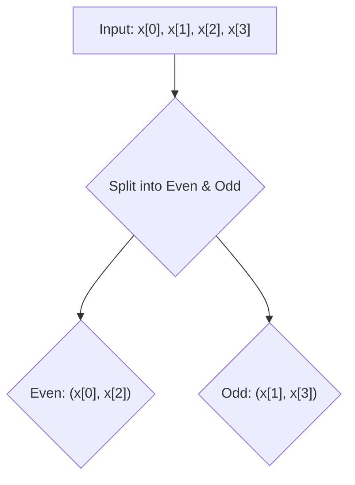
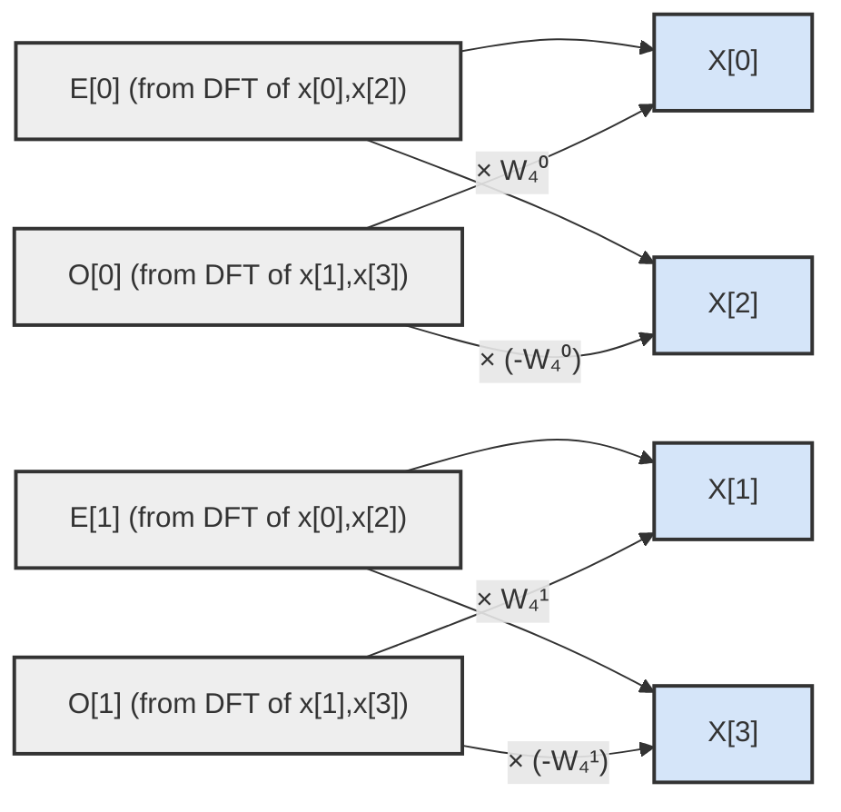
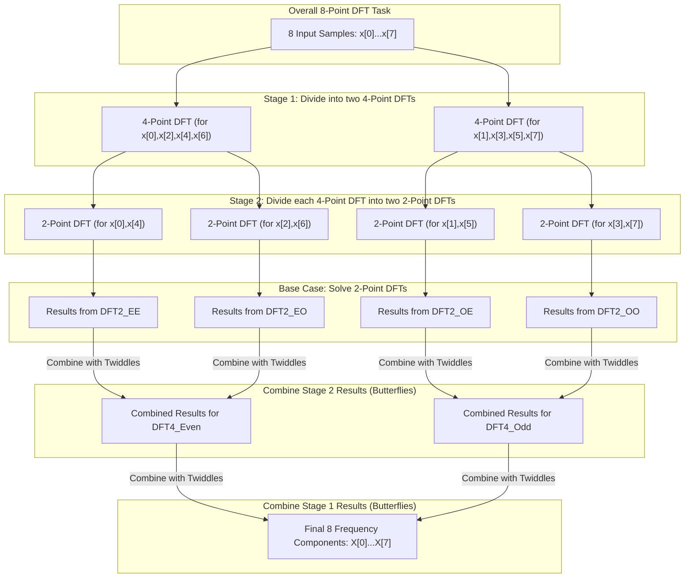
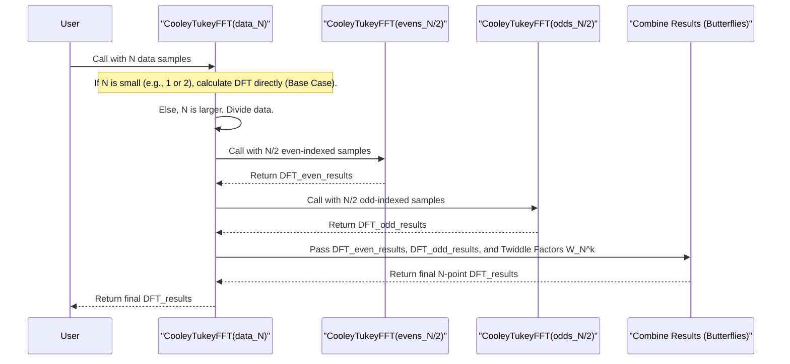

# Chapter 5: Cooley–Tukey FFT Algorithm

Welcome to Chapter 5! In [Chapter 4: Applications of FFT](04_applications_of_fft_.md), we saw the incredible versatility and power of the Fast Fourier Transform. From cleaning up noisy audio to enabling modern Wi-Fi, the FFT's ability to quickly break signals into their frequencies is a game-changer. We also know from [Chapter 3: Computational Complexity (O(n log n))](03_computational_complexity__o_n_log_n___.md) that this speed (O(N log N)) is a massive improvement over the direct DFT's O(N²) slowness.

But *how* does the FFT achieve this remarkable speed? While there are many FFT algorithms, one stands out as the most common and foundational: the **Cooley–Tukey FFT algorithm**. This chapter will give you a beginner-friendly look under the hood of this clever method.

## The Big Problem: Calculating a Large DFT Efficiently

Imagine you have a long audio recording with, say, 4096 samples. As we learned in [Chapter 1: Discrete Fourier Transform (DFT) - Foundation](01_discrete_fourier_transform__dft____foundation_.md), calculating the DFT directly would involve roughly 4096 * 4096 = 16,777,216 operations! That's a lot of work. We need a smarter way. The Cooley-Tukey algorithm provides this smarter way.

## The Cooley-Tukey Idea: Divide and Conquer!

The Cooley-Tukey algorithm is a brilliant example of a "divide and conquer" strategy. Think of it like trying to solve a giant, complicated jigsaw puzzle.
*   **The Hard Way (Direct DFT):** Trying to fit all thousands of pieces together at once, looking at every piece in relation to every other piece.
*   **The Smart Way (Cooley-Tukey):**
    1.  **Divide:** Split the big puzzle into several smaller, more manageable mini-puzzles. For example, if you have an N-piece puzzle, maybe you split it into two N/2-piece puzzles.
    2.  **Conquer:** Solve these smaller mini-puzzles. If a mini-puzzle is still too big, you divide it again! You keep doing this until the puzzles are so tiny they are trivial to solve (like a 2-piece puzzle).
    3.  **Combine:** Once you have the solutions to all the tiny puzzles, you cleverly put them back together, step-by-step, to get the solution for the original giant puzzle.

The Cooley-Tukey algorithm does exactly this with the DFT calculation. It recursively breaks a large DFT problem down into smaller DFT problems. Once these smaller DFTs are solved, their results are efficiently combined to give the solution to the original large DFT.

This approach is especially efficient when the size of our data (N) is a **power of two** (like 2, 4, 8, 16, 32, ..., 1024, 4096, etc.). This is because splitting a power-of-two number in half repeatedly always results in more powers of two, making the "divide" step very clean.

## How It Works: A Simple Example (Calculating a 4-Point DFT)

Let's say we have 4 data samples: `x[0], x[1], x[2], x[3]`. We want to calculate their 4-point DFT, which will give us 4 frequency components: `X[0], X[1], X[2], X[3]`.

Here's how Cooley-Tukey (specifically the "radix-2" version, which means we always divide by 2) tackles this:

**1. Divide:**
The first step is to split our 4-point sequence into two 2-point sequences:
*   One sequence with the **even-indexed** samples: `(x[0], x[2])`
*   One sequence with the **odd-indexed** samples: `(x[1], x[3])`

**2. Conquer (Solve the Smaller DFTs):**
Now, we need to calculate the DFT for these two smaller sequences. Since they are 2-point sequences, their DFTs are very easy to calculate.
Let's call the 2-point DFT of the even samples `E[0], E[1]` and the 2-point DFT of the odd samples `O[0], O[1]`.

A 2-point DFT for generic inputs `a, b` is:
*   `Output[0] = a + b`
*   `Output[1] = a - b`
(This is because the "twiddle factor" $W_2^1 = e^{-2\pi i (1) / 2} = e^{-\pi i} = -1$)

So, for our even and odd sequences:
*   `E[0] = x[0] + x[2]`
*   `E[1] = x[0] - x[2]`

And:
*   `O[0] = x[1] + x[3]`
*   `O[1] = x[1] - x[3]`

At this point, we've "conquered" the smaller DFTs. If we had started with an 8-point DFT, we would have split it into two 4-point DFTs, and then each of those 4-point DFTs would be split again like we're doing here. This "calling itself on a smaller problem" is what "recursive" means.

**3. Combine: The Magic of "Butterfly Operations"**
Now comes the clever part: combining the results `E[0], E[1], O[0], O[1]` to get our final 4-point DFT results `X[0], X[1], X[2], X[3]`. This combination involves special complex numbers called **twiddle factors**.

A twiddle factor is written as $W_N^k = e^{-2\pi i k / N}$. Think of it as a "complex spinner" or a "rotation number" that helps us correctly phase and scale the results from the smaller DFTs. For our N=4 case, the important twiddle factors are:
*   $W_4^0 = e^{-2\pi i (0) / 4} = e^0 = 1$
*   $W_4^1 = e^{-2\pi i (1) / 4} = e^{-\pi i / 2} = -i$ (a 90-degree clockwise rotation in the complex plane)
*   $W_4^2 = e^{-2\pi i (2) / 4} = e^{-\pi i} = -1$
*   $W_4^3 = e^{-2\pi i (3) / 4} = e^{-3\pi i / 2} = i$

The combination formulas for a 4-point DFT are:
*   `X[0] = E[0] + W_4^0 * O[0]`
*   `X[1] = E[1] + W_4^1 * O[1]`
*   `X[2] = E[0] + W_4^2 * O[0]`  (which is the same as `E[0] - W_4^0 * O[0]`, because $W_N^{k+N/2} = -W_N^k$)
*   `X[3] = E[1] + W_4^3 * O[1]`  (which is the same as `E[1] - W_4^1 * O[1]`)

This pattern of combining results is often visualized in what's called a **butterfly diagram**. For each `k` from `0` to `N/2 - 1`, we calculate `X[k]` and `X[k + N/2]`.

Here's how the combination step for our 4-point DFT looks as a butterfly diagram:

In this diagram:
*   `E[0]` and `O[0]` combine to form `X[0]` and `X[2]`.
*   `E[1]` and `O[1]` combine to form `X[1]` and `X[3]`.
*   The lines show additions, and the labels like "x $W_4^0$" show multiplication by a twiddle factor.
*   Notice the "cross-over" pattern – that's why it's called a "butterfly"! Each butterfly takes two inputs and produces two outputs.

For an N-point DFT, there are N/2 such butterflies in the final combination stage.

## The Recursive Breakdown (Conceptual)

If we started with an 8-point DFT, the process would look like this:

This diagram shows that an 8-point DFT is broken down into two 4-point DFTs, and each of those is broken down into two 2-point DFTs. The 2-point DFTs are solved directly (the "base case" of the recursion). Then, the results are combined back up using butterfly operations at each stage.

## Why is Cooley-Tukey Faster?

Let `T(N)` be the time (number of operations) to compute an N-point DFT.
With Cooley-Tukey, we do:
1.  Two N/2-point DFTs: `2 * T(N/2)`
2.  N/2 butterfly operations. Each butterfly involves one complex multiplication (by a twiddle factor) and two complex additions. So, roughly `O(N)` operations for all butterflies.

So, `T(N) = 2 * T(N/2) + O(N)`.
This is a famous recurrence relation in computer science. If you keep breaking it down until `T(1)` (a 1-point DFT is just the sample itself, so `O(1)` work), this relation solves to `T(N) = O(N log N)`.

This `N log N` complexity, as we discussed in [Chapter 3: Computational Complexity (O(n log n))](03_computational_complexity__o_n_log_n___.md), is a huge saving compared to the `N²` complexity of a direct DFT, especially for large `N`.

## A Peek Under the Hood (Conceptual Sequence)

Let's imagine a function `CooleyTukeyFFT(data)`:

This diagram illustrates the recursive nature. The `CooleyTukeyFFT` function calls itself with smaller problems until it hits a simple base case. Then, it combines the results on the way back up.

It's important to note that most practical FFT implementations don't use explicit recursion like this due to function call overhead. Instead, they use an iterative approach that achieves the same result, often reordering the input data in a specific way (called bit-reversal permutation) and then performing stages of butterfly operations. However, the recursive "divide and conquer" logic is the core idea.

## Summary: The Power of Dividing

The Cooley-Tukey FFT algorithm is a cornerstone of digital signal processing because it provides an incredibly efficient way to compute the Discrete Fourier Transform. Its key features are:
*   It's a **divide and conquer** algorithm.
*   It **recursively** breaks down a large DFT into smaller DFTs.
*   It's particularly efficient for data sizes `N` that are **powers of two** (this is called the radix-2 Cooley-Tukey).
*   The results from smaller DFTs are combined using **butterfly operations** and **twiddle factors**.
*   This strategy reduces the computational complexity from O(N²) to **O(N log N)**, making FFTs practical for real-world applications.

Understanding the Cooley-Tukey algorithm helps demystify how the FFT achieves its amazing speed. This "divide and conquer" principle is a powerful tool used in many areas of computer science.

So far, we've mostly talked about 1D signals, like a single audio timeline. But what about signals with more dimensions, like images (which are 2D)? Can we apply FFTs to them too? You bet!

Let's explore this in [Chapter 6: Multidimensional FFTs](06_multidimensional_ffts_.md).

---

Generated by [AI Codebase Knowledge Builder](https://github.com/The-Pocket/Tutorial-Codebase-Knowledge)