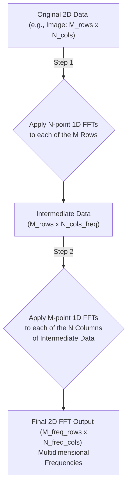
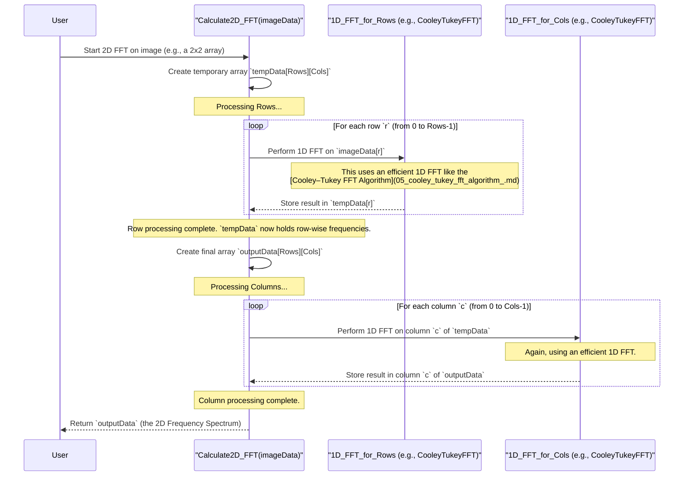

# Chapter 6: Multidimensional FFTs

Welcome to Chapter 6! In [Chapter 5: Cooley–Tukey FFT Algorithm](05_cooley_tukey_fft_algorithm_.md), we explored the clever "divide and conquer" strategy that makes the Fast Fourier Transform so efficient for one-dimensional (1D) signals like audio. But what if our data isn't just a simple timeline? Many types of data have more than one dimension – think of digital images, which are 2D grids of pixels, or medical scans like MRIs, which are 3D volumes of data.

This chapter introduces **Multidimensional FFTs**, extending the power of frequency analysis to these higher-dimensional datasets.

## From Lines to Grids: Why Do We Need Multidimensional FFTs?

So far, we've mostly talked about signals like a sound wave, which can be represented as a sequence of values over time – a 1D line of data. The FFT helps us find the frequencies hidden in that sound.

But what if our data is an **image**? An image isn't just a line; it's a 2D grid of pixels. Each pixel has a brightness or color value.
*   In a 1D audio signal, frequencies relate to how fast the sound wave oscillates over *time*.
*   In a 2D image, "frequencies" (often called **spatial frequencies**) relate to how rapidly the pixel values change across *space* – both horizontally and vertically. For example, a finely striped shirt in an image has high horizontal spatial frequencies, while a smooth, blurry background has low spatial frequencies.

Imagine you want to analyze the textures in an image. Are there repeating patterns? How fine are these patterns, and in what direction do they run? This is where a **2D FFT** comes in handy. It can break down the image into its 2D spatial frequency components, revealing information about these patterns. Similarly, a 3D FFT can analyze volumetric data, like finding periodic structures in a medical scan.

Our central use case for this chapter will be: **How can we analyze a digital image to understand its underlying spatial frequency content (e.g., to identify textures or repeating patterns)?**

## What is Multidimensional Data?

Before diving into the FFT, let's quickly clarify what we mean by multidimensional data:
*   **1D Data:** A sequence of values, like `[v1, v2, v3, ..., vN]`. Think of an audio signal sampled over time.
*   **2D Data:** A grid or matrix of values. A grayscale image is a perfect example, where each element `pixel[row][column]` holds a brightness value.
    ```
    Image Pixel Values:
    [ [10, 20, 30],
      [40, 50, 60],
      [70, 80, 90] ]
    ```
*   **3D Data:** A volume or cube of values. Think of a stack of grayscale images, like the slices from an MRI scan. Each element `voxel[slice][row][column]` holds a value.

## The "Row-Column" Algorithm: Extending 1D FFTs

The most common and intuitive way to compute a multidimensional FFT is called the **row-column algorithm** (for 2D data, or more generally, the separable or dimension-by-dimension algorithm).

The idea is surprisingly simple: **You apply 1D FFTs sequentially along each dimension of your data.**

Let's take our 2D image example:
1.  **Process Rows:** Go through your image, row by row. For each individual row of pixel values, perform a standard 1D FFT. This will transform the pixel values in that row into their horizontal spatial frequency components. After doing this for all rows, you'll have an intermediate 2D grid where each row represents horizontal frequencies.

2.  **Process Columns:** Now, take this intermediate grid (where rows are already transformed). Go through it, column by column. For each individual column, perform a standard 1D FFT. This will transform the values in that column (which already represent horizontal frequencies) into their vertical spatial frequency components.

The final 2D grid you end up with is the 2D FFT of your original image! Each point in this 2D frequency spectrum `F[u][v]` tells you the strength (and phase) of a specific 2D spatial frequency, where `u` relates to horizontal frequency and `v` relates to vertical frequency.

Here’s a diagram illustrating this:



**Analogy:** Imagine you have a large sheet of fabric with a woven pattern.
*   **Row Processing:** You first scan across each horizontal thread, analyzing the pattern along that thread.
*   **Column Processing:** Then, you take these "horizontal scan results" and scan down each vertical thread, analyzing how the horizontal patterns change vertically.
The combination gives you a complete picture of the 2D weave.

## Example: 2D FFT on a Tiny Image

Let's say we have a super tiny 2x2 grayscale image:
`image_data = [ [A, B], [C, D] ]`
where A, B, C, D are pixel brightness values.

**Step 1: FFTs along Rows**
*   Perform 1D FFT on Row 0: `[A, B]`. Let the result be `[A'_freq, B'_freq]`.
*   Perform 1D FFT on Row 1: `[C, D]`. Let the result be `[C'_freq, D'_freq]`.

Our intermediate data (let's call it `temp_data`) is now:
`temp_data = [ [A'_freq, B'_freq], [C'_freq, D'_freq] ]`

**Step 2: FFTs along Columns (of `temp_data`)**
*   Perform 1D FFT on Column 0 of `temp_data`: `[A'_freq, C'_freq]`. Let the result be `[F_00, F_10]`.
*   Perform 1D FFT on Column 1 of `temp_data`: `[B'_freq, D'_freq]`. Let the result be `[F_01, F_11]`.

Our final 2D FFT output is:
`FFT_output = [ [F_00, F_01], [F_10, F_11] ]`

Each `F_uv` value in `FFT_output` represents the strength of a 2D spatial frequency. For example:
*   `F_00`: Represents the average brightness (DC component, zero frequency in both directions).
*   `F_01`: Represents purely horizontal frequency content (no vertical variation, but some horizontal variation).
*   `F_10`: Represents purely vertical frequency content.
*   `F_11`: Represents diagonal frequency content (variation in both directions).

(Note: For a 2x2 FFT, the "frequencies" are quite limited, but this illustrates the process.)

## Efficiency of Multidimensional FFTs

The wonderful thing about the row-column method is that it preserves the O(N log N) efficiency we love, where 'N' here is the *total number of data points*.

Let's say our image is `R` rows by `C` columns.
*   **Row FFTs:** We do `R` individual 1D FFTs, each on `C` data points. If a 1D FFT of `C` points takes roughly `C log C` operations, then this step takes `R * (C log C)` operations.
*   **Column FFTs:** We do `C` individual 1D FFTs, each on `R` data points (from the intermediate data). This step takes `C * (R log R)` operations.

The total number of operations is roughly `R * C log C + C * R log R`.
Let `P = R * C` be the total number of pixels.
The complexity is `P * (log C + log R) = P * log(RC) = P log P`.

So, if you have a 1000x1000 pixel image (1 million pixels), the 2D FFT will be roughly proportional to `1,000,000 * log(1,000,000)`, which is vastly faster than a hypothetical direct 2D DFT that might be `(1,000,000)^2`. This efficiency makes 2D FFTs practical for image processing tasks like filtering, compression (like in JPEG, which uses a related transform called DCT), and pattern analysis.

## Extending to 3D and Beyond

The beauty of the row-column (or dimension-by-dimension) approach is that it extends naturally to higher dimensions.
For a 3D dataset of size `L x M x N`:
1.  Perform 1D FFTs along the first dimension (e.g., for all `L` points, `M*N` times).
2.  Take the result and perform 1D FFTs along the second dimension (e.g., for all `M` points, `L*N` times).
3.  Take that result and perform 1D FFTs along the third dimension (e.g., for all `N` points, `L*M` times).

The complexity remains O(P log P), where `P = L * M * N` is the total number of data points.

## Under the Hood: A Conceptual Sequence

Let's visualize the steps for a 2D FFT function, `Calculate2D_FFT(imageData)`:



This sequence diagram shows that the 2D FFT process essentially orchestrates multiple 1D FFTs. The actual heavy lifting for transforming data into frequencies is done by the 1D FFT algorithm (like the [Cooley–Tukey FFT Algorithm](05_cooley_tukey_fft_algorithm_.md) we learned about previously) applied to each row and then each column.

## Use Case Revisited: Analyzing Image Textures

How does our 2D FFT output help analyze textures in an image?
The `outputData` from our 2D FFT is often called the **2D frequency spectrum** or **power spectrum** (if we look at the magnitude squared of the complex values).

*   **Low Frequencies (Center):** The values near the center of this 2D spectrum correspond to low spatial frequencies – the smooth, slowly changing parts of the image (e.g., overall brightness, large blurry areas).
*   **High Frequencies (Edges/Outer regions):** Values further away from the center correspond to high spatial frequencies – the sharp edges, fine details, and rapidly changing textures.
*   **Directional Patterns:** If your image has a strong repetitive pattern (like vertical stripes), you'll see bright spots or lines in the 2D frequency spectrum corresponding to the orientation and frequency of that pattern. For example, strong vertical stripes in the image would lead to bright spots along the horizontal axis in the frequency spectrum.

By visualizing and analyzing this 2D spectrum, we can:
*   Identify dominant orientations of textures.
*   Determine the "scale" or "fineness" of patterns.
*   Design filters to enhance or remove specific textures (e.g., blurring by reducing high frequencies, or sharpening by boosting them). This is a key part of image processing applications we saw in [Chapter 4: Applications of FFT](04_applications_of_fft_.md).

No specific code is needed here to display the 2D spectrum, as it's often visualized as an image itself (where brightness indicates the magnitude of the frequency component). Libraries like OpenCV or scikit-image in Python provide tools for computing and visualizing 2D FFTs.

## Summary and What's Next

In this chapter, we've expanded our understanding of FFTs beyond simple 1D signals:
*   **Multidimensional FFTs** allow us to analyze data with two or more dimensions, like images (2D) or medical scans (3D).
*   The most common method is the **row-column algorithm** (or dimension-by-dimension), which applies 1D FFTs sequentially along each axis of the data.
*   This approach is efficient, maintaining the overall **O(P log P)** complexity, where P is the total number of data points.
*   The result of a multidimensional FFT is a multidimensional frequency spectrum, revealing components like spatial frequencies in images.

The Cooley-Tukey algorithm and the row-column method are very general and widely applicable. However, for certain types of data or specific computational goals, even more specialized FFT algorithms have been developed. These can offer further optimizations or handle unique data structures.

Ready to explore some of these specialized techniques? Let's move on to [Chapter 7: Specialized FFT Algorithms](07_specialized_fft_algorithms_.md)!

---

Generated by [AI Codebase Knowledge Builder](https://github.com/The-Pocket/Tutorial-Codebase-Knowledge)