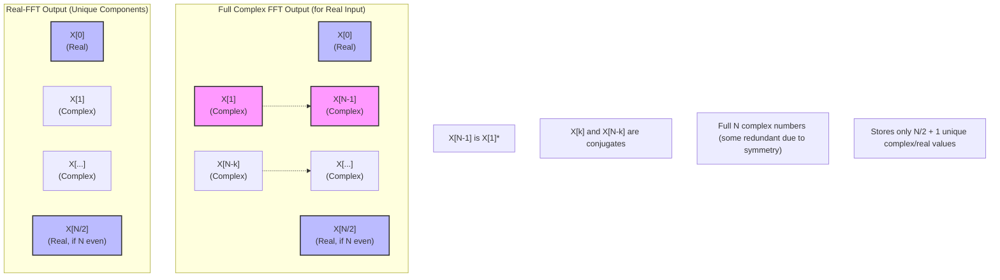
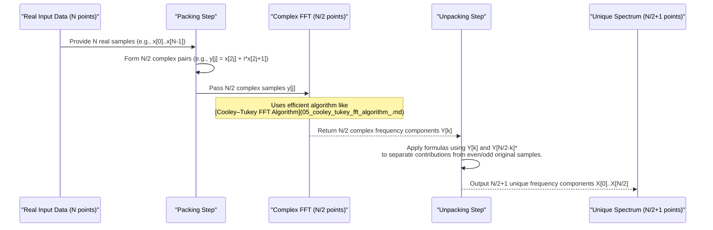

# Chapter 7: Specialized FFT Algorithms

Welcome to Chapter 7! In [Chapter 6: Multidimensional FFTs](06_multidimensional_ffts_.md), we learned how to apply the Fast Fourier Transform to data with more than one dimension, like images, by cleverly using 1D FFTs along each axis. Algorithms like the [Cooley–Tukey FFT Algorithm](05_cooley_tukey_fft_algorithm_.md) are quite general and powerful. However, sometimes our input data has special properties. Can we do even better in those cases? Yes, we can! This chapter explores **Specialized FFT Algorithms**, which are optimized versions designed for specific characteristics of the input data.

## The Quest for Even More Speed: Why Specialize?

Imagine you have a general-purpose toolkit. It's great for many jobs. But if you're only ever tightening one specific type of bolt, a specialized wrench designed just for that bolt will likely be faster, lighter, and easier to use.

Similarly, while a general FFT algorithm (like those we've discussed) works for all sorts of complex-valued input data, many real-world signals have specific properties. For instance, a lot of data we collect from physical measurements – like an audio recording from a microphone or temperature readings over time – consists purely of **real numbers** (numbers without an imaginary part).

**Our Central Use Case:** Let's say we're analyzing an audio signal. Audio samples are typically real numbers. If we use a standard FFT that expects complex numbers, we're essentially feeding it numbers like `sample + 0i`. Could we have an FFT that's tailor-made for real-only inputs and, by knowing this, performs its job even more efficiently?

Specialized FFT algorithms are like that specialized wrench. They are designed to exploit known characteristics of the input data to reduce computations and sometimes memory usage.

## Real-Valued FFTs: Exploiting Symmetry

The most common type of specialized FFT is for **real-valued input data**.

When the input signal `x[n]` is purely real, its Discrete Fourier Transform `X[k]` has a special property called **Hermitian symmetry** (or conjugate symmetry). This means:
$X[k] = X[N-k]^*$

Let's break this down:
*   `X[k]` is the k-th frequency component.
*   `X[N-k]` is another frequency component (N is the total number of samples).
*   `*` means the complex conjugate (if $a+bi$ is a complex number, its conjugate is $a-bi$).

**What does this symmetry tell us?**
If you know `X[k]`, you automatically know `X[N-k]` just by taking its complex conjugate!
For an N-point FFT:
*   `X[0]` (the DC component, or average value) is always real if the input is real.
*   If N is even, `X[N/2]` (the Nyquist frequency component) is also always real if the input is real.
*   For other frequencies `X[1]` to `X[N/2 - 1]`, their counterparts `X[N-1]` down to `X[N/2 + 1]` are just their complex conjugates.

This means that roughly **half of the output DFT coefficients are redundant**! We only need to compute and store about the first half of them (`X[0]` up to `X[N/2]`) to know the entire frequency spectrum.

The diagram above illustrates that for a real input, the full complex FFT output has symmetries. A Real-FFT cleverly computes only the unique parts, saving effort.

**The Benefit: Speed and Memory**
Algorithms specialized for real-valued inputs can exploit these symmetries to:
1.  **Reduce Computations:** They can cut down the number of arithmetic operations (multiplications and additions) by roughly half compared to a general-purpose complex FFT of the same length.
2.  **Reduce Memory:** The output can be stored more compactly, as only about half the coefficients are unique.

This is precisely what the concept description stated: "It's like using a specialized tool perfect for one job, rather than a general one; it gets the work done faster and more efficiently for that particular type of data."

## How Real-Valued FFTs Work (Conceptual)

There are a couple of common ways to get the benefits of a real-FFT:

**1. Packing and Unpacking (Common for even N):**
This is a clever trick that lets you use an existing complex FFT algorithm that's half the size.
*   **Input:** N real data points `x[0], x[1], ..., x[N-1]`.
*   **Pack:** Combine these N real points into N/2 complex points. For example, create a new complex sequence `y[j] = x[2j] + i * x[2j+1]` for `j = 0 to N/2 - 1`.
*   **Complex FFT:** Perform an N/2-point complex FFT on this packed sequence `y[j]` to get `Y[k]`. This is faster because the FFT size is halved.
*   **Unpack:** Use specific mathematical formulas to "unravel" the N/2 complex outputs `Y[k]` to reconstruct the N/2 + 1 unique frequency components of the original N-point real signal. This unpacking step involves using the symmetries.

**Example of Packing/Unpacking Benefit:**
Suppose you have 1024 real audio samples.
*   A general complex FFT would operate on 1024 points.
*   Using the packing method, you'd perform a complex FFT on 1024/2 = 512 points. Since FFT complexity is roughly O(N log N), a 512-point FFT is significantly faster than a 1024-point FFT (more than just half, because of the `log N` factor too!). The packing and unpacking steps add a little overhead, but the overall result is a speedup.

**2. Direct Real-FFT Algorithms:**
Some FFT algorithms are designed from the ground up to handle real-valued inputs directly. These algorithms build the symmetry exploitation into every stage of the computation. Examples include variants of the Cooley-Tukey algorithm adapted for real data, or algorithms that transform the data into DCTs/DSTs (Discrete Cosine/Sine Transforms), which are inherently for real data.

**Example: Input and Output Showing Symmetry**
Let's take an N=4 real input signal: `x = [1.0, 2.0, 3.0, 4.0]`

If we fed this into a *general complex FFT* (treating inputs as `1+0i, 2+0i, ...`), we'd get 4 complex outputs:
*   `X[0] = 10.0 + 0.0i`  (DC component)
*   `X[1] = -2.0 - 2.0i`
*   `X[2] = -2.0 + 0.0i`  (Nyquist frequency for N=4)
*   `X[3] = -2.0 + 2.0i`

Notice the symmetry:
*   `X[0]` is real.
*   `X[2]` (which is `X[N/2]`) is real.
*   `X[3]` is the complex conjugate of `X[1]` (i.e., `X[4-1] = X[1]*`).

A specialized **real-FFT** library function would typically return only the unique components, often in a packed format. For N=4, it might return:
*   `X_real[0] = 10.0`
*   `X_real[1] = -2.0 - 2.0i`
*   `X_real[2] = -2.0`
The component `X[3]` is implicitly known from `X[1]`. We saved computing and storing one complex number. For larger N, the savings are about half.

## Internal Implementation: Packing/Unpacking Sketch

Let's visualize the packing/unpacking approach for a real-input FFT using a sequence diagram.
Suppose we have `N` real input samples.

This diagram shows:
1.  **Real Input Data:** Our N real samples.
2.  **Packer:** Combines pairs of real samples into single complex numbers, creating an N/2 length complex array.
3.  **Complex FFT (N/2 points):** A standard, fast FFT algorithm is run on this smaller complex array.
4.  **Unpacker:** This crucial step uses the Hermitian symmetry property to mathematically separate the transformed even and odd original samples from the N/2 complex FFT results, yielding the N/2+1 unique frequency components of the original N-point real signal.
5.  **Unique Spectrum Output:** The useful, non-redundant part of the frequency spectrum.

Most high-performance FFT libraries (like FFTW, Intel MKL, Arm Performance Libraries) will automatically use these specialized real-FFT algorithms if you indicate your input is real. You usually don't have to implement the packing/unpacking yourself.

## Other Specialized FFTs (A Quick Glance)

While real-valued FFTs are very common, other specializations exist:

*   **FFTs for Real Symmetric/Anti-Symmetric Data (DCT/DST):**
    If the real input data itself has certain symmetries (e.g., it's an even function or an odd function), the DFT simplifies further into Discrete Cosine Transforms (DCTs) or Discrete Sine Transforms (DSTs). These are heavily used in image and video compression (like JPEG, which uses a 2D DCT, as mentioned in [Chapter 4: Applications of FFT](04_applications_of_fft_.md)). Fast algorithms for DCT/DST are often derived from real-FFTs.

*   **Prime Factor Algorithm (PFA) / Winograd FFT Algorithm (WFTA):**
    These algorithms are structured differently from Cooley-Tukey.
    *   **PFA (Good-Thomas algorithm):** Works when the FFT length `N` can be factored into mutually prime factors (e.g., N = 15 = 3 * 5). It can be more efficient than Cooley-Tukey for certain N by avoiding "twiddle factor" multiplications, though often at the cost of more complex data indexing.
    *   **WFTA:** Aims to minimize the number of multiplications, sometimes at the expense of more additions. This was more critical on older hardware where multiplications were much slower than additions. Modern CPUs often make this trade-off less beneficial.

*   **Bluestein's FFT Algorithm (Chirp Z-Transform):**
    This is a clever algorithm that can compute the DFT for any size `N`, including prime numbers (for which basic Cooley-Tukey factorization isn't as straightforward). It converts the DFT into a convolution operation, which can then be computed efficiently using FFTs of a slightly larger, convenient size (like a power of two).

*   **FFTs for Sparse Data:**
    If you know that your signal is "sparse" in the frequency domain (meaning only a few frequency components are significant and most are zero or near-zero), specialized algorithms can sometimes find these significant components faster than a full FFT.

These are more advanced topics, but they show that the world of FFT algorithms is rich and diverse, with solutions tailored to many different kinds of problems and data.

## Summary and Farewell

In this chapter, we've learned:
*   **Specialized FFT algorithms** are optimized for input data with specific characteristics.
*   The most common type is for **real-valued inputs**, which exploit **Hermitian symmetry** in the output DFT.
*   Real-FFTs can reduce computations and memory usage by roughly half compared to a general complex FFT.
*   This can be achieved by packing real data into smaller complex FFTs or by algorithms designed directly for real data.
*   Other specializations exist for data with other symmetries (leading to DCT/DST), for specific FFT lengths (like prime numbers), or for minimizing certain types of operations.

Understanding these specializations helps us appreciate how FFT libraries can provide even greater performance by choosing the right tool for the job based on the nature of our data.

This chapter concludes our main journey through the concepts of the Discrete Fourier Transform and its fast computation via FFT algorithms. We've gone from the [Discrete Fourier Transform (DFT) - Foundation](01_discrete_fourier_transform__dft____foundation_.md), understood the need for speed with the [Fast Fourier Transform (FFT) - Core Concept](02_fast_fourier_transform__fft____core_concept_.md) and its [Computational Complexity (O(n log n))](03_computational_complexity__o_n_log_n___.md), seen its wide-ranging [Applications of FFT](04_applications_of_fft_.md), delved into the classic [Cooley–Tukey FFT Algorithm](05_cooley_tukey_fft_algorithm_.md), extended it to [Multidimensional FFTs](06_multidimensional_ffts_.md), and finally, explored these Specialized FFT Algorithms.

We hope this tutorial for `tmp4anpk_vy` has given you a solid, beginner-friendly understanding of this incredibly important mathematical tool and its efficient computation!

---

Generated by [AI Codebase Knowledge Builder](https://github.com/The-Pocket/Tutorial-Codebase-Knowledge)