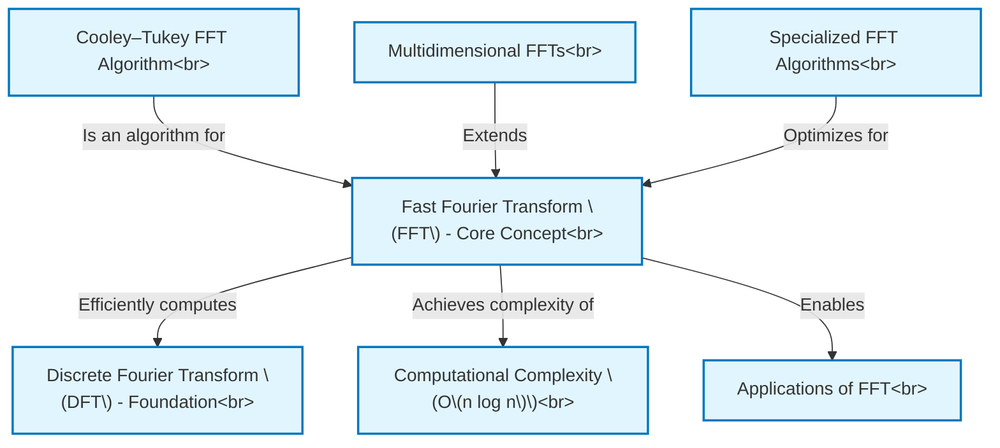

# Tutorial: tmp4anpk_vy

This project explains the **Fast Fourier Transform (FFT)**, which is a highly *efficient algorithm* for calculating the **Discrete Fourier Transform (DFT)**.
The DFT converts a signal, like an audio wave or an image, from its original domain (e.g., time or space) into its constituent *frequency components*.
The FFT achieves this much faster (O(n log n) complexity) than a direct DFT (O(n²) complexity), making it practical for many **applications** in signal processing, image analysis, and scientific computing.
The project also covers common FFT algorithms like **Cooley-Tukey**, its **computational complexity**, **multidimensional FFTs**, and **specialized FFTs**.

**Source Repository:** [None](None)

## Chapters

1. [Discrete Fourier Transform (DFT) - Foundation
](01_discrete_fourier_transform__dft____foundation_.md)
2. [Fast Fourier Transform (FFT) - Core Concept
](02_fast_fourier_transform__fft____core_concept_.md)
3. [Computational Complexity (O(n log n))
](03_computational_complexity__o_n_log_n___.md)
4. [Applications of FFT
](04_applications_of_fft_.md)
5. [Cooley–Tukey FFT Algorithm
](05_cooley_tukey_fft_algorithm_.md)
6. [Multidimensional FFTs
](06_multidimensional_ffts_.md)
7. [Specialized FFT Algorithms
](07_specialized_fft_algorithms_.md)

---

Generated by [AI Codebase Knowledge Builder](https://github.com/The-Pocket/Tutorial-Codebase-Knowledge)