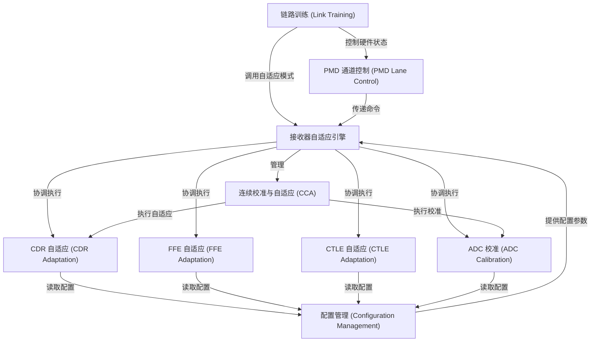

# Tutorial: hw

该项目是一个高速 SerDes（串行器/解串器）接收器的**固件** (firmware)。其核心是一个*接收器自适应引擎*，如同乐队指挥，协调 **CDR**（时钟数据恢复）、**FFE**（前馈均衡）、**CTLE**（连续时间线性均衡）等不同部分的自适应算法，以优化接收信号的质量，确保数据能稳定可靠地恢复。项目还实现了建立稳定连接的*链路训练*过程，修正硬件误差的*ADC 校准*，以及在设备正常运行时进行微调以补偿环境变化的*连续校准与自适应* (CCA) 功能。**配置管理**和**PMD 通道控制**则负责管理系统设置和物理层硬件状态。

**Source Repository:** [None](None)

## Chapters

1. [接收器自适应引擎
](01_接收器自适应引擎_.md)
2. [配置管理 (Configuration Management)
](02_配置管理__configuration_management__.md)
3. [链路训练 (Link Training)
](03_链路训练__link_training__.md)
4. [CDR 自适应 (CDR Adaptation)
](04_cdr_自适应__cdr_adaptation__.md)
5. [FFE 自适应 (FFE Adaptation)
](05_ffe_自适应__ffe_adaptation__.md)
6. [CTLE 自适应 (CTLE Adaptation)
](06_ctle_自适应__ctle_adaptation__.md)
7. [ADC 校准 (ADC Calibration)
](07_adc_校准__adc_calibration__.md)
8. [连续校准与自适应 (CCA)
](08_连续校准与自适应__cca__.md)
9. [PMD 通道控制 (PMD Lane Control)
](09_pmd_通道控制__pmd_lane_control__.md)

---

Generated by [AI Codebase Knowledge Builder](https://github.com/The-Pocket/Tutorial-Codebase-Knowledge)