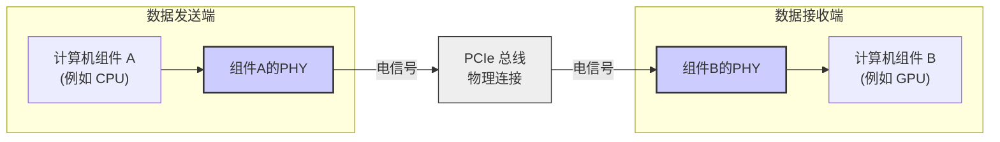
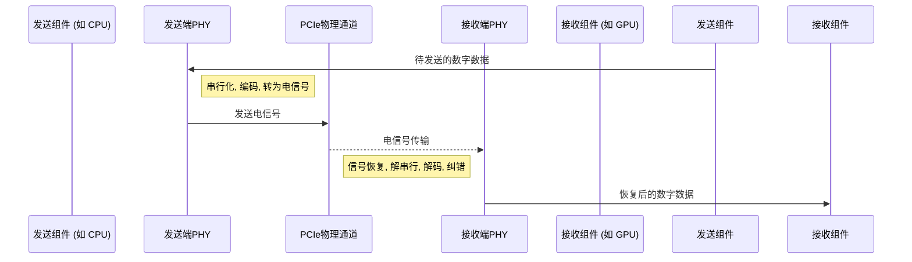

# Chapter 1: PHY (物理层接口)

欢迎来到 `instllation_quick_reference` 系列教程！在本章中，我们将一起探索一个非常重要的概念：PHY，即物理层接口。这听起来可能有点技术性，但别担心，我们会用最简单易懂的方式来解释它。

## 为什么我们需要了解 PHY？

想象一下，你的电脑里有许多辛勤工作的部件：CPU（中央处理器，大脑）、GPU（图形处理器，负责显示酷炫画面）、SSD（固态硬盘，存储游戏和文件的地方）。它们都需要非常快速地交换大量信息。例如，当你启动一个大型游戏时：

1.  游戏文件存储在 SSD 上。
2.  CPU 需要告诉 SSD 读取这些文件。
3.  SSD 读取数据后，需要将数据发送给 GPU，这样 GPU 才能把游戏画面渲染出来。

这个过程中，数据需要在不同部件之间飞速穿梭。如果这个传输过程很慢，你就会遇到游戏加载缓慢、画面卡顿等问题。

那么，如何确保这些数据能够快速、可靠地传输呢？这就是 PHY 发挥作用的地方！

**PHY (物理层接口)**，特别是我们这里讨论的 **PCI Express (PCIe) 5.0 PHY (专为TSMC 6FF工艺设计)**，可以被理解为计算机内部件间数据高速公路的“收费站和匝道”。它负责管理和确保数据流能够快速、可靠地在这些部件之间传输。

## PHY 到底是什么？

让我们把“PHY (物理层接口)”这个词拆解开来理解：

*   **P - Physical (物理层)**：
    在计算机网络和通信中，“层”是一个常见的概念，它指的是处理不同任务的不同级别。物理层是最底层，直接处理实际的物理连接——比如电线、光纤，以及如何在这些媒介上传输原始的比特流（0和1）。
    *   **打个比方**：如果数据传输是一条高速公路，那么物理层就是这条公路的路面本身、铺设路面的材料、交通信号灯的电线等等这些最基础的物理设施。

*   **HY - Interface (接口)**：
    接口就是两个不同系统或组件进行连接和交互的点。它定义了如何发送和接收信号。
    *   **打个比方**：高速公路的“匝道”和“收费站”就是接口。它们连接着地方道路（计算机组件）和高速公路主干道（数据总线），并规定了车辆（数据）如何进出。

所以，**PHY (物理层接口)** 就是一个专门负责将数字数据转换成能在物理介质（如电路板上的铜线）上传输的电信号，或者反过来，将接收到的电信号转换回数字数据的硬件模块。

在我们这个教程中，我们关注的是一种特定的PHY：
*   **PCI Express (PCIe) 5.0 PHY**：
    *   **PCI Express (PCIe)**：这是一种广泛使用的高速串行计算机扩展总线标准。你可以把它想象成一种非常先进和快速的“高速公路系统规范”。
    *   **5.0**：这是 PCIe 标准的第五代版本，意味着它比之前的版本速度更快，带宽更大。就像高速公路升级到了更宽、限速更高的级别。
    *   我们讨论的这个 PHY 可能还会有类似 `x4` 这样的标识，比如 "PCIe 5 PHY x4"。这里的 "x4" 表示它有4条数据通道 (lanes)。通道越多，一次可以传输的数据就越多，就像高速公路有更多车道一样。
*   **专为 TSMC 6FF 工艺设计**：
    *   **TSMC**：台积电，全球领先的半导体制造公司。
    *   **6FF 工艺**：这是台积电提供的一种先进的芯片制造技术。可以理解为用来建造这些“收费站和匝道”的特定、高质量的材料和施工工艺，确保它们非常高效和可靠。

**核心作用**：PHY 的核心任务是确保数据在物理层面能够正确、快速、可靠地发送和接收。它处理诸如信号的产生、调制、发送、接收、解调以及纠错等底层细节。

上图展示了数据是如何通过PHY在两个计算机组件之间流动的。组件A（比如CPU）想要发送数据给组件B（比如GPU）。数据首先经过组件A的PHY，被转换成适合在PCIe总线上传输的电信号。这些电信号通过物理连接（PCIe总线）到达组件B的PHY，在这里它们被转换回组件B可以理解的数字数据。

## PHY 如何解决我们的“游戏加载”问题？

回到我们之前那个加载游戏的例子：

1.  **CPU 请求数据**：CPU 想要从 SSD 获取游戏数据。
2.  **SSD 准备数据**：SSD 内部的控制器准备好数据。
3.  **SSD 的 PHY 发送数据**：SSD 上的 PHY 将这些数字游戏数据转换成电信号，通过 PCIe 通道发送出去。这个 PHY 确保信号足够强劲，并且以正确的速率发送。
4.  **数据在 PCIe 总线上传输**：这些电信号在主板上的 PCIe 通道（物理线路）中飞速传播。
5.  **GPU 的 PHY 接收数据**：GPU 上的 PHY 捕获这些电信号。它会进行信号的清理、放大（如果需要的话），然后将它们转换回 GPU 可以理解的数字数据。它还会检查数据在传输过程中是否出错。
6.  **GPU 处理数据**：GPU 拿到数据后，开始渲染游戏画面。

在这个过程中，SSD 的 PHY 和 GPU 的 PHY 就像是两个高效的“数据搬运工”和“翻译官”，它们默默地完成了最底层的、但至关重要的信号转换和传输工作。没有它们，CPU、GPU 和 SSD 之间的高速通信就无从谈起。

## PHY 的内部是如何工作的？（概览）

你可能不会直接编写代码来控制 PHY 的每一个细微操作，因为 PHY 通常是以一个高度优化和测试过的硬件IP（Intellectual Property，知识产权）核的形式提供的。比如我们文档中提到的 `Synopsys DesignWare PHY` 就是这样一个 IP 核。开发者通常是将这个 IP 核集成到自己的芯片设计中。

尽管如此，了解一下 PHY 内部大致发生了什么还是很有帮助的：

1.  **数据准备发送**：一个组件（如CPU）准备好一串数字数据（0和1）要发送。
2.  **PHY 串行化 (Serialization)**：如果数据是并行进来的（比如一次进来8位或16位），PHY 内部的串行器 (Serializer) 会把它们转换成一长串单个的比特流，这样才能在单条或少数几条高速通道上传输。
3.  **编码 (Encoding)**：为了确保信号的可靠性（例如，避免出现太长的连续0或连续1，这可能导致时钟恢复困难），数据会被编码成特定的格式。
4.  **电信号转换**：编码后的比特流被转换成精确控制的电压或电流变化，即电信号。
5.  **通过物理介质传输**：这些电信号通过电路板上的铜走线（PCIe通道）传输到接收端。
6.  **接收端 PHY 的工作**：
    *   **信号恢复与放大**：接收端 PHY 首先捕获这些可能已经衰减或带有噪声的电信号，并尝试恢复它们。
    *   **时钟数据恢复 (CDR)**：从接收到的信号中提取出时钟信息，以便正确地采样数据。
    *   **解串行 (Deserialization)**：将串行的比特流转换回并行的数字数据。
    *   **解码 (Decoding)**：进行与发送端相反的解码操作。
    *   **错误检测与纠正**：检查数据在传输过程中是否出错，并尽可能纠正。
7.  **数据传递给目标组件**：干净、正确的数字数据被传递给接收组件（如GPU）。

下面是一个简化的序列图，展示了这个过程：

我们使用的 `DesignWare PHY` 是一个预先设计和验证好的模块。在后续章节中，你将学习如何[下载](03_phy_下载_.md)和[安装](04_phy_安装_.md)这个PHY模块，以便在你的项目中使用它。这些PHY模块的详细技术规格通常可以在其《数据手册》(Databook) 中找到，例如本教程参考的 `PCIe 5 PHY x4 for TSMC 6FF Databook`。

## 总结

在本章中，我们初步认识了 PHY（物理层接口）。我们了解到：

*   PHY 是计算机内部件间高速数据传输的关键，就像数据高速公路的“收费站和匝道”。
*   它工作在物理层，负责数字信号和电信号之间的转换。
*   我们讨论的特定 PHY 是 PCIe 5.0 PHY，专为高性能的 TSMC 6FF 工艺设计，用于实现极高的数据传输速率。
*   虽然我们不直接编写 PHY 的内部代码，但理解其功能对于有效地集成和使用这类 IP 核至关重要。

希望现在你对 PHY 有了一个基本的概念。它是我们后续进行下载、安装和配置工作的基础。

在下一章中，我们将讨论在开始下载和安装 PHY 之前，你需要满足哪些[先决条件](02_先决条件_.md)。

---

Generated by [AI Codebase Knowledge Builder](https://github.com/The-Pocket/Tutorial-Codebase-Knowledge)