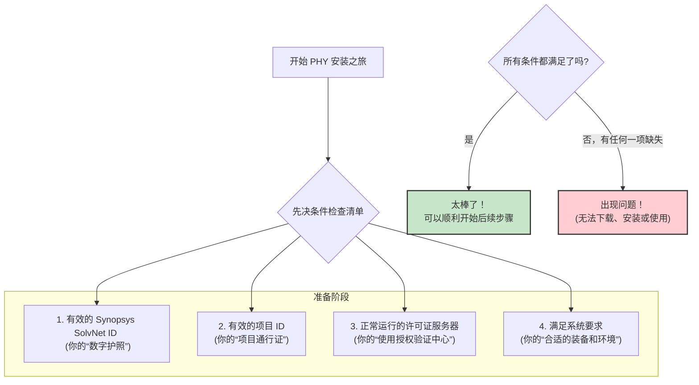

# Chapter 2: 先决条件

在上一章 [PHY (物理层接口)](01_phy__物理层接口__.md) 中，我们一起认识了什么是 PHY，以及它在计算机系统中扮演的重要角色，就像是数据高速公路的“收费站和匝道”。我们了解到，一个高性能的 PHY 对于确保数据快速、可靠地传输至关重要。

现在，你可能已经迫不及待地想知道如何获取并安装这样一个强大的 PHY 模块了。但在我们开始下载和安装之前，就像任何重要的任务或旅行一样，我们需要做好充分的准备。这一章，我们就来详细讨论这些“先决条件”。

## 为什么“先决条件”如此重要？

想象一下，你计划去一个遥远而美丽的国家旅行。在出发之前，你必须确保拥有有效的护照、目的国签发的签证，以及足够的旅行经费。如果缺少其中任何一项，你的整个旅行计划可能都会泡汤，甚至无法离开国门。

同样地，在开始下载和安装我们所需的 PHY (例如，Synopsys 的 PCIe 5.0 PHY for TSMC 6FF) 之前，也有一系列基础要求必须得到满足。这些就是所谓的“先决条件”。如果这些条件不具备，后续的下载和安装过程将无法顺利进行，甚至可能根本无法开始。

满足这些先决条件，可以确保：
*   你有权访问和下载相关的 PHY 文件。
*   你下载的 PHY 适用于你的特定项目。
*   安装完成后，PHY 相关的软件工具能够正常运行。

简单来说，**先决条件是成功安装和使用 PHY 的基石。**

## 核心先决条件清单

根据通常的行业实践以及我们参考的 `instllation_quick_reference.pdf` 文档（具体请参照你获取IP时的附带文档），安装和使用 Synopsys PHY 通常需要满足以下核心先决条件：

1.  **有效的 Synopsys SolvNet ID (一个有效的 Synopsys SolvNet 账号)**
2.  **有效的项目 ID (一个有效的项目识别码)**
3.  **正常运行的许可证服务器 (一个包含有效许可证且正常运行的许可证服务器)**
4.  **满足系统要求 (确保你的工作环境满足指定的系统配置要求)**

让我们用一个图来形象地表示这个准备过程：

现在，我们来逐一详细了解这些先决条件。

### 1. 有效的 Synopsys SolvNet ID

*   **它是什么？**
    Synopsys SolvNetPlus (通常简称 SolvNet) 是 Synopsys 公司为其客户提供的一个在线支持和资源门户。你的 SolvNet ID 就是登录这个门户的个人账户凭证（用户名和密码）。
*   **为什么需要它？**
    这个 ID 是你获取 Synopsys IP (知识产权，比如我们的 PHY)、技术文档、软件更新和在线支持的“钥匙”。没有它，你将无法从官方渠道（例如 `www.designware.com` 或 `mydesignware.com`，这些通常在购买IP后的邮件或文档中指定）下载 PHY 的安装文件。
*   **如何获取/检查？**
    *   通常，如果你的公司或机构购买了 Synopsys 的产品或服务，相关负责人会为你或你的团队申请 SolvNet ID。
    *   如果你不确定，可以咨询你的项目经理或IT部门。
    *   新的用户注册通常可以通过 SolvNet 网站进行，例如 `instllation_quick_reference.pdf` 中提到的 `https://solvnet.synopsys.com/ProcessRegistration`。
*   **把它想象成**：进入一个专属会员俱乐部的会员卡，或者你进行国际旅行时必须出示的**有效护照**。

### 2. 有效的项目 ID (Project ID)

*   **它是什么？**
    项目 ID 是一个特定的识别码，用于关联一个特定的设计项目和所授权使用的 Synopsys IP。
*   **为什么需要它？**
    Synopsys 的 IP 通常是针对特定项目授权的。这个项目 ID 确保了你下载和安装的 PHY 版本是为你的项目所授权的，并且也便于 Synopsys 和你的公司进行 IP 使用的跟踪和管理。在安装过程中，如 `instllation_quick_reference.pdf` 所示，系统可能会提示你输入项目 ID：`Enter the project ID to install the PHY.`。
*   **如何获取/检查？**
    项目 ID 通常由你的公司在启动一个使用 Synopsys IP 的新项目时分配和提供。你需要从你的项目经理或团队负责人那里获取这个 ID。
*   **把它想象成**：针对特定旅行目的地（你的项目）签发的**有效签证**，它证明了你有权进入并使用特定资源。

### 3. 正常运行的许可证服务器

*   **它是什么？**
    许多商业软件，包括 Synopsys 的设计工具和 IP，都使用许可证管理系统来控制软件的使用。许可证服务器是一台在你的公司网络中运行的计算机，它管理着可用的软件许可证。当你要安装或运行受许可证保护的软件时，你的计算机需要连接到这个服务器以获取授权。
*   **为什么需要它？**
    PHY 的某些组件（例如用于仿真验证的工具或模型）可能需要有效的许可证才能运行。即使你成功下载并安装了 PHY 文件，如果没有配置正确的许可证服务器信息，或者服务器上没有对应 PHY 的有效许可证，你可能无法使用其全部功能。
    `instllation_quick_reference.pdf` 中的 "Key Commands" 部分展示了如何设置环境变量 (如 `SNPSLMD_LICENSE_FILE` 和 `LM_LICENSE_FILE`) 指向许可证服务器，格式通常是 `port@host` (端口号@服务器主机名)。
*   **如何获取/检查？**
    *   你的公司 IT 部门或专门负责 EDA (电子设计自动化) 工具管理的团队会维护许可证服务器，并提供连接所需的 `port@host` 信息。
    *   你需要确保你的工作环境（通常是 UNIX/Linux 服务器）能够访问到这个许可证服务器，并且服务器上有你项目所需的 PHY 许可证。
    *   `instllation_quick_reference.pdf` 中也提到了验证许可证设置的命令，例如 `lmstat -a -c port@host`。
*   **把它想象成**：旅行前需要确认你有**充足的旅费并通过了银行的授权**，确保你在目的地可以进行消费和服务。

### 4. 满足系统要求

*   **它是什么？**
    这指的是你的工作计算机或服务器需要满足 PHY 软件包及其相关工具运行所需的最低硬件和软件配置。这可能包括特定的操作系统版本、足够的内存 (RAM)、硬盘空间，以及可能需要的其他辅助软件。
*   **为什么需要它？**
    如果系统不满足要求，PHY 软件包可能无法正确安装，或者安装后运行不稳定、出错，甚至根本无法运行。
*   **如何获取/检查？**
    *   这些要求通常在 PHY 的发行说明 (Release Notes)、数据手册 (Databook)、自述文件 (Readme files) 或安装指南中详细列出。这些文档通常与 PHY 软件包一同提供，或者可以在 SolvNet 上找到。
    *   `instllation_quick_reference.pdf` 提示可以在 Synopsys 支持页面 (`https://www.synopsys.com/support.html`) 查找支持的平台信息，并且相关文档（Readme, Databooks）会随产品一同打包，通常位于安装目录下的 `doc/` 文件夹中。
*   **把它想象成**：在开始一项体育运动前，你需要确保拥有**合适的运动装备和场地条件**，比如打篮球需要篮球鞋和篮球场。

## 如果缺少先决条件会怎样？

未能满足这些先决条件，可能会导致以下一些常见问题：

*   **无法登录下载门户**：没有有效的 SolvNet ID。
*   **下载请求被拒绝**：SolvNet ID 有效，但没有与当前项目关联的有效项目 ID，或者尝试下载未授权的 IP。
*   **安装过程中断或失败**：安装脚本可能需要项目 ID 进行验证，或者在检查许可证时失败。
*   **软件功能受限或无法运行**：PHY 安装成功，但在进行仿真或其他操作时，由于找不到有效的许可证而报错。
*   **工具运行不稳定或兼容性问题**：工作环境不满足指定的系统要求。

因此，在投入时间和精力进行下载和安装之前，花一些时间确认所有先决条件都已齐备，是非常明智和必要的。这会为你节省大量排查问题的时间，并确保后续工作顺利进行。

## 总结

在本章中，我们详细了解了在开始下载和安装 PHY 之前必须满足的各项先决条件。我们知道了为什么这些条件如此重要，它们具体包括：

*   **有效的 Synopsys SolvNet ID**：访问资源的“数字护照”。
*   **有效的项目 ID**：特定项目的“通行证”。
*   **正常运行的许可证服务器**：软件使用的“授权验证中心”。
*   **满足系统要求**：确保工作环境符合“装备和场地”标准。

就像一次精心策划的旅行一样，充分的行前准备是成功的一半。确保这些先决条件都已就绪，将为我们后续的 PHY 下载、安装和使用铺平道路。

现在我们已经知道了需要准备些什么，在下一章中，我们将学习如何进行 [PHY 下载](03_phy_下载_.md)。

---

Generated by [AI Codebase Knowledge Builder](https://github.com/The-Pocket/Tutorial-Codebase-Knowledge)