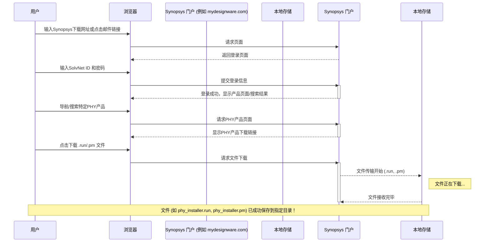

# Chapter 3: PHY 下载

在上一章 [先决条件](02_先决条件_.md) 中，我们详细讨论了在开始获取和安装 PHY 之前需要满足的各项准备工作，包括有效的 Synopsys SolvNet ID、项目ID、正常的许可证服务器以及满足系统要求。这些就像是开启一段旅程前的“护照”、“签证”和“行囊”。现在，既然我们的准备工作已经就绪，是时候迈出获取 PHY 的第一步了——下载安装文件！

## 为什么要“下载”PHY？这步是做什么的？

想象一下，你想在你的智能手机上安装一个新的应用程序，比如一个酷炫的游戏或者一个实用的工具。你会怎么做？你通常会打开手机上的“应用商店”，搜索你想要的应用程序，然后点击“下载”按钮。下载完成后，你手机里就有了一个安装包，之后你才能进行安装和使用。

PHY 的下载过程与此非常相似。我们需要的 PHY (例如 Synopsys 的 PCIe 5.0 PHY for TSMC 6FF) 并非凭空出现，它是由 Synopsys 这样的专业公司设计和提供的知识产权 (IP) 产品。为了在我们的项目中使用这个 PHY，我们首先需要从 Synopsys 的官方渠道获取它的“安装包”。

**本章的核心目的**：指导你如何从 Synopsys 指定的官方网站（例如 `mydesignware.com` 或 `www.designware.com`，具体地址通常在你购买IP后收到的邮件通知中会有链接）安全地获取 PHY 的安装文件。这些文件通常是 `.run` 格式的可执行安装包，有时还会附带 `.pm` 文件。

**这为什么重要？**
*   **获取正版软件**：从官方渠道下载能确保你获得的是正版、未经篡改的原始文件，就像从官方应用商店下载应用一样，安全可靠。
*   **安装的基础**：没有这些下载下来的文件，后续的[PHY 安装](04_phy_安装_.md)步骤就无从谈起。它们是安装过程的“原材料”。

把这个过程想象成：你已经办好了去“PHY乐园”的门票（满足了先决条件），现在你要去乐园的官方售票处领取你的入园凭证和地图（下载PHY安装文件）。

## PHY 下载步骤详解

根据 `instllation_quick_reference.pdf` 中的指引以及通常的操作流程，下载 PHY 文件主要包含以下几个步骤：

让我们一步步来看：

### 1. 访问 Synopsys 下载门户

*   **从哪里进入？**
    *   最常见的方式是通过 Synopsys 发送给你的**邮件通知中的链接**。当你所在的公司购买了 PHY IP 后，通常会收到一封包含产品信息和下载链接的邮件。
    *   你也可以直接访问 Synopsys 的 DesignWare 网站，例如 `www.designware.com` 或 `mydesignware.com`。
*   **需要什么？**
    *   在这里，你在上一章 [先决条件](02_先决条件_.md) 中准备好的 **Synopsys SolvNet ID (用户名和密码)** 就要派上用场了。你需要用它来登录这些网站。

    **打个比方**：这就像你知道了某个在线商店的网址 (`www.designware.com`)，然后用你的会员账户 (SolvNet ID) 登录进去。

### 2. 登录并查找你的 PHY 产品

*   **登录**：在下载门户网站上，找到登录入口，输入你的 SolvNet ID 和密码。
*   **查找产品**：
    *   登录成功后，你需要找到你项目所需的特定 PHY 产品。例如，我们教程中关注的可能是 "PCIe 5 PHY x4 for TSMC 6FF"。
    *   你可以使用网站提供的搜索功能，输入产品名称或相关关键词。
    *   有时，邮件中的链接会直接将你导向到你所购买产品的专属页面。
    *   在某些情况下，系统可能会要求你提供在[先决条件](02_先决条件_.md)中提到的**项目ID (Project ID)**，以验证你是否有权下载该特定版本的IP。

    **打个比方**：登录在线商店后，你会在琳琅满目的商品中搜索你具体想要的某一款手机型号（你的PHY产品）。

### 3. 下载指定的安装文件

*   **找到下载链接**：在你的PHY产品页面上，你会找到下载安装文件的链接。
*   **主要文件类型**：
    *   **`.run` 文件**：这是最主要的安装文件。它通常是一个自解压的可执行脚本，包含了PHY的核心组件和安装逻辑。例如 `DW_pcie_phy_tsmc6ff_c5_x4_2.01a.run` (文件名仅为示例)。
    *   **`.pm` 文件**：有时，除了 `.run` 文件，可能还会有同名的 `.pm` 文件 (例如 `DW_pcie_phy_tsmc6ff_c5_x4_2.01a.pm`)。这通常是产品清单文件 (Product Manifest) 或包模块文件，包含了关于软件包的额外信息或依赖关系。**如果提供了 `.pm` 文件，你需要将它和对应的 `.run` 文件下载到同一个目录下。**

    **打个比方**：你找到了心仪的手机，现在点击“下载购买凭证和说明书”。`.run` 文件就像是主要的“商品本身（压缩包装）”，而 `.pm` 文件（如果存在）就像是“配件清单或重要说明”，两者需要一起保管。

    `instllation_quick_reference.pdf` 中明确指出：
    > b. On the product component page, download the image files: .run file and .pm files (if applicable) on to the same directory

    这意味着，如果产品页面同时提供了 `.run` 和 `.pm` 文件，务必将它们都下载下来，并确保它们位于**同一个文件夹**中。

### 4. 保存文件到指定位置

*   **保存在哪里？**
    *   建议在你的工作服务器（通常是 UNIX 或 Linux 系统，因为后续安装步骤常在这些系统上进行）上创建一个专门的目录来存放这些下载的文件。例如，你可以创建一个名为 `phy_downloads` 或 `synopsys_phy_installers` 的文件夹。
    *   **关键点**：再次强调，如果同时下载了 `.run` 文件和 `.pm` 文件，请确保它们被保存在这个**相同的目录**下。

    **打个比方**：你把下载的手机安装包和说明书一起放进一个专门的抽屉里，方便后续查找和使用。

## 下载过程交互示意图

为了更直观地理解整个下载过程，我们可以用一个简单的序列图来表示用户与 Synopsys 下载门户之间的交互：

这个图展示了从用户开始访问网站，到登录，再到找到并下载所需文件的整个流程。

## 关于下载文件的几点提示

*   **网络稳定性**：下载这些文件可能需要一些时间，特别是如果文件较大或者你的网络连接速度一般。请确保在一个网络连接相对稳定的环境中进行下载，以避免下载中断或文件损坏。
*   **文件完整性**：从官方渠道下载可以最大程度保证文件的完整性和安全性。避免从非官方或不可信的来源获取这些安装文件。
*   **遇到问题怎么办？**
    *   如果无法登录，请检查你的 SolvNet ID 和密码是否正确，以及账户是否有效。
    *   如果找不到特定的PHY产品，确认你的产品名称是否准确，或者你的账户是否有权限访问该产品（可能与项目ID关联）。
    *   很多时候，下载页面或产品文档中会有相关的说明或FAQ，可以查阅。如果问题依然存在，可以联系Synopsys的技术支持（参考[支持与文档资源](07_支持与文档资源_.md)章节）。

## 总结

恭喜你！在本章中，我们一起学习了如何从 Synopsys 官方渠道下载 PHY 的安装文件。我们了解到：

*   下载 PHY 文件是获取正版、可用软件的第一步，就像从官方应用商店下载软件安装包。
*   主要的下载步骤包括：访问下载门户、登录并查找产品、下载 `.run` 和可能的 `.pm` 文件。
*   非常重要的一点是，如果存在 `.pm` 文件，需要将其与 `.run` 文件下载到**同一目录**下。
*   这些下载下来的文件是我们进行下一步安装操作的基础。

现在，你的“原材料”已经准备就绪，存放在了你的服务器上。接下来，我们将学习如何使用这些文件来真正地把 PHY 安装到你的系统中。

在下一章 [PHY 安装](04_phy_安装_.md) 中，我们将详细介绍如何执行下载的 `.run` 文件，完成 PHY 的安装过程。

---

Generated by [AI Codebase Knowledge Builder](https://github.com/The-Pocket/Tutorial-Codebase-Knowledge)