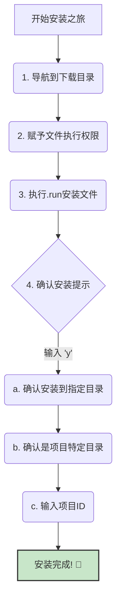
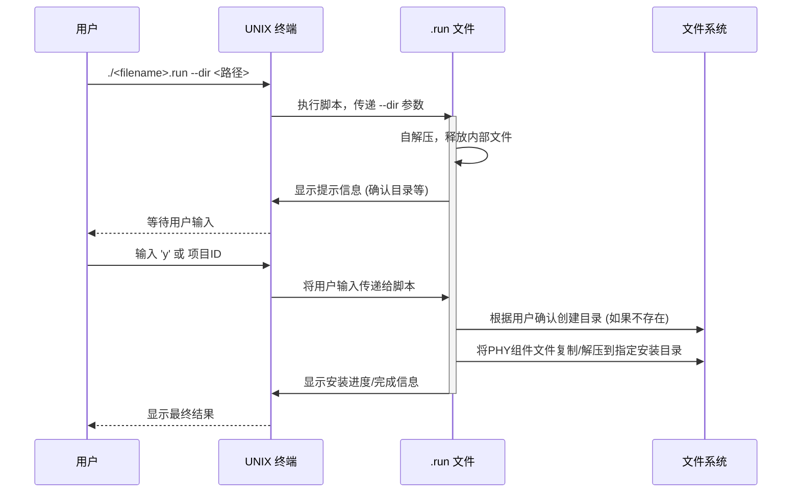

# Chapter 4: PHY 安装


欢迎来到 `instllation_quick_reference` 教程的第四章！在上一章 [PHY 下载](03_phy_下载_.md) 中，我们学习了如何从 Synopsys 官方渠道获取 PHY 的安装文件（`.run` 文件以及可能的 `.pm` 文件），并将它们妥善地保存在我们的服务器上。这些文件就像是制作精美模型的零件包，已经安全送达你的手中。

现在，是时候打开这些“零件包”，按照“组装图纸”一步步将我们的 PHY 模型搭建起来了。本章将详细指导你如何在 UNIX 服务器上安装 PHY，这个过程就像是按照一份精密的组装图纸来搭建复杂的乐高模型，每一步都需要仔细操作以确保最终 PHY 能够正确部署和工作。

## 为什么需要“安装”PHY？下载了还不够吗？

你可能会问，既然我们已经下载了 `.run` 文件，为什么还需要一个单独的“安装”步骤呢？

想象一下，你从网上下载了一个大型软件的压缩包（比如一个游戏或者一个专业的办公软件）。这个压缩包本身并不能直接运行，它里面包含了成百上千个文件和文件夹，需要按照特定的结构组织起来，并且可能还需要根据你的系统环境进行一些配置。

PHY 的 `.run` 文件就类似于这样一个“压缩包”或“安装向导”。它不仅仅是一个文件，更是一个包含了所有必要组件和安装逻辑的可执行程序。**安装过程的核心目的就是**：

1.  **解压和组织文件**：将 `.run` 文件中包含的 PHY 组件（如设计文件、仿真模型、文档等）解压出来，并按照预设的目录结构放置到你指定的安装位置。
2.  **环境配置（初步）**：安装脚本可能会进行一些初步的环境检查，并引导你确认关键信息，例如安装路径和项目ID。
3.  **使其可用**：最终目标是让 PHY 的各个部分在你的系统中处于“准备就绪”的状态，以便后续的[许可证配置与验证](05_许可证配置与验证_.md)和[仿真运行](06_仿真运行_.md)。

简单来说，下载只是把“乐高积木盒”买回家，而安装则是“打开盒子，按照说明书把积木拼装成型”的过程。没有安装，下载的文件只是一堆数据，无法发挥其应有的作用。

## PHY 安装步骤详解

根据 `instllation_quick_reference.pdf` 中的指引，在UNIX服务器上安装PHY的主要步骤如下：



让我们一步步详细分解这些操作：

### 1. 导航到下载目录

首先，你需要打开一个UNIX终端或命令行界面，并切换到你在上一章 [PHY 下载](03_phy_下载_.md) 中保存 `.run` 和 `.pm` 文件的那个目录。

假设你将文件下载到了 `/home/user/phy_downloads` 目录下，你可以使用 `cd` (change directory) 命令：

```bash
cd /home/user/phy_downloads
```

这条命令会把你当前的工作目录更改为 `/home/user/phy_downloads`。你可以使用 `ls` 命令查看当前目录下的文件，确保你的 `.run` 文件（例如 `DW_pcie_phy_tsmc6ff_c5_x4_2.01a.run`）和可能的 `.pm` 文件（例如 `DW_pcie_phy_tsmc6ff_c5_x4_2.01a.pm`）都在这里。

**打个比方**：这就像你走到了存放乐高积木盒的桌子旁边，准备开始动手。

### 2. 赋予文件执行权限

在UNIX/Linux系统中，文件默认可能没有执行权限。为了能够运行 `.run` 安装脚本，你需要给它（以及 `.pm` 文件，如果存在）添加执行权限。这通过 `chmod` (change mode) 命令完成。

`instllation_quick_reference.pdf` 建议使用 `chmod 555`：

```bash
chmod 555 DW_pcie_phy_tsmc6ff_c5_x4_2.01a.run
# 如果存在 .pm 文件，也给它同样的权限
# chmod 555 DW_pcie_phy_tsmc6ff_c5_x4_2.01a.pm
```

*   `chmod` 是修改文件权限的命令。
*   `555` 是一种权限设置，表示文件的所有者、所属组以及其他用户都拥有读取和执行该文件的权限，但没有写入权限。这对于安装脚本来说是安全的。
*   `DW_pcie_phy_tsmc6ff_c5_x4_2.01a.run` 是你的PHY安装文件名（请替换成你实际下载的文件名）。

**打个比方**：这就像是给你的“电动螺丝刀”（安装脚本）装上电池，让它能够工作。

### 3. 执行 `.run` 安装文件

现在，万事俱备，可以开始执行安装脚本了。执行时，你需要使用 `--dir` 选项来指定你希望将PHY安装到哪个目录下。

```bash
./DW_pcie_phy_tsmc6ff_c5_x4_2.01a.run --dir /opt/synopsys_phy/my_project_phy_v2.01a
```

让我们解析一下这个命令：
*   `./`：表示执行当前目录下的文件。
*   `DW_pcie_phy_tsmc6ff_c5_x4_2.01a.run`：你的PHY安装脚本文件名。
*   `--dir`：这是一个非常重要的参数，它告诉安装脚本将PHY文件解压和安装到哪里。
*   `/opt/synopsys_phy/my_project_phy_v2.01a`：这是你指定的安装目录。**强烈建议**：
    *   选择一个专门用于存放 Synopsys IP 或项目相关文件的清晰路径。
    *   在路径中包含PHY的名称、版本和项目信息，以便日后管理。
    *   确保你对这个指定的安装目录有写入权限。如果目录不存在，安装脚本通常会自动创建它。

**打个比方**：你按下了电动螺丝刀的启动按钮，并告诉它“请把这些零件安装在书架的第三层（指定的安装目录）”。

### 4. 根据提示确认安装信息

执行上述命令后，安装脚本会启动，并开始与你交互，要求确认一些信息。

#### a. 确认安装到指定目录

脚本通常会显示你通过 `--dir` 参数指定的安装目录，并询问你是否确认安装到该位置。

```text
You are installing to directory: /opt/synopsys_phy/my_project_phy_v2.01a
Is this correct? [y/n]:
```

你需要输入 `y` (代表 yes) 并按回车键确认。

```text
You are installing to directory: /opt/synopsys_phy/my_project_phy_v2.01a
Is this correct? [y/n]: y  <-- 用户输入 'y'
```

#### b. 确认是项目特定目录

接下来，脚本可能会询问你确认这个安装目录是否是项目特定的。这有助于避免不同项目之间的IP版本混淆。

```text
Is this a project-specific directory? [y/n]:
```

通常情况下，为了良好的项目管理，建议为每个项目或每个特定版本的PHY使用独立的安装目录。所以，这里也输入 `y` 并按回车。

```text
Is this a project-specific directory? [y/n]: y  <-- 用户输入 'y'
```

#### c. 输入项目 ID

最后，安装脚本会要求你输入在 [先决条件](02_先决条件_.md) 中提到的**项目 ID (Project ID)**。

```text
Enter the project ID to install the PHY:
```

你需要准确输入你的项目ID，然后按回车。假设你的项目ID是 `PROJ12345`：

```text
Enter the project ID to install the PHY: PROJ12345  <-- 用户输入项目ID
```

**重要提示**：项目ID的正确性至关重要，它关系到IP授权和合规性。请务必从你的项目经理或相关负责人处获取准确的项目ID。

完成这些确认步骤后，安装脚本就会开始实际的文件解压和部署过程。屏幕上通常会显示一些进度信息。整个过程可能需要几分钟，具体取决于PHY的大小和服务器性能。

当看到类似 "Installation completed successfully." 或类似提示时，就表示PHY已经成功安装到你指定的目录了！

**打个比方**：在组装乐高时，说明书会问你：“确定要把这个部件装在这里吗？”（确认目录），“这个模型是给这个展示柜专用的吗？”（项目特定目录），“请输入这个模型的唯一序列号”（项目ID）。你一一确认后，就可以开始拼装了。

## 安装过程背后发生了什么？（简要了解）

当你运行 `.run` 文件时，背后其实发生了一系列操作。这个 `.run` 文件通常是一个自解压的归档文件，内嵌了一个安装脚本（通常是shell脚本）。



**核心步骤解读**：

1.  **执行与参数传递**：你在终端执行 `./<filename>.run --dir <install_directory>`。操作系统加载并运行这个脚本，并将 `--dir` 后面的路径作为参数传递给脚本。
2.  **自解压**：`.run` 脚本首先可能会将自身携带的压缩数据（真正的PHY文件）解压到内存或一个临时位置。
3.  **用户交互**：脚本通过标准输出在终端上打印提示信息，并通过标准输入读取你的回答（`y`、`n`、项目ID）。
4.  **路径和权限检查**：脚本会检查指定的安装目录是否存在，是否可写等。
5.  **文件部署**：一旦所有检查和用户确认通过，脚本就会将解压出来的PHY组件（如Verilog文件、GDSII文件、文档、仿真脚本等）按照预设的结构复制到你指定的 `<install_directory>` 中。
6.  **记录日志**：许多安装脚本还会生成一个安装日志文件（通常在安装目录下），记录了安装过程中的详细步骤和结果，这对于后续排错很有帮助。`instllation_quick_reference.pdf` 中提到，日志文件会在安装产品或运行仿真时生成。

安装完成后，你可以在你指定的 `<install_directory>` (例如 `/opt/synopsys_phy/my_project_phy_v2.01a`) 下看到类似这样的目录结构 (具体结构可能因PHY版本和类型而异)：

```
<install_directory>/
├── synopsys/
│   └── <product_name>/  (例如 DW_pcie_phy_tsmc6ff_c5_x4)
│       └── <version>/       (例如 2.01a)
│           ├── doc/         # 文档 (Databooks, Release Notes, etc.)
│           ├── phy/         # PHY核心文件 (设计, 仿真模型等)
│           ├── upcs/        # UPCS (Universal PHY Control Subsystem) 相关文件 (如果适用)
│           ├── examples/    # 示例设计
│           └── ...          # 其他相关目录和文件
└── ...
```
`instllation_quick_reference.pdf` 也指出了文档的常见位置：`<install_folder>/synopsys/<product_name>/<version>/doc/`。

## 总结

在本章中，我们详细学习了如何在UNIX服务器上安装PHY。我们知道了安装过程不仅仅是复制文件，更是一个解压、配置和使PHY组件可用的过程。关键步骤包括：

*   导航到下载了 `.run` 和 `.pm` 文件的目录。
*   使用 `chmod` 命令为这些文件赋予执行权限。
*   使用 `./<filename>.run --dir <install_directory>` 命令执行安装脚本，并指定安装路径。
*   根据脚本提示，依次确认安装目录、项目特定目录，并输入正确的项目ID。

现在，你的PHY已经像一个组装完成的精密模型一样，静静地安放在你指定的目录中了。但这只是完成了“硬件”部分的搭建。接下来，我们需要为这个模型“通电”并确保它能正常工作，也就是进行许可证的配置和验证。

在下一章 [许可证配置与验证](05_许可证配置与验证_.md) 中，我们将学习如何设置必要的环境变量，使你的系统能够找到并使用有效的许可证来运行PHY相关的工具和仿真。

---

Generated by [AI Codebase Knowledge Builder](https://github.com/The-Pocket/Tutorial-Codebase-Knowledge)