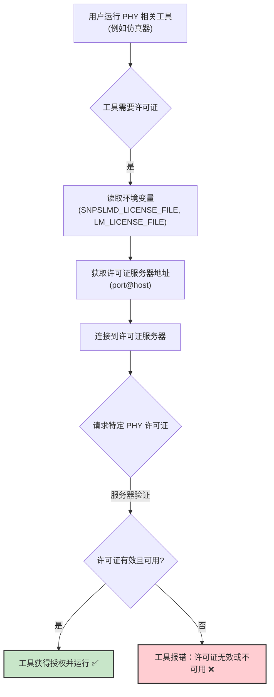
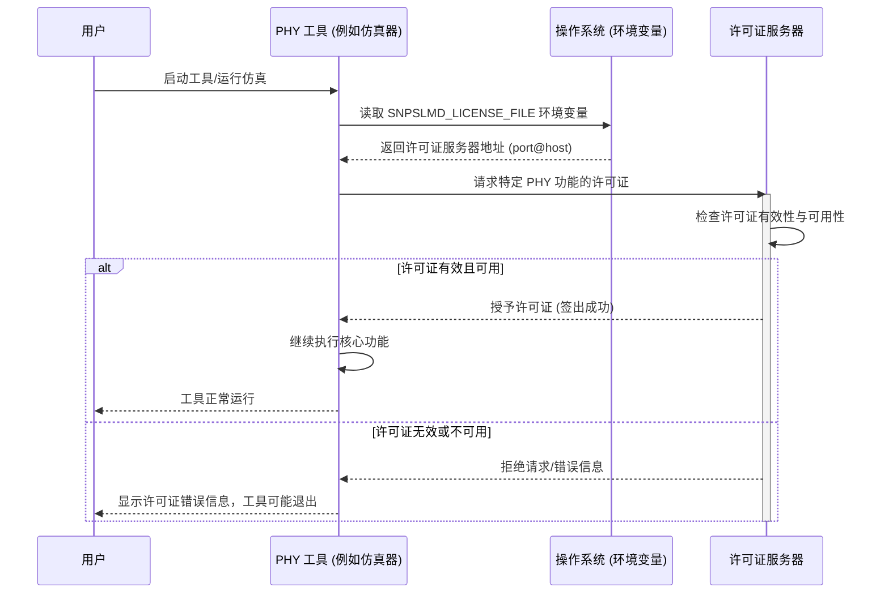

# Chapter 5: 许可证配置与验证


在上一章 [PHY 安装](04_phy_安装_.md) 中，我们成功地将 PHY 的“零件包”按照“组装图纸”安装到了我们的系统中。现在，我们的 PHY 就像一个组装完毕的精密模型，已经准备就绪。但是，要让这个模型真正“活”起来，能够为我们工作（例如进行仿真），我们还需要最后一步关键操作——为它配置并验证“数字钥匙”，也就是许可证。

## 为什么需要许可证配置与验证？

想象一下，你购买了一款非常棒的付费电脑游戏。你已经下载并安装了游戏文件（就像我们安装了PHY）。但是，当你尝试启动游戏时，它可能会弹出一个窗口，要求你输入产品密钥或序列号来激活游戏。没有这个“激活码”，即使游戏安装好了，你也无法玩。

PHY 和许多专业的工程软件（如 Synopsys 的工具）也是如此。它们通常受到许可证的保护，以确保只有授权用户才能使用。**许可证配置与验证**这个环节，就相当于：

1.  **告诉系统去哪里找“激活码”**（配置许可证服务器信息）。
2.  **检查这个“激活码”是否有效并且可用**（验证许可证）。

如果许可证没有正确配置，或者服务器上没有有效的许可证，那么即使 PHY 已经安装，相关的工具（比如用于仿真的工具）也无法运行，你可能会遇到类似“找不到许可证 (License not found)”或“授权失败 (Authorization failed)”的错误。

**本章的核心目的**：指导你如何设置必要的环境变量，让你的系统能够找到正确的许可证服务器，并使用像 `lmstat` 这样的命令来检查你的 PHY 相关许可证是否有效且可用。这是确保 PHY 能够成功运行的关键环节。

## 核心概念解析

在我们开始动手操作之前，先来理解几个核心概念：

1.  **许可证 (License)**：
    *   这就是我们常说的“数字钥匙”或“激活码”。它是一份授权证明，允许你合法使用特定的软件功能或IP（如我们的PHY）。
    *   **打个比方**：就像你进入付费主题公园的门票，或者你公寓的钥匙。

2.  **许可证服务器 (License Server)**：
    *   通常，在一个公司或组织内部，会有一台专门的计算机（服务器）来统一管理和分发这些“数字钥匙”。当你的工具需要许可证时，它会向这台服务器发出请求。
    *   **打个比方**：许可证服务器就像是主题公园的“票务中心”或者公寓楼的“物业管理处”，负责发放和管理钥匙。

3.  **环境变量 (Environment Variables)**：
    *   环境变量是操作系统中一些特殊的“便签条”或“指示牌”。我们可以通过设置这些“便签条”，告诉在本机运行的软件（比如PHY的仿真工具）去哪里寻找许可证服务器。
    *   对于 Synopsys 的产品，两个关键的环境变量是 `SNPSLMD_LICENSE_FILE` 和 `LM_LICENSE_FILE`。它们的值通常是 `端口号@服务器主机名` 的格式。
    *   **打个比方**：如果你想让快递员把包裹送到“票务中心”，你需要在包裹上写清楚“票务中心”的详细地址（服务器主机名）和特定窗口（端口号）。环境变量就是这个写着地址的标签。

4.  **许可证验证 (License Verification)**：
    *   配置好环境变量后，我们还需要确认设置是否正确，以及许可证服务器上是否有我们需要的有效许可证。这通常通过特定的命令（如 `lmstat`）来完成。
    *   **打个比方**：写好地址标签后，你可能需要打个电话给“票务中心”，确认他们是否开门，以及你想要的门票类型是否有存货。



## 如何配置和验证许可证？

现在我们来一步步操作，就像给我们的 PHY 模型“通电”并获取“启动许可”。这些操作通常在你的 UNIX/Linux 终端中进行。

### 1. 设置环境变量

你需要告诉你的系统许可证服务器在哪里。这通过设置 `SNPSLMD_LICENSE_FILE` 和 `LM_LICENSE_FILE` 环境变量来完成。

**重要提示**：你需要从你的公司 IT 部门或 EDA (电子设计自动化) 工具管理员那里获取正确的 `端口号` 和 `服务器主机名`。这些信息对于每个组织都是特定的。

假设你的许可证服务器主机名是 `licenseserver.mycompany.com`，使用的端口号是 `27000`。

**对于 csh 或 tcsh Shell 用户** (这是 `instllation_quick_reference.pdf` 中示例的 Shell 类型):

首先，清除任何可能存在的旧设置（这是一个好习惯）：
```bash
unsetenv SNPSLMD_LICENSE_FILE
unsetenv LM_LICENSE_FILE
```
*   `unsetenv` 命令用于删除（取消设置）一个环境变量。

然后，设置新的值：
```bash
setenv SNPSLMD_LICENSE_FILE 27000@licenseserver.mycompany.com
setenv LM_LICENSE_FILE 27000@licenseserver.mycompany.com
```
*   `setenv 变量名 值` 是 csh/tcsh 中设置环境变量的命令。
*   `27000@licenseserver.mycompany.com` 就是 `端口号@服务器主机名` 的格式。
*   `SNPSLMD_LICENSE_FILE` 通常是 Synopsys 工具优先查找的变量。`LM_LICENSE_FILE` 是一个更通用的 FlexNet/FlexLM 许可证管理变量，设置两者可以确保兼容性。

**对于 bash, sh, 或 ksh Shell 用户** (作为参考):
如果你使用的是这些 Shell，命令会略有不同：
```bash
# 清除旧设置 (可选，但推荐)
# unset SNPSLMD_LICENSE_FILE
# unset LM_LICENSE_FILE

# 设置新值
export SNPSLMD_LICENSE_FILE=27000@licenseserver.mycompany.com
export LM_LICENSE_FILE=27000@licenseserver.mycompany.com
```
*   `export 变量名=值` 是 bash/sh/ksh 中设置环境变量的命令。

**把这些命令放在哪里？**
你可以直接在当前的终端窗口中运行这些命令。但这样设置只对当前终端会话有效。为了让设置永久生效（每次登录都自动设置），你可以将这些 `setenv` (或 `export`) 命令添加到你的 Shell 启动配置文件中，例如：
*   csh/tcsh: `~/.cshrc` 或 `~/.tcshrc`
*   bash: `~/.bashrc`
*   sh: `~/.profile`
*   ksh: `~/.kshrc` 或 `~/.profile`

### 2. 验证环境变量设置

设置完环境变量后，你需要检查它们是否已正确设置。可以使用 `echo` 命令来显示变量的值。

**对于 csh 或 tcsh Shell 用户**:
```bash
echo $SNPSLMD_LICENSE_FILE
echo $LM_LICENSE_FILE
```

**预期输出**:
```
27000@licenseserver.mycompany.com
27000@licenseserver.mycompany.com
```
如果输出与你设置的值一致，那么环境变量就设置成功了！

**对于 bash, sh, 或 ksh Shell 用户**:
命令相同：
```bash
echo $SNPSLMD_LICENSE_FILE
echo $LM_LICENSE_FILE
```
预期输出也一样。

### 3. 验证许可证的可用性 (`lmstat` 命令)

环境变量设置正确，只是告诉了工具去哪里找许可证。接下来，我们需要确认许可证服务器本身是否正常工作，以及是否有我们需要的 PHY 相关许可证。这就要用到 `lmstat` 命令了。

`lmstat` 是一个标准的 FlexNet/FlexLM 许可证管理工具，用于查询许可证服务器的状态和使用情况。

基本命令格式如下：
```bash
lmstat -a -c 许可证文件路径或服务器地址
```
*   `-a`：显示所有可用信息（更详细）。
*   `-c <许可证文件路径或服务器地址>`：指定要查询的许可证文件或服务器。在这里，我们直接使用 `端口号@服务器主机名`。

所以，根据我们之前的例子，命令将是：
```bash
lmstat -a -c 27000@licenseserver.mycompany.com
```

**解读 `lmstat` 的输出**：
`lmstat` 的输出可能很长，包含很多信息。对于初学者，你需要关注以下几点：

1.  **连接成功**：命令执行后，如果没有立即报错（比如 "Cannot connect to license server system"），说明你的电脑和许可证服务器之间的网络连接是通的，并且你指定的 `端口号@服务器主机名` 是正确的。
2.  **许可证服务器状态**：输出会显示许可证服务器（`lmgrd`）和供应商守护进程（例如 `snpslmd`，Synopsys 的供应商守护进程）的状态，通常会显示 "UP" 或 "RUNNING"。
3.  **功能 (Feature) 列表**：最重要的是查找与你的 PHY 或相关 Synopsys 工具对应的“功能 (feature)”条目。每个可授权的软件模块或IP核都有一个或多个这样的 feature 名称。
    *   例如，你可能会看到类似 `PCIe_PHY_TSMC6FF_Sim` (这只是一个假设的 feature 名称) 这样的条目。
    *   在每个 feature 旁边，会显示总共购买了多少个许可证 (`Total of ... licenses issued`) 和当前有多少个可用 (`Total of ... licenses in use`，`Total of ... licenses available`)。

**一个非常简化的 `lmstat` 输出示例概念**：

```
Users of PCIe_PHY_TSMC6FF_Sim: (Total of 5 licenses issued; Total of 1 license in use)
  "PCIe_PHY_TSMC6FF_Sim" v2.01, vendor: snpslmd
  floating license

    user1 project_alpha workstation1 (v2.01) (licenseserver/27000 101), start Tue 3/12 10:00 (1 license)

Users of SOME_OTHER_TOOL: (Total of 10 licenses issued; Total of 3 licenses in use)
  ... (其他工具的许可证信息) ...
```

在这个简化的例子中：
*   对于 `PCIe_PHY_TSMC6FF_Sim` 这个功能，总共有5个许可证，目前有1个正在被用户 `user1` 使用。这意味着还有4个可用。
*   如果你需要运行的工具依赖这个 `PCIe_PHY_TSMC6FF_Sim` 功能，并且有可用的许可证，那么你的工具就应该能够成功获取授权并运行。

**如果 `lmstat` 显示错误或找不到你需要的 feature**：
*   **检查网络和服务器地址**：确保你的电脑可以访问许可证服务器，并且 `端口号@服务器主机名` 完全正确。
*   **联系管理员**：如果连接正常，但找不到对应的 feature，或者所有许可证都在使用中，你需要联系你的 IT 或 EDA 管理员。可能是许可证已过期、数量不足，或者你没有被授权使用该 feature。

## 内部是如何工作的？（简要了解）

当你启动一个需要许可证的 Synopsys 工具（例如，一个使用我们安装的 PHY 模型的仿真器）时，大致会发生以下情况：

1.  **工具启动**：你执行了启动仿真器的命令。
2.  **寻找许可证信息**：仿真器首先会检查 `SNPSLMD_LICENSE_FILE` (然后是 `LM_LICENSE_FILE`) 环境变量。
3.  **定位服务器**：从环境变量中获取 `端口号@服务器主机名`。
4.  **发起连接**：仿真器尝试通过网络连接到指定主机名的指定端口上的许可证服务器。
5.  **请求许可证**：连接成功后，仿真器会向服务器请求一个或多个特定功能 (feature) 的许可证，这些功能是运行该仿真器和使用特定 PHY 模型所必需的。
6.  **服务器处理请求**：
    *   许可证服务器（由 `lmgrd` 主进程和 `snpslmd` 供应商守护进程管理）接收到请求。
    *   它会检查请求的 feature 是否存在于其管理的许可证文件中。
    *   检查是否有可用的许可证（数量、有效期、用户权限等）。
7.  **授予或拒绝**：
    *   如果一切正常，服务器会“签出 (check out)”一个许可证给你的仿真器，仿真器开始正常运行。
    *   如果许可证不可用（例如，数量已满、已过期、你没有权限等），服务器会拒绝请求，仿真器通常会显示一条错误消息并退出。

下面是一个简化的序列图，展示了这个过程：



这个过程确保了软件和IP的授权使用，是许多商业工程软件的标准做法。

## 总结

在本章中，我们学习了如何为我们安装的 PHY 配置和验证许可证，这是确保它能够正常工作的“点睛之笔”。我们掌握了：

*   **许可证的核心概念**：许可证、许可证服务器、环境变量和许可证验证。
*   **如何设置环境变量**：使用 `setenv` (或 `export`) 命令设置 `SNPSLMD_LICENSE_FILE` 和 `LM_LICENSE_FILE`，指向正确的 `端口号@服务器主机名`。
*   **如何验证环境变量**：使用 `echo` 命令检查设置是否正确。
*   **如何使用 `lmstat` 命令验证许可证**：检查与许可证服务器的连接，以及所需功能 (feature) 的可用性。
*   **许可证工作的基本原理**：工具如何通过环境变量找到服务器并请求授权。

现在，我们的 PHY 不仅安装好了，而且它的“数字钥匙”也配置妥当，随时准备投入使用！这就像你不仅安装了游戏，还成功激活了它。

在下一章 [仿真运行](06_仿真运行_.md) 中，我们将终于可以实际运行一个与 PHY 相关的仿真任务，看看我们辛勤工作的成果！

---

Generated by [AI Codebase Knowledge Builder](https://github.com/The-Pocket/Tutorial-Codebase-Knowledge)