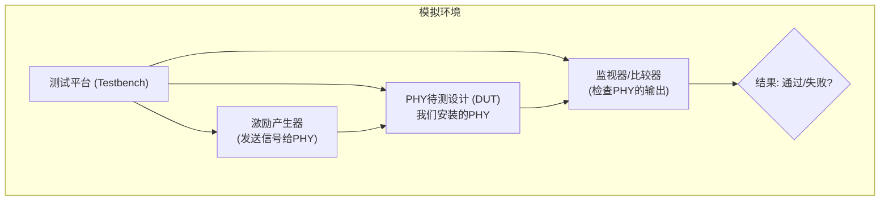
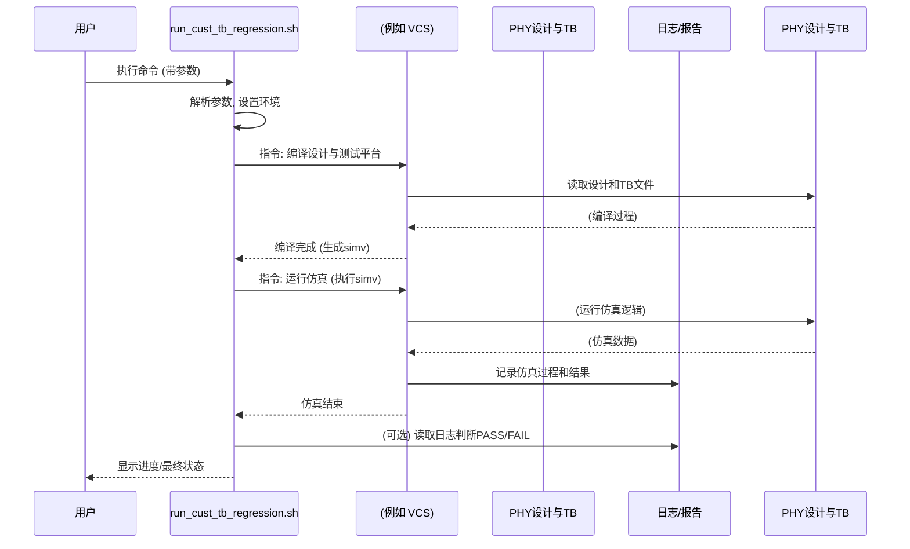

# Chapter 6: 仿真运行


欢迎来到 `instllation_quick_reference` 系列教程的第六章！在上一章 [许可证配置与验证](05_许可证配置与验证_.md) 中，我们成功地为我们安装的 PHY 配置并验证了许可证。这就像是给我们的“新车”加满了油，并且拿到了合法的“行驶证”。现在，一切准备就绪，是时候把这辆“新车”开上“试验场”，进行一次全面的“道路测试”了！

本章将指导你如何通过执行特定的脚本来进行仿真测试，以验证我们安装的 [PHY (物理层接口)](01_phy__物理层接口__.md) 的基本功能是否符合预期。这非常重要，因为在将PHY集成到更复杂的芯片设计或实际部署之前，我们需要确保它在模拟环境中的行为和性能是正确的。

## 为什么需要进行仿真运行？

想象一下，一家汽车制造商生产了一辆全新的汽车。在将这款车投入量产并销售给消费者之前，他们会进行大量的测试：在各种模拟路况下行驶、测试加速、刹车、转向等各项功能。这就是为了确保汽车的安全性和可靠性。

同样地，在我们安装好PHY之后，运行仿真是：
*   **功能验证**：就像软件发布前的“功能验证”，确保PHY的各个模块能按设计要求正常工作。
*   **早期问题发现**：在模拟环境中测试，可以尽早发现潜在的设计缺陷或与我们系统集成的问题，避免在后期造成更大的麻烦和成本。
*   **信心建立**：成功的仿真结果能给我们信心，表明PHY已正确安装并基本功能完好，为后续的系统集成打下坚实基础。

简单来说，仿真运行就是对我们安装好的PHY进行一次“健康检查”和“能力测试”。

## 核心概念：测试平台与回归测试

在深入了解如何运行仿真之前，让我们先简单认识两个相关的概念：

1.  **测试平台 (Testbench, TB)**：
    *   你可以把测试平台想象成一个为PHY专门搭建的“虚拟测试场地”或“实验室”。它是一个包含了激励产生器（模拟输入信号）、监视器（检查输出信号）和PHY设计本身（我们称之为“待测设计”，Device Under Test, DUT）的完整环境。
    *   测试平台会给PHY施加各种预设的输入信号（就像在不同路况下驾驶汽车），然后观察PHY的响应是否符合预期。

2.  **回归测试 (Regression Testing)**：
    *   这个词听起来有点专业，但概念很简单。通常，一个PHY会有很多项功能需要测试，对应着许多不同的测试用例。回归测试就是指运行一套预先定义好的测试用例集合，来全面检查PHY的功能。
    *   特别地，当PHY本身有更新，或者我们修改了测试环境时，会进行回归测试，以确保新的改动没有意外地“破坏”之前已经正常工作的功能（即防止“功能退化”）。
    *   我们即将使用的脚本名称中包含 `regression`，暗示了它可能用于运行这样的测试集合。


上图简单展示了测试平台如何与PHY交互并进行验证。

## 定位并运行仿真脚本

Synopsys 通常会提供预设的脚本来帮助用户方便地运行仿真。根据 `instllation_quick_reference.pdf` 的指引，我们需要使用 `run_cust_tb_regression.sh` 脚本。

### 1. 导航到仿真脚本目录

首先，你需要打开一个UNIX终端，并使用 `cd` 命令切换到包含该脚本的目录。这个目录通常位于你的PHY安装路径下。

假设你的PHY安装在 `/opt/synopsys_phy/my_project_phy_v2.01a` (这是我们在 [PHY 安装](04_phy_安装_.md) 章节中使用的示例路径)，产品名称是 `DW_pcie_phy_tsmc6ff_c5_x4`，版本是 `2.01a`，那么脚本的路径通常是：

`<install_folder>/synopsys/<product_name>/<version>/phy/sim/`

所以，你需要执行：
```bash
cd /opt/synopsys_phy/my_project_phy_v2.01a/synopsys/DW_pcie_phy_tsmc6ff_c5_x4/2.01a/phy/sim/
```
请将上述路径替换为你实际的安装路径、产品名称和版本。

**小提示**：你可以使用 `ls` 命令查看当前目录下的文件，确保 `run_cust_tb_regression.sh` 脚本确实存在。

### 2. 执行仿真脚本

进入正确的目录后，你就可以执行仿真脚本了。`instllation_quick_reference.pdf` 中给出的示例命令如下：

```bash
./run_cust_tb_regression.sh -sim_type gtech -sim_tool vcs -grid 0
```

让我们来分解这个命令的各个部分：

*   `./run_cust_tb_regression.sh`：
    *   `./` 表示执行当前目录下的这个脚本文件。
    *   `run_cust_tb_regression.sh` 是我们要运行的仿真脚本的名称。

*   `-sim_type gtech`：
    *   这个选项指定了仿真的类型。`gtech` 通常指的是“门级 (gate-level)”仿真。简单来说，就是在PHY设计已经被转换成由基本逻辑门（如与门、或门、非门等）组成的网表之后进行的仿真。这比更高层次的抽象模型仿真更接近实际硬件行为，但运行速度通常较慢。
    *   **打个比方**：如果把PHY设计比作盖房子，`gtech` 仿真就像是在房子主体结构（由砖块、钢筋等具体材料构成）完成后进行的检查。

*   `-sim_tool vcs`：
    *   这个选项指定了使用哪个仿真工具。`vcs` 是 Synopsys 公司提供的一款强大的业界主流仿真器。你的许可证配置（参考 [许可证配置与验证](05_许可证配置与验证_.md)）必须支持这个工具。
    *   **打个比方**：`vcs` 就像是进行汽车道路测试时使用的专业检测设备和跑道。

*   `-grid 0`：
    *   这个选项通常与分布式计算（仿真任务分发到多台机器上并行处理）有关。`-grid 0` 通常意味着**在本地单机运行仿真**，不使用计算集群或网格。对于初学者或简单的验证，这通常是默认或推荐的设置。
    *   **打个比方**：`-grid 0` 就像是只在本地的测试跑道上测试一辆车，而不是同时在全国多个测试中心进行大规模测试。

**重要提示**：
*   确保你已经正确设置了 [许可证配置与验证](05_许可证配置与验证_.md) 中讨论的环境变量，因为仿真工具（如VCS）需要有效的许可证才能运行。
*   根据你的具体PHY版本和文档，可用的选项及其含义可能会有所不同。请务必参考随PHY提供的 `Readme` 文件或相关文档。
*   文档中还提到了针对UPCS（Universal PHY Control Subsystem，通用PHY控制子系统）的类似脚本 `run_cust_tb_regression_upcs.sh`，位于 `<install_folder>/synopsys/<product_name>/<version>/upcs/sim/`。如果你的PHY包含UPCS并且你也需要验证它，运行方式类似。本章主要关注PHY本身的仿真。

### 3. 观察仿真过程与结果

当你执行上述命令后，仿真过程就开始了。你会在终端上看到很多输出信息，显示仿真的各个阶段，例如：
*   编译设计文件和测试平台文件。
*   链接生成可执行的仿真模型。
*   运行仿真。
*   显示测试用例的通过 (PASS) 或失败 (FAIL) 状态。

**预期会发生什么？**

1.  **终端输出**：屏幕会滚动显示仿真器（如VCS）的日志信息，包括编译警告或错误（如果有的话）、仿真进度等。
2.  **日志文件生成**：仿真脚本通常会在当前目录或其子目录（例如 `logs` 或与测试用例相关的目录）下生成详细的日志文件。这些日志文件非常重要，它们记录了仿真的完整过程、所有输出信息、以及最终的测试结果。文件名可能类似于 `test_case_name.log` 或 `vcs.log`。
    *   `instllation_quick_reference.pdf` 也提到：“Log files that are generated when you install the product or run simulation”。
3.  **结果指示**：
    *   理想情况下，在仿真结束时，你会看到指示所有测试（或你运行的特定测试）**通过 (PASS)** 的信息。
    *   如果出现问题，可能会显示**失败 (FAIL)**，或者仿真因错误而提前终止。这时，你需要仔细检查终端输出和日志文件，找出错误的原因。

**一个非常简化的仿真结束时终端输出的例子可能如下**：
```text
... (大量仿真过程信息) ...

===========================================================
REGRESSION SUMMARY
===========================================================
TEST: test_basic_loopback                STATUS: PASS
TEST: test_power_down                    STATUS: PASS
TEST: test_data_integrity_high_speed     STATUS: PASS
===========================================================
ALL TESTS PASSED
===========================================================

仿真完成。详细信息请查看生成的日志文件。
```
这只是一个理想化的示例。实际输出会更复杂。关键是找到总结性的状态报告。

## 仿真脚本背后发生了什么？

你可能会好奇，这个小小的 `.sh` 脚本是如何完成这么多工作的？它就像一个能干的“工头”，指挥着各个“工人”（如编译器、仿真器）协同工作。

下面是 `run_cust_tb_regression.sh` 脚本执行时的一个大致流程：

1.  **解析参数**：脚本首先读取你通过命令行传递给它的参数，例如 `-sim_tool vcs`, `-sim_type gtech` 等。
2.  **环境设置**：它可能会设置一些必要的环境变量，比如指向设计文件、库文件、许可证服务器的路径等。确保仿真器能够找到所有需要的东西。
3.  **编译阶段**：
    *   脚本会调用你指定的仿真工具（例如VCS）的编译器。
    *   编译器会读取PHY的Verilog或SystemVerilog设计文件以及测试平台文件。
    *   它将这些高级描述语言的代码转换成仿真器可以理解的底层格式，并最终生成一个可执行的仿真模型（通常在UNIX/Linux下是一个名为 `simv` 的文件，如果是VCS的话）。
4.  **仿真运行阶段**：
    *   脚本接着会执行上一步生成的那个仿真模型（例如 `./simv`）。
    *   测试平台开始工作，产生激励信号输入到PHY，并监控PHY的输出。
    *   仿真器会根据设计逻辑计算PHY的行为，并记录结果。
5.  **结果收集与报告**：
    *   仿真结束后，脚本可能会检查仿真日志文件中的特定关键词（例如 "PASS", "FAIL", "ERROR"）来判断测试是否成功。
    *   它会将结果汇总并在终端上显示一个摘要，同时确保所有详细日志都已保存。

我们可以用一个序列图来更清晰地展示这个交互过程：



### 脚本内部的一瞥 (概念性)

`run_cust_tb_regression.sh` 本身是一个Shell脚本（通常是Bash或csh脚本）。它包含了一系列按顺序执行的命令。虽然我们不需要修改它，但了解其大致结构有助于理解。

下面是一个**高度简化和概念化**的伪代码，展示了脚本可能包含的逻辑片段：

```bash
#!/bin/bash
# 伪代码示例: run_cust_tb_regression.sh 的简化逻辑

# 默认参数
SIM_TOOL="vcs" # 默认仿真工具
SIM_TYPE="gtech" # 默认仿真类型

# --- 1. 解析命令行参数 (省略复杂解析逻辑) ---
# (例如，使用 getopts 或循环检查 $1, $2, ...)
# if [ "$1" == "-sim_tool" ]; then SIM_TOOL="$2"; fi
# ... 其他参数解析 ...

echo "使用的仿真工具: $SIM_TOOL"
echo "使用的仿真类型: $SIM_TYPE"

# --- 2. 设置必要的环境变量和路径 (示例) ---
# export DESIGN_DIR=../src
# export TB_DIR=./testbenches
# (此处可能还有更多与许可证、库相关的设置)

# --- 3. 根据 sim_tool 调用编译器和仿真器 ---
if [ "$SIM_TOOL" == "vcs" ]; then
  echo "正在使用 VCS 编译设计和测试平台..."
  # 实际编译命令会非常复杂，包含很多文件和选项
  vcs -full64 -sverilog +incdir+../src ../src/phy_top.v ./tb/test_case_1.sv -o simv_executable
  
  echo "正在运行 VCS 仿真..."
  ./simv_executable +TESTNAME=test_case_1 +SIM_TYPE=$SIM_TYPE
else
  echo "错误: 不支持的仿真工具 $SIM_TOOL"
  exit 1
fi

# --- 4. 检查结果 (非常简化的示例) ---
echo "检查仿真结果..."
# (实际脚本中，这里会有更复杂的逻辑，例如:
#  grep "TEST PASSED" run.log > /dev/null
#  if [ $? -eq 0 ]; then echo "测试通过!"; else echo "测试失败!"; fi
# )
echo "仿真完成。详情请查看日志文件。"
```
**请注意**：上面的脚本只是一个为了说明概念的伪代码，真实的 `run_cust_tb_regression.sh` 脚本会复杂得多，并且针对特定的PHY和工具有很多定制化内容。**你通常不需要也请勿随意修改官方提供的这些脚本**，除非你非常清楚自己在做什么，并且有文档指引。

## 总结

在本章中，我们迈出了验证PHY功能的关键一步——运行仿真。我们学习了：

*   **为什么需要仿真**：就像新车的“道路测试”，确保PHY按预期工作。
*   **核心概念**：了解了测试平台 (Testbench) 和回归测试 (Regression Testing) 的基本含义。
*   **如何运行仿真**：
    *   导航到包含 `run_cust_tb_regression.sh` 脚本的目录。
    *   使用特定参数（如 `-sim_type`, `-sim_tool`, `-grid`）执行该脚本。
*   **预期结果**：仿真会在终端输出信息，生成详细的日志文件，并最终指示测试的通过 (PASS) 或失败 (FAIL) 状态。
*   **脚本工作原理**：了解了仿真脚本大致如何通过调用编译器和仿真器来自动化整个测试流程。

通过成功运行仿真并获得“PASS”的结果，我们可以更有信心地认为我们的PHY已经正确[安装](04_phy_安装_.md)并且基本功能正常。这为你后续将PHY集成到更大使能系统奠定了坚实的基础。

如果你在仿真过程中遇到问题，或者想更深入地了解PHY的特性和使用方法，下一章将为你提供宝贵的资源。

下一章，我们将探索 [支持与文档资源](07_支持与文档资源_.md)，学习在哪里可以找到帮助信息和更详细的技术文档。

---

Generated by [AI Codebase Knowledge Builder](https://github.com/The-Pocket/Tutorial-Codebase-Knowledge)