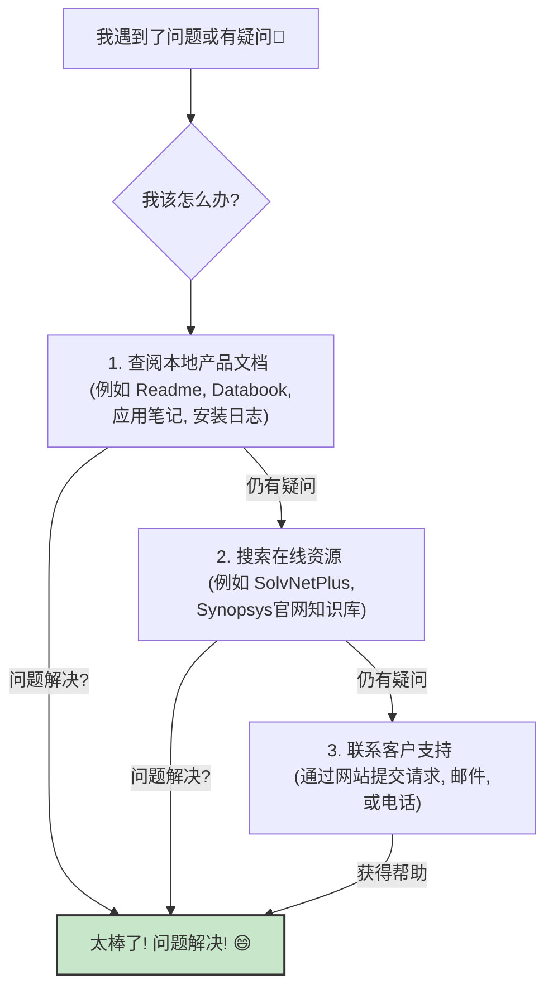

# Chapter 7: 支持与文档资源


在上一章 [仿真运行](06_仿真运行_.md) 中，我们成功地运行了PHY的仿真测试，就像对新组装的机器进行了一次全面的“试运行”。通过仿真，我们验证了PHY的基本功能符合预期。但学习和使用一个像PHY这样复杂的技术组件，旅程往往不会一帆风顺。你可能会遇到新的问题，或者想更深入地了解某些特定功能，亦或是在安装和使用过程中遇到一些文档中未详细覆盖的特殊情况。这时，你就需要一个可靠的“向导”和“资料库”来帮助你了。

本章，我们就来一起探索“支持与文档资源”。这就像是你的专属“服务台”和“图书馆”，为你提供解决问题、获取信息所需的一切帮助。

## 为什么“支持与文档资源”如此重要？

想象一下，你在玩一个非常复杂且庞大的电子游戏。虽然游戏提供了新手教程，但在深入探索游戏世界的过程中，你总会遇到一些挑战：一个特别难打的BOSS，一个隐藏的任务线索，或者你不理解某个游戏机制。这时，你会怎么做呢？你可能会去查阅游戏的官方攻略、玩家社区的讨论，甚至联系游戏客服寻求帮助。

同样地，在使用PHY（比如我们教程中涉及的 Synopsys PCIe 5.0 PHY）的过程中：
*   你可能在[PHY 安装](04_phy_安装_.md)时遇到一个奇怪的错误提示。
*   你可能对[许可证配置与验证](05_许可证配置与验证_.md)中的某个步骤不理解。
*   你可能在[仿真运行](06_仿真运行_.md)后发现结果与预期不符。
*   你可能想了解PHY的某个高级特性如何在你的特定设计中使用。

在这些情况下，**“支持与文档资源”就是你的救生索和知识宝库**。它们能帮助你：
*   **快速定位和解决问题**，节省宝贵的时间。
*   **深入理解PHY的功能和特性**，从而更好地将其应用于你的项目中。
*   **获取官方的、权威的信息**，避免因错误信息导致更多问题。

## 支持与文档资源的核心组成

“支持与文档资源”主要包含以下几个方面，我们可以把它们想象成一个综合服务中心的不同部门：

1.  **客户支持 (Customer Support)**：你的“人工服务台”，当你无法自行解决问题时，可以向专家求助。
2.  **产品文档 (Product Documentation)**：你的“官方参考书”，包含了关于PHY的详细技术信息。
3.  **在线资源 (Online Resources)**：你的“数字图书馆和社区”，提供便捷的在线查询和信息获取。

让我们用一个图来梳理一下遇到问题时的求助路径：



现在，我们来分别详细了解这些资源。

### 1. 客户支持 (Customer Support)

当你尝试了查阅文档和在线搜索，但问题依旧无法解决时，Synopsys 的客户支持团队就是你的坚强后盾。他们拥有专业的技术知识，可以为你提供针对性的帮助。

#### 如何联系客户支持？

根据 `instllation_quick_reference.pdf` 提供的指引（具体联系方式请以你获取IP时Synopsys提供的最新信息为准），你可以通过以下几种主要方式联系他们：

*   **支持网站 (Support Website) / 提交请求 (Enter a Call)**：
    *   通常可以通过 Synopsys 的官方支持门户网站提交你的问题。例如 `instllation_quick_reference.pdf` 中提到的 `http://solvnet.synopsys.com/EnterACall`。你需要使用你的 [SolvNet ID](02_先决条件_.md) 登录。
    *   这是推荐的方式，因为你可以详细描述问题，并附带相关的日志文件或截图。

*   **电子邮件 (Email)**：
    *   例如 `support_center@synopsys.com` (请确认最新的官方邮箱地址)。

*   **电话 (Telephone)**：
    *   `instllation_quick_reference.pdf` 提供了北美地区的电话示例：`1-800-245-8005` (太平洋时间 周一至周五 上午7点至下午5:30)。其他地区请查询 Synopsys 全球支持中心页面：`https://www.synopsys.com/support/global-support-centers.html`。

#### 联系支持前需要准备什么信息？

为了让支持团队能更快、更准确地帮助你，请在联系他们之前，尽量准备好以下信息（参考 `instllation_quick_reference.pdf`）：

*   **产品名称 (Product name) 和子产品名称 (Sub Product name)**：例如 "PCIe 5 PHY x4 for TSMC 6FF"。
*   **产品版本 (Version of the product)**：例如 "2.01a"。
*   **问题严重性 (Issue Severity)**：例如，是导致项目停滞的关键问题，还是一个影响较小的疑问。
*   **问题类型 (Problem type)**：例如，是安装问题、编译错误、仿真失败还是功能疑问。
*   **问题的详细描述 (Problem)**：清晰地描述你遇到的问题，包括你执行的操作步骤、期望的结果和实际发生的情况。
*   **授权产品 (Licensed Product)**：确认你拥有该产品的使用授权。
*   **客户追踪编号 (Customer Tracking Num)**：如果之前就此问题联系过，提供追踪编号。
*   **任何相关文件 (Any files)**：例如，调试日志文件 (debug files)、仿真波形文件 (waveforms)、截图等。这些文件对于诊断问题非常有价值。

**打个比方**：就像你去看医生，你需要告诉医生你的姓名、年龄（产品名和版本），哪里不舒服（问题描述），以及相关的检查报告（日志文件），医生才能更好地诊断。

### 2. 产品文档 (Product Documentation)

产品文档是你获取PHY详细技术信息和使用指南的第一手资料。这些文档通常随着PHY的安装包一同提供。

#### 主要的产品文档类型：

*   **Readme 文件 (Readme files)**：
    *   这通常是你应该最先阅读的文档。它包含了最新的产品信息、安装说明、已知问题、重要更新以及对其他文档的指引。
*   **数据手册 (Databooks)**：
    *   例如本教程参考的 `PCIe 5 PHY x4 for TSMC 6FF Databook`。数据手册是PHY的“技术规格说明书”，详细描述了PHY的特性、性能参数、接口信号、时序图、电气特性、寄存器列表等。这是进行深入设计和集成时的核心参考。
*   **应用笔记 (Application notes) (如果提供)**：
    *   这些文档通常针对特定的应用场景或高级功能，提供更具体的配置示例、使用技巧或设计指导。
*   **安装指南 (Installation Guides)**：
    *   更详细的安装步骤和环境配置说明（本快速参考教程是其简化版）。
*   **其他文档 (Other documents) (如果提供)**：
    *   可能还包括用户指南、参考手册等。

#### 在哪里找到这些文档？

根据 `instllation_quick_reference.pdf` 的指引，这些文档通常位于你的PHY安装目录下的 `doc/` 文件夹中：

```
<install_folder>/synopsys/<product_name>/<version>/doc/
```
例如，如果你将PHY安装在 `/opt/synopsys_phy/my_project_phy_v2.01a`，产品名为 `DW_pcie_phy_tsmc6ff_c5_x4`，版本为 `2.01a`，那么文档路径就是：
`/opt/synopsys_phy/my_project_phy_v2.01a/synopsys/DW_pcie_phy_tsmc6ff_c5_x4/2.01a/doc/`

**打个比方**：这就像你买了一件新电器，包装盒里会有用户手册、保修卡和快速入门指南。`doc/` 文件夹就是存放这些“说明书”的地方。

#### 日志文件 (Log files) 也是重要的参考：

`instllation_quick_reference.pdf` 还提到：
> Log files that are generated when you install the product or run simulation

这些在[PHY 安装](04_phy_安装_.md)或[仿真运行](06_仿真运行_.md)过程中生成的日志文件，虽然不是严格意义上的“文档”，但它们记录了详细的操作过程和错误信息，是排查问题时的重要线索。

### 3. 在线资源 (Online Resources)

除了本地文档和直接的客户支持，Synopsys 还提供了丰富的在线资源，方便你随时查询信息。

#### 主要的在线资源入口：

*   **Synopsys SolvNetPlus (通常简称 SolvNet)**：
    *   网址示例：`https://solvnet.synopsys.com` (注册入口示例: `https://solvnet.synopsys.com/ProcessRegistration`)。
    *   这是Synopsys为其客户提供的综合在线支持门户。你需要有效的 [SolvNet ID](02_先决条件_.md) 登录。
    *   功能：
        *   **产品下载 (Download Image)**：我们在 [PHY 下载](03_phy_下载_.md) 章节已经使用过它 (`www.designware.com` 或 `www.mydesignware.com` 通常会导向或集成SolvNet的功能)。
        *   **知识库 (Knowledge Base)**：包含大量技术文章、常见问题解答(FAQ)、应用笔记、已知问题和解决方案。当你遇到问题时，用关键词在这里搜索往往能找到答案。
        *   **提交和管理支持请求 (Enter a Call)**。
        *   **产品文档查阅**。

*   **Synopsys 官方网站 (www.synopsys.com)**：
    *   **产品信息 (Product Information)**：
        *   例如，关于PCI Express IP的信息：`https://www.synopsys.com/designware-ip/interface-ip/pci-express.html`
        *   这里可以找到关于PHY产品线的概述、特性、优势等市场和技术信息。
    *   **支持页面 (Support Page)**：
        *   例如：`https://www.synopsys.com/support.html`
        *   提供支持概览、联系方式、支持的平台信息 (Supported Platforms) 等。
    *   **许可证信息 (Licensing Information)**：
        *   例如：`http://www.synopsys.com/Support/LI/Licensing/Pages/default.aspx`
        *   关于许可证配置、管理和故障排除的资源。

**打个比方**：SolvNetPlus 就像一个巨大的在线“专业图书馆+技术论坛”，而 Synopsys 官网则是了解产品和公司信息的“官方展厅”。

## 如何有效地利用这些资源？——一个案例分析

假设你在[仿真运行](06_仿真运行_.md)后，遇到了一个之前没见过的错误信息，比如 "Error: Link training failed with status code 0x1A"。你该怎么办？

1.  **第一步：检查仿真日志**
    *   首先，仔细查看仿真工具（如VCS）生成的详细日志文件。错误信息附近通常会有更具体的上下文，指出问题可能发生在哪个模块或哪个阶段。

2.  **第二步：查阅产品文档 (本地)**
    *   打开PHY安装目录下的 `doc/` 文件夹。
    *   **Readme 文件**：看看是否有关于此错误代码的已知问题或说明。
    *   **Databook**：查找关于“Link training”（链路训练）过程的描述，看看状态码 `0x1A` 可能代表什么含义。是否有相关的寄存器可以提供更多诊断信息？
    *   **Application Notes** (如果有)：是否有关于链路训练调试或常见问题的应用笔记？

3.  **第三步：搜索在线资源 (SolvNetPlus)**
    *   登录 SolvNetPlus。
    *   使用关键词 "PCIe Link training error 0x1A" 或者 PHY 型号加上错误信息进行搜索。
    *   查看搜索结果中的知识库文章、社区帖子或已解决的案例。也许其他用户也遇到过类似问题。

4.  **第四步：如果仍未解决，联系客户支持**
    *   准备好你在前三步中收集到的所有信息：
        *   完整的错误信息和相关的日志片段。
        *   你查阅过的文档章节和你的理解。
        *   你在SolvNetPlus上找到的相关信息（如果有）。
        *   你的PHY型号、版本、使用的仿真工具和版本等。
    *   通过SolvNetPlus提交一个支持请求，或者按照指引发送邮件/拨打电话。详细描述你的问题和已尝试的步骤。

通过这样系统性的方法，你可以更高效地找到解决方案。

## 总结

在本章中，我们一起探索了PHY使用过程中不可或缺的“支持与文档资源”。我们了解到：

*   这些资源如同“服务台”和“资料库”，为我们解决问题、深入学习提供了坚实的基础。
*   核心资源包括三大类：
    *   **客户支持**：提供专业的、个性化的人工帮助。
    *   **产品文档** (如 Readme, Databooks)：提供详细、权威的技术规格和使用指南，通常位于安装目录的 `doc/` 文件夹下。
    *   **在线资源** (如 SolvNetPlus, Synopsys官网)：提供便捷的知识库查询、产品信息和下载服务。
*   我们还学习了在遇到问题时，如何有条理地利用这些资源来寻求解决方案。

掌握如何查找和使用这些支持与文档资源，将使你在学习和使用PHY的过程中如虎添翼，能够更自信地应对挑战，更高效地完成项目。

至此，`instllation_quick_reference` 系列教程的主要内容已经全部介绍完毕。我们从认识[PHY (物理层接口)](01_phy__物理层接口__.md)开始，经历了[先决条件](02_先决条件_.md)的准备、[PHY 下载](03_phy_下载_.md)、[PHY 安装](04_phy_安装_.md)、[许可证配置与验证](05_许可证配置与验证_.md)，再到[仿真运行](06_仿真运行_.md)以验证其功能，最后学习了如何获取[支持与文档资源](07_支持与文档资源_.md)。希望这个系列教程能为你打下坚实的基础，帮助你顺利开启使用Synopsys PHY的旅程。

祝你在未来的学习和工作中一切顺利！不断探索，不断进步！

---

Generated by [AI Codebase Knowledge Builder](https://github.com/The-Pocket/Tutorial-Codebase-Knowledge)