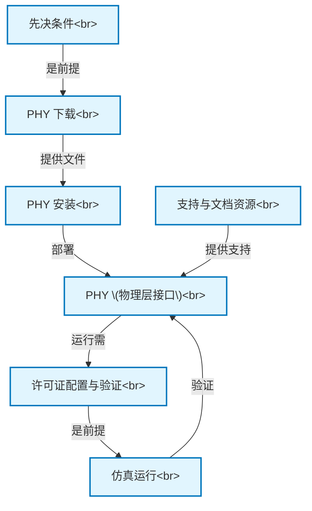

# Tutorial: instllation_quick_reference

这份文档是一个*快速上手指南*，帮助用户一步步**安装和初步测试**一个关键的计算机硬件接口——**Synopsys PCIe 5.0 PHY (物理层接口)**。此PHY专为*TSMC 6FF工艺*设计，用于实现计算机内部件间的高速数据连接。指南涵盖了从准备、下载、安装到许可证配置和基本功能验证的完整流程。

**Source Repository:** [None](None)

## Chapters

1. [PHY (物理层接口)
](01_phy__物理层接口__.md)
2. [先决条件
](02_先决条件_.md)
3. [PHY 下载
](03_phy_下载_.md)
4. [PHY 安装
](04_phy_安装_.md)
5. [许可证配置与验证
](05_许可证配置与验证_.md)
6. [仿真运行
](06_仿真运行_.md)
7. [支持与文档资源
](07_支持与文档资源_.md)

---

Generated by [AI Codebase Knowledge Builder](https://github.com/The-Pocket/Tutorial-Codebase-Knowledge)