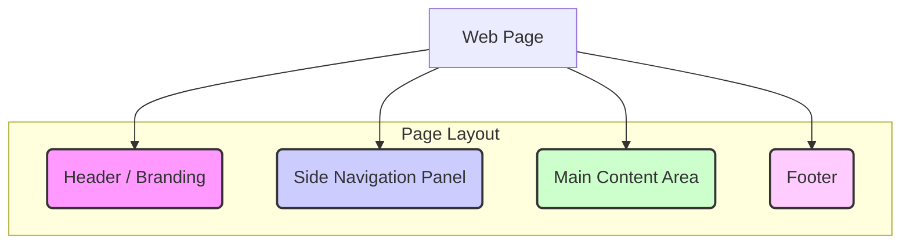

# Chapter 2: Tutorial Page Structure

Welcome to Chapter 2! In [Chapter 1: Statistical Concept Block](01_statistical_concept_block_.md), we learned how individual statistical ideas are presented as neat, focused "exhibits" with explanations, images, and formulas. This helps you learn one concept at a time.

But how do all these "exhibits" or blocks fit together on a single webpage? Where do you find the main information, and how do you move around? That's what this chapter is all about: the **Tutorial Page Structure**.

## What's the Big Deal About Page Structure?

Imagine you walk into a new classroom. If the whiteboard is hidden behind a bookshelf, the teacher's desk is in a corner facing the wall, and there are no signs telling you where the library or other resources are, it would be pretty confusing, right? You'd spend more time figuring out the room than learning!

A website or a tutorial page is similar. The **Tutorial Page Structure** is like the blueprint of that classroom. It defines:
*   Where the main "whiteboard" (our learning content) is.
*   Where the "school's name" (our branding, like "KalmanFilter.NET") is displayed.
*   How you can find "other resources" or different topics (navigation links).

A good page structure makes learning easier because you always know where to find things. It provides a consistent and user-friendly experience, so you can focus on understanding the concepts, not on figuring out how the page works.

## The Key Parts of Our "Classroom" Page

Our tutorial pages in `kalman_filter` (like the `kalman_filter.txt` file) are organized into a few main areas, much like a well-organized room:

1.  **Header / Branding Area (often part of the Navigation)**: This is like the name of our "school" or the title of our "course." It tells you where you are and who is presenting the information. For us, this includes "KalmanFilter.NET" and a logo.
2.  **Side Navigation Panel**: Think of this as a map or a table of contents for our "course." It lists all the different "lessons" (like [Statistical Concept Block](01_statistical_concept_block_.md)s or different chapters) and lets you easily jump between them.
3.  **Main Content Area**: This is the star of the show! It's our "whiteboard" or "textbook page" where all the explanations, images, and formulas for the current topic are displayed. This is where you'll find the [Statistical Concept Block](01_statistical_concept_block_.md)s we talked about in Chapter 1.
4.  **Footer**: This is like the fine print at the bottom of a document. It usually contains copyright information, links to privacy policies, and other useful, but less prominent, details.

Let's see how these parts visually fit together:



This diagram shows the basic sections you'll typically find on our tutorial pages.

## A Peek Under the Hood: How It's Built with HTML

These different areas of the page are created using HTML, the standard language for building web pages. You don't need to be an HTML expert, but seeing a little bit of how it's structured can help you understand.

Let's look at simplified snippets from our `kalman_filter.txt` file.

### 1. Header / Branding (Inside the Side Navigation)

In our project, the branding (logo and site name) is actually placed at the top of the **Side Navigation Panel**.

```html
<!-- This is the wrapper for the side navigation -->
<div class="wrapper navbar ... " id="sideNav">
    <nav class="vertScrol">
        <!-- Here's the branding! -->
        <a class="navbar-brand ..." href="#page-top">
            <span class="d-block d-lg-none">KalmanFilter.NET</span> <!-- For small screens -->
            <div class="d-none d-lg-block"> <!-- For larger screens -->
                <div class="font-weight-bold mb-3">KalmanFilter.NET</div>
                
            </div>
        </a>
        <!-- ... rest of the navigation links would follow ... -->
    </nav>
</div>
```
*   The `div` with `id="sideNav"` is the main container for our navigation.
*   Inside it, the `<a>` tag (which means a link) with class `navbar-brand` holds our site name "KalmanFilter.NET" and the logo image (``). This makes it clear you're on the KalmanFilter.NET tutorial.

### 2. Side Navigation Panel

This panel contains the links to navigate through the tutorial. We'll dive much deeper into this in the next chapter on the [Side Navigation Menu](03_side_navigation_menu_.md). For now, just see its basic container:

```html
<!-- The Side Navigation Panel container (same as above) -->
<div class="wrapper navbar ... " id="sideNav">
    <nav class="vertScrol">
        <!-- Branding (as shown before) -->
        <a class="navbar-brand ..."> ... </a>

        <!-- This part holds the actual list of links -->
        <div class="collapse navbar-collapse" id="navbarSupportedContent">
            <ul class="navbar-nav">
                <li class="nav-item nav-main">
                    <a class="nav-link ..." href="https://www.kalmanfilter.net/">Overview</a>
                </li>
                <!-- Many more navigation links (li elements) would be here -->
            </ul>
        </div>
    </nav>
    <!-- ... A "support" link might also be here ... -->
</div>
```
*   The `<ul>` tag (unordered list) and `<li>` tags (list items) are commonly used to create menus. Each `<li>` often contains an `<a>` (link) to another page or section.

### 3. Main Content Area

This is where you do your learning! It's the largest area of the page.

```html
<!-- Main Content Area where tutorial lessons appear -->
<div class="container-fluid p-0">

    <!-- An introductory section -->
    <section class="resume-section ...">
        <div class="my-auto">
            <h1 class="text-primary">Essential background I</h1>
            <p>Before we start, I would like to explain...</p>
        </div>
    </section>

    <!-- A Statistical Concept Block (covered in Chapter 1) -->
    <section class="resume-section ..." id="mean">
        <div class="my-auto">
            <h2 class="mb-3 mt-5">Hidden State</h2>
            <p>The term Hidden State refers to...</p>
            <!-- ... more text, images, formulas ... -->
        </div>
    </section>

    <!-- More sections like the one above would follow -->

</div>
```
*   The `<div class="container-fluid p-0">` often acts as the main wrapper for all the content.
*   Inside it, `<section>` tags are used to divide the content into logical parts. As we saw in [Chapter 1: Statistical Concept Block](01_statistical_concept_block_.md), each of these `<section>` elements often holds one **Statistical Concept Block**.
*   You'll see headings (`<h1>`, `<h2>`), paragraphs (`<p>`), images, and (as we'll learn in [Mathematical Formula Rendering](04_mathematical_formula_rendering_.md)) math formulas here.

### 4. Footer

At the very bottom, you'll find the footer.

```html
<!-- Footer at the bottom of the page -->
<footer style="background-color: #f5f5f5;">
    <div class="container">
        <div class="row">
            <div class="col-md-6 ...">
                <small><a href="accessibility.html">Accessibility</a></small>
                <!-- ... other links like Privacy ... -->
            </div>
            <div class="col-md-6 text-center text-md-right">
                <p class="mb-0"><small>&copy; Copyright 2024 Alex Becker. All rights reserved.</small></p>
            </div>
        </div>
    </div>
</footer>
```
*   The `<footer>` tag clearly marks this section.
*   It typically contains copyright notices (`&copy;`) and links to informational pages like "Privacy" or "Terms and Conditions."

## Why This Structure Matters for Learning

Having this consistent structure—Header/Branding, Side Navigation, Main Content, and Footer—is super helpful because:

*   **It's Predictable:** Once you understand the layout of one page, you understand the layout of all pages in the tutorial. You won't get lost.
*   **Easy Navigation:** You always know where to find the navigation links to jump to other topics or go back.
*   **Focus on Content:** You can spend your brainpower on learning the statistical concepts, not on trying to find where the information is located on the page.
*   **Clear Separation:** Different types of information (branding, navigation, content, legal bits) are in their own dedicated spots.

It's all designed to make your journey through `kalman_filter` as smooth and efficient as possible!

## Conclusion

We've now seen that a tutorial page is more than just a collection of text and images. It has a deliberate **Tutorial Page Structure** with a header/branding area, a side navigation panel, a main content area for the [Statistical Concept Block](01_statistical_concept_block_.md)s, and a footer. This structure, defined in HTML files like `kalman_filter.txt`, acts like a reliable blueprint for every "classroom" in our tutorial, ensuring a consistent and easy-to-use learning environment.

One of the most important parts of this structure for getting around is the navigation menu. Let's take a closer look at that next!

Next up: [Side Navigation Menu](03_side_navigation_menu_.md)

---

Generated by [AI Codebase Knowledge Builder](https://github.com/The-Pocket/Tutorial-Codebase-Knowledge)