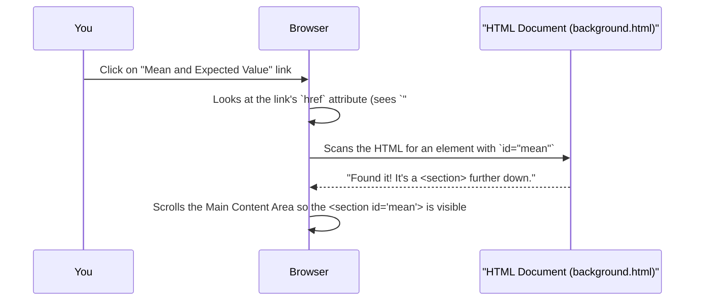

# Chapter 3: Side Navigation Menu

Welcome to Chapter 3! In the previous chapter, [Tutorial Page Structure](02_tutorial_page_structure_.md), we explored how our tutorial pages are laid out like a well-organized classroom, with distinct areas for branding, main content, and the footer. One of the most helpful parts of this structure is the guide that helps you find your way around – the **Side Navigation Menu**.

## Lost in a Big Book? Not Anymore!

Imagine you're reading a very long textbook or browsing a large website with many pages and topics. If you want to jump to a specific chapter you read a few days ago, or quickly see what topics are covered in the current section, it can be a bit like searching for a needle in a haystack! You might have to scroll endlessly or keep flipping back to the table of contents.

This is where the **Side Navigation Menu** comes to the rescue!

Think of it like this: you're reading a physical book, but next to every page, there's a super-detailed, clickable table of contents that's *always visible*. This "magic table of contents" not only shows you all the chapters in the book but also the main headings within the chapter you're currently reading. If you want to jump to "Chapter 5, Section B," you just click on it, and *poof* – you're there!

That's exactly what the Side Navigation Menu does for our `kalman_filter` Kalman Filter tutorial. It's an interactive list of links, usually found on the left side of the page. It's designed to help you:

*   Easily jump to different chapters of the tutorial.
*   Quickly navigate to specific sections (like different [Statistical Concept Block](01_statistical_concept_block_.md)s) within the current topic (e.g., "Essential Background I").
*   See how the current topic fits into the larger subject of the Kalman Filter.

It makes finding information simple and helps you understand the overall structure of the tutorial without any guesswork.

## What Does It Look Like and How Does It Work?

On our tutorial pages (like the `kalman_filter.txt` example), you'll typically see the Side Navigation Menu as a vertical bar on the left. It contains a list of clickable text items.

Here's a simplified idea:

```
+-------------------------+-------------------------------------------------+
| SIDE NAVIGATION MENU    | MAIN CONTENT AREA                               |
|                         |                                                 |
| - Overview              |                                                 |
| - Introduction          |  (You are currently reading this part)          |
|   - Essential Background I|                                                 |
|     - Mean & Exp. Value |  Section: Mean and Expected Value               |
|     - Variance & Std Dev|    Bla bla bla...                               |
|     - Normal Dist.      |                                                 |
|   - Alpha-Beta Filter   |  Section: Variance and Standard Deviation       |
| - Multivariate KF       |    More bla bla...                              |
| - ...                   |                                                 |
+-------------------------+-------------------------------------------------+
```

When you click on a link in this menu:
*   If it's a link to a section on the *current page* (like "Variance & Std Dev"), the main content area will automatically scroll down (or up) to show you that specific section.
*   If it's a link to a *different main chapter* or page, the browser will load that new page.

The menu often visually indicates which section or chapter you are currently viewing, perhaps by highlighting the link or changing its color. This helps you stay oriented.

## A Peek Under the Hood: The HTML Behind the Menu

The Side Navigation Menu, just like the rest of the [Tutorial Page Structure](02_tutorial_page_structure_.md), is built using HTML. Let's look at some simplified snippets from `kalman_filter.txt` to see how it's put together.

The entire side navigation, including the branding we saw in Chapter 2, is often wrapped in a `<div>` element. The actual list of links is typically created using `<ul>` (unordered list) and `<li>` (list item) tags.

```html
<!-- This is the main container for the side navigation -->
<div class="wrapper navbar navbar-expand-lg navbar-dark bg-primary fixed-top ..." id="sideNav">
    <nav class="vertScrol">
        <!-- Branding (logo, site name) goes here first -->
        <a class="navbar-brand js-scroll-trigger ..." href="#page-top">
            <!-- ... site name and logo ... -->
        </a>

        <!-- This 'div' contains the list of navigation links -->
        <div class="collapse navbar-collapse" id="navbarSupportedContent">
            <ul class="navbar-nav">
                <!-- Individual navigation links (list items) will be here -->
            </ul>
        </div>
    </nav>
    <!-- Other elements like a 'support' link might also be here -->
</div>
```
*   `id="sideNav"`: This unique identifier helps target this whole navigation block with styles or scripts.
*   `<nav>`: This HTML5 tag indicates that this section is for navigation.
*   `<ul class="navbar-nav">`: This unordered list will hold all our menu links.

Now, let's look at how the links themselves are structured within this `<ul>`:

```html
<ul class="navbar-nav">
    <!-- Link to the main overview page of the whole website -->
    <li class="nav-item nav-main">
        <a class="nav-link js-scroll-trigger" href="https://www.kalmanfilter.net/">Overview</a>
    </li>

    <!-- Link to the "Introduction to Kalman Filter" main topic page -->
    <li class="nav-item nav-main">
        <!-- 'text-white' might mean this is the currently active main topic -->
        <a class="nav-link js-scroll-trigger text-white" href="background.html">Introduction to Kalman Filter</a>
    </li>

    <!-- A sub-item indicating the current "Essential background I" page/section -->
    <li class="nav-item nav-mid">
        <a class="nav-link js-scroll-trigger text-white" href="background.html">Essential background I</a>
    </li>

    <!-- Sub-sub-items: Links to specific sections (Statistical Concept Blocks) on the current page -->
    <li class="nav-item nav-sub">
        <!-- href="#mean" links to an element with id="mean" on the current page -->
        <a class="nav-link js-scroll-trigger" href="#mean">Mean and Expected Value</a>
    </li>
    <li class="nav-item nav-sub">
        <a class="nav-link js-scroll-trigger" href="#variance">Variance and Standard deviation</a>
    </li>
    <li class="nav-item nav-sub">
        <a class="nav-link js-scroll-trigger" href="#normal">Normal Distribution</a>
    </li>
    <!-- ... more links would follow ... -->
</ul>
```
Let's break this down:
*   `<li>`: Each `<li>` (list item) represents one entry in our navigation menu.
*   `<a>`: Inside each `<li>`, there's an `<a>` (anchor) tag. This is what makes the text clickable – it's a hyperlink!
*   `href="..."`: This is the most important part of the `<a>` tag. It tells the browser where to go when the link is clicked.
    *   `href="https://www.kalmanfilter.net/"` or `href="background.html"`: These are links to *other web pages*.
    *   `href="#mean"`: This is special! The `#` symbol (called a hash or fragment identifier) tells the browser to look for an HTML element *on the current page* that has an `id="mean"`. If it finds one (like `<section ... id="mean">`), it will scroll the page to bring that section into view. This is how you jump to different [Statistical Concept Block](01_statistical_concept_block_.md)s within the "Essential Background I" topic.
*   `nav-main`, `nav-mid`, `nav-sub`: These are custom CSS classes. They are likely used to style the links differently to show a hierarchy (e.g., main topics, sub-topics, sub-sub-topics might be indented differently).
*   `js-scroll-trigger`: This class name suggests that a little bit of JavaScript might be used to make the scrolling smooth when you click a same-page link.

So, when you see a link like "Mean and Expected Value" in the side navigation, it's likely an `<a>` tag pointing to `"#mean"`. Clicking it tells your browser to find the part of the page marked with `id="mean"` and show it to you.

## How Clicking a Link Works: A Simple Story

Let's imagine you click on the "Mean and Expected Value" link in the side navigation. Here's a simplified step-by-step of what happens:



And just like that, you're viewing the "Mean and Expected Value" [Statistical Concept Block](01_statistical_concept_block_.md)!

## Why Is This So Helpful?

The Side Navigation Menu is a powerful tool for learning because:

1.  **It's Always There:** No need to scroll to the top or bottom of a long page to find out where to go next. It's like a constant companion.
2.  **Clear Structure:** It shows you the outline of the current topic and the entire tutorial, so you always know where you are and what else there is to learn.
3.  **Quick Jumps:** You can instantly go to any section that interests you or revisit a section you want to review.
4.  **Reduces Overwhelm:** Seeing the tutorial broken down into manageable, named sections makes the overall topic feel less daunting.

It helps you focus on learning the content, not on trying to figure out how to move around the website.

## Conclusion

The **Side Navigation Menu** is your interactive map and guide for the `kalman_filter` tutorial. It's a list of links, usually on the left side of the page, built with simple HTML lists and anchor tags. By using `href` attributes that point to other pages or specific `id`s on the current page (like those of our [Statistical Concept Block](01_statistical_concept_block_.md)s), it allows you to effortlessly explore the different parts of the Kalman Filter lessons. It’s a key part of the [Tutorial Page Structure](02_tutorial_page_structure_.md) designed to make your learning experience smooth and efficient.

Now that we've seen how to navigate and how content is structured, you might be wondering about those neat mathematical equations you've seen in some of the examples. How are those displayed so clearly? Let's dive into that in the next chapter!

Next up: [Mathematical Formula Rendering](04_mathematical_formula_rendering_.md)

---

Generated by [AI Codebase Knowledge Builder](https://github.com/The-Pocket/Tutorial-Codebase-Knowledge)