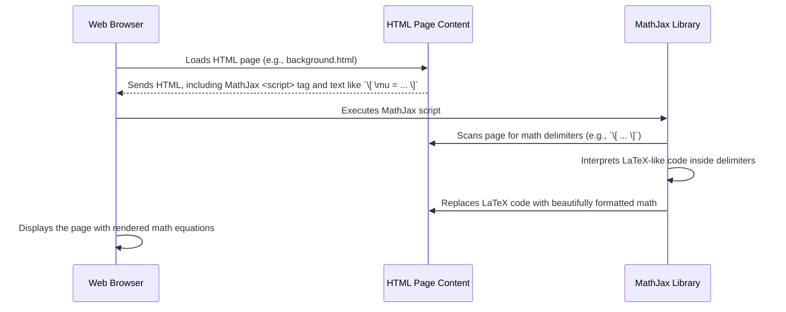

# Chapter 4: Mathematical Formula Rendering

Welcome to Chapter 4! In [Chapter 3: Side Navigation Menu](03_side_navigation_menu_.md), we learned how the side navigation menu helps you easily find your way through the different sections of our tutorial. As you navigate, especially in a technical tutorial like this one on the Kalman Filter, you'll often encounter mathematical formulas.

Have you ever tried to write a fraction or a fancy math symbol like Σ (sigma for summation) or μ (mu for mean) in a simple text message or a basic email? It usually looks pretty clunky, right? For example, `x = (-b +/- sqrt(b^2-4ac))/(2a)` is much harder to read than its properly typeset version. In a tutorial that explains statistical concepts, it's super important that formulas are clear, professional, and easy to understand.

## The Challenge: Making Math Look Good on the Web

Imagine you're trying to understand how "Variance" is calculated. The explanation in a [Statistical Concept Block](01_statistical_concept_block_.md) might include a formula like this, if written in plain text:

`sigma^2 = (1/N) * sum_from_i=1_to_N (x_i - mu)^2`

That's... okay, but not great. It’s a bit hard to see the structure of the formula, especially if it gets more complex. The little "2" for "squared" is just a normal "2", the summation symbol is written out as "sum_from_i=1_to_N", and the fraction "1/N" is also just plain text. It doesn't look like what you'd see in a math textbook.

We could try to use images for formulas, but images can become blurry if you zoom in, and they are not easily searchable or accessible for screen readers. We need a better way!

## The Solution: MathJax, Our Digital Math Typesetter!

This is where **Mathematical Formula Rendering** comes in. For the `kalman_filter` project, we use a special tool called **MathJax**.

Think of MathJax as a **digital typesetter** specifically for mathematics. A typesetter in the old days would carefully arrange metal letters and symbols to print a book. MathJax does something similar, but digitally, right in your web browser! It takes special text-based instructions for math and transforms them into beautifully formatted equations that look like they came straight out of a professional textbook.

This is crucial for a technical tutorial discussing statistical formulas because it ensures that notations such as:
*   Fractions (e.g., \( \frac{1}{N} \))
*   Summations (e.g., \( \sum \))
*   Greek letters (e.g., \( \mu, \sigma \))
*   Exponents (e.g., \( x^2 \))
*   Square roots (e.g., \( \sqrt{b^2 - 4ac} \))
...and many other complex symbols appear correctly and clearly.

## How Do We Tell MathJax What to Display? Writing Math for the Web

MathJax doesn't magically know what's a formula and what's regular text. We need to give it a hint by writing our mathematical expressions in a special format. This format is very similar to a language called **LaTeX** (pronounced "LAH-tek" or "LAY-tek"), which is very popular in scientific and academic writing for typesetting documents, especially those with a lot of math.

You don't need to be a LaTeX expert! For our purposes, the basics are quite simple. We typically mark our math in two ways:

1.  **Inline Math**: For formulas that appear within a line of text, like \( E = mc^2 \). These are usually wrapped in `\( ... \)` symbols.
2.  **Display Math**: For larger formulas that should appear on their own line, centered, like:
    \[ \mu = \frac{1}{N} \sum_{i=1}^{N} x_i \]
    These are usually wrapped in `\[ ... \]` symbols.

Let's take the variance formula example from before:
Plain text: `sigma^2 = (1/N) * sum_from_i=1_to_N (x_i - mu)^2`

Using LaTeX-like syntax for MathJax, it would look something like this in the HTML source code:
`\[ \sigma^{2} = \frac{1}{N} \sum _{n=1}^{N} ( x_{n}- \mu ) ^{2} \]`

When MathJax processes this, it displays it beautifully as:
\[ \sigma^{2} = \frac{1}{N} \sum _{n=1}^{N} ( x_{n}- \mu ) ^{2} \]
See the difference? The `\sigma` becomes σ, `^2` makes the 2 an exponent, `\frac{1}{N}` creates a proper fraction, and `\sum` becomes the summation symbol with its limits.

## How MathJax Works Its Magic (A Peek Under the Hood)

So, how does this transformation happen? MathJax is essentially a collection of JavaScript programs and fonts.

1.  **Including MathJax in the Page**:
    First, we need to tell the web browser to load the MathJax library. This is done by adding a `<script>` tag to our HTML file (like `kalman_filter.txt`). This tag points to where the MathJax code is located (often on a content delivery network, or CDN, which is a fast way to load common libraries).

    Here's what that script tag typically looks like in `kalman_filter.txt`:
    ```html
    <!-- MathJax -->
    <script type="text/javascript" async
        src="https://cdnjs.cloudflare.com/ajax/libs/mathjax/2.7.2/MathJax.js?config=TeX-AMS_HTML-full">
    </script>
    ```
    This little piece of code tells the browser: "Hey, go fetch the MathJax library from this web address and get it ready." The `async` attribute means the browser can continue loading other parts of the page while MathJax is being fetched, which helps the page load faster.

2.  **MathJax Scans the Page**:
    Once the page is loaded and the MathJax script runs, MathJax automatically scans through the HTML content of the page. It looks for those special markers we talked about: `\[ ... \]` for display math and `\( ... \)` for inline math.

3.  **Transformation Time!**:
    When MathJax finds a block of text enclosed in these markers, it reads the LaTeX-like commands inside. It then uses its built-in knowledge of mathematical symbols and layout rules (and special math fonts) to convert that plain text into a visually rich and correctly formatted mathematical expression. This new, beautiful version replaces the original plain text in the browser.

Here’s a simplified sequence of what happens:



## Seeing it in Action (HTML Snippets from `kalman_filter.txt`)

Let's look back at an example from `kalman_filter.txt`, inside a [Statistical Concept Block](01_statistical_concept_block_.md) for "Hidden State":

```html
<!-- From kalman_filter.txt -->
<section class="resume-section p-3 p-lg-5 d-column" id="mean">
    <div class="my-auto">
        <h2 class="mb-3 mt-5">Hidden State</h2>
        <!-- ... some explanatory text ... -->
        <div class="container">
            <div class="row justify-content-md-center">
                <div class="card mx-3 my-3 text-center equation">
                    <div class="card-block mx-3 my-3">
                        \[ \mu = \frac{1}{N} \sum _{n=1}^{N}V_{n}= \frac{1}{5} \left( 5+5+10+10+10 \right) = 8 cent \]
                    </div>
                </div>
            </div>
        </div>
        <!-- ... more text ... -->
    </div>
</section>
```

In this snippet:
*   The math formula is written inside `\[ ... \]`:
    `\[ \mu = \frac{1}{N} \sum _{n=1}^{N}V_{n}= \frac{1}{5} \left( 5+5+10+10+10 \right) = 8 cent \]`
*   When you open this page in your browser, the MathJax script (included in the `<head>` section of the HTML, as shown earlier) runs, finds this code, and transforms it into the clear, professional-looking equation you see on the tutorial page.

The `<div class="card ... equation">` parts are just HTML and CSS used to style the box around the equation, making it stand out visually. The core magic of rendering the math symbols themselves is all MathJax.

## Why Is This So Cool for Learning?

Using MathJax for mathematical formula rendering offers several big advantages:

1.  **Looks Professional and Clear**: Formulas are displayed just like in textbooks, making them much easier to read and understand.
2.  **Scales Perfectly**: Because MathJax uses special fonts and rendering techniques (not images), the formulas look sharp and clear no matter how much you zoom in or out on the page. Try it!
3.  **Accessible**: For users with visual impairments who use screen readers, MathJax can often make the math accessible. Screen readers can sometimes read out the structure of the equation.
4.  **Copy and Paste**: Often, you can select and copy the MathJax-rendered math and paste it into other applications that understand LaTeX (though this depends on the application).
5.  **Easier to Maintain**: For us, the tutorial creators, writing math in a text-based format (LaTeX) is much easier than creating and managing hundreds of image files for formulas.

## Conclusion

Mathematical Formula Rendering, powered by the MathJax library, is like having a specialized digital typesetter for our tutorial. It transforms plain text commands (written in a LaTeX-like syntax such as `\[ E=mc^2 \]`) into beautifully formatted, professional-looking mathematical equations directly in your web browser. This is achieved by including the MathJax JavaScript library in our HTML pages (like `kalman_filter.txt`), which then scans the page and renders any math it finds. This ensures that all the statistical formulas you encounter in the `kalman_filter` project are clear, scalable, and easy to understand, which is essential for learning complex technical topics.

Now that you understand how we display pretty math, you might be interested in another feature that makes our tutorial accessible to a wider audience: how we handle different languages. Let's explore that next!

Next up: [Language Switching Mechanism](05_language_switching_mechanism_.md)

---

Generated by [AI Codebase Knowledge Builder](https://github.com/The-Pocket/Tutorial-Codebase-Knowledge)