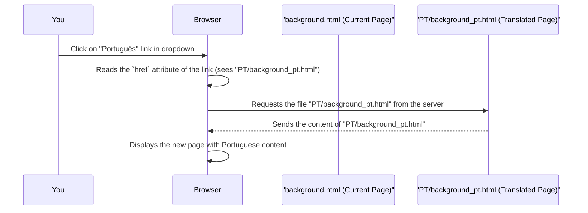

# Chapter 5: Language Switching Mechanism

Welcome to Chapter 5! In [Chapter 4: Mathematical Formula Rendering](04_mathematical_formula_rendering_.md), we saw how `kalman_filter` uses MathJax to display complex mathematical formulas clearly and professionally. This is vital for understanding the technical details of concepts like the Kalman Filter. But what if you understand math well, but English isn't your first language? How can we make the tutorial accessible to a wider, global audience?

That's where our **Language Switching Mechanism** comes into play!

## What is a Language Switching Mechanism? Imagine a Global Museum!

Imagine you're visiting a fascinating museum exhibit in a foreign country. The exhibit itself is amazing, but all the information signs are in a language you don't understand well. It would be hard to appreciate the details, right? Now, what if the museum offered a pamphlet for the exhibit in many different languages? You could simply pick the one in your preferred language and enjoy the exhibit fully!

The **Language Switching Mechanism** in `kalman_filter` works just like that multilingual pamphlet. It's a feature, usually a dropdown menu, that allows you, the user, to select your preferred language for viewing the tutorial content. If you choose "Japanese," the page will reload to show the tutorial text in Japanese. If you pick "Portuguese," you'll see it in Portuguese.

This makes our tutorial on complex topics like the Kalman Filter much more accessible and user-friendly for people all around the world.

## How Does It Look and How Do You Use It?

Typically, you'll find the language switcher in a prominent place, often in the header or at the top of the [Side Navigation Menu](03_side_navigation_menu_.md). In `kalman_filter`, it's right at the top of the side navigation.

It usually looks like this:
*   A dropdown menu showing the currently selected language (e.g., "English").
*   Often, there's a little flag icon next to the language name for quick visual recognition.
*   When you click on it, a list of other available languages appears (e.g., Japanese, Portuguese, Spanish, etc.), also with their respective flag icons.

Here’s a simplified visual idea:

```
+---------------------------------+
| SIDE NAVIGATION MENU            |
|---------------------------------|
| [🇺🇸 English ▼]                  |  <-- This is the language switcher!
|   - [🇯🇵 Japanese]               |
|   - [🇧🇷 Portuguese]             |
|   - [🇪🇸 Spanish]                |
|---------------------------------|
| - Overview                      |
| - Introduction                  |
|   - Essential Background I      |
|     - Mean & Exp. Value         |
|     ...                         |
+---------------------------------+
```

**Using it is simple:**
1.  **Click** on the current language (e.g., "[🇺🇸 English ▼]").
2.  The dropdown list **opens**, showing other available languages.
3.  **Click** on your desired language (e.g., "[🇯🇵 Japanese]").
4.  The page will then **reload**, and you'll see the tutorial content – the explanations in the [Statistical Concept Block](01_statistical_concept_block_.md)s, the text around the [Mathematical Formula Rendering](04_mathematical_formula_rendering_.md), and other page text – in the language you selected!

## A Peek Under the Hood: How Does It Work?

The magic behind the language switcher is actually quite straightforward, especially for a beginner to understand. It doesn't involve complex, real-time translation AI. Instead, it relies on having **pre-translated versions of each page**.

Think of it this way:
*   For the "Essential Background I" page, there's an English version (e.g., `background.html`).
*   There's also a separate Japanese version (e.g., `JP/background_jp.html`).
*   And a Portuguese version (e.g., `PT/background_pt.html`), and so on for other languages.

The language switcher is essentially a set of links. When you click on "Japanese," you're just telling your browser to go to the `JP/background_jp.html` file.

### The HTML Code for the Switcher

Let's look at the HTML snippet from our `kalman_filter.txt` file (which is the English `background.html` page). This code is part of the [Side Navigation Menu](03_side_navigation_menu_.md):

```html
<!-- Inside the <ul class="navbar-nav"> in the Side Navigation -->
<li class="nav-item dropdown">
    <!-- This is the main button for the dropdown, showing current language (English) -->
    <a class="nav-link dropdown-toggle" href="#" data-toggle="dropdown" aria-haspopup="true" aria-expanded="false">
        <span class="flag-icon flag-icon-us"></span> English
    </a>
    <!-- This div holds all the language options that appear when you click -->
    <div class="dropdown-menu">
        <!-- Link to the Japanese version of the current page -->
        <a class="dropdown-item" href="JP/background_jp.html">
            <span class="flag-icon flag-icon-jp"> </span>  日本 <!-- "Japanese" in Japanese -->
        </a>
        <!-- Link to the Portuguese version -->
        <a class="dropdown-item" href="PT/background_pt.html">
            <span class="flag-icon flag-icon-br"> </span>  Português <!-- "Portuguese" in Portuguese -->
        </a>
        <!-- Other languages would follow -->
        <a class="dropdown-item" href="ES/background_es.html">
             <span class="flag-icon flag-icon-es"> </span>  Español <!-- "Spanish" in Spanish -->
        </a>
        <!-- ... and so on -->
    </div>
</li>
```

Let's break this down:
*   `<li class="nav-item dropdown">`: This list item holds the entire language switcher. The `dropdown` class is from Bootstrap (a styling framework) and helps make it work like a dropdown.
*   `<a class="nav-link dropdown-toggle" ...>`: This is the clickable part that initially shows "🇺🇸 English". The `data-toggle="dropdown"` attribute tells Bootstrap to show/hide the menu when clicked.
*   `<span class="flag-icon flag-icon-us"></span>`: This displays the little US flag. The `flag-icon` classes come from a library called "Flag Icon CSS," which we included in the `<head>` of our HTML:
    ```html
    <link href="https://cdnjs.cloudflare.com/ajax/libs/flag-icon-css/3.1.0/css/flag-icon.min.css" rel="stylesheet">
    ```
*   `<div class="dropdown-menu">`: This container holds all the links to the different language versions. It's hidden by default and shows up when you click the main dropdown link.
*   `<a class="dropdown-item" href="JP/background_jp.html">...</a>`: This is a link to one specific language.
    *   `class="dropdown-item"`: Styles it as an item in the dropdown.
    *   `href="JP/background_jp.html"`: This is the crucial part! It tells the browser: "If this is clicked, go to the file named `background_jp.html` located in the `JP/` folder." This file contains the Japanese translation of the page.
    *   `日本`: This is "Japanese" written in Japanese characters (it might look a bit garbled here, but displays correctly in the browser).

So, each language option is simply a link (`<a>` tag) pointing to a different HTML file. These files (e.g., `background_en.html`, `background_jp.html`, `background_pt.html`) are structured similarly but contain text in their respective languages.

### What Happens When You Click? (A Simple Story)

Let's say you're on `background.html` (the English page) and you click the "Português" link in the language switcher.


And just like that, you're viewing the tutorial in Portuguese! The entire [Tutorial Page Structure](02_tutorial_page_structure_.md) is now filled with Portuguese content.

## Why Is This Approach Helpful?

This method of language switching (linking to separate, pre-translated files) is great for a tutorial like `kalman_filter` because:

1.  **High-Quality Translations**: Human translators can carefully translate the content, ensuring accuracy and cultural nuances, which is very important for technical topics.
2.  **Reliability**: It works every time. There's no dependency on an online translation service that might fail or produce awkward translations.
3.  **Good Performance**: The browser just loads a new HTML file, which is fast.
4.  **Search Engine Friendly**: Search engines can find and index each language version of the page, making the tutorial discoverable to people searching in different languages.
5.  **Simple to Understand and Maintain**: For developers, adding a new language means creating a new set of translated HTML files and adding a link to the dropdown.

## Conclusion

The **Language Switching Mechanism** in `kalman_filter` is a user-friendly feature, typically a dropdown menu with flag icons, that allows you to select your preferred language. Under the hood, it works by linking to separate, pre-translated HTML files for each language (e.g., `background.html` for English, `JP/background_jp.html` for Japanese). When you select a language, your browser simply navigates to the corresponding HTML file, presenting the entire tutorial page in that language. This makes complex topics like the Kalman Filter accessible to a global audience, allowing more people to learn effectively.

This chapter concludes our exploration of some of the key structural and functional components that make the `kalman_filter` tutorial project user-friendly and effective. From understanding how content is organized into [Statistical Concept Block](01_statistical_concept_block_.md)s and full pages ([Tutorial Page Structure](02_tutorial_page_structure_.md)), to navigating with the [Side Navigation Menu](03_side_navigation_menu_.md), seeing clear [Mathematical Formula Rendering](04_mathematical_formula_rendering_.md), and now, being able to switch languages, each feature is designed with the beginner learner in mind. We hope this "behind-the-scenes" look helps you appreciate how these elements work together to create a smooth learning experience!

---

Generated by [AI Codebase Knowledge Builder](https://github.com/The-Pocket/Tutorial-Codebase-Knowledge)