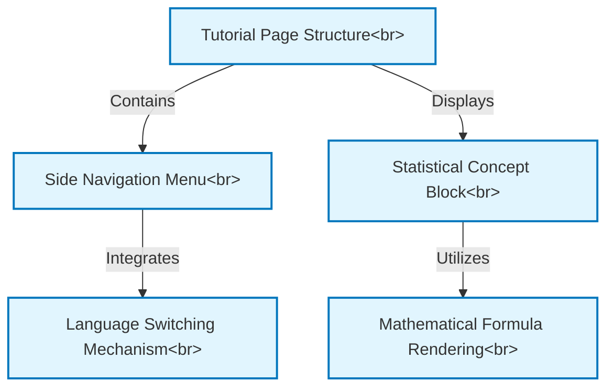

# Tutorial: kalman_filter

This project, `kalman_filter`, is an *interactive online tutorial* designed to teach users about the **Kalman Filter**. It presents complex *statistical concepts* in an accessible way, featuring a structured page layout with a **side navigation menu** for easy browsing, clear rendering of **mathematical formulas**, and a **language switching** option to cater to a global audience.

**Source Repository:** [None](None)

## Chapters

1. [Statistical Concept Block
](01_statistical_concept_block_.md)
2. [Tutorial Page Structure
](02_tutorial_page_structure_.md)
3. [Side Navigation Menu
](03_side_navigation_menu_.md)
4. [Mathematical Formula Rendering
](04_mathematical_formula_rendering_.md)
5. [Language Switching Mechanism
](05_language_switching_mechanism_.md)

---

Generated by [AI Codebase Knowledge Builder](https://github.com/The-Pocket/Tutorial-Codebase-Knowledge)