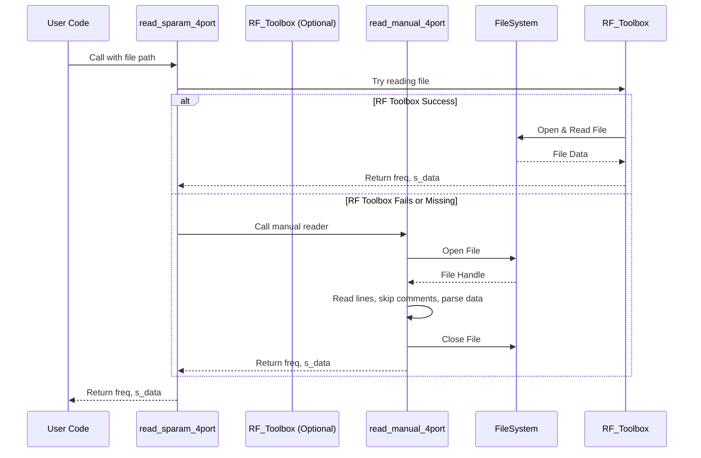

# Chapter 1: S-Parameter Data Handling

Welcome to the `kr100G-ck` tutorial! This project helps us analyze high-speed communication channels, like those used in modern networking equipment (think 100 Gigabit Ethernet!). Before we can perform any complex analysis, we need to start with the basics: understanding the electrical behavior of our components.

## What's the Goal? Reading the Blueprint

Imagine you're building something complex, like a high-performance race car engine. Before you put it together, you need the blueprints for each part, right? These blueprints tell you the exact specifications and characteristics of each component.

In the world of high-speed electronics, **S-parameter files** (often ending in `.sNp`, like `.s4p`) are like those detailed blueprints. They describe exactly how electrical signals behave when they travel through a component (like a cable, connector, or circuit board trace) at different frequencies.

**Our goal in this chapter:** Learn how `kr100G-ck` reads and understands these S-parameter "blueprints" so we can use that information for later analysis.

## What are S-Parameters Anyway?

S-parameters (Scattering parameters) tell us two main things about how a signal interacts with an electronic component at a specific frequency:

1.  **Reflection:** How much of the signal bounces *back* from the component's input? (Like an echo)
2.  **Transmission:** How much of the signal successfully passes *through* the component to the output? (How much gets through?)

Think of shining a flashlight beam (the signal) at a piece of tinted glass (the component):
*   Some light reflects off the surface (Reflection).
*   Some light passes through, maybe getting dimmed or slightly changed (Transmission).

S-parameter files store this reflection and transmission information as complex numbers (magnitude and phase) across a *range* of frequencies. Why frequencies? Because electrical components behave differently depending on the signal's frequency (how fast it's oscillating).

These files usually follow a standard format called **Touchstone**. You might see `.s2p` files (for 2-port components like a simple cable) or `.s4p` files (for 4-port components, common when dealing with differential signals, which we'll cover later). Our project often uses `.s4p` files.

## Handling the Data: Why Do We Need Special Code?

S-parameter files are just text files, but they contain a lot of structured numerical data. We can't just look at them and instantly understand the component's behavior. We need software to:

1.  **Open and Read:** Access the `.sNp` file.
2.  **Parse:** Understand the file's structure (like skipping comment lines starting with `!` or `#`, finding the frequency units, etc.). Touchstone has different versions (v1.0, v2.0) which need slightly different handling.
3.  **Extract:** Pull out the frequency points and the corresponding S-parameter values.
4.  **Format:** Store this data in a way our analysis code (in MATLAB) can easily use.

This is where the "S-Parameter Data Handling" part of `kr100G-ck` comes in. It provides functions to manage this reading and parsing process.

## How `kr100G-ck` Reads S-Parameter Files

In our project, the function `read_sparam_4port` (found in the `com_tdr.m` file) is responsible for reading 4-port S-parameter files (`.s4p`).

Let's see how you'd use it:

**Use Case:** You have an S-parameter file named `my_connector.s4p` and you want to load its data into MATLAB.

**Input:** The path to the file.
**Output:** Two variables:
*   `freq`: A list (vector) of all the frequencies measured in the file (e.g., in Hertz).
*   `s_data`: A more complex array holding all the S-parameter values (reflection/transmission) for each frequency. For a `.s4p` file, this will be a 4x4 matrix for *each* frequency point.

**Example Code:**

```matlab
% Define the path to your S-parameter file
% (Make sure this file exists or change the path!)
s_param_file_path = 'C:\path\to\your\data\my_connector.s4p';

% Use the function to read the file
disp(['Attempting to read: ' s_param_file_path]);
[frequencies, s_parameter_data] = read_sparam_4port(s_param_file_path);

% If successful, display a confirmation and the number of frequency points
disp('Successfully read the S-parameter file!');
num_freq_points = length(frequencies);
disp(['Found data for ' num2str(num_freq_points) ' frequency points.']);

% Now, 'frequencies' holds the frequency list (e.g., in Hz)
% and 's_parameter_data' holds the S-parameter matrices.
% We can use these variables in later analysis steps.
```

**What happens when you run this?**

The code calls `read_sparam_4port` with the file path. The function opens the file, reads the data, and returns the frequencies and S-parameters, storing them in the `frequencies` and `s_parameter_data` variables respectively. The `disp` commands print messages to the MATLAB console confirming the process.

## Under the Hood: How `read_sparam_4port` Works

How does the function actually get the data? It has a clever strategy:

1.  **Try the Easy Way First:** MATLAB has an optional add-on called the "RF Toolbox" which is specifically designed for tasks like this. `read_sparam_4port` first tries to use this toolbox because it's usually fast and reliable.
2.  **Use the Manual Backup:** If the RF Toolbox isn't installed, or if it encounters an error, the function switches to a backup plan: `read_manual_4port`. This second function reads the file line-by-line, interpreting the Touchstone format manually.

**Simplified Flow:**



**Code Glimpse 1: Trying the RF Toolbox (from `com_tdr.m`)**

This part shows the "try the easy way first" logic.

```matlab
% Inside the read_sparam_4port function...
function [freq, s_data] = read_sparam_4port(filepath)
    try
        % --- Try using the RF Toolbox (if available) ---
        disp('Attempting to read using RF Toolbox...');
        network = read(rfdata.network, filepath); % Use toolbox command
        freq = network.Frequencies;        % Get frequencies
        s_data = network.Parameters;       % Get S-parameter data (4x4xN)
        disp('Successfully read with RF Toolbox.');
    catch
        % --- If RF Toolbox fails or is not installed ---
        disp('RF Toolbox failed or not found. Switching to manual parsing...');
        % Call the manual reading function (explained next)
        [freq, s_data] = read_manual_4port(filepath);
    end
end
```

*Explanation:* The `try...catch` block attempts to use `read(rfdata.network, filepath)`. If this works, it grabs the frequencies and data. If it fails (throws an error), the code jumps to the `catch` block and calls the manual reader.

**Code Glimpse 2: Manual Reading (Simplified from `com_tdr.m`)**

This shows the core idea of the backup plan: reading line by line.

```matlab
% Inside the read_manual_4port function...
function [freq, s_data] = read_manual_4port(filepath)
    fileID = fopen(filepath, 'r'); % Open the text file
    if fileID == -1
        error('Cannot open file: %s', filepath); % Stop if file can't be opened
    end

    freq = []; % Start with an empty list for frequencies
    s_data_list = {}; % Temporary storage for S-parameter matrices

    % --- Skip Header and Comment Lines ---
    line = fgetl(fileID); % Read the first line
    % Keep reading lines as long as they are comments (start with !)
    % or specification lines (start with #) or blank lines
    while ischar(line) && (isempty(line) || line(1) == '!' || line(1) == '#')
        % Optional: Could check for # line info here (Hz/GHz, S MA/RI, etc.)
        line = fgetl(fileID);
    end

    % --- Read Data Lines ---
    % Now 'line' should be the first data line (or end of file)
    while ischar(line)
        values = str2num(line); % Convert the text line into numbers
        if ~isempty(values)
            freq(end+1) = values(1); % First number is the frequency

            % --- Extract S-parameters (details simplified) ---
            % Touchstone format puts S-params as Real/Imag pairs
            % We need to read 16 pairs (32 numbers) for a 4x4 matrix
            s_matrix = zeros(4, 4); % Create a 4x4 matrix for this freq
            % ... (Logic to fill s_matrix using values(2:end)) ...
            s_data_list{end+1} = s_matrix; % Store the matrix
        end
        line = fgetl(fileID); % Read the next line
    end

    fclose(fileID); % Close the file

    % --- Format the Output ---
    freq = freq(:); % Make sure frequency is a column vector
    % Convert the list of matrices into the 3D array format needed
    if ~isempty(s_data_list)
        s_data = cat(3, s_data_list{:});
    else
        s_data = []; % Handle empty file case
        error('No valid data found in file: %s', filepath);
    end
    disp('Manually parsed the S-parameter file.');
end
```

*Explanation:* This code opens the file, reads lines one by one, skips comments (`!`) and the header line (`#`), converts lines with numbers into frequency and S-parameter data, stores them, and finally closes the file. The actual extraction of the 16 complex S-parameters for each frequency involves careful handling of the real and imaginary pairs according to the Touchstone standard.

## Why is This the First Step?

Getting the S-parameter data correctly is fundamental. All the advanced analysis in `kr100G-ck`, such as [Differential Signal Analysis](02_differential_signal_analysis_.md), calculating [Time Domain Reflectometry (TDR)](04_time_domain_reflectometry__tdr__.md), or running [COM Execution Framework](06_com_execution_framework_.md), relies on having accurate frequency and S-parameter data as input. If we don't read the "blueprint" correctly, all subsequent calculations and simulations will be flawed.

## Conclusion

In this chapter, we learned about S-parameters – the electronic blueprints for components. We saw why we need specific code to handle reading and parsing `.sNp` files (especially `.s4p` for this project). We explored how the `read_sparam_4port` function in `kr100G-ck` tackles this, using the RF Toolbox when possible and falling back to manual parsing otherwise.

Now that we know how to load the basic electrical description of our components, we can move on to interpreting this data in more meaningful ways. The next chapter will focus on a common technique used in high-speed signaling: analyzing differential signals.

**Next:** [Chapter 2: Differential Signal Analysis](02_differential_signal_analysis_.md)

---

Generated by [AI Codebase Knowledge Builder](https://github.com/The-Pocket/Tutorial-Codebase-Knowledge)