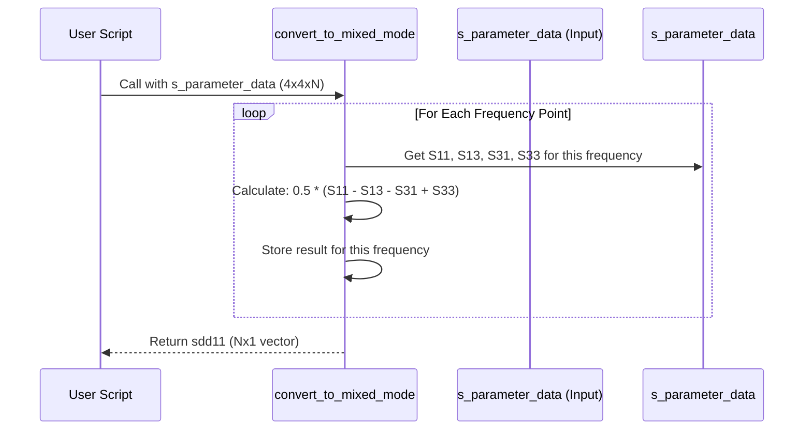

# Chapter 2: Differential Signal Analysis

In [Chapter 1: S-Parameter Data Handling](01_s_parameter_data_handling_.md), we learned how to load the "electrical blueprints" (S-parameter files) of our high-speed components into MATLAB using `kr100G-ck`. Now that we have this raw data (often from a 4-port `.s4p` file), we need to interpret it in a way that makes sense for modern high-speed communication links.

## Why Talk Differently? Handling Noise

Imagine trying to have a quiet conversation next to a noisy construction site. If you just shout louder (like increasing power in a simple electrical signal), the noise still interferes. This is similar to **single-ended signaling**, where a signal is measured relative to a common ground reference. Any noise picked up by the signal wire or the ground affects the message.

Now, imagine you and a friend are the messengers. Instead of shouting the same message, you shout opposite instructions: you shout "Go LEFT!" while your friend simultaneously shouts "Go RIGHT!". Someone listening far away can focus on the *difference* between your messages. If a sudden loud noise (like a jackhammer) happens, it affects both of you equally. When the listener subtracts the background noise by focusing on the difference, the original message ("LEFT!" vs "RIGHT!") becomes clear again.

This is the core idea behind **differential signaling**. Signals are sent as a *pair* of wires carrying opposite polarity signals (Signal+ and Signal-). The receiver looks at the *difference* between these two signals. Because noise often affects both wires similarly ("common-mode noise"), subtracting the signals at the receiver cancels out a lot of this noise. This is crucial for high-speed links like 100G Ethernet (KR100G), which are very sensitive to noise.

**Our goal in this chapter:** Understand how to take the standard 4-port S-parameter data (which describes individual wires) and convert it into parameters that describe the behavior of these differential signal pairs.

## From Four Wires to Differential Pairs

Chapter 1 showed us how to load a `.s4p` file, giving us a `s_parameter_data` variable. This variable contains information about how signals interact between four different connection points (ports). For a typical differential link, we might label these ports like this:

```mermaid
graph LR
    subgraph Input End
        Port1(Port 1: In +)
        Port3(Port 3: In -)
    end
    subgraph Output End
        Port2(Port 2: Out +)
        Port4(Port 4: Out -)
    end
    Component[High-Speed Component (Cable, Connector, etc.)]

    Port1 -- Signal+ --> Component
    Port3 -- Signal- --> Component
    Component -- Signal+ --> Port2
    Component -- Signal- --> Port4
```

The `.s4p` file tells us things like:
*   `S11`: How much signal reflects back into Port 1 when sent into Port 1.
*   `S21`: How much signal comes out of Port 2 when sent into Port 1.
*   `S31`: How much signal "leaks" out of Port 3 when sent into Port 1.
*   ...and so on for all 16 combinations (S11, S12, S13, S14, S21, ..., S44).

But for differential analysis, we're more interested in questions like:
*   How much of the *differential* signal (Port 1 vs Port 3) reflects back from the input pair? This is called **Sdd11** (Differential input reflection).
*   How much of the *differential* signal successfully travels from the input pair (1 & 3) to the output pair (2 & 4)? This is called **Sdd21** (Differential transmission or insertion loss).

These "mixed-mode" S-parameters (like Sdd11, Sdd21, Scc11, Scd11, etc., where 'd' means differential and 'c' means common-mode) give us a much clearer picture of how the *differential* signal behaves.

## Converting to Differential: Using `convert_to_mixed_mode`

`kr100G-ck` provides a function specifically for this conversion, focusing on calculating **Sdd11**, the differential reflection at the input. This is often the most important parameter for initial checks and for calculating things like the impedance profile (which we'll see in [Chapter 5: Impedance Profile Calculation](05_impedance_profile_calculation_.md)).

**Use Case:** We've loaded `my_connector.s4p` and have the `frequencies` and `s_parameter_data` variables. We now want to calculate the differential reflection, Sdd11.

**Input:** The `s_parameter_data` variable (a 4x4xN complex array, where N is the number of frequency points).
**Output:** A variable (let's call it `sdd11`) containing the Sdd11 value for each frequency (an N x 1 complex vector).

**Example Code:**

```matlab
% --- Prerequisite: Load S-parameters (from Chapter 1) ---
s_param_file_path = 'C:\path\to\your\data\my_connector.s4p';
disp(['Reading S-parameters from: ' s_param_file_path]);
[frequencies, s_parameter_data] = read_sparam_4port(s_param_file_path);
disp('S-parameters loaded.');

% --- Now, convert to Differential Reflection (Sdd11) ---
disp('Converting to differential S-parameters (Sdd11)...');
% Use the function from com_tdr.m
sdd11 = convert_to_mixed_mode(s_parameter_data);

% Display confirmation and the size of the result
disp('Conversion complete!');
num_freq_points = length(sdd11);
disp(['Calculated Sdd11 for ' num2str(num_freq_points) ' frequency points.']);

% Now, 'sdd11' holds the differential reflection data.
% We can plot it against 'frequencies' or use it for further analysis.
```

**What happens when you run this?**

After loading the data (as in Chapter 1), the code calls `convert_to_mixed_mode` with the raw 4x4xN S-parameter data. The function performs the necessary calculations and returns a vector `sdd11`, where each element corresponds to the differential reflection at one of the frequencies in the `frequencies` vector.

## Under the Hood: The Magic Formula

How does `convert_to_mixed_mode` work? It doesn't require magic, just some specific math! It combines certain elements from the original 4x4 single-ended S-parameter matrix for each frequency point to calculate the desired mixed-mode parameter.

For **Sdd11**, the formula relies on the standard port numbering convention (Ports 1 & 3 are the input pair, 2 & 4 are the output pair):

`Sdd11 = 0.5 * (S11 - S13 - S31 + S33)`

Let's break this down:
*   `S11`: Signal reflection back into Port 1.
*   `S33`: Signal reflection back into Port 3.
*   `S13`: Signal crossing from Port 3 *into* Port 1 (undesired leakage).
*   `S31`: Signal crossing from Port 1 *into* Port 3 (undesired leakage).

The formula essentially combines the reflections on the intended paths (`S11`, `S33`) and subtracts the crosstalk or leakage between the paired input ports (`S13`, `S31`). The `0.5` factor is for normalization.

**Simplified Flow:**



**Code Glimpse: The `convert_to_mixed_mode` function (from `com_tdr.m`)**

This is the actual function that performs the conversion.

```matlab
% Inside com_tdr.m file...
function sdd11 = convert_to_mixed_mode(s_matrix)
    % Convert 4-port single-ended S-parameters (s_matrix)
    % to differential input reflection (Sdd11).

    % Find out how many frequency points we have
    n_freq = size(s_matrix, 3);

    % Create an empty vector to store the results
    sdd11 = zeros(n_freq, 1);

    % Loop through each frequency point
    for i = 1:n_freq
        % Get the 4x4 S-parameter matrix for the current frequency
        s = s_matrix(:,:,i);

        % Apply the formula for Sdd11:
        % Sdd11 = 0.5 * (S11 - S13 - S31 + S33)
        sdd11(i) = 0.5 * (s(1,1) - s(1,3) - s(3,1) + s(3,3));
    end
    % The loop finishes, and the function returns the 'sdd11' vector.
end
```

*Explanation:* The function takes the 3D array `s_matrix` as input. It figures out how many frequency points (`n_freq`) there are. It then loops through each frequency point (`i`). Inside the loop, it extracts the 4x4 matrix `s` for that frequency and applies the mathematical formula using standard MATLAB matrix indexing (e.g., `s(1,1)` is S11, `s(1,3)` is S13). The calculated `sdd11` value for that frequency is stored in the `sdd11` vector. Finally, the complete vector is returned.

## Why is This Important?

Converting to differential parameters like Sdd11 is essential because:
1.  **Real-World Relevance:** High-speed links *operate* differentially. Analyzing Sdd11 tells us directly about the performance related to how the link is actually used.
2.  **Noise Immunity:** Differential parameters inherently account for the noise-canceling benefits of this signaling scheme.
3.  **Foundation for Further Analysis:** Sdd11 is a key input for other important analyses like [Time Domain Reflectometry (TDR)](04_time_domain_reflectometry__tdr__.md) and calculating the [Impedance Profile Calculation](05_impedance_profile_calculation_.md), which help us find physical defects or impedance mismatches in the link.

## Conclusion

In this chapter, we explored the concept of differential signaling and why it's vital for noise immunity in high-speed channels. We learned that the raw 4-port S-parameters loaded in Chapter 1 represent single-ended measurements, but we often need to analyze the system's *differential* behavior. We saw how the `convert_to_mixed_mode` function in `kr100G-ck` calculates the differential reflection (Sdd11) using a specific formula based on the single-ended S-parameters.

With the ability to load S-parameters and convert them into meaningful differential terms, we are now ready to configure the specific settings for our analysis.

**Next:** [Chapter 3: Analysis Configuration](03_analysis_configuration_.md)

---

Generated by [AI Codebase Knowledge Builder](https://github.com/The-Pocket/Tutorial-Codebase-Knowledge)