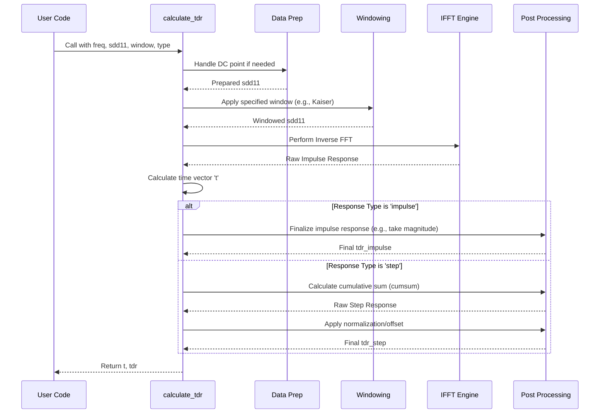

# Chapter 4: Time Domain Reflectometry (TDR)

In [Chapter 3: Analysis Configuration](03_analysis_configuration_.md), we learned how to set up the "control panel" for our simulations using configuration files. We now know how to load our channel's "blueprint" ([S-Parameter Data Handling](01_s_parameter_data_handling_.md)), process it for differential signals ([Differential Signal Analysis](02_differential_signal_analysis_.md)), and tell the analysis tool exactly what settings to use.

Now, let's dive into one of the fundamental analysis techniques `kr100G-ck` can perform: Time Domain Reflectometry, or TDR.

## What's the Goal? Seeing Inside the Cable

Imagine you have a long garden hose, and you suspect there's a kink somewhere that's reducing the water flow. How can you find the exact location of the kink without cutting the hose open?

You could try sending a quick burst of water pressure down the hose and carefully listening or feeling for where the "echo" or pressure wave bounces back from the constriction.

**Time Domain Reflectometry (TDR)** is very similar, but for electrical cables and pathways. It's like an electrical "sonar" or "radar" for your channel (like a cable, connector, or circuit board trace). We send a tiny, fast electrical pulse (like a sonar ping) down the path and "listen" for the electrical echoes (reflections) that bounce back.

These reflections occur wherever the electrical properties of the path change. This could be:
*   A connector
*   A sharp bend in a circuit board trace
*   Damage to a cable
*   A change in the material
*   Essentially, any "bump," "constriction," or change along the way.

By analyzing the timing and strength of these echoes, TDR lets us "see" inside the channel and map out these changes over distance (which corresponds to time).

**Our goal in this chapter:** Understand how TDR works conceptually and how `kr100G-ck` calculates TDR information from the S-parameter data we loaded earlier.

## From Frequency Ripples to Time Echoes

In Chapter 1, we learned that S-parameters tell us how a channel reflects (`S11`) and transmits (`S21`) signals at *different frequencies*. This is called the **frequency domain** view. It's like knowing how well a musical instrument produces different notes (frequencies).

TDR, however, looks at how a signal behaves over *time* as it travels down the channel. This is the **time domain** view. It's like hearing the actual sound of the instrument playing a short tune over a few seconds.

How do we get from the frequency domain (S-parameters) to the time domain (TDR)? We use a mathematical tool called the **Inverse Fast Fourier Transform (IFFT)**. The IFFT is like a special calculator that converts frequency information into time information.

In [Chapter 2: Differential Signal Analysis](02_differential_signal_analysis_.md), we calculated `sdd11`, the differential reflection. This tells us how much of the *differential* signal reflects back at each frequency. By applying the IFFT to `sdd11`, we can get the TDR response – how a differential pulse would reflect back over time.

## Two Ways to Look at TDR: Impulse and Step

`kr100G-ck` can calculate two main types of TDR responses:

1.  **Impulse Response:** Imagine sending a single, extremely short "ping" (an impulse) down the channel. The TDR impulse response shows the echoes coming back over time. A sharp peak in the impulse response indicates a reflection happening at that specific point in time (and thus, location) along the channel. It's great for pinpointing the exact location of changes.

2.  **Step Response:** Imagine flipping a switch "on" instantly (a step change in voltage) and sending that steady signal down the channel. The TDR step response shows how the *reflected voltage level* changes over time as the signal travels. It starts at zero reflection, then jumps up or down at each point where the channel's *impedance* (electrical resistance to high-frequency signals) changes. The level it settles at between changes tells you the impedance of that section. It's very useful for seeing the impedance profile along the channel.

Think of it like this:
*   **Impulse:** Like tapping on a wall and listening for distinct echoes from obstacles.
*   **Step:** Like turning on a faucet into a series of connected pipes of different diameters – the pressure you feel back changes as the water front hits each change in diameter.

## Calculating TDR in `kr100G-ck`

The function `calculate_tdr` (found in `com_tdr.m`) is the workhorse for this.

**Use Case:** We have the `frequencies` and the differential reflection `sdd11` calculated from our `.s4p` file. We want to find both the TDR impulse and step responses.

**Input:**
*   `freq`: The vector of frequencies (from Chapter 1).
*   `s_param`: The S-parameter data to analyze (we'll use `sdd11` from Chapter 2).
*   `window_type`: A smoothing method (e.g., 'kaiser') to reduce artificial ringing in the results. Optional but recommended.
*   `response_type`: Either 'impulse' or 'step'.
*   `is_differential`: A flag (usually `true` when using `sdd11`).

**Output:**
*   `t`: A vector representing time (usually in nanoseconds, ns).
*   `tdr`: The calculated TDR response (either impulse or step) corresponding to each time point in `t`.

**Example Code:**

```matlab
% --- Prerequisites: Load S-parameters and get Sdd11 ---
s_param_file_path = 'C:\path\to\your\data\my_connector.s4p';
[frequencies, s_parameter_data] = read_sparam_4port(s_param_file_path);
sdd11 = convert_to_mixed_mode(s_parameter_data);
disp('Frequencies and Sdd11 obtained.');

% --- Calculate TDR Impulse Response ---
disp('Calculating TDR Impulse Response...');
window = 'kaiser'; % Use Kaiser window for smoothing
[t_impulse, tdr_impulse] = calculate_tdr(frequencies, sdd11, window, 'impulse', true);
disp(['Impulse response calculated for ' num2str(length(t_impulse)) ' time points.']);

% --- Calculate TDR Step Response ---
disp('Calculating TDR Step Response...');
[t_step, tdr_step] = calculate_tdr(frequencies, sdd11, window, 'step', true);
disp(['Step response calculated for ' num2str(length(t_step)) ' time points.']);

% Now 't_impulse' and 'tdr_impulse' hold the impulse response data,
% and 't_step' and 'tdr_step' hold the step response data.
% We can plot these results (e.g., plot(t_impulse, tdr_impulse)).
```

**What happens when you run this?**

1.  The code first gets the necessary frequency data (`frequencies`) and the differential reflection data (`sdd11`).
2.  It calls `calculate_tdr` once with `response_type` set to `'impulse'`. This function performs the IFFT on `sdd11` (after applying the Kaiser window) and returns the time vector and the impulse response.
3.  It calls `calculate_tdr` again, this time with `response_type` set to `'step'`. This function performs the IFFT and then calculates the cumulative sum to get the step response, returning the corresponding time vector and step response data.

## Under the Hood: How `calculate_tdr` Works

The process inside `calculate_tdr` follows these main steps:

1.  **Prepare Data:** Checks if the data starts at DC (0 Hz). If not, it often extrapolates to estimate the DC value, which is important for the IFFT.
2.  **Apply Window:** Multiplies the S-parameter data (`sdd11`) by a mathematical "window" function (like Kaiser or Hamming). This helps to reduce sharp transitions at the beginning and end of the frequency data, which prevents unrealistic ringing or oscillations in the resulting time-domain signal. Think of it like smoothly fading the frequency data in and out.
3.  **Perform IFFT:** Uses MATLAB's `ifft` function on the windowed S-parameter data. This converts the frequency-domain reflection information into the time-domain *impulse* response.
4.  **Calculate Time Vector:** Determines the time step (`dt`) based on the maximum frequency in the input data (`freq`). It then creates the time vector `t` corresponding to the output of the `ifft`.
5.  **Calculate Step Response (if requested):** If `response_type` is 'step', it calculates the cumulative sum (`cumsum` in MATLAB) of the impulse response. This mathematically simulates the response to a step input.
6.  **Normalize/Scale (Optional):** Sometimes applies scaling or offsets to make the step response easier to interpret, typically ranging from -1 to +1.
7.  **Return Results:** Outputs the time vector (`t`) and the calculated TDR response (`tdr`).

**Simplified Flow:**



**Code Glimpse 1: Windowing and IFFT (from `com_tdr.m`)**

This shows the core transformation step.

```matlab
% Inside the calculate_tdr function...

    % Apply window to reduce ringing
    if strcmp(window_type, 'kaiser')
        % Use Kaiser window (beta=6 is common)
        w = kaiser(length(s_param), 6);
    else % Default or other type (e.g., hamming)
        w = hamming(length(s_param));
    end
    s_param_w = s_param .* w; % Apply window by element-wise multiplication

    % Compute impulse response using Inverse Fast Fourier Transform
    tdr_impulse_raw = ifft(s_param_w);

    % Calculate time vector based on frequency spacing
    % freq(end) is the maximum frequency
    dt = 1 / (2 * freq(end)); % Time step
    t = (0:length(tdr_impulse_raw)-1)' * dt * 1e9;  % Time in nanoseconds (ns)
```

*Explanation:* The code first creates a window vector `w` (here, a Kaiser window). It multiplies the input S-parameter data (`s_param`, which is `sdd11` in our case) by this window element by element. Then, it calls the `ifft` function on the windowed data (`s_param_w`) to get the raw impulse response. Finally, it calculates the corresponding time vector `t` in nanoseconds.

**Code Glimpse 2: Calculating Step Response (from `com_tdr.m`)**

This shows how the step response is derived from the impulse response.

```matlab
% Inside the calculate_tdr function, after getting tdr_impulse_raw...

    if strcmp(response_type, 'step')
        % Calculate step response by integrating the impulse response
        % Integration is approximated by cumulative summation
        tdr_step_raw = cumsum(real(tdr_impulse_raw)); % Take real part first

        % --- Apply normalization and offset (simplified) ---
        % This makes the plot typically range from -1 to 1
        % and centers it around zero for long times.
        tdr_step_scaled = some_scaling_function(tdr_step_raw);
        tdr = tdr_step_scaled; % Assign to output variable
    else % response_type is 'impulse'
        % For impulse, often we just want the magnitude
        tdr = abs(tdr_impulse_raw); % Assign absolute value to output
    end
```

*Explanation:* If the user requested a `'step'` response, the code calculates the cumulative sum (`cumsum`) of the real part of the raw impulse response. This is the step response. It then applies some scaling and offsetting (represented here by `some_scaling_function`) to make the output easier to interpret visually. If the user requested `'impulse'`, it often just takes the absolute value (`abs`) of the raw impulse response. The final result (either step or impulse) is assigned to the output variable `tdr`.

## Why is TDR Important?

TDR is a powerful diagnostic tool:
*   **Finds Problems:** It helps locate physical discontinuities like bad solder joints, crushed cables, or impedance mismatches between connectors and circuit boards.
*   **Verifies Design:** It can check if a manufactured cable or PCB trace meets its impedance specifications.
*   **Input for Impedance Calculation:** The TDR step response is the direct input needed to calculate the impedance profile along the channel, which we will cover in the next chapter.

By transforming frequency-domain S-parameter data into the time domain, TDR gives us valuable insights into the physical structure and quality of our high-speed communication path.

## Conclusion

In this chapter, we explored Time Domain Reflectometry (TDR), an electrical "sonar" technique used to find changes and potential problems along a signal path. We learned that it works by sending a pulse and analyzing the reflections (echoes). We saw that `kr100G-ck` uses the IFFT to convert frequency-domain S-parameters (like `sdd11`) into time-domain TDR responses, offering both impulse (for locating reflections) and step (for seeing impedance levels) views. We looked at how the `calculate_tdr` function implements this, including windowing and the core IFFT transformation.

The TDR step response gives us a map of reflection coefficients over time. How can we convert this into a map of the actual impedance values (in Ohms) along the channel? That's exactly what we'll cover next.

**Next:** [Chapter 5: Impedance Profile Calculation](05_impedance_profile_calculation_.md)

---

Generated by [AI Codebase Knowledge Builder](https://github.com/The-Pocket/Tutorial-Codebase-Knowledge)