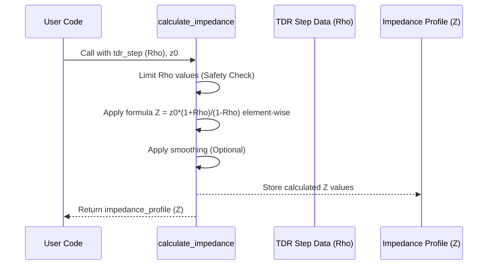

# Chapter 5: Impedance Profile Calculation

Welcome back! In [Chapter 4: Time Domain Reflectometry (TDR)](04_time_domain_reflectometry__tdr__.md), we learned how to use TDR, our electrical "sonar," to send a signal down a channel and listen for echoes (reflections). We saw how to calculate the TDR *step response*, which shows us the strength of the reflection coming back at each point in time. This is like knowing *how much* water pressure bounces back as a water wave travels through pipes.

But just knowing there's a reflection isn't always enough. What we often really want to know is: how "wide" or "narrow" does the electrical path *feel* to the signal at each point? This electrical "width" is called **impedance**.

## What's the Goal? Mapping the Electrical Highway Width

Imagine our electrical signal is like traffic flowing down a highway. If the highway always has the same number of lanes (say, 3 lanes), traffic flows smoothly. But what if suddenly it narrows to 1 lane, or widens to 5 lanes? You'd get traffic jams (reflections!) and slowdowns.

High-speed signals need a smooth "highway" with a consistent electrical width, or **characteristic impedance**. For differential signals like those in 100G Ethernet, this target impedance is typically **100 Ohms**. Changes or bumps in this impedance cause signals to reflect, just like echoes in TDR. These reflections can corrupt the signal, leading to errors.

The TDR step response we calculated in Chapter 4 tells us the *reflection coefficient* (often called Rho or Γ) at each point. This coefficient is a number between -1 and +1 that says how much of the signal bounces back.
*   Rho = 0 means no reflection (perfect match).
*   Rho > 0 means the path ahead looks "wider" (higher impedance).
*   Rho < 0 means the path ahead looks "narrower" (lower impedance).

**Our goal in this chapter:** Learn how to convert the TDR step response (reflection coefficient map) into an **Impedance Profile** – a map showing the actual impedance value (in Ohms) at each point along the channel. This helps us directly see if the channel meets its target (like 100 Ohms) and pinpoint where the "lane changes" (impedance mismatches) occur.

## The Magic Formula: From Reflections to Ohms

Luckily, there's a direct mathematical relationship between the reflection coefficient (Rho, Γ) from the TDR step response, the reference impedance of our measurement system (Z0), and the actual impedance (Z) at a specific point along the channel.

The formula is:

`Z = Z0 * (1 + Rho) / (1 - Rho)`

Where:
*   `Z` is the impedance we want to calculate at a specific point (in Ohms).
*   `Z0` is the reference impedance. For differential signals, this is usually 100 Ohms. For single-ended, it's often 50 Ohms.
*   `Rho` (or Γ) is the reflection coefficient at that point, which we get directly from the TDR step response calculated in Chapter 4.

This formula tells us that if we know the reference impedance and how much signal is reflected at a point, we can calculate the impedance the signal is encountering at that point.

## Calculating Impedance in `kr100G-ck`

The `kr100G-ck` project provides a function called `calculate_impedance` (inside `com_tdr.m`) to do this calculation for us.

**Use Case:** We have calculated the TDR step response (`tdr_step`) and its corresponding time vector (`t_step`) for our differential channel in Chapter 4. We know the target differential impedance is 100 Ohms. We want to find the impedance profile.

**Input:**
*   `reflection_coefficient`: The TDR step response vector (`tdr_step`).
*   `z0`: The reference impedance (e.g., `100.0` for 100 Ohm differential).

**Output:**
*   `impedance`: A vector containing the calculated impedance value (in Ohms) for each corresponding point in the `tdr_step` input.

**Example Code:**

```matlab
% --- Prerequisites: Calculate TDR Step Response (from Chapter 4) ---
% Assume we have 't_step' and 'tdr_step' from calculate_tdr
% t_step: Time vector (ns)
% tdr_step: Reflection coefficient vector (unitless)

% Define the reference impedance for our differential system
reference_impedance = 100.0; % Ohms

% --- Calculate the Impedance Profile ---
disp('Calculating Impedance Profile...');
impedance_profile = calculate_impedance(tdr_step, reference_impedance);

% Display confirmation
num_points = length(impedance_profile);
disp(['Impedance profile calculated for ' num2str(num_points) ' points.']);

% Now 'impedance_profile' holds the impedance values (Ohms)
% corresponding to each time point in 't_step'.
% We can plot this: plot(t_step, impedance_profile)
```

**What happens when you run this?**

1.  We provide the `tdr_step` vector (which contains the reflection coefficient values over time) and the known `reference_impedance` (100 Ohms).
2.  The `calculate_impedance` function takes these inputs.
3.  It applies the formula `Z = Z0 * (1 + Rho) / (1 - Rho)` to *every single value* in the `tdr_step` vector.
4.  It returns a new vector, `impedance_profile`, where each value is the calculated impedance in Ohms at that point in time/distance along the channel.

Plotting `impedance_profile` against `t_step` gives us a visual map of how the channel's impedance changes along its length.

## Under the Hood: Applying the Formula

What does `calculate_impedance` actually do internally? It's quite straightforward:

1.  **Get Inputs:** It receives the vector of reflection coefficients (`reflection_coefficient`, which is our `tdr_step`) and the reference impedance (`z0`).
2.  **Safety Check:** It makes sure the reflection coefficient values don't get too close to +1 or -1, as this would cause the formula to "blow up" (division by zero). It limits them slightly (e.g., to +/- 0.9 or 0.99). This prevents unrealistic infinite or zero impedance values which can happen due to noise or calculation artifacts.
3.  **Apply Formula:** It performs the core calculation `z0 * (1 + rc_limited) ./ (1 - rc_limited)` for every element in the (limited) reflection coefficient vector. The `./` means element-wise division in MATLAB, so it calculates the impedance for each point individually.
4.  **Smooth (Optional):** Sometimes, the raw impedance profile can look a bit noisy or jagged. The function might apply a light smoothing filter (like a moving average) to make the overall trend easier to see. This is like slightly blurring a pixelated image to see the shapes better.
5.  **Return Result:** It outputs the final calculated `impedance` vector.

**Simplified Flow:**



**Code Glimpse: The Core Calculation (from `com_tdr.m`)**

This snippet shows the heart of the `calculate_impedance` function.

```matlab
% Inside the calculate_impedance function...
function impedance = calculate_impedance(reflection_coefficient, z0)

    % Limit reflection coefficient to avoid division by zero or instability
    % Keep it slightly away from +/- 1.0
    rc_limited = max(min(reflection_coefficient, 0.99), -0.99); % Limit between -0.99 and +0.99

    % Calculate impedance using the formula
    % Z = Z0 * (1 + Rho) / (1 - Rho)
    % The './' performs element-wise division for the whole vector at once
    impedance = z0 * (1 + rc_limited) ./ (1 - rc_limited);

    % --- Apply light smoothing (optional, for visual clarity) ---
    % This uses a simple moving average filter
    window_size = 5; % Example: Average over 5 points
    if length(impedance) > window_size
        kernel = ones(window_size, 1) / window_size;
        % 'same' keeps the output vector the same size as the input
        impedance = conv(impedance, kernel, 'same');
    end

    % 'impedance' vector is returned
end
```

*Explanation:* The function first limits the input `reflection_coefficient` values using `max` and `min` to keep them within a safe range (here, -0.99 to +0.99). Then, it applies the core impedance formula using element-wise operations (`+`, `-`, `*`, `./`) which are very efficient in MATLAB. Finally, it includes an optional smoothing step using `conv` (convolution) with a small averaging kernel to reduce noise in the output impedance profile. The final `impedance` vector is then returned.

## Why is This Important? Finding the Bumps

The impedance profile is one of the most useful outputs for diagnosing channel problems:
*   **Visual Check:** Plotting the impedance profile lets you immediately see if the channel stays close to the target impedance (e.g., 100 Ohms).
*   **Locating Mismatches:** Large spikes or dips in the profile clearly show locations where the impedance changes significantly. These often correspond to connectors, vias (connections between PCB layers), poor cable construction, or other physical features that can degrade the signal.
*   **Design Verification:** It helps engineers confirm if their circuit board layout or cable design achieves the desired impedance control.
*   **Quality Control:** Can be used in manufacturing to check if products meet impedance specifications.

By transforming abstract reflection coefficients into concrete impedance values (Ohms), we gain a much more intuitive understanding of the electrical highway our signal has to navigate.

## Conclusion

In this chapter, we bridged the gap between the TDR reflections (from Chapter 4) and the physical property they represent: characteristic impedance. We learned the simple formula `Z = Z0 * (1 + Rho) / (1 - Rho)` that allows us to convert the TDR step response (Rho) into an impedance profile (Z). We saw how the `calculate_impedance` function in `kr100G-ck` implements this conversion, including safety checks and optional smoothing.

The impedance profile gives us a clear map of the electrical "width" along our channel, making it easy to spot problem areas where the impedance deviates from the target, which could cause signal integrity issues.

We now have several powerful tools: reading S-parameters, converting to differential, calculating TDR, and mapping impedance. How do we put all this together, along with transmitter and receiver equalization, noise, and other real-world effects, to get a single number that tells us if the channel is likely to work? That's where the Channel Operating Margin (COM) comes in, which we'll explore in the next chapter.

**Next:** [Chapter 6: COM Execution Framework](06_com_execution_framework_.md)

---

Generated by [AI Codebase Knowledge Builder](https://github.com/The-Pocket/Tutorial-Codebase-Knowledge)