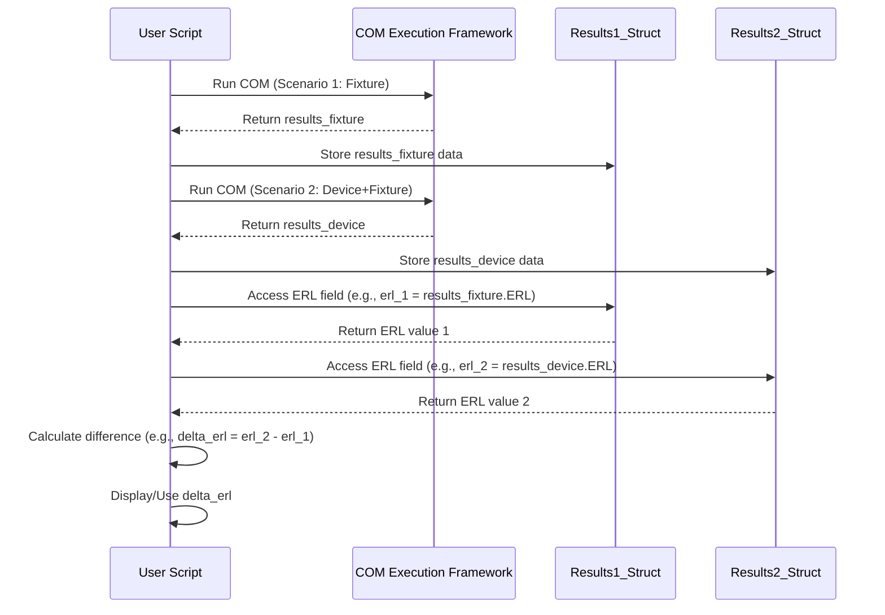

# Chapter 7: Metric Extraction & Comparison

In [Chapter 6: COM Execution Framework](06_com_execution_framework_.md), we saw how `kr100G-ck` can run a sophisticated simulation, like COM, which acts like a flight simulator for our data signals. Running this simulation is great, but the simulator produces a lot of detailed output. How do we pull out the most important numbers – the final score or the key performance indicators – from this complex report?

## What's the Goal? Reading the Scoreboard

Imagine our COM simulation just finished its "flight." It generated a detailed report with hundreds of data points about the flight path, engine performance, fuel consumption over time, etc. That's useful for deep analysis, but often, we just want the quick summary:
*   Did the plane land successfully (Pass/Fail)?
*   What was the final fuel margin (COM value)?
*   What was the maximum vibration experienced (related to noise/reflections)?
*   What was the landing smoothness score (related to signal quality)?

In `kr100G-ck`, the COM simulation output contains many calculated values. We often need to extract specific, standard metrics like:
*   **COM (Channel Operating Margin):** The main pass/fail number (in dB).
*   **ERL (Effective Return Loss):** A measure of how much unwanted reflection there is, considering the transmitter's capabilities (in dB).
*   **Vf (Steady State Voltage):** The voltage level the signal settles to at the receiver (in mV).
*   **Pmax/Vf (Peak Voltage / Steady State Voltage):** A ratio related to signal distortion.

**Our goal in this chapter:** Learn how the results from analyses like COM are stored and how we can easily extract these key performance metrics. We'll also see how to compare these metrics from different simulation runs (e.g., analyzing a channel with and without a test fixture).

## Where are the Results Stored? The Results Structure

Remember in Chapter 6, when we called a function like `run_com_ieee8023_93a_320`?
```matlab
% From Chapter 6 Example
com_results = run_com_ieee8023_93a_320(config_file, num_fext, num_next, signal_path, noise_path);
```
The output, which we stored in the variable `com_results`, isn't just a single number. It's typically a MATLAB **structure**. Think of a structure like a container or a folder that holds many different pieces of information, each with its own label (called a "field").

The [COM Execution Framework](06_com_execution_framework_.md) calculates various metrics and intermediate values during the simulation and conveniently bundles them into this structure.

## Extracting Metrics: Looking Inside the Container

Accessing the information inside a structure in MATLAB is easy. You use the structure variable's name, followed by a dot (`.`), followed by the field name (the label).

**Use Case:** You've run the COM simulation and the results are in the `com_results` variable. You want to get the COM value and the ERL value.

**Input:** The `com_results` structure returned by the COM function.
**Output:** The specific numerical values for COM and ERL.

**Example Code:**

```matlab
% Assume 'com_results' structure exists from a previous COM run

disp('Extracting key metrics from the results...');

% Check if the COM field exists and then display it
if isfield(com_results, 'COM')
    com_value_db = com_results.COM; % Access the COM value
    fprintf('COM Value: %.2f dB\n', com_value_db);
else
    disp('COM value not found in results.');
end

% Check if the ERL field exists and then display it
if isfield(com_results, 'ERL')
    erl_value_db = com_results.ERL; % Access the ERL value
    fprintf('ERL Value: %.2f dB\n', erl_value_db);
else
    disp('ERL value not found in results.');
end

% Similarly, you could access other fields if they exist:
% vf_mv = com_results.steady_state_voltage_mV;
% pmax_vf_ratio = com_results.Pmax_by_Vf_est;
```

**What happens when you run this?**

1.  The code checks if a field named `'COM'` exists within the `com_results` structure using `isfield`. This is good practice to avoid errors if the simulation didn't produce that specific metric.
2.  If it exists, the line `com_value_db = com_results.COM;` reads the value associated with the `COM` label inside the `com_results` container and stores it in a new variable `com_value_db`.
3.  It then prints this value.
4.  The same process is repeated for the `ERL` field.

It's that simple! The COM framework does the hard work of calculation; we just need to know the labels (field names) for the metrics we care about. Common field names include `COM`, `ERL`, `steady_state_voltage_mV`, and `Pmax_by_Vf_est`.

## Comparing Results: Apples to Oranges?

Sometimes, we want to compare the results from two different scenarios. A common example is evaluating the impact of a **test fixture** – the cables and connectors used to attach your device to the measurement equipment.

You might run the analysis twice:
1.  **Run 1:** Analyze the S-parameters of your channel *including* the test fixture.
2.  **Run 2:** Analyze the S-parameters of the channel *alone* (if possible, or mathematically remove the fixture's effect).

Or, as seen in the `TP0V_example.m` script within the project, you might:
1.  **Run 1:** Analyze the S-parameters of just the test fixture itself (maybe to calibrate or get reference values like ERL).
2.  **Run 2:** Analyze the S-parameters of your actual device measured *through* the test fixture.

By comparing metrics like ERL between these runs, you can understand the fixture's influence or calculate metrics specific to the device itself.

**Use Case:** You ran COM/ERL analysis on a fixture (`results_fixture`) and then on your device measured through the fixture (`results_device_w_fixture`). You want to compare their ERL values.

**Input:** Two result structures, `results_fixture` and `results_device_w_fixture`.
**Output:** The difference in their ERL values.

**Example Code (Conceptual, inspired by `TP0V_example.m`):**

```matlab
% Assume 'results_fixture' exists from analyzing the fixture alone
% Assume 'results_device_w_fixture' exists from analyzing the device + fixture

disp('Comparing ERL from two different runs...');

% Extract ERL from the fixture-only run
if isfield(results_fixture, 'ERL')
    erl_fixture = results_fixture.ERL;
    fprintf('Fixture ERL: %.2f dB\n', erl_fixture);
else
    disp('ERL not found for fixture run.');
    erl_fixture = NaN; % Use NaN (Not a Number) if missing
end

% Extract ERL from the device + fixture run
if isfield(results_device_w_fixture, 'ERL')
    erl_device = results_device_w_fixture.ERL;
    fprintf('Device + Fixture ERL: %.2f dB\n', erl_device);
else
    disp('ERL not found for device run.');
    erl_device = NaN;
end

% Calculate the difference (if both values were found)
if ~isnan(erl_fixture) && ~isnan(erl_device)
    delta_erl = erl_device - erl_fixture;
    fprintf('Difference in ERL (Device - Fixture): %.2f dB\n', delta_erl);
else
    disp('Cannot calculate difference due to missing ERL values.');
end
```

**What happens when you run this?**

1.  The code extracts the `ERL` value from the first result structure (`results_fixture`).
2.  It extracts the `ERL` value from the second result structure (`results_device_w_fixture`).
3.  It calculates the difference between these two values (`delta_erl`).
4.  It prints the individual ERLs and their difference.

This comparison allows you to quantify the impact of the fixture or isolate the performance of the device under test.

## Under the Hood: Accessing Pre-Calculated Data

Metric extraction isn't usually a complex calculation itself; it's primarily about accessing the data that the [COM Execution Framework](06_com_execution_framework_.md) already calculated and stored.

1.  **COM Runs:** The core COM function (e.g., `run_com_ieee8023_93a_320`) performs all the heavy simulation work based on the S-parameters and configuration.
2.  **Results Packaging:** At the end of the simulation, the framework gathers key results (COM, ERL, Vf, etc.) and puts them into labeled fields within a MATLAB structure.
3.  **Return Structure:** This structure is returned to the calling script.
4.  **User Access:** Your script then accesses specific fields using the `.` notation (e.g., `results.COM`).
5.  **Comparison:** Comparing results from multiple runs involves storing each output structure in a different variable and then simply subtracting the values from the corresponding fields.

**Simplified Flow for Comparison:**



**Code Glimpse: Metric Access in `TP0V_example.m`**

This snippet from `TP0V_example.m` shows how it accesses results stored in a cell array `results` (where `results{1}` might hold fixture results and `results{2}` might hold device results) and calculates the difference in ERL.

```matlab
% Inside TP0V_example.m, after running COM twice and storing in results{1} and results{2}

% Accessing ERL from the first run (reference/fixture)
% Note: Sometimes results are nested, hence the {1, 1} indexing
if ncases == 1 % Check if results are nested or not
    ERL_ref = results{1, 1}.ERL;
else
    ERL_ref = results{1, 1}{1, 1}.ERL; % Access nested structure
end

% Accessing ERL from the second run (device measurement)
% Assuming results{2} holds the second run's output structure
if isfield(results{1, 2}, 'ERL') % Check if field exists in the second result
    ERL_meas = results{1, 2}.ERL;
else
    ERL_meas = NaN; % Handle missing field
end

% Calculate the difference if both are valid
if ~isnan(ERL_ref) && ~isnan(ERL_meas)
    dERL = ERL_meas - ERL_ref; % Simple subtraction

    % Display the difference (using fprintf for formatted output)
    fprintf('Difference in ERL (dERL) = %.3g dB\n', dERL);
else
    disp('Could not calculate dERL.');
end
```

*Explanation:* This code demonstrates accessing the `ERL` field from potentially nested structures returned by the COM framework (stored in `results{1}` and `results{2}`). It handles cases where the structure might be nested differently (`ncases == 1`). After retrieving both `ERL_ref` and `ERL_meas`, it performs a simple subtraction to find `dERL`, the difference between them, and then prints the result. This directly shows the extraction and comparison steps.

## Why is Metric Extraction & Comparison Important?

*   **Focus:** Allows you to focus on the specific numbers that matter for your analysis or for checking compliance against a standard.
*   **Clarity:** Translates complex simulation output into easily understandable performance indicators.
*   **Comparison:** Enables quantitative comparison between different designs, configurations, or measurement setups (like evaluating fixture effects).
*   **Automation:** Extracting metrics programmatically is essential for automating tests and generating reports, which we'll explore next.

Being able to efficiently pull out and compare these key numbers turns the raw simulation output into actionable insights.

## Conclusion

In this chapter, we learned that the results from complex analyses like COM are typically stored in MATLAB structures. We saw how easy it is to extract specific key metrics (like COM, ERL, Vf) from these structures using the simple dot (`.`) notation. We also explored how comparing these metrics from different simulation runs (e.g., with and without a test fixture) can provide valuable insights, using simple subtraction after extracting the relevant values. This process allows us to move from the detailed simulation report to the concise "scoreboard" numbers we often need.

Now that we know how to run simulations and extract the key results, how can we make this process even more efficient, especially if we need to analyze many different channels or test various configurations? The next chapter introduces how to automate these tasks using scripts.

**Next:** [Chapter 8: Automation Scripting](08_automation_scripting_.md)

---

Generated by [AI Codebase Knowledge Builder](https://github.com/The-Pocket/Tutorial-Codebase-Knowledge)