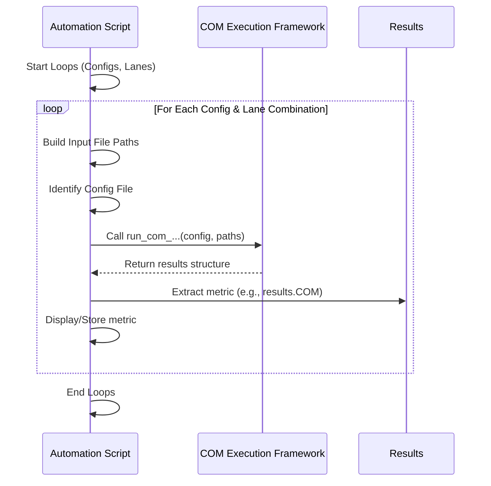

# Chapter 8: Automation Scripting

Welcome to the final chapter of the `kr100G-ck` tutorial! In [Chapter 7: Metric Extraction & Comparison](07_metric_extraction___comparison_.md), we learned how to pull out important results, like COM or ERL, from the detailed output of our simulations. This is great for analyzing a single channel or scenario. But what if you need to test *many* different scenarios? Analyzing dozens, or even hundreds, of channel variations or configurations one by one would be incredibly time-consuming and prone to errors.

## What's the Goal? Setting Up an Assembly Line

Imagine you're running that flight simulator ([Chapter 6: COM Execution Framework](06_com_execution_framework_.md)) we talked about. Running it once for one specific aircraft configuration and weather condition is easy. But what if you need to test 50 different aircraft variations across 10 different weather patterns? Doing each one manually – loading the parameters, running the simulation, recording the results – would take forever!

You'd want an **assembly line**. You'd set it up once to automatically:
1.  Pick the next aircraft variation.
2.  Select the next weather pattern.
3.  Run the simulation.
4.  Record the result.
5.  Repeat until all combinations are tested.

**Automation Scripting** in `kr100G-ck` is exactly this concept. It's about writing simple scripts (programs) that automatically run our analysis functions (like the COM simulator) multiple times, systematically changing the inputs (like channel files or configuration settings) for each run.

**Our goal in this chapter:** Learn how to write basic MATLAB scripts to automate repetitive analysis tasks, saving massive amounts of time and effort.

**Use Case:** We need to run the COM analysis for a 4-lane communication channel. For each lane (Lane 0, Lane 1, Lane 2, Lane 3), we need to test two different chip package models defined in two separate configuration files: `config_pkg1.xlsx` and `config_pkg2.xlsx`. The S-parameter files follow a pattern like `channel_lane0.s4p`, `channel_lane1.s4p`, etc.

## What is Automation Scripting?

At its heart, automation scripting involves using a programming language (in our case, MATLAB) to tell the computer to perform a sequence of tasks automatically. For `kr100G-ck`, this usually means:

1.  **Looping:** Repeating a block of code multiple times. We often use loops to iterate through different lane numbers, test cases, or configuration files.
2.  **Varying Parameters:** Changing the input values for each repetition of the loop. This could mean generating different filenames based on the loop counter or selecting different configuration files.
3.  **Calling Functions:** Inside the loop, calling the core analysis functions we've learned about, like `read_sparam_4port` ([Chapter 1: S-Parameter Data Handling](01_s_parameter_data_handling_.md)), `run_com_ieee8023_93a_320` ([Chapter 6: COM Execution Framework](06_com_execution_framework_.md)), or others.
4.  **Collecting Results:** Storing or displaying the key metrics ([Chapter 7: Metric Extraction & Comparison](07_metric_extraction___comparison_.md)) from each run.

It's like providing a checklist and the necessary parts (S-parameter files, config files) to a robot (the script), which then runs the assembly line (the analysis functions) for you.

## How to Automate in `kr100G-ck`

We use MATLAB scripts (`.m` files) to perform automation. The key tool is the `for` loop, which allows us to repeat actions.

**Example Scenario:** Run COM for Lanes 0 through 3 using `config_pkg1.xlsx`.

**Steps:**
1.  Create a new MATLAB script file (e.g., `automate_my_analysis.m`).
2.  Define the list of lanes we want to test (0, 1, 2, 3).
3.  Define the configuration file to use (`config_pkg1.xlsx`).
4.  Start a `for` loop that iterates through each lane number.
5.  Inside the loop:
    *   Construct the correct S-parameter filename for the current lane (e.g., `channel_lane` + `0` + `.s4p`).
    *   Construct filenames for any noise files similarly.
    *   Call the `run_com_ieee8023_93a_320` function with the constructed filenames and the specified config file.
    *   Extract the `COM` value from the results structure.
    *   Display the lane number and its corresponding COM value.
6.  End the loop.

Let's make this more concrete with our use case (4 lanes, 2 config files).

**Example Script (`automate_my_analysis.m`):**

```matlab
% --- Define Inputs ---
lanes_to_test = [0, 1, 2, 3]; % List of lanes
config_files_to_test = {'config_pkg1.xlsx', 'config_pkg2.xlsx'}; % List of config files
base_signal_filename = 'channel_lane'; % Base name for signal S4P
base_noise_filename = 'noise_lane';   % Base name for noise S4P
num_fext = 1; % Number of FEXT noise files
num_next = 0; % Number of NEXT noise files

disp('Starting Automated Analysis...');

% --- Outer Loop: Iterate through Config Files ---
for cfg_index = 1:length(config_files_to_test)
    current_config_file = config_files_to_test{cfg_index};
    disp(['--- Using Config File: ', current_config_file, ' ---']);

    % --- Inner Loop: Iterate through Lanes ---
    for lane_index = 1:length(lanes_to_test)
        current_lane = lanes_to_test(lane_index);
        lane_str = num2str(current_lane); % Convert lane number to string

        % --- Construct File Names ---
        signal_path = [base_signal_filename, lane_str, '.s4p'];
        noise_path = [base_noise_filename, lane_str, '.s4p'];
        disp(['Analyzing Lane ', lane_str, '...']);
        disp(['  Signal: ', signal_path]);
        disp(['  Noise:  ', noise_path]);

        % --- Run COM Simulation ---
        % (Error handling omitted for simplicity)
        results = run_com_ieee8023_93a_320(current_config_file, ...
            num_fext, num_next, signal_path, noise_path);

        % --- Extract and Display Result ---
        if isfield(results, 'COM')
            com_value = results.COM;
            fprintf('  Lane %d COM = %.2f dB\n', current_lane, com_value);
        else
            fprintf('  Lane %d: COM value not found.\n', current_lane);
        end

    end % --- End of Lane Loop ---
end % --- End of Config File Loop ---

disp('Automated Analysis Complete.');
```

**What happens when you run this script?**

1.  **Setup:** It defines the lists of lanes and config files, and the base filenames.
2.  **Outer Loop:** It starts looping through the `config_files_to_test`.
    *   **First Iteration:** `current_config_file` becomes `'config_pkg1.xlsx'`.
3.  **Inner Loop:** It starts looping through the `lanes_to_test`.
    *   **First Iteration (Inner):** `current_lane` becomes `0`. It builds filenames `channel_lane0.s4p` and `noise_lane0.s4p`. It calls `run_com_ieee8023_93a_320` using `config_pkg1.xlsx` and these lane 0 files. It extracts and prints the COM result for Lane 0 / Pkg 1.
    *   **Second Iteration (Inner):** `current_lane` becomes `1`. It builds filenames `channel_lane1.s4p`, etc. It calls the COM function using `config_pkg1.xlsx` and lane 1 files. It prints the result for Lane 1 / Pkg 1.
    *   *(...repeats for Lane 2 and Lane 3...)*
4.  **Outer Loop Continues:** The inner loop finishes for `config_pkg1.xlsx`. The outer loop moves to the next config file.
    *   **Second Iteration (Outer):** `current_config_file` becomes `'config_pkg2.xlsx'`.
5.  **Inner Loop Repeats:** The inner loop runs again for lanes 0, 1, 2, 3, but this time using `config_pkg2.xlsx` to call the COM function. It prints the results for Lanes 0-3 / Pkg 2.
6.  **Finish:** Both loops complete, and the script prints "Automated Analysis Complete."

This script automatically runs the COM simulation 8 times (4 lanes x 2 configs), changing the inputs correctly each time!

*Note:* The file `run_com_script.m` included in `kr100G-ck` is a more complex example of such an automation script, including features like logging results to files and error handling (`try`/`catch`), which are very useful in practice.

## Under the Hood: The Script as a Conductor

The automation script itself doesn't perform the complex analysis. It acts like a conductor leading an orchestra.

1.  **The Script (`automate_my_analysis.m`):** Reads the plan (which lanes/configs to test).
2.  **The Loop:** Tells the conductor which piece to play next (Lane 0, Pkg 1; then Lane 1, Pkg 1; ... then Lane 0, Pkg 2; etc.).
3.  **Parameter Building:** The conductor hands out the correct sheet music (constructs filenames, selects config file).
4.  **Function Call:** The conductor signals the orchestra ([Chapter 6: COM Execution Framework](06_com_execution_framework_.md)) to play using that specific music.
5.  **Result Handling:** The conductor listens to the performance ([Chapter 7: Metric Extraction & Comparison](07_metric_extraction___comparison_.md)) and notes down the key result.
6.  **Repeat:** The loop tells the conductor to move to the next piece.

**Simplified Flow:**



The script simply orchestrates the calls to the powerful analysis functions provided by `kr100G-ck`, feeding them the correct inputs for each run based on the loop variables.

## Benefits of Automation

Why bother writing a script?
*   **Saves Time:** Dramatically reduces manual effort for large sets of simulations.
*   **Ensures Consistency:** Reduces human error by applying the exact same process every time.
*   **Enables Large-Scale Testing:** Makes it feasible to test hundreds or thousands of variations (e.g., across manufacturing tolerances, different environmental conditions).
*   **Repeatability:** Easy to re-run the entire test suite later if designs change or bugs are fixed.

## Conclusion

In this chapter, we explored the power of **Automation Scripting**. We learned that by using simple MATLAB scripts with `for` loops, we can automatically run analyses like COM multiple times, systematically varying inputs like channel files or [Analysis Configuration](03_analysis_configuration_.md) settings. This "assembly line" approach leverages the functions we learned about in previous chapters – loading data, running simulations, and extracting results – to efficiently handle large-scale testing tasks, saving time and ensuring consistency.

This concludes the `kr100G-ck` tutorial series! We've journeyed from understanding raw [S-Parameter Data Handling](01_s_parameter_data_handling_.md) and [Differential Signal Analysis](02_differential_signal_analysis_.md), through configuring simulations ([Analysis Configuration](03_analysis_configuration_.md)) and specific techniques like [TDR](04_time_domain_reflectometry__tdr__.md) and [Impedance Profile Calculation](05_impedance_profile_calculation_.md), to running the core [COM Execution Framework](06_com_execution_framework_.md), interpreting the [Metric Extraction & Comparison](07_metric_extraction___comparison_.md), and finally, automating the whole process.

You now have a foundational understanding of how `kr100G-ck` works and how you can use it to analyze and predict the performance of high-speed communication channels. Happy analyzing!

---

Generated by [AI Codebase Knowledge Builder](https://github.com/The-Pocket/Tutorial-Codebase-Knowledge)