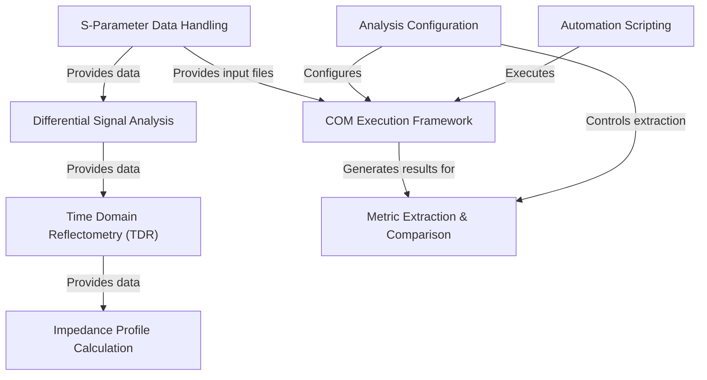

# Tutorial: kr100G-ck

This project analyzes the performance of **high-speed communication channels**, specifically for standards like *KR100G*.
It uses **S-parameter files** (electrical blueprints) to perform **Time Domain Reflectometry (TDR)** for impedance checks and runs **Channel Operating Margin (COM)** simulations to predict *signal quality* and ensure reliable data transmission.

**Source Repository:** [None](None)

## Chapters

1. [S-Parameter Data Handling
](01_s_parameter_data_handling_.md)
2. [Differential Signal Analysis
](02_differential_signal_analysis_.md)
3. [Analysis Configuration
](03_analysis_configuration_.md)
4. [Time Domain Reflectometry (TDR)
](04_time_domain_reflectometry__tdr__.md)
5. [Impedance Profile Calculation
](05_impedance_profile_calculation_.md)
6. [COM Execution Framework
](06_com_execution_framework_.md)
7. [Metric Extraction & Comparison
](07_metric_extraction___comparison_.md)
8. [Automation Scripting
](08_automation_scripting_.md)

---

Generated by [AI Codebase Knowledge Builder](https://github.com/The-Pocket/Tutorial-Codebase-Knowledge)