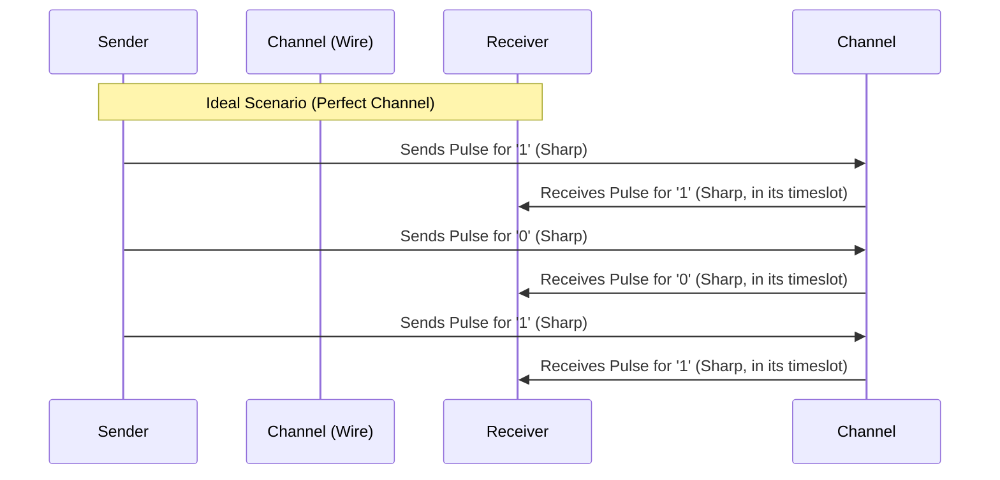
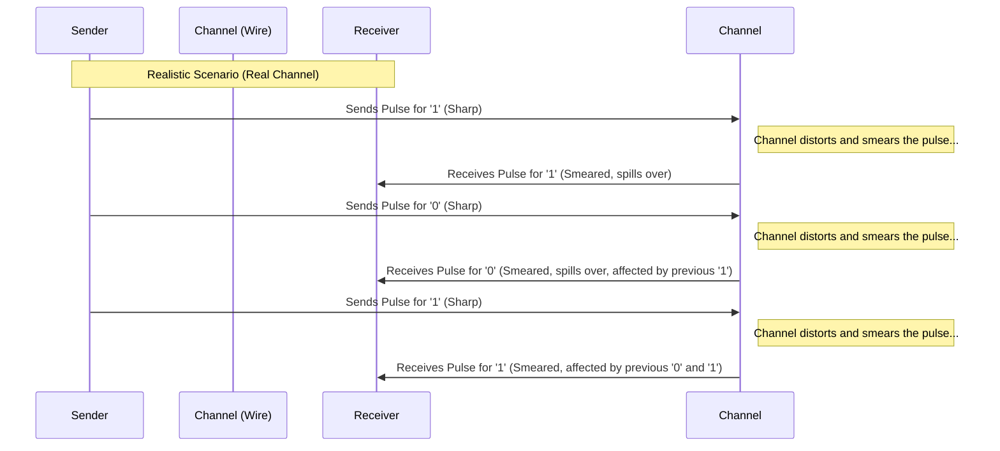

# Chapter 1: Intersymbol Interference (ISI)

Welcome to the first chapter of our tutorial on equalization for high-speed links! We're going to start by understanding the main problem that equalization tries to solve: something called **Intersymbol Interference**, or **ISI** for short.

## Sending Signals Down a Wire

Imagine you want to send digital information – a sequence of 1s and 0s (called bits) – from one place to another very quickly. Think about sending data over a cable connecting two parts of a computer, or across the internet.

You represent these 1s and 0s using electrical signals, maybe a high voltage for a '1' and a low voltage for a '0'. You send these signals one after the other, like pulses of electricity.

In a perfect world, each pulse would be neat and tidy, arriving at the receiver exactly within its designated time slot, looking just like it did when it was sent.

## The Problem: Signals Get "Smeared"

Unfortunately, the real world isn't perfect. The pathways these signals travel through (like copper wires or traces on a circuit board, which we call the "channel") aren't perfect conductors. They have limitations:

1.  **Resistance:** Like friction for electricity, slowing things down.
2.  **Capacitance:** The ability to store charge, which can resist quick voltage changes.
3.  **Inductance:** Resists changes in current flow.
4.  **Frequency Limitations:** Channels often struggle to pass the very high-frequency components needed to make sharp, sudden signal changes (like going instantly from a '0' to a '1'). They act like a filter, blurring sharp edges.

Because of these effects, especially when we try to send bits very, very fast, the electrical pulse representing one bit doesn't stay neatly confined to its own time slot. Instead, it gets "smeared" or "spread out" over time.

Think of it like shouting words quickly in a large, echoey room. Even after you finish saying one word, the echoes linger and overlap with the beginning of the next word. It becomes hard to understand what's being said.

This "smearing" causes the energy from one bit's pulse to leak into the time slots of its neighbors (the bits sent before and after it). This overlap is called **Intersymbol Interference (ISI)**. The "symbols" (our bits, 1s and 0s) are interfering with each other.

## Why is ISI Bad?

When the receiver looks at the signal during a specific time slot, it's not just seeing the signal for the bit that *should* be there. It's also seeing the leftover "echoes" or "smears" from previous bits (post-cursor ISI) and sometimes even effects from bits coming slightly later due to complex channel behaviors (pre-cursor ISI).

Imagine the receiver is trying to decide if the signal represents a '1' (high voltage) or a '0' (low voltage).

*   If a '1' was sent, but echoes from previous '0's make the voltage lower than expected, the receiver might mistakenly think it received a '0'.
*   If a '0' was sent, but echoes from previous '1's make the voltage higher than expected, the receiver might mistakenly think it received a '1'.

These mistakes are called **bit errors**. Too much ISI leads to too many bit errors, making the communication unreliable or forcing us to send data much slower to reduce the smearing effect.

You can see visualizations of how a channel affects the signal on pages 6 and 7 of the `lecture7_ee720_eq_intro_txeq.pdf` slides. A clean, open "eye diagram" (a common way to visualize signal quality) indicates low ISI, while a closed, messy eye indicates high ISI and likely errors. Page 8 highlights the goal: counteract this distortion.

## What Can We Do About It?

We can't easily change the physical properties of the channel (the wire). So, instead, we use clever signal processing techniques to compensate for the channel's distortion. This process is called **Equalization**.

Think of equalization as trying to "un-smear" the signal or cancel out the echoes. We can do this either at the transmitter (before the signal enters the channel) or at the receiver (after the signal has passed through the channel), or sometimes both!

## Conclusion

You now understand the fundamental challenge in high-speed communication: **Intersymbol Interference (ISI)**. It's the smearing of signal pulses due to channel limitations, causing bits to interfere with their neighbors and leading to potential errors at the receiver. It's like echoes muddying speech in a large room.

In the next chapter, we'll start looking at the solution: [Channel Equalization](02_channel_equalization_.md). We'll discuss the general idea of how we can fight back against ISI to achieve clear, fast, and reliable communication.

---

Generated by [AI Codebase Knowledge Builder](https://github.com/The-Pocket/Tutorial-Codebase-Knowledge)