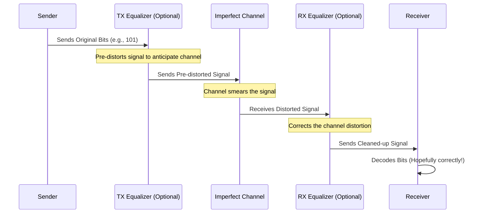

# Chapter 2: Channel Equalization

In [Chapter 1: Intersymbol Interference (ISI)](01_intersymbol_interference__isi__.md), we learned about a big problem in high-speed communication: signals getting smeared out by the channel (like a wire), causing bits to interfere with each other (ISI). This makes it hard for the receiver to tell the 1s and 0s apart, leading to errors.

So, how do we fix this? The answer is **Channel Equalization**.

## What is Channel Equalization?

Imagine you're listening to music through headphones, but there's a lot of background noise making it hard to hear. Noise-canceling headphones work by creating an "anti-noise" signal that cancels out the unwanted background sound, letting you hear the music clearly.

Or think about adjusting the equalizer settings on your stereo. If the music sounds too muffled (too much bass, not enough treble), you can boost the treble frequencies to make it sound crisp and clear again.

**Channel Equalization** does something very similar for our data signals. It's the process of **correcting or compensating for the distortion** introduced by the transmission channel. The goal is to "un-smear" the signal pulses that got distorted, reducing the ISI we talked about in Chapter 1.

The main aims of equalization are (as shown on pages 8 and 16 of the slides):
1.  **Flatten the Frequency Response:** The channel often acts like a filter, weakening high-frequency parts of the signal more than low-frequency parts. This causes the sharp edges of our pulses to get rounded off. Equalization tries to boost these weakened high frequencies back up, making the overall response "flatter" up to the frequencies we need.
2.  **Remove Time-Domain ISI:** By counteracting the channel's effects, equalization reduces the amount that one bit's pulse spills over into the time slots of its neighbours.

```mermaid
graph TD
    A[Original Sharp Signal (101)] --> B(Channel);
    B -- Distorts Signal --> C{Distorted Smeared Signal (High ISI)};
    C --> D(Equalizer);
    D -- Corrects Distortion --> E[Restored Sharper Signal (Low ISI)];

    style A fill:#cfc,stroke:#333,stroke-width:2px
    style E fill:#cfc,stroke:#333,stroke-width:2px
    style C fill:#f99,stroke:#333,stroke-width:2px
    style D fill:#ccf,stroke:#333,stroke-width:2px
```

## Where Does Equalization Happen?

We can apply equalization in two main places in our communication link (see page 5 of the slides for a system diagram showing where equalizers fit):

1.  **At the Transmitter (TX):** Before sending the signal down the problematic channel, we can deliberately *pre-distort* it in a way that anticipates and cancels out the channel's distortion. It's like knowing the room will make your voice echo, so you speak in a slightly different way to counteract the echo. This is often called **pre-emphasis** or **transmit equalization (TX EQ)**. We'll explore this in detail in [Chapter 3: TX FIR Equalization (Transmitter Finite Impulse Response)](03_tx_fir_equalization__transmitter_finite_impulse_response__.md).

2.  **At the Receiver (RX):** After the signal has traveled through the channel and become distorted, we can process it at the receiver to try and reverse the distortion. This is like using noise-canceling headphones or adjusting the stereo equalizer *after* the sound has already been affected by the environment. This is called **receive equalization (RX EQ)**. We'll look at techniques for this in [Chapter 7: RX Equalization Techniques (CTLE, RX FIR, DFE)](07_rx_equalization_techniques__ctle__rx_fir__dfe__.md).

Sometimes, both TX and RX equalization are used together for very challenging channels.

## How Does it Work (The Basic Idea)?

Equalizers often work like specialized filters. Remember how the channel acts like a filter that harms high frequencies? An equalizer might act like an *inverse* filter, boosting those high frequencies back up.

Imagine the channel muffles high notes (treble). The equalizer acts like a treble booster.


*Note: Equalization might happen at the TX, RX, or both.*

Different equalization techniques use different methods. Some adjust the signal shape based on previous bits ([Chapter 3: TX FIR Equalization (Transmitter Finite Impulse Response)](03_tx_fir_equalization__transmitter_finite_impulse_response__.md)), while others use filters tuned to the channel's characteristics ([Chapter 7: RX Equalization Techniques (CTLE, RX FIR, DFE)](07_rx_equalization_techniques__ctle__rx_fir__dfe__.md)). The effectiveness of different methods can vary depending on the channel and the speed of communication (as hinted at on page 14 of the slides).

## Conclusion

You now understand the core idea of **Channel Equalization**: it's the toolkit we use to fight back against the signal distortion and Intersymbol Interference (ISI) introduced by imperfect communication channels. By cleverly processing the signal, either before sending it or after receiving it, we can "clean it up" and significantly improve the chances of recovering the original data correctly, even at very high speeds. It's like turning a muffled, echoey message into clear speech.

In the next chapter, we'll dive into the first specific type of equalization: [Chapter 3: TX FIR Equalization (Transmitter Finite Impulse Response)](03_tx_fir_equalization__transmitter_finite_impulse_response__.md), where we modify the signal *before* it even enters the channel.

---

Generated by [AI Codebase Knowledge Builder](https://github.com/The-Pocket/Tutorial-Codebase-Knowledge)