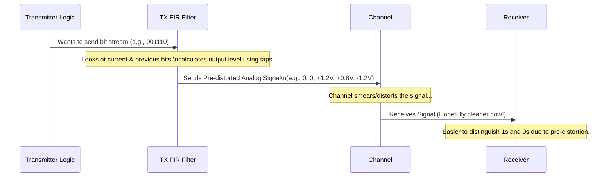
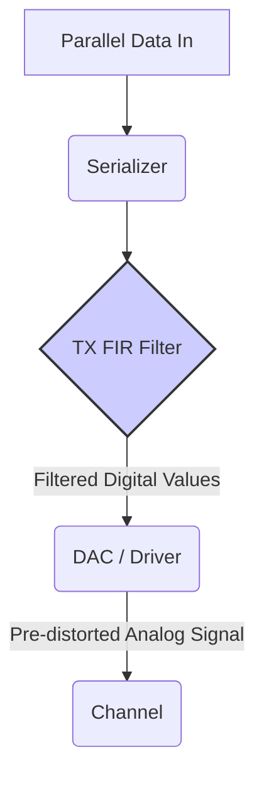

# Chapter 3: TX FIR Equalization (Transmitter Finite Impulse Response)

In [Chapter 2: Channel Equalization](02_channel_equalization_.md), we learned that equalization is like putting on noise-canceling headphones or adjusting a stereo equalizer to counteract distortion and make the signal clearer. We saw that equalization can happen either at the transmitter (before the signal goes into the channel) or at the receiver (after it comes out).

Now, let's dive into the first specific technique: doing equalization at the **transmitter (TX)** using something called a **Finite Impulse Response (FIR) filter**.

## Why Pre-Distort the Signal?

Remember [Chapter 1: Intersymbol Interference (ISI)](01_intersymbol_interference__isi__.md)? The channel (the wire) smears our nice, sharp signal pulses. Long sequences of the same bit (like `11111`) tend to build up energy and overshoot, while quick changes (like `0101`) get blurred and rounded off.

What if, *before* we even send the signal down the messy channel, we could deliberately change its shape? What if we could *anticipate* how the channel will distort it and send a "pre-distorted" signal instead? The idea is that this pre-distorted signal, after being distorted by the channel, will arrive at the receiver looking much cleaner!

This is exactly what **Transmit (TX) Equalization** does. It's like knowing you have to shout across a noisy, echoey room – you might intentionally speak louder and enunciate more clearly than usual, anticipating the difficult environment, so your message gets through intelligibly.

One common way to do this is **TX FIR Equalization**.

## What is a FIR Filter?

A **filter** is something that takes an input signal and modifies it to produce an output signal. Think of the bass and treble controls on your stereo – they filter the music signal to emphasize or reduce certain frequencies.

An **FIR (Finite Impulse Response)** filter is a specific type of *digital* filter. "Finite" means it makes its decisions based on a *limited*, fixed number of previous input samples. It doesn't have feedback loops that make its response depend on infinitely old inputs (unlike IIR - Infinite Impulse Response filters).

In TX FIR Equalization, this digital filter operates on the stream of bits (1s and 0s) we want to send.

## How Does TX FIR Work? The Magic of De-Emphasis

The core idea behind TX FIR is often called **de-emphasis** (or sometimes pre-emphasis, depending on perspective).

Imagine we want to send the sequence `00111100`.

*   **The Problem:** The channel tends to attenuate high frequencies more than low frequencies. This means sharp transitions (like 0 to 1 or 1 to 0) get weakened and rounded. Long runs of the same bit (like the four '1's) represent lower frequency content and might cause the signal level to drift or overshoot due to the channel's characteristics.

*   **The TX FIR Solution:** The FIR filter looks at the current bit and a few *previous* bits.
    *   **When a transition happens (0 to 1):** The filter sends the '1' out strongly. This is often called the **cursor** or **main tap**. This boosts the high-frequency component of the signal.
    *   **When the bit stays the same (1 to 1):** For the *second* '1' in a row (and the third, fourth, etc.), the filter deliberately sends it out with *less* strength than the first one. This is **de-emphasis**. It's like saying the first "hello" loudly, but then continuing the conversation at a normal volume. This reduces the power in the lower-frequency components (the long run of '1's) and prevents the signal from building up too much charge or energy in the channel.
    *   **The filter uses "taps":** It calculates the output signal level by taking a weighted sum of the current bit and some number of previous bits. The weights are called **taps** or **coefficients**. A typical 3-tap TX FIR might look like this:

        `Output_Level = (Cursor_Tap * Current_Bit) + (Post_Tap1 * Previous_Bit) + (Post_Tap2 * Bit_Before_Previous)`

        *   `Cursor_Tap`: Weight for the main, current bit. Usually the largest value.
        *   `Post_Tap1`, `Post_Tap2`, etc.: Weights for the bits immediately preceding the current one. These are often *negative* to subtract from the main tap, achieving the de-emphasis effect.

Let's visualize this (conceptually):

**Simple Example:** Let's use a 2-tap filter (cursor and one post-cursor tap) for `001110`. Let `cursor=1.0` and `post1=-0.3`. Let '1' be +1 and '0' be -1.

1.  **Send first '1':** Previous bit was '0' (-1). Output = `(1.0 * +1) + (-0.3 * -1) = 1.0 + 0.3 = +1.3`. (Emphasized!)
2.  **Send second '1':** Previous bit was '1' (+1). Output = `(1.0 * +1) + (-0.3 * +1) = 1.0 - 0.3 = +0.7`. (De-emphasized!)
3.  **Send first '0':** Previous bit was '1' (+1). Output = `(1.0 * -1) + (-0.3 * +1) = -1.0 - 0.3 = -1.3`. (Emphasized Transition!)

You can see the filter changes the *strength* of the transmitted signal based on the pattern of bits. Slide 9 and 25 in the `lecture7_ee720_eq_intro_txeq.pdf` show a more complex 4-tap example (`I-1, I0, I1, I2` corresponding to pre-cursor, cursor, and post-cursor taps affecting data `D(1), D(0), D(-1), D(-2)`). Slide 17 shows how the resulting waveform might look in the time domain.

## Why is it Called "FIR"?

It's "Finite" because the filter only considers a fixed, limited number of previous bits (determined by the number of taps) to calculate the current output. The "Impulse Response" refers to how the filter reacts if you feed it a single '1' pulse surrounded by '0's – its output will last for only a finite duration.

## Frequency Domain View

Remember how the channel often acts like a low-pass filter, hurting high frequencies (fast transitions)? TX FIR equalization, by emphasizing transitions and de-emphasizing long runs, effectively boosts the *relative* strength of high-frequency components compared to low-frequency components in the transmitted signal. This pre-compensation helps to flatten the overall frequency response when combined with the channel's filtering effect (See slides 8, 16, and 18).

## Where Does This Happen?

This digital filtering happens *inside* the transmitter chip, right after the data is serialized (turned from parallel bits into a single stream) but *before* it's converted into the final analog electrical signal by the output driver circuitry.

(See Slide 5 for a system diagram). The actual circuits that implement the output levels calculated by the FIR filter are discussed in [Chapter 6: TX Driver Architectures](06_tx_driver_architectures_.md) (Slides 24-36 show various circuit implementations).

## Pros and Cons of TX FIR (Simplified from Slide 10)

**Advantages:**

*   **Relatively Simple:** Compared to some receiver techniques, it can be easier to implement.
*   **Doesn't Amplify Noise:** Since the filtering happens *before* the signal goes through the noisy channel, the filter itself doesn't amplify noise or crosstalk that gets picked up later.
*   **Can Handle Pre-cursor ISI:** By adjusting taps appropriately, it can help compensate for channel effects that cause interference from bits arriving slightly "early" relative to the main pulse energy.

**Disadvantages:**

*   **Attenuates Signal:** The de-emphasis process means the average signal power sent is lower than if you just blasted every bit at full strength. This reduces the signal reaching the receiver.
*   **Needs Channel Knowledge:** To set the filter taps correctly, the transmitter needs some information about how bad the channel distortion is. This often requires a configuration step or a "back channel" where the receiver can tell the transmitter how to adjust its taps. We'll learn how taps are calculated in [Chapter 5: MMSE (Minimum Mean-Square Error) Algorithm](05_mmse__minimum_mean_square_error__algorithm_.md).

## Conclusion

You've now learned about **TX FIR Equalization**, a technique where the transmitter uses a digital FIR filter to cleverly **pre-distort** the signal before sending it. By **de-emphasizing** long runs of identical bits and emphasizing transitions, it anticipates and counteracts the smearing effect of the channel. This helps the signal arrive cleaner at the receiver, fighting against ISI. It's like speaking clearly and adjusting your volume because you know the listener is far away in an echoey room.

But how exactly do we choose the right amount of emphasis and de-emphasis? This depends on the **FIR Filter Taps (Coefficients)**, which we'll explore in the next chapter: [Chapter 4: FIR Filter Taps (Coefficients)](04_fir_filter_taps__coefficients__.md).

---

Generated by [AI Codebase Knowledge Builder](https://github.com/The-Pocket/Tutorial-Codebase-Knowledge)