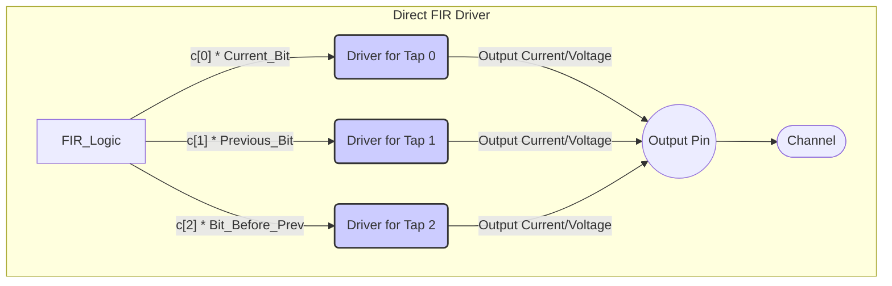
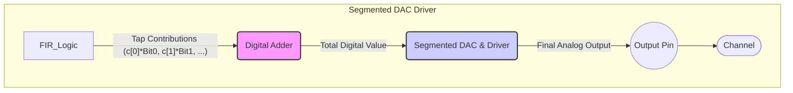

# Chapter 6: TX Driver Architectures

In [Chapter 5: MMSE (Minimum Mean-Square Error) Algorithm](05_mmse__minimum_mean_square_error__algorithm_.md), we discovered a clever way (the MMSE algorithm) to calculate the best "knob settings" – the **FIR filter tap coefficients** – for our transmitter's equalizer. We learned that the [Chapter 3: TX FIR Equalization (Transmitter Finite Impulse Response)](03_tx_fir_equalization__transmitter_finite_impulse_response__.md) uses these taps to figure out the *precise* signal level it needs to send for each bit, based on the current bit and its neighbors, to pre-compensate for channel distortion.

But wait... the FIR filter is doing calculations with numbers (digital values). How does the transmitter actually *create* these specific analog electrical voltage or current levels to send out onto the physical wire (the channel)? That's the job of the **TX Driver**, and there are different ways to design its circuitry, which we call **TX Driver Architectures**.

## What's the Problem? Making the Signal Real

Imagine the TX FIR filter has done its math. Based on the taps calculated by MMSE (like `c[0]=+0.7`, `c[1]=-0.2`, `c[2]=-0.1`) and the bit pattern (like `...00111...`), it determines the exact output level needed *right now*. For example, maybe it calculated "send a signal level of +0.85 Volts".

The **TX Driver** is the final electronic circuit in the transmitter that takes this digital command ("make +0.85V") and converts it into a real analog electrical signal on the output wires. Think of it like the power amplifier and speaker cone in your stereo system – they take the electrical signal representing the music and turn it into the actual sound waves you hear.

The challenge is that the TX FIR filter needs to combine the contributions from multiple taps (cursor, pre-cursor, post-cursor) very quickly and accurately. How do we build circuits that can do this efficiently?

## Key Idea: Combining Tap Contributions

Remember our FIR filter equation looked something like this:

`Output_Level = (c[0] * Current_Bit) + (c[1] * Previous_Bit) + (c[2] * Bit_Before_Previous) + ...`

The driver architecture is all about *how* we physically implement this summing and weighting process in an electronic circuit. Let's look at two common ways.

## Architecture 1: Direct FIR (Parallel Drivers)

Imagine you have a band with a guitarist, a bassist, and a drummer. In the "Direct FIR" approach, each instrument gets its own amplifier and speaker stack. The final sound you hear is the acoustic sum of the sound coming from each stack.

In a Direct FIR driver architecture:
*   There are separate small output driver circuits (like mini-amplifiers) dedicated to each FIR tap (cursor, post-cursor 1, post-cursor 2, etc.).
*   Each mini-driver is controlled by its corresponding tap's contribution (e.g., `c[1] * Previous_Bit`).
*   The outputs of all these mini-drivers are connected (wired together) at the final output pin. The electrical currents or voltages naturally sum up at this point.

*(See Slide 25 in `lecture7_ee720_eq_intro_txeq.pdf` for a circuit example of this approach. The blocks labeled "IDACs & Bias Control" for `sgn-1, sgn0, sgn1, sgn2` represent these parallel drivers.)*

**Pros & Cons of Direct FIR:**
*   **Pros:** Relatively simpler control logic for each driver slice. Can be power-efficient if designed well.
*   **Cons:** Each mini-driver adds some electrical "bulk" (capacitance) to the output pin. Having many parallel drivers can lead to high total output capacitance, which can limit the maximum speed of the transmitter. Each driver might need to be sized for its maximum possible contribution, which might not be area-efficient.

## Architecture 2: Segmented DAC (Digital Summing)

Now, imagine our band uses a modern digital mixer. The signals from the guitar, bass, and drums go into the mixer *first*. The mixer digitally adds them together according to the sound engineer's settings (like our tap weights). Then, the combined signal goes to *one* large, powerful amplifier and speaker system.

In a Segmented DAC architecture:
1.  The contributions from all the FIR taps (`c[0] * Current_Bit`, `c[1] * Previous_Bit`, etc.) are added together *digitally* using logic gates (adders) *before* they reach the final output stage. This results in a single digital number representing the total desired output level.
2.  This final digital number is then fed into a single, highly-segmented Digital-to-Analog Converter (DAC) and driver. A segmented DAC is like having many tiny identical switches controlling small current or voltage sources – by turning on the right *number* of segments, you can create the desired total output level very accurately.

*(See Slide 26 in `lecture7_ee720_eq_intro_txeq.pdf` for a block diagram. The "Combining taps in digital domain" block is the key difference.)*

**Pros & Cons of Segmented DAC:**
*   **Pros:** Can achieve very low output capacitance because there's essentially only one main driver connected to the output pin, optimized for speed. Often very flexible, allowing for many taps and fine control.
*   **Cons:** Requires more complex digital logic (the adder, and often a lookup table or mapping logic to control the DAC segments). Can consume more power in the digital logic section.

## Other Variations: Voltage, Current, and Impedance

Beyond these two main structures, designers also make choices about:

*   **Voltage-Mode vs. Current-Mode Drivers:**
    *   **Voltage-Mode:** The driver tries to directly create a specific *voltage* level at the output (like setting the output to 0.8V or 1.0V). Often uses switches connecting the output to different reference voltages. (See Slides 27, 28).
    *   **Current-Mode:** The driver steers a specific amount of *current* into the output load (usually a termination resistor). The voltage is then developed across this resistor (Ohm's Law: V = I * R). (Slide 25 is an example of a current-mode approach).
    *   Sometimes hybrid approaches are used! (See Slide 29).

*   **Impedance Modulation:** A more advanced technique where the driver changes its *own* output resistance (impedance) in addition to the voltage/current level, based on the data pattern. This can also help with equalization, especially for de-emphasis. (See Slides 30-36).

## Choosing an Architecture: The Trade-offs

Why so many choices? Because each architecture has different trade-offs:

*   **Complexity:** How difficult is the circuit to design and implement? Segmented DACs often have more complex digital logic.
*   **Power Consumption:** How much energy does the driver use? This depends heavily on the specific design, speed, and architecture.
*   **Output Capacitance:** Lower capacitance generally allows for higher speeds. Segmented DACs often excel here.
*   **Flexibility:** How easily can the number of taps or their precision be changed? Segmented DACs can be very flexible.

The best choice depends on the specific application – how fast does the link need to be? How much power can it use? What kind of channel is it driving? It's like choosing between a simple portable speaker (maybe like Direct FIR) and a complex home theater system (maybe like Segmented DAC) – the best choice depends on your needs and budget!

## Conclusion

You've now peeked under the hood at **TX Driver Architectures**! You understand that these are the circuits responsible for taking the digital commands from the TX FIR filter and creating the actual analog electrical signals. We saw two main approaches:
1.  **Direct FIR:** Parallel drivers for each tap, summing electrically at the output. Simpler logic, potentially higher capacitance.
2.  **Segmented DAC:** Digital summing first, then one main highly-segmented driver. Complex logic, potentially lower capacitance and more flexible.

We also briefly touched on voltage-mode vs. current-mode operation and impedance modulation. Choosing the right architecture involves balancing trade-offs like speed, power, and complexity.

So far, we've focused heavily on fixing the signal *before* it goes into the channel using TX FIR equalization. But what if the signal is still distorted when it arrives at the receiver? In the next chapter, we'll explore techniques used on the other side of the link: [Chapter 7: RX Equalization Techniques (CTLE, RX FIR, DFE)](07_rx_equalization_techniques__ctle__rx_fir__dfe__.md).

---

Generated by [AI Codebase Knowledge Builder](https://github.com/The-Pocket/Tutorial-Codebase-Knowledge)