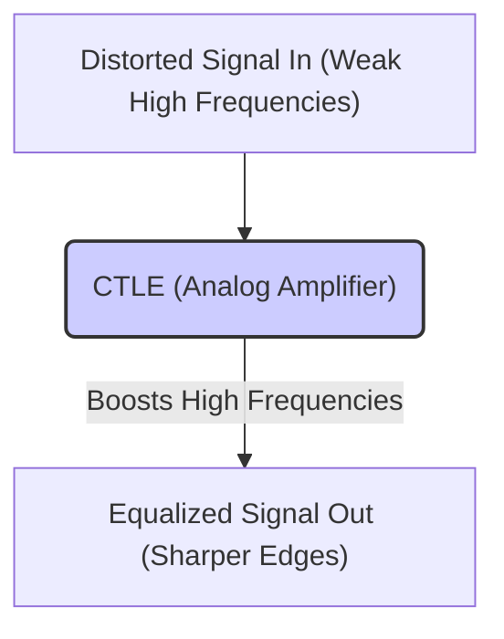
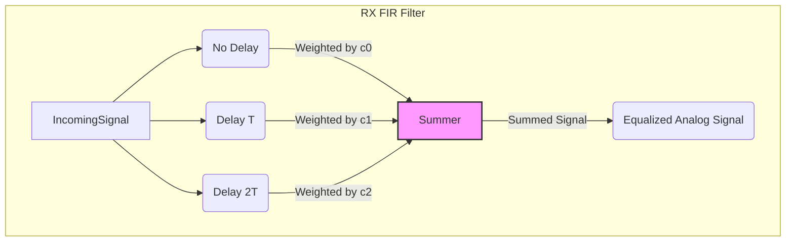
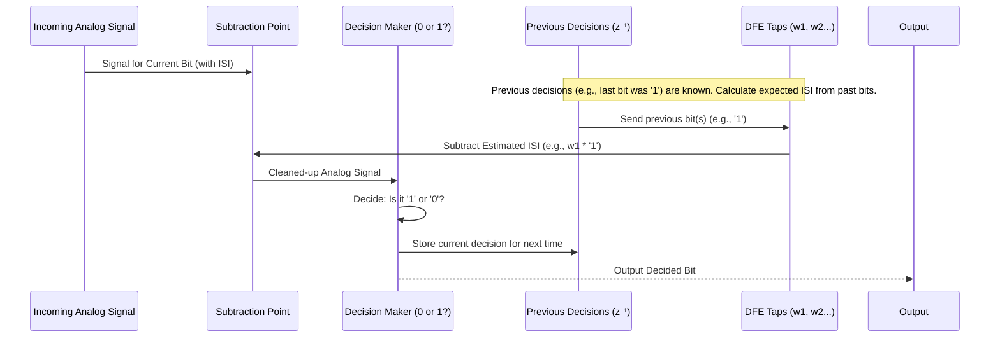

# Chapter 7: RX Equalization Techniques (CTLE, RX FIR, DFE)

Welcome back! In the previous chapters, especially [Chapter 3: TX FIR Equalization (Transmitter Finite Impulse Response)](03_tx_fir_equalization__transmitter_finite_impulse_response__.md) and [Chapter 6: TX Driver Architectures](06_tx_driver_architectures__.md), we explored how the transmitter can cleverly pre-shape the signal *before* sending it down the channel to fight against Intersymbol Interference (ISI). We used techniques like TX FIR to anticipate the channel's distortion.

But what if the channel is really, really bad? Or what if we want to keep the transmitter simple? Sometimes, pre-shaping the signal at the transmitter isn't enough, or we might need additional help at the other end. The signal arriving at the receiver might still be smeared and distorted, making it hard to read the 1s and 0s correctly.

This is where **Receiver (RX) Equalization** comes in! These are techniques applied *after* the signal has traveled through the channel and arrived at the receiver. The goal is the same: clean up the signal and reduce ISI, but this time, we do the cleaning at the destination.

Think of it like this: TX Equalization is like carefully choosing your words and speaking clearly because you know the room is echoey. RX Equalization is like having noise-canceling headphones or asking the speaker to repeat themselves – you're fixing the sound *after* it has already traveled through the difficult environment.

Let's explore three popular RX equalization techniques: CTLE, RX FIR, and DFE. (See slides 11, 12, 13 in `lecture7_ee720_eq_intro_txeq.pdf` for quick overviews).

## 1. CTLE (Continuous-Time Linear Equalizer)

Imagine you're listening to music that sounds muffled – too much bass, not enough treble. What do you do? You might turn up the treble knob on your stereo!

A **CTLE** works in a very similar way for our electrical signals.
*   **What it is:** A CTLE is essentially a special kind of **analog amplifier** built into the receiver front-end.
*   **How it works:** It's designed to amplify **high-frequency** components of the incoming signal *more* than the low-frequency components. Remember from [Chapter 1: Intersymbol Interference (ISI)](01_intersymbol_interference__isi__.md) that the channel often weakens high frequencies the most, rounding off the sharp edges of our signal pulses. The CTLE tries to boost these high frequencies back up.
*   **Analogy:** It's like a simple **tone control (treble boost)** for the received data signal.

*(See Slide 12 for a simplified circuit diagram and pros/cons)*

**Pros & Cons of CTLE:**
*   **Pros:** Relatively simple, low power, provides gain (amplification) along with equalization. Can compensate for some pre-cursor and post-cursor ISI.
*   **Cons:**
    *   **Amplifies Noise:** Unfortunately, any noise or crosstalk picked up in the channel at high frequencies also gets amplified along with the signal. It's like turning up the treble also makes the tape hiss louder.
    *   **Limited Flexibility:** Usually provides a relatively simple shape of frequency boost (often called "1st order"). It might not perfectly match complex channel distortions.
    *   **Sensitivity:** Its performance can change with manufacturing variations, temperature, etc. (PVT sensitivity).

## 2. RX FIR (Receiver Finite Impulse Response Filter)

Remember the [Chapter 3: TX FIR Equalization (Transmitter Finite Impulse Response)](03_tx_fir_equalization__transmitter_finite_impulse_response__.md)? We used a digital filter at the transmitter to shape the signal based on the current and previous bits.

An **RX FIR** filter uses the same core idea, but it operates on the **received signal** *after* it comes out of the channel.
*   **What it is:** A filter (often implemented with analog circuits) that combines delayed versions of the incoming analog signal.
*   **How it works:** It takes the incoming analog signal, makes slightly delayed copies of it, scales each copy by a specific weight (like the [FIR Filter Taps (Coefficients)](04_fir_filter_taps__coefficients__.md) we saw for TX FIR), and then sums them up. By choosing the right weights (taps), it can cancel out ISI.
*   **Analogy:** Similar to TX FIR, but operating on the already-distorted analog signal received. It's like trying to cancel echoes by combining delayed versions of the sound you hear.

*(See Slide 11 for a conceptual diagram and pros/cons)*

**Pros & Cons of RX FIR:**
*   **Pros:** Can handle both pre-cursor and post-cursor ISI. Can potentially amplify high frequencies without attenuating the whole signal (unlike TX FIR's de-emphasis). Can be made adaptive (taps adjust automatically).
*   **Cons:**
    *   **Amplifies Noise:** Like CTLE, it operates on the signal *after* noise has been added, so it tends to amplify noise along with the signal.
    *   **Analog Delays:** Implementing accurate, wide-bandwidth analog delays is tricky and can consume area and power.
    *   **Tap Precision:** Achieving precise analog weighting (multiplication) can be challenging.

## 3. DFE (Decision Feedback Equalizer)

The DFE is a bit different and quite clever. It uses the history of the data itself to cancel ISI.

Imagine you receive a garbled text message like: "Let's meet at the co?fee shop". Even though the 'f' is smudged, you can easily guess it's 'coffee' based on the context and your knowledge of words.

A **DFE** does something similar with the signal bits:
*   **What it is:** A feedback system within the receiver.
*   **How it works:**
    1.  The receiver looks at the incoming (possibly distorted) analog signal for the *current* bit.
    2.  It makes a guess (a decision) about whether the *previous* bit (or bits) was a '1' or a '0'.
    3.  It knows how much "smear" (ISI) a previous '1' or '0' *should* contribute to the current bit's signal level (based on calculated tap weights, similar to FIR taps).
    4.  It **subtracts** this expected ISI contribution from the current bit's analog signal level.
    5.  *Then*, it makes the final decision ('1' or '0'?) on the current bit based on this cleaned-up signal level.
*   **Analogy:** Using the context of previously understood words (decided bits) to help decipher the current garbled word (current bit's signal level), by removing the expected echoes from those previous words.

*(See Slide 13 for a block diagram and pros/cons)*

**Pros & Cons of DFE:**
*   **Pros:**
    *   **No Noise Amplification:** This is its biggest advantage! Because it subtracts ISI *based on previous decisions* (which are clean digital values, not noisy analog ones), it doesn't amplify the incoming analog noise.
    *   **Adaptable:** The feedback tap weights (w1, w2, ...) can be automatically adjusted.
*   **Cons:**
    *   **Cannot Cancel Pre-cursor ISI:** It only uses *past* decisions. It can't know about future bits to cancel ISI that arrives "early".
    *   **Critical Timing Path:** The loop (Decide -> Store -> Feedback -> Subtract -> Decide) needs to happen very, very quickly, within one bit period. This makes designing very high-speed DFEs challenging.
    *   **Error Propagation:** If the slicer makes a wrong decision (guesses the wrong bit), that wrong decision feeds back into the loop and can cause *more* errors on subsequent bits.

## Combining Techniques

Often, these techniques are used together! For example, a receiver might have a CTLE for a basic high-frequency boost, followed by a DFE to clean up the remaining post-cursor ISI without amplifying noise. The choice depends on the channel characteristics, the data rate, power budget, and complexity constraints. Slide 14 shows how combining different types of equalization can significantly improve performance.

## Conclusion

You've now learned about three key **RX Equalization techniques** used to clean up signals *after* they've traveled through the channel:
*   **CTLE:** An analog treble boost, simple but noise-amplifying.
*   **RX FIR:** Like TX FIR but on the received analog signal, flexible but noise-amplifying and needs analog delays.
*   **DFE:** Uses feedback from past decisions to cancel ISI without amplifying noise, but has timing challenges and can't fix pre-cursor ISI.

These techniques complement or sometimes replace TX equalization, providing powerful tools to combat ISI and enable reliable high-speed communication.

Now that we've discussed equalization in both the transmitter and receiver, how do we analyze their effects? We can look at signals in the time domain (how they change over time) or in the frequency domain (which frequencies they contain). In the next chapter, we'll explore these two perspectives: 
[Chapter 8: Frequency Domain vs. Time Domain Analysis
](08_frequency_domain_vs__time_domain_analysis_.md)

---

Generated by [AI Codebase Knowledge Builder](https://github.com/The-Pocket/Tutorial-Codebase-Knowledge)