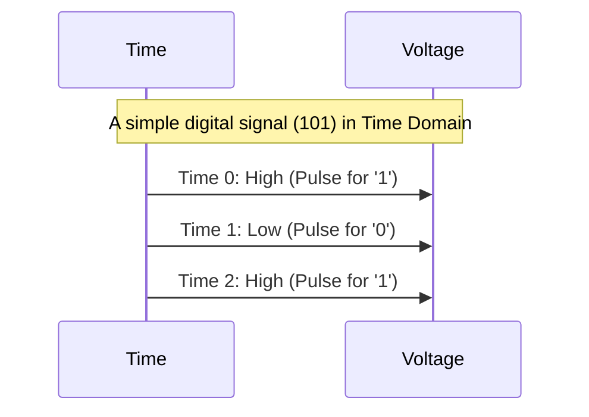

# Chapter 8: Frequency Domain vs. Time Domain Analysis

Welcome to the final chapter of our introductory tutorial on equalization! In [Chapter 7: RX Equalization Techniques (CTLE, RX FIR, DFE)](07_rx_equalization_techniques__ctle__rx_fir__dfe__.md), we explored various ways the receiver can clean up a distorted signal. Throughout this tutorial, we've talked about signals being "smeared," "attenuated," or "boosted." To truly understand these effects and how equalization helps, engineers use two powerful ways of looking at signals: the **Time Domain** and the **Frequency Domain**.

Imagine you're listening to a piece of music. You could:
1.  Look at the raw audio waveform scrolling by on a screen – that's like the **Time Domain** view. You see the exact shape of the sound waves as they change from moment to moment.
2.  Look at a graphic equalizer display, which shows bars representing the strength of different notes (bass, midrange, treble) – that's like the **Frequency Domain** view. You see how the music's energy is spread across different pitches.

Both views describe the same music, but they highlight different aspects. It's the same for the electrical signals in our high-speed links!

## What is Time Domain Analysis?

**Time Domain analysis** is like watching a movie of our signal. We look at how the signal's voltage (or current) changes as time goes by.

*   **What you see:** You get a direct picture of the signal's waveform. For our digital data (1s and 0s), this means seeing the actual shape of the electrical pulses.
*   **Key Insights:**
    *   **Pulse Shape:** Is the pulse for a '1' sharp and clear, or is it rounded and spread out?
    *   **Intersymbol Interference (ISI):** This is where the Time Domain shines! You can *directly see* the "smearing" we discussed in [Chapter 1: Intersymbol Interference (ISI)](01_intersymbol_interference__isi__.md). You'll see the tail of one pulse overlapping with the next pulse's time slot.
    *   **Eye Diagrams:** A very common time-domain visualization is the "eye diagram." Imagine taking all the bits, one by one, and drawing their waveforms on top of each other in the same time window. If the signal is clean, a clear "eye" shape opens up in the middle (see slide 7 of `lecture7_ee720_eq_intro_txeq.pdf` for examples). If there's a lot of ISI, the eye will be "closed" or messy.
    *   **Equalizer Effects:** You can see how [Chapter 3: TX FIR Equalization (Transmitter Finite Impulse Response)](03_tx_fir_equalization__transmitter_finite_impulse_response__.md) shapes the transmitted pulse (e.g., de-emphasis, as shown on slide 17).


*This diagram conceptually shows that we plot voltage against time.*

Think of an oscilloscope – a piece of lab equipment that draws graphs of voltage versus time. That's a time-domain tool!

## What is Frequency Domain Analysis?

**Frequency Domain analysis** is like taking our signal and breaking it down into its fundamental "ingredients" – a collection of simple sine waves of different frequencies (like different musical notes) and strengths. We then look at how much energy or strength the signal has at each of these individual frequencies.

*   **What you see:** You get a graph showing signal strength (or power) on the vertical axis and frequency on the horizontal axis. This is often called the signal's "spectrum."
*   **Key Insights:**
    *   **Channel Attenuation:** Channels often act like filters that affect different frequencies differently. Typically, they attenuate (weaken) high-frequency components more than low-frequency components. A frequency domain plot clearly shows this "roll-off" (see slide 6 for how a channel affects the signal, often visualized in frequency domain terms as loss vs. frequency).
    *   **Sharp Edges Need High Frequencies:** To make very fast transitions in a signal (like going from a '0' to a '1' instantly), you need a lot of high-frequency content. If the channel kills these high frequencies, the pulse edges get rounded in the time domain.
    *   **Equalizer Action:** Frequency domain analysis shows how equalizers try to compensate for channel loss.
        *   A CTLE (from [Chapter 7: RX Equalization Techniques (CTLE, RX FIR, DFE)](07_rx_equalization_techniques__ctle__rx_fir__dfe__.md)) is designed to boost high frequencies. You'd see its gain increase at higher frequencies on a frequency plot.
        *   TX FIR pre-emphasis ([Chapter 3: TX FIR Equalization (Transmitter Finite Impulse Response)](03_tx_fir_equalization__transmitter_finite_impulse_response__.md)) effectively sends out more energy at high frequencies (relative to low frequencies) to pre-compensate for the channel's high-frequency loss (see slide 18).
    *   **Flattening the Response:** The goal of equalization, as stated on slides 8 and 16, is often to "flatten the frequency response." This means making the combined response of the (Equalizer + Channel) treat all necessary frequencies more or less equally, up to the Nyquist frequency (half the data rate, which is the highest frequency we theoretically need).

```mermaid
graph TD
    A[Signal Energy] --> B[Frequency (Low to High)];
    C(Spectrum Plot) --- A;
    C --- B;
    Note right of C: Shows energy distribution across frequencies.
```
*This diagram conceptually shows that we plot signal energy against frequency.*

Think of the bass and treble controls on your stereo. They adjust the strength of low and high frequencies, respectively.

## Why Use Both? Two Sides of the Same Coin

The Time Domain and Frequency Domain are not competing views; they are **complementary**. They offer different perspectives on the same signal and system behavior, and engineers use both to get a complete picture.

*   **Time Domain is often more intuitive for visualizing ISI** and the direct shape of pulses. It tells you *when* things happen.
*   **Frequency Domain is excellent for understanding how a channel filters a signal** and how an equalizer is designed to counteract that filtering. It tells you *what ingredients* (frequencies) make up the signal and how they are affected.

A mathematical tool called the **Fourier Transform** allows engineers to convert a signal's description from the time domain to the frequency domain, and its inverse (Inverse Fourier Transform) takes it back from frequency to time. They are inextricably linked.

## Connecting to Equalization

Let's see how these views help us understand equalization:

*   **In the Time Domain:**
    *   **Problem:** We see pulses smeared out, leading to a "closed" eye diagram.
    *   **Equalization Goal:** To "un-smear" the pulses, reduce the interference between them, and "open" the eye diagram, making it easy for the receiver to tell 1s from 0s.

*   **In the Frequency Domain:**
    *   **Problem:** We see that the channel significantly attenuates high frequencies, like a low-pass filter.
    *   **Equalization Goal:** To design an equalizer that boosts these attenuated high frequencies. The equalizer's frequency response ideally looks like the *inverse* of the channel's loss. If the channel cuts high frequencies by 10dB, the equalizer tries to boost them by 10dB.

```mermaid
graph TD
    subgraph Viewpoint
        direction LR
        TV[Time Domain (Voltage vs. Time)]
        FV[Frequency Domain (Energy vs. Frequency)]
    end

    subgraph What_It_Shows
        direction TB
        T_Shows("Pulse Shape, ISI, Eye Diagram")
        F_Shows("Channel Loss, EQ Boost, Spectrum")
    end

    TV --> T_Shows;
    FV --> F_Shows;

    Problem_ISI[Problem: ISI (Time)] --> Solution_EQ_Time[EQ Goal: Open Eye (Time)];
    Problem_Loss[Problem: High-Freq Loss (Freq)] --> Solution_EQ_Freq[EQ Goal: Flatten Response (Freq)];

    TV --> Problem_ISI;
    FV --> Problem_Loss;
```

## Conclusion

You now understand the fundamental difference and relationship between **Time Domain analysis** and **Frequency Domain analysis**.
*   The **Time Domain** lets us see the signal's waveform evolve over time, directly showing pulse shapes and the smearing effect of Intersymbol Interference (ISI).
*   The **Frequency Domain** lets us see the signal's energy distribution across different frequencies, revealing how channels attenuate certain frequencies (especially high ones) and how equalization aims to compensate by boosting them.

Both perspectives are crucial for engineers designing, analyzing, and debugging high-speed communication links. They help us understand why ISI happens and how the various equalization techniques we've discussed effectively combat it to ensure our 1s and 0s arrive clearly.

This concludes our introductory tutorial on equalization for the `lecture7_ee720_eq_intro_txeq` project. We hope you now have a solid foundation in understanding Intersymbol Interference and the fascinating world of channel equalization!

---

Generated by [AI Codebase Knowledge Builder](https://github.com/The-Pocket/Tutorial-Codebase-Knowledge)