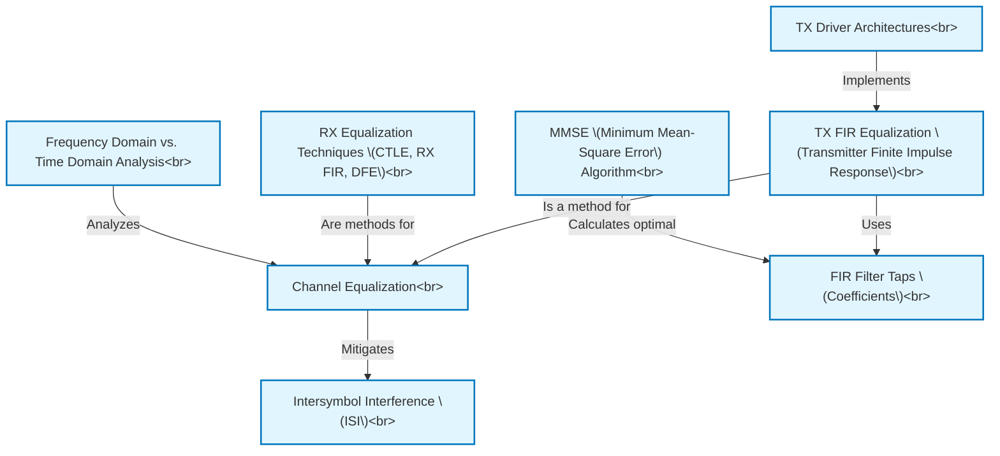

# Tutorial: lecture7_ee720_eq_intro_txeq

This project explains how **high-speed communication** systems fix signal distortions caused by cables or backplanes, a problem called *Intersymbol Interference (ISI)*.
It focuses on **Channel Equalization** techniques, especially *Transmitter (TX) FIR Equalization*, where the signal is pre-shaped using digital filters (*FIR Filter Taps*) before sending.
The lecture discusses how to calculate the best filter settings (*MMSE Algorithm*), different ways to build the transmitter circuits (*TX Driver Architectures*), briefly mentions receiver-side fixes (*RX Equalization Techniques*), and uses both *Time and Frequency Domain Analysis* to understand these concepts.

**Source Repository:** [None](None)

## Chapters

1. [Intersymbol Interference (ISI)
](01_intersymbol_interference__isi__.md)
2. [Channel Equalization
](02_channel_equalization_.md)
3. [TX FIR Equalization (Transmitter Finite Impulse Response)
](03_tx_fir_equalization__transmitter_finite_impulse_response__.md)
4. [FIR Filter Taps (Coefficients)
](04_fir_filter_taps__coefficients__.md)
5. [MMSE (Minimum Mean-Square Error) Algorithm
](05_mmse__minimum_mean_square_error__algorithm_.md)
6. [TX Driver Architectures
](06_tx_driver_architectures_.md)
7. [RX Equalization Techniques (CTLE, RX FIR, DFE)
](07_rx_equalization_techniques__ctle__rx_fir__dfe__.md)
8. [Frequency Domain vs. Time Domain Analysis
](08_frequency_domain_vs__time_domain_analysis_.md)

---

Generated by [AI Codebase Knowledge Builder](https://github.com/The-Pocket/Tutorial-Codebase-Knowledge)